This is the analysis script to prepare the data to run analyses for the project "Anxiety, depression and trauma symptom change during the COVID-19 pandemic: retrospective versus objective assessment" - Young et al (2020)

Script written by K L Purves, K N Thompson, C Huebel and M Davies.
Email: kirstin.purves@kcl.ac.uk, katie.thompson@kcl.ac.uk, christopher.1.huebel@kcl.ac.uk, molly.davies@kcl.ac.uk

#Set up


Clear global environment


Retrieve the current date to use it for file endings to not overwrite files when one exports files


#Packages
Install packages (if they are not available in your version of R)


Load packages


# R functions


```
Warning in file(filename, "r", encoding = encoding): cannot open file 'lm_forest.R': No such file or directory
```

```
Error in file(filename, "r", encoding = encoding): cannot open the connection
```

## Half-violin plot


# Colour palettes
Define colours for plotting this are the standard coping colours


Choose in this chunk which palette to use
04.07.2020 - Default to 2 colour COPING palette


# ggplot theme
Set up ggplot theme for the plots


# Function for split violin plot


# Data import

## Source data file paths


## Read in data

```
[1] 31884   641
```

```
  [1] "Sample"                                                          
  [2] "ID"                                                              
  [3] "startDate.prepandemic"                                           
  [4] "Age_uncleaned"                                                   
  [5] "Gender_unc"                                                      
  [6] "Sex"                                                             
  [7] "EduYrs"                                                          
  [8] "demographics.college_or_university_degree"                       
  [9] "demographics.a_levelsas_levels_or_equivalent"                    
 [10] "demographics.o_levelsgcses_or_equivalent"                        
 [11] "demographics.cses_or_equivalent"                                 
 [12] "demographics.nvq_or_hnd_or_hnc_or_equivalent"                    
 [13] "Ethnicity_unc"                                                   
 [14] "Gender_numeric"                                                  
 [15] "Sex_numeric"                                                     
 [16] "demographics.college_or_university_degree_numeric"               
 [17] "demographics.a_levelsas_levels_or_equivalent_numeric"            
 [18] "demographics.o_levelsgcses_or_equivalent_numeric"                
 [19] "demographics.cses_or_equivalent_numeric"                         
 [20] "demographics.nvq_or_hnd_or_hnc_or_equivalent_numeric"            
 [21] "Ethnicity_numeric"                                               
 [22] "Gender"                                                          
 [23] "Ethnicity"                                                       
 [24] "Age"                                                             
 [25] "age_category_numeric"                                            
 [26] "age_category"                                                    
 [27] "highest_education_prepan_numeric"                                
 [28] "highest_education_prepan"                                        
 [29] "employment.phd"                                                  
 [30] "employment.masters_degree_or_equivalent"                         
 [31] "employment.postgraduate_degree_or_equivalent"                    
 [32] "employment.bachelors_degree_or_equivalent"                       
 [33] "employment.a_levelsas_levels_or_equivalent"                      
 [34] "employment.o_levelsgcses_or_equivalent"                          
 [35] "employment.cses_or_equivalent"                                   
 [36] "employment.nvq_or_hnd_or_hnc_or_equivalent"                      
 [37] "employment.government_work_key_workers"                          
 [38] "employment.unemployed"                                           
 [39] "employment.zerohours_contract"                                   
 [40] "employment.stayathome_parent_or_carer"                           
 [41] "employment.retired"                                              
 [42] "employment.student_gcse_or_a_level"                              
 [43] "employment.student_university"                                   
 [44] "employment.became_unemployed"                                    
 [45] "employment.furloughed_or_paid_leave_government_funded"           
 [46] "employment.furloughed_or_paid_leave_company_funded"              
 [47] "employment.paid_leave_furloughed"                                
 [48] "employment.fulltime_employed"                                    
 [49] "employment.parttime_employed"                                    
 [50] "employment.selfemployed"                                         
 [51] "employment.contract_or_freelance_work"                           
 [52] "employment.small_business_owner"                                 
 [53] "employment.receiving_state_income"                               
 [54] "employment.my_employment_status_has_not_changed"                 
 [55] "employment.reduction_in_hours"                                   
 [56] "employment.reduction_in_salary"                                  
 [57] "employment.benefits_increased"                                   
 [58] "employment.benefits_decreased"                                   
 [59] "employment.became_employed"                                      
 [60] "employment.increased_hours"                                      
 [61] "employment.increased_salary"                                     
 [62] "employment.phd_numeric"                                          
 [63] "employment.masters_degree_or_equivalent_numeric"                 
 [64] "employment.postgraduate_degree_or_equivalent_numeric"            
 [65] "employment.bachelors_degree_or_equivalent_numeric"               
 [66] "employment.a_levelsas_levels_or_equivalent_numeric"              
 [67] "employment.o_levelsgcses_or_equivalent_numeric"                  
 [68] "employment.cses_or_equivalent_numeric"                           
 [69] "employment.nvq_or_hnd_or_hnc_or_equivalent_numeric"              
 [70] "employment.government_work_key_workers_numeric"                  
 [71] "employment.unemployed_numeric"                                   
 [72] "employment.zerohours_contract_numeric"                           
 [73] "employment.stayathome_parent_or_carer_numeric"                   
 [74] "employment.retired_numeric"                                      
 [75] "employment.student_gcse_or_a_level_numeric"                      
 [76] "employment.student_university_numeric"                           
 [77] "employment.became_unemployed_numeric"                            
 [78] "employment.furloughed_or_paid_leave_government_funded_numeric"   
 [79] "employment.furloughed_or_paid_leave_company_funded_numeric"      
 [80] "employment.paid_leave_furloughed_numeric"                        
 [81] "employment.fulltime_employed_numeric"                            
 [82] "employment.parttime_employed_numeric"                            
 [83] "employment.selfemployed_numeric"                                 
 [84] "employment.contract_or_freelance_work_numeric"                   
 [85] "employment.small_business_owner_numeric"                         
 [86] "employment.receiving_state_income_numeric"                       
 [87] "employment.my_employment_status_has_not_changed_numeric"         
 [88] "employment.reduction_in_hours_numeric"                           
 [89] "employment.reduction_in_salary_numeric"                          
 [90] "employment.benefits_increased_numeric"                           
 [91] "employment.benefits_decreased_numeric"                           
 [92] "employment.became_employed_numeric"                              
 [93] "employment.increased_hours_numeric"                              
 [94] "employment.increased_salary_numeric"                             
 [95] "highest_education_numeric"                                       
 [96] "highest_education"                                               
 [97] "employment_prior_covid_numeric"                                  
 [98] "employment_prior_covid"                                          
 [99] "employment_change_numeric"                                       
[100] "employment_change"                                               
[101] "key_worker_numeric"                                              
[102] "key_worker"                                                      
[103] "anxiety_disorders_numeric"                                       
[104] "anxiety_disorders"                                               
[105] "mhd.specific_phobia_e.g._phobia_of_flying_numeric"               
[106] "mhd.specific_phobia_e.g._phobia_of_flying"                       
[107] "mhd.social_anxiety_or_social_phobia_numeric"                     
[108] "mhd.social_anxiety_or_social_phobia"                             
[109] "agoraphobia_panic_disorder_numeric"                              
[110] "agoraphobia_panic_disorder"                                      
[111] "depressive_disorders_numeric"                                    
[112] "depressive_disorders"                                            
[113] "eating_disorders_numeric"                                        
[114] "eating_disorders"                                                
[115] "obsessive_compulsive_disorders_numeric"                          
[116] "obsessive_compulsive_disorders"                                  
[117] "psychotic_disorders_numeric"                                     
[118] "psychotic_disorders"                                             
[119] "mhd.mania_hypomania_bipolar_or_manicdepression_numeric"          
[120] "mhd.mania_hypomania_bipolar_or_manicdepression"                  
[121] "mhd.posttraumatic_stress_disorder_ptsd_numeric"                  
[122] "mhd.posttraumatic_stress_disorder_ptsd"                          
[123] "autism_spectrum_disorder_numeric"                                
[124] "autism_spectrum_disorder"                                        
[125] "mhd.attention_deficit_hyperactivity_disorder_numeric"            
[126] "mhd.attention_deficit_hyperactivity_disorder"                    
[127] "mhd.personality_disorder_numeric"                                
[128] "mhd.personality_disorder"                                        
[129] "personality_cluster_a_numeric"                                   
[130] "personality_cluster_a"                                           
[131] "personality_cluster_b_numeric"                                   
[132] "personality_cluster_b"                                           
[133] "personality_cluster_c_numeric"                                   
[134] "personality_cluster_c"                                           
[135] "depression_and_anxiety_numeric"                                  
[136] "depression_and_anxiety"                                          
[137] "restricting_vs_binge_eating_eating_disorders_numeric"            
[138] "restricting_vs_binge_eating_eating_disorders"                    
[139] "bipolar_and_schizophrenia_numeric"                               
[140] "bipolar_and_schizophrenia"                                       
[141] "control_numeric"                                                 
[142] "control"                                                         
[143] "disorders_total_count"                                           
[144] "comorbidity_total_count_numeric"                                 
[145] "comorbidity_total_count_factor_numeric"                          
[146] "comorbidity_total_count_factor"                                  
[147] "mhd.none_of_the_above"                                           
[148] "mhd.none_of_the_above.1"                                         
[149] "gad.feeling_nervous_anxious_or_on_edge_prepan"                   
[150] "gad.control_worrying_stop_prepan"                                
[151] "gad.worrying_too_much_about_different_things_prepan"             
[152] "gad.trouble_relaxing_prepan"                                     
[153] "gad.sit_restless_hard_prepan"                                    
[154] "gad.becoming_easily_annoyed_or_irritable_prepan"                 
[155] "gad.awful_feeling_afraid_happen_prepan"                          
[156] "gad.feeling_nervous_anxious_or_on_edge_prepan_numeric"           
[157] "gad.control_worrying_stop_prepan_numeric"                        
[158] "gad.worrying_too_much_about_different_things_prepan_numeric"     
[159] "gad.trouble_relaxing_prepan_numeric"                             
[160] "gad.sit_restless_hard_prepan_numeric"                            
[161] "gad.becoming_easily_annoyed_or_irritable_prepan_numeric"         
[162] "gad.awful_feeling_afraid_happen_prepan_numeric"                  
[163] "gad.sum_score_prepan_raw"                                        
[164] "na_per_person_gad_prepan"                                        
[165] "gad.sum_score_prepan"                                            
[166] "pcl.stressful_experience_repeated_images_prepan"                 
[167] "pcl.stressful_experience_upset_reminded_prepan"                  
[168] "pcl.stressful_situation_avoiding_activities_prepan"              
[169] "pcl.cut_people_feeling_distant_prepan"                           
[170] "pcl.feeling_irritable_or_having_angry_outbursts_prepan"          
[171] "pcl.difficulty_concentrating_prepan"                             
[172] "pcl.stressful_experience_repeated_images_prepan_numeric"         
[173] "pcl.stressful_experience_upset_reminded_prepan_numeric"          
[174] "pcl.stressful_situation_avoiding_activities_prepan_numeric"      
[175] "pcl.cut_people_feeling_distant_prepan_numeric"                   
[176] "pcl.feeling_irritable_or_having_angry_outbursts_prepan_numeric"  
[177] "pcl.difficulty_concentrating_prepan_numeric"                     
[178] "pcl.sum_score_prepan_raw"                                        
[179] "na_per_person_pcl_prepan"                                        
[180] "pcl.sum_score_prepan"                                            
[181] "phq.little_interest_or_pleasure_in_doing_things_prepan"          
[182] "phq.feeling_down_depressed_or_hopeless_prepan"                   
[183] "phq.staying_asleep_sleeping_trouble_prepan"                      
[184] "phq.feeling_tired_or_having_little_energy_prepan"                
[185] "phq.poor_appetite_or_overeating_prepan"                          
[186] "phq.feeling_bad_failure_family_prepan"                           
[187] "phq.trouble_concentrating_reading_newspaper_prepan"              
[188] "phq.moving_fidgety_noticed_opposite_prepan"                      
[189] "phq.dead_hurting_thoughts_prepan"                                
[190] "phq.little_interest_or_pleasure_in_doing_things_prepan_numeric"  
[191] "phq.feeling_down_depressed_or_hopeless_prepan_numeric"           
[192] "phq.staying_asleep_sleeping_trouble_prepan_numeric"              
[193] "phq.feeling_tired_or_having_little_energy_prepan_numeric"        
[194] "phq.poor_appetite_or_overeating_prepan_numeric"                  
[195] "phq.feeling_bad_failure_family_prepan_numeric"                   
[196] "phq.trouble_concentrating_reading_newspaper_prepan_numeric"      
[197] "phq.moving_fidgety_noticed_opposite_prepan_numeric"              
[198] "phq.dead_hurting_thoughts_prepan_numeric"                        
[199] "phq.sum_score_prepan_raw"                                        
[200] "na_per_person_phq_prepan"                                        
[201] "phq.missing_only_suicide_item_prepan"                            
[202] "phq.sum_score_prepan"                                            
[203] "phq.sum_score_8items_prepan"                                     
[204] "ocir.i_repeatedly_check_doors_windows_drawers_etc_prepan"        
[205] "ocir.arranged_things_change_upset_prepan"                        
[206] "ocir.repeat_feel_numbers_prepan"                                 
[207] "ocir.clean_simply_wash_feel_prepan"                              
[208] "ocir.mind_upset_unpleasant_thoughts_prepan"                      
[209] "ocir.afraid_avoid_throwing_things_prepan"                        
[210] "ocir.light_switches_water_taps_prepan"                           
[211] "ocir.arranged_things_prepan"                                     
[212] "ocir.good_feel_bad_numbers_prepan"                               
[213] "ocir.hands_longer_wash_prepan"                                   
[214] "ocir.saved_things_prepan"                                        
[215] "ocir.frequently_difficulty_rid_nasty_prepan"                     
[216] "ocir.i_check_things_more_often_than_necessary_prepan"            
[217] "ocir.arranged_properly_objects_upset_prepan"                     
[218] "ocir.feel_compelled_count_things_prepan"                         
[219] "ocir.strangers_touch_touched_difficult_prepan"                   
[220] "ocir.control_difficult_find_thoughts_prepan"                     
[221] "ocir.i_collect_things_i_dont_need_prepan"                        
[222] "ocir.i_repeatedly_check_doors_windows_drawers_etc_prepan_numeric"
[223] "ocir.arranged_things_change_upset_prepan_numeric"                
[224] "ocir.repeat_feel_numbers_prepan_numeric"                         
[225] "ocir.clean_simply_wash_feel_prepan_numeric"                      
[226] "ocir.mind_upset_unpleasant_thoughts_prepan_numeric"              
[227] "ocir.afraid_avoid_throwing_things_prepan_numeric"                
[228] "ocir.light_switches_water_taps_prepan_numeric"                   
[229] "ocir.arranged_things_prepan_numeric"                             
[230] "ocir.good_feel_bad_numbers_prepan_numeric"                       
[231] "ocir.hands_longer_wash_prepan_numeric"                           
[232] "ocir.saved_things_prepan_numeric"                                
[233] "ocir.frequently_difficulty_rid_nasty_prepan_numeric"             
[234] "ocir.i_check_things_more_often_than_necessary_prepan_numeric"    
[235] "ocir.arranged_properly_objects_upset_prepan_numeric"             
[236] "ocir.feel_compelled_count_things_prepan_numeric"                 
[237] "ocir.strangers_touch_touched_difficult_prepan_numeric"           
[238] "ocir.control_difficult_find_thoughts_prepan_numeric"             
[239] "ocir.i_collect_things_i_dont_need_prepan_numeric"                
[240] "ocir.sum_score_prepan_raw"                                       
[241] "na_per_person_ocir_prepan"                                       
[242] "ocir.sum_score_prepan"                                           
[243] "startDate.coping"                                                
[244] "gad.problems_made_difficult_care"                                
[245] "gad.pandemic_felt_feelings"                                      
[246] "gad.feeling_nervous_anxious_or_on_edge_retro"                    
[247] "gad.control_worrying_stop_retro"                                 
[248] "gad.worrying_too_much_about_different_things_retro"              
[249] "gad.trouble_relaxing_retro"                                      
[250] "gad.sit_restless_hard_retro"                                     
[251] "gad.becoming_easily_annoyed_or_irritable_retro"                  
[252] "gad.awful_feeling_afraid_happen_retro"                           
[253] "gad.feeling_nervous_anxious_or_on_edge_base"                     
[254] "gad.control_worrying_stop_base"                                  
[255] "gad.worrying_too_much_about_different_things_base"               
[256] "gad.trouble_relaxing_base"                                       
[257] "gad.sit_restless_hard_base"                                      
[258] "gad.becoming_easily_annoyed_or_irritable_base"                   
[259] "gad.awful_feeling_afraid_happen_base"                            
[260] "gad.problems_made_difficult_care_numeric"                        
[261] "gad.pandemic_felt_feelings_numeric"                              
[262] "gad.feeling_nervous_anxious_or_on_edge_retro_numeric"            
[263] "gad.control_worrying_stop_retro_numeric"                         
[264] "gad.worrying_too_much_about_different_things_retro_numeric"      
[265] "gad.trouble_relaxing_retro_numeric"                              
[266] "gad.sit_restless_hard_retro_numeric"                             
[267] "gad.becoming_easily_annoyed_or_irritable_retro_numeric"          
[268] "gad.awful_feeling_afraid_happen_retro_numeric"                   
[269] "gad.feeling_nervous_anxious_or_on_edge_base_numeric"             
[270] "gad.control_worrying_stop_base_numeric"                          
[271] "gad.worrying_too_much_about_different_things_base_numeric"       
[272] "gad.trouble_relaxing_base_numeric"                               
[273] "gad.sit_restless_hard_base_numeric"                              
[274] "gad.becoming_easily_annoyed_or_irritable_base_numeric"           
[275] "gad.awful_feeling_afraid_happen_base_numeric"                    
[276] "gad.sum_score_retro_raw"                                         
[277] "gad.sum_score_base_raw"                                          
[278] "na_per_person_gad_base"                                          
[279] "na_per_person_gad_retro"                                         
[280] "gad.sum_score_base"                                              
[281] "gad.sum_score_retro"                                             
[282] "pcl.stressful_experience_repeated_images_base"                   
[283] "pcl.stressful_experience_upset_reminded_base"                    
[284] "pcl.stressful_situation_avoiding_activities_base"                
[285] "pcl.cut_people_feeling_distant_base"                             
[286] "pcl.feeling_irritable_or_having_angry_outbursts_base"            
[287] "pcl.difficulty_concentrating_base"                               
[288] "pcl.stressful_experience_repeated_images_retro"                  
[289] "pcl.stressful_experience_upset_reminded_retro"                   
[290] "pcl.stressful_situation_avoiding_activities_retro"               
[291] "pcl.cut_people_feeling_distant_retro"                            
[292] "pcl.feeling_irritable_or_having_angry_outbursts_retro"           
[293] "pcl.difficulty_concentrating_retro"                              
[294] "pcl.stressful_experience_repeated_images_base_numeric"           
[295] "pcl.stressful_experience_upset_reminded_base_numeric"            
[296] "pcl.stressful_situation_avoiding_activities_base_numeric"        
[297] "pcl.cut_people_feeling_distant_base_numeric"                     
[298] "pcl.feeling_irritable_or_having_angry_outbursts_base_numeric"    
[299] "pcl.difficulty_concentrating_base_numeric"                       
[300] "pcl.stressful_experience_repeated_images_retro_numeric"          
[301] "pcl.stressful_experience_upset_reminded_retro_numeric"           
[302] "pcl.stressful_situation_avoiding_activities_retro_numeric"       
[303] "pcl.cut_people_feeling_distant_retro_numeric"                    
[304] "pcl.feeling_irritable_or_having_angry_outbursts_retro_numeric"   
[305] "pcl.difficulty_concentrating_retro_numeric"                      
[306] "pcl.sum_score_retro_raw"                                         
[307] "pcl.sum_score_base_raw"                                          
[308] "na_per_person_pcl_base"                                          
[309] "na_per_person_pcl_retro"                                         
[310] "pcl.sum_score_base"                                              
[311] "pcl.sum_score_retro"                                             
[312] "phq.problems_made_difficult_care"                                
[313] "phq.pandemic_felt_feelings"                                      
[314] "phq.little_interest_or_pleasure_in_doing_things_retro"           
[315] "phq.feeling_down_depressed_or_hopeless_retro"                    
[316] "phq.staying_asleep_sleeping_trouble_retro"                       
[317] "phq.feeling_tired_or_having_little_energy_retro"                 
[318] "phq.poor_appetite_or_overeating_retro"                           
[319] "phq.feeling_bad_failure_family_retro"                            
[320] "phq.trouble_concentrating_reading_newspaper_retro"               
[321] "phq.moving_fidgety_noticed_opposite_retro"                       
[322] "phq.dead_hurting_thoughts_retro"                                 
[323] "phq.little_interest_or_pleasure_in_doing_things_base"            
[324] "phq.feeling_down_depressed_or_hopeless_base"                     
[325] "phq.staying_asleep_sleeping_trouble_base"                        
[326] "phq.feeling_tired_or_having_little_energy_base"                  
[327] "phq.poor_appetite_or_overeating_base"                            
[328] "phq.feeling_bad_failure_family_base"                             
[329] "phq.trouble_concentrating_reading_newspaper_base"                
[330] "phq.moving_fidgety_noticed_opposite_base"                        
[331] "phq.dead_hurting_thoughts_base"                                  
[332] "phq.problems_made_difficult_care_numeric"                        
[333] "phq.pandemic_felt_feelings_numeric"                              
[334] "phq.little_interest_or_pleasure_in_doing_things_retro_numeric"   
[335] "phq.feeling_down_depressed_or_hopeless_retro_numeric"            
[336] "phq.staying_asleep_sleeping_trouble_retro_numeric"               
[337] "phq.feeling_tired_or_having_little_energy_retro_numeric"         
[338] "phq.poor_appetite_or_overeating_retro_numeric"                   
[339] "phq.feeling_bad_failure_family_retro_numeric"                    
[340] "phq.trouble_concentrating_reading_newspaper_retro_numeric"       
[341] "phq.moving_fidgety_noticed_opposite_retro_numeric"               
[342] "phq.dead_hurting_thoughts_retro_numeric"                         
[343] "phq.little_interest_or_pleasure_in_doing_things_base_numeric"    
[344] "phq.feeling_down_depressed_or_hopeless_base_numeric"             
[345] "phq.staying_asleep_sleeping_trouble_base_numeric"                
[346] "phq.feeling_tired_or_having_little_energy_base_numeric"          
[347] "phq.poor_appetite_or_overeating_base_numeric"                    
[348] "phq.feeling_bad_failure_family_base_numeric"                     
[349] "phq.trouble_concentrating_reading_newspaper_base_numeric"        
[350] "phq.moving_fidgety_noticed_opposite_base_numeric"                
[351] "phq.dead_hurting_thoughts_base_numeric"                          
[352] "phq.sum_score_retro_raw"                                         
[353] "phq.sum_score_base_raw"                                          
[354] "na_per_person_phq_retro"                                         
[355] "phq.missing_only_suicide_item_retro"                             
[356] "na_per_person_phq_base"                                          
[357] "phq.missing_only_suicide_item_base"                              
[358] "phq.sum_score_base"                                              
[359] "phq.sum_score_8items_base"                                       
[360] "phq.sum_score_retro"                                             
[361] "phq.sum_score_8items_retro"                                      
[362] "ocir.felt_pandemic_feelings"                                     
[363] "ocir.i_repeatedly_check_doors_windows_drawers_etc_retro"         
[364] "ocir.arranged_things_change_upset_retro"                         
[365] "ocir.repeat_feel_numbers_retro"                                  
[366] "ocir.clean_simply_wash_feel_retro"                               
[367] "ocir.mind_upset_unpleasant_thoughts_retro"                       
[368] "ocir.afraid_avoid_throwing_things_retro"                         
[369] "ocir.light_switches_water_taps_retro"                            
[370] "ocir.arranged_things_retro"                                      
[371] "ocir.good_feel_bad_numbers_retro"                                
[372] "ocir.hands_longer_wash_retro"                                    
[373] "ocir.saved_things_retro"                                         
[374] "ocir.frequently_difficulty_rid_nasty_retro"                      
[375] "ocir.i_check_things_more_often_than_necessary_retro"             
[376] "ocir.arranged_properly_objects_upset_retro"                      
[377] "ocir.feel_compelled_count_things_retro"                          
[378] "ocir.strangers_touch_touched_difficult_retro"                    
[379] "ocir.control_difficult_find_thoughts_retro"                      
[380] "ocir.i_collect_things_i_dont_need_retro"                         
[381] "ocir.i_repeatedly_check_doors_windows_drawers_etc_base"          
[382] "ocir.arranged_things_change_upset_base"                          
[383] "ocir.repeat_feel_numbers_base"                                   
[384] "ocir.clean_simply_wash_feel_base"                                
[385] "ocir.mind_upset_unpleasant_thoughts_base"                        
[386] "ocir.afraid_avoid_throwing_things_base"                          
[387] "ocir.light_switches_water_taps_base"                             
[388] "ocir.arranged_things_base"                                       
[389] "ocir.good_feel_bad_numbers_base"                                 
[390] "ocir.hands_longer_wash_base"                                     
[391] "ocir.saved_things_base"                                          
[392] "ocir.frequently_difficulty_rid_nasty_base"                       
[393] "ocir.i_check_things_more_often_than_necessary_base"              
[394] "ocir.arranged_properly_objects_upset_base"                       
[395] "ocir.feel_compelled_count_things_base"                           
[396] "ocir.strangers_touch_touched_difficult_base"                     
[397] "ocir.control_difficult_find_thoughts_base"                       
[398] "ocir.i_collect_things_i_dont_need_base"                          
[399] "ocir.felt_pandemic_feelings_numeric"                             
[400] "ocir.i_repeatedly_check_doors_windows_drawers_etc_retro_numeric" 
[401] "ocir.arranged_things_change_upset_retro_numeric"                 
[402] "ocir.repeat_feel_numbers_retro_numeric"                          
[403] "ocir.clean_simply_wash_feel_retro_numeric"                       
[404] "ocir.mind_upset_unpleasant_thoughts_retro_numeric"               
[405] "ocir.afraid_avoid_throwing_things_retro_numeric"                 
[406] "ocir.light_switches_water_taps_retro_numeric"                    
[407] "ocir.arranged_things_retro_numeric"                              
[408] "ocir.good_feel_bad_numbers_retro_numeric"                        
[409] "ocir.hands_longer_wash_retro_numeric"                            
[410] "ocir.saved_things_retro_numeric"                                 
[411] "ocir.frequently_difficulty_rid_nasty_retro_numeric"              
[412] "ocir.i_check_things_more_often_than_necessary_retro_numeric"     
[413] "ocir.arranged_properly_objects_upset_retro_numeric"              
[414] "ocir.feel_compelled_count_things_retro_numeric"                  
[415] "ocir.strangers_touch_touched_difficult_retro_numeric"            
[416] "ocir.control_difficult_find_thoughts_retro_numeric"              
[417] "ocir.i_collect_things_i_dont_need_retro_numeric"                 
[418] "ocir.i_repeatedly_check_doors_windows_drawers_etc_base_numeric"  
[419] "ocir.arranged_things_change_upset_base_numeric"                  
[420] "ocir.repeat_feel_numbers_base_numeric"                           
[421] "ocir.clean_simply_wash_feel_base_numeric"                        
[422] "ocir.mind_upset_unpleasant_thoughts_base_numeric"                
[423] "ocir.afraid_avoid_throwing_things_base_numeric"                  
[424] "ocir.light_switches_water_taps_base_numeric"                     
[425] "ocir.arranged_things_base_numeric"                               
[426] "ocir.good_feel_bad_numbers_base_numeric"                         
[427] "ocir.hands_longer_wash_base_numeric"                             
[428] "ocir.saved_things_base_numeric"                                  
[429] "ocir.frequently_difficulty_rid_nasty_base_numeric"               
[430] "ocir.i_check_things_more_often_than_necessary_base_numeric"      
[431] "ocir.arranged_properly_objects_upset_base_numeric"               
[432] "ocir.feel_compelled_count_things_base_numeric"                   
[433] "ocir.strangers_touch_touched_difficult_base_numeric"             
[434] "ocir.control_difficult_find_thoughts_base_numeric"               
[435] "ocir.i_collect_things_i_dont_need_base_numeric"                  
[436] "ocir.sum_score_retro_raw"                                        
[437] "ocir.sum_score_base_raw"                                         
[438] "na_per_person_ocir_retro"                                        
[439] "na_per_person_ocir_base"                                         
[440] "ocir.sum_score_base"                                             
[441] "ocir.sum_score_retro"                                            
[442] "alsfrs.limb_weakness_noticed_past"                               
[443] "alsfrs.normal"                                                   
[444] "alsfrs.slow_or_sloppy_all_words_are_legible"                     
[445] "alsfrs.not_all_words_are_legible"                                
[446] "alsfrs.able_to_grip_pen"                                         
[447] "alsfrs.unable_to_grip_pen"                                       
[448] "alsfrs.have_you_noticed_any_difficulty_walking"                  
[449] "alsfrs.do_you_have_any_difficulty_climbing_stairs"               
[450] "alsfrs.limb_weakness_noticed_past_numeric"                       
[451] "alsfrs.normal_numeric"                                           
[452] "alsfrs.slow_or_sloppy_all_words_are_legible_numeric"             
[453] "alsfrs.not_all_words_are_legible_numeric"                        
[454] "alsfrs.able_to_grip_pen_numeric"                                 
[455] "alsfrs.unable_to_grip_pen_numeric"                               
[456] "alsfrs.have_you_noticed_any_difficulty_walking_numeric"          
[457] "alsfrs.do_you_have_any_difficulty_climbing_stairs_numeric"       
[458] "ess.felt_excessively_sleepy_past"                                
[459] "ess.sitting_and_reading"                                         
[460] "ess.watching_tv"                                                 
[461] "ess.sitting_inactive_in_a_public_place"                          
[462] "ess.break_passenger_car_hour"                                    
[463] "ess.afternoon_rest_circumstances_lying"                          
[464] "ess.sitting_and_talking_to_someone"                              
[465] "ess.sitting_quietly_after_a_lunch_without_alcohol"               
[466] "ess.car_minutes_stopped_traffic"                                 
[467] "ess.insomnia"                                                    
[468] "ess.narcolepsy"                                                  
[469] "ess.rem_sleep_behaviour_disorder"                                
[470] "ess.restless_legs_syndrome"                                      
[471] "ess.sleep_apnea"                                                 
[472] "ess.sleep_terrors"                                               
[473] "ess.sleepwalking"                                                
[474] "ess.other"                                                       
[475] "ess.none"                                                        
[476] "ess.felt_excessively_sleepy_past_numeric"                        
[477] "ess.sitting_and_reading_numeric"                                 
[478] "ess.watching_tv_numeric"                                         
[479] "ess.sitting_inactive_in_a_public_place_numeric"                  
[480] "ess.break_passenger_car_hour_numeric"                            
[481] "ess.afternoon_rest_circumstances_lying_numeric"                  
[482] "ess.sitting_and_talking_to_someone_numeric"                      
[483] "ess.sitting_quietly_after_a_lunch_without_alcohol_numeric"       
[484] "ess.car_minutes_stopped_traffic_numeric"                         
[485] "ess.insomnia_numeric"                                            
[486] "ess.narcolepsy_numeric"                                          
[487] "ess.rem_sleep_behaviour_disorder_numeric"                        
[488] "ess.restless_legs_syndrome_numeric"                              
[489] "ess.sleep_apnea_numeric"                                         
[490] "ess.sleep_terrors_numeric"                                       
[491] "ess.sleepwalking_numeric"                                        
[492] "ess.other_numeric"                                               
[493] "ess.none_numeric"                                                
[494] "midas.headaches_suffered_past_month"                             
[495] "midas.days_past_month_miss_work_school"                          
[496] "midas.days_past_month_work_school_half_productivity"             
[497] "midas.days_past_month_miss_housework"                            
[498] "midas.days_past_month_housework_half_productivity"               
[499] "midas.days_past_month_miss_social_activities"                    
[500] "midas.headaches_suffered_past_month_numeric"                     
[501] "midas.days_past_month_miss_work_school_numeric"                  
[502] "midas.days_past_month_work_school_half_productivity_numeric"     
[503] "midas.days_past_month_miss_housework_numeric"                    
[504] "midas.days_past_month_housework_half_productivity_numeric"       
[505] "midas.days_past_month_miss_social_activities_numeric"            
[506] "nmss.ability_taste_food_smell"                                   
[507] "nmss.severe_taste_smell_loss"                                    
[508] "nmss.ability_taste_food_smell_numeric"                           
[509] "nmss.severe_taste_smell_loss_numeric"                            
[510] "nmsw.drink_problems_choking_difficulty"                          
[511] "nmsw.regularly_night_pass_urine"                                 
[512] "nmsw.sex_difficult_finding"                                      
[513] "nmsw.weak_standing_feeling_light"                                
[514] "nmsw.acting_moving_sleep_talking"                                
[515] "nmsw.double_vision"                                              
[516] "nmsw.drink_problems_choking_difficulty_numeric"                  
[517] "nmsw.regularly_night_pass_urine_numeric"                         
[518] "nmsw.sex_difficult_finding_numeric"                              
[519] "nmsw.weak_standing_feeling_light_numeric"                        
[520] "nmsw.acting_moving_sleep_talking_numeric"                        
[521] "nmsw.double_vision_numeric"                                      
[522] "tinnitus.ears_noises_minutes_head"                               
[523] "tinnitus.ears_noises_minutes_head_frequency"                     
[524] "tinnitus.noises_worry_worst_upset"                               
[525] "tinnitus.ears_noises_minutes_head_numeric"                       
[526] "tinnitus.ears_noises_minutes_head_frequency_numeric"             
[527] "tinnitus.noises_worry_worst_upset_numeric"                       
[528] "ID.dup"                                                          
[529] "prepandemic_january_31_numeric"                                  
[530] "prepandemic_january_31"                                          
[531] "prepandemic_march_1_numeric"                                     
[532] "prepandemic_march_1"                                             
[533] "prepandemic_march_23_numeric"                                    
[534] "prepandemic_march_23"                                            
[535] "time_diff_coping_lockdown_march_23"                              
[536] "time_diff_coping_awareness_march_1"                              
[537] "time_diff_coping_first_case_uk_jan_31"                           
[538] "time_diff_signup_lockdown_march_23"                              
[539] "time_diff_signup_awareness_march_1"                              
[540] "time_diff_signup_first_case_uk_jan_31"                           
[541] "time_diff_sign_up_coping"                                        
[542] "phq.diff_score_retro_prepan"                                     
[543] "phq.diff_score_base_prepan"                                      
[544] "phq.diff_score_base_retro"                                       
[545] "gad.diff_score_retro_prepan"                                     
[546] "gad.diff_score_base_prepan"                                      
[547] "gad.diff_score_base_retro"                                       
[548] "pcl.diff_score_base_prepan"                                      
[549] "ocir.diff_score_retro_prepan"                                    
[550] "ocir.diff_score_base_prepan"                                     
[551] "ocir.diff_score_base_retro"                                      
[552] "data_group_phq_numeric"                                          
[553] "data_group_phq"                                                  
[554] "data_group_gad_numeric"                                          
[555] "data_group_gad"                                                  
[556] "data_group_pcl_numeric"                                          
[557] "data_group_pcl"                                                  
[558] "data_group_ocir_numeric"                                         
[559] "data_group_ocir"                                                 
[560] "respiratory.breath_diarrhoea_fatigue_fever"                      
[561] "respiratory.worst_ill_feel"                                      
[562] "respiratory.persistent_cough"                                    
[563] "respiratory.skipping_meals_because_you_felt_unwell"              
[564] "respiratory.was_your_sense_of_smell_impaired"                    
[565] "respiratory.was_your_sense_of_taste_impaired"                    
[566] "respiratory.feeling_tiredfatigued"                               
[567] "respiratory.throat_swab_coronavirus_nose"                        
[568] "respiratory.throat_swab_test_nose"                               
[569] "respiratory.coronavirus_antibody_test"                           
[570] "respiratory.results_antibody_test"                               
[571] "respiratory.breath_diarrhoea_fatigue_fever_numeric"              
[572] "respiratory.worst_ill_feel_numeric"                              
[573] "respiratory.persistent_cough_numeric"                            
[574] "respiratory.skipping_meals_because_you_felt_unwell_numeric"      
[575] "respiratory.was_your_sense_of_smell_impaired_numeric"            
[576] "respiratory.was_your_sense_of_taste_impaired_numeric"            
[577] "respiratory.feeling_tiredfatigued_numeric"                       
[578] "respiratory.throat_swab_coronavirus_nose_numeric"                
[579] "respiratory.throat_swab_test_nose_numeric"                       
[580] "respiratory.coronavirus_antibody_test_numeric"                   
[581] "respiratory.results_antibody_test_numeric"                       
[582] "respiratory.anosmia_binary"                                      
[583] "respiratory.pcough_binary"                                       
[584] "respiratory.fatigue_binary"                                      
[585] "respiratory.skipped_meals_binary"                                
[586] "Sex_respiratory"                                                 
[587] "Age_respiratory"                                                 
[588] "covid_symptoms"                                                  
[589] "covid_probability"                                               
[590] "covid_odds_ratio"                                                
[591] "covid_odds_ratio_50_numeric"                                     
[592] "covid_odds_ratio_50"                                             
[593] "covid_probable_case_incl_screening_numeric"                      
[594] "covid_probable_case_incl_screening"                              
[595] "COPING_ID"                                                       
[596] "Birthyear_unc"                                                   
[597] "Birthmonth"                                                      
[598] "Birthday"                                                        
[599] "Birthyear_unc_numeric"                                           
[600] "Birthmonth_numeric"                                              
[601] "Birthday_numeric"                                                
[602] "Birthyear_numeric"                                               
[603] "Birthdate"                                                       
[604] "Cohort"                                                          
[605] "Ethnicity.unc"                                                   
[606] "Cohort_numeric"                                                  
[607] "Ethnicity.unc_numeric"                                           
[608] "Ethnicity_full"                                                  
[609] "Transgender_uncleaned"                                           
[610] "Transgender_uncleaned_numeric"                                   
[611] "employment.what_is_your_highest_level_of_education"              
[612] "employment.what_is_your_highest_level_of_education_numeric"      
[613] "respiratory.coronavirus_week_antibody_test"                      
[614] "respiratory.coronavirus_week_antibody_test_numeric"              
[615] "covid_test_positive_double_numeric"                              
[616] "covid_test_positive_double"                                      
[617] "gad.covid_test_positive_numeric"                                 
[618] "covid_test_positive"                                             
[619] "age_category_collapsed_numeric"                                  
[620] "age_category_collapsed"                                          
[621] "age_category_collapsed_reordered"                                
[622] "Gender_collapsed_numeric"                                        
[623] "Gender_collapsed"                                                
[624] "Ethnicity_collapsed_numeric"                                     
[625] "Ethnicity_collapsed"                                             
[626] "Disorder_hierarchical_psychosis_numeric"                         
[627] "Disorder_hierarchical_psychosis"                                 
[628] "Disorder_hierarchical_numeric"                                   
[629] "Disorder_hierarchical"                                           
[630] "gad.change_binary_numeric"                                       
[631] "gad.change_binary"                                               
[632] "phq.change_binary_numeric"                                       
[633] "phq.change_binary"                                               
[634] "ocir.change_binary_numeric"                                      
[635] "ocir.change_binary"                                              
[636] "prepandemic_3_months_numeric"                                    
[637] "prepandemic_3_months"                                            
[638] "prepandemic_6_months_numeric"                                    
[639] "prepandemic_6_months"                                            
[640] "prepandemic_9_months_numeric"                                    
[641] "prepandemic_9_months"                                            
```

## Important vectors with collections of columns

## Vectors for sum_score


```
 [1] "gad.sum_score_prepan"        "pcl.sum_score_prepan"        "phq.sum_score_prepan"        "phq.sum_score_8items_prepan"
 [5] "ocir.sum_score_prepan"       "gad.sum_score_base"          "gad.sum_score_retro"         "pcl.sum_score_base"         
 [9] "pcl.sum_score_retro"         "phq.sum_score_base"          "phq.sum_score_8items_base"   "phq.sum_score_retro"        
[13] "phq.sum_score_8items_retro"  "ocir.sum_score_base"         "ocir.sum_score_retro"       
```

```
[1] "phq.sum_score_prepan" "phq.sum_score_base"   "phq.sum_score_retro" 
```

```
[1] "gad.sum_score_prepan" "gad.sum_score_base"   "gad.sum_score_retro" 
```

```
[1] "ocir.sum_score_prepan" "ocir.sum_score_base"   "ocir.sum_score_retro" 
```

```
[1] "pcl.sum_score_prepan" "pcl.sum_score_base"   "pcl.sum_score_retro" 
```

## Vectors for diff_score


```
 [1] "phq.diff_score_retro_prepan"  "phq.diff_score_base_prepan"   "phq.diff_score_base_retro"    "gad.diff_score_retro_prepan" 
 [5] "gad.diff_score_base_prepan"   "gad.diff_score_base_retro"    "pcl.diff_score_base_prepan"   "ocir.diff_score_retro_prepan"
 [9] "ocir.diff_score_base_prepan"  "ocir.diff_score_base_retro"  
```

```
[1] "phq.diff_score_retro_prepan" "phq.diff_score_base_prepan"  "phq.diff_score_base_retro"  
```

```
[1] "gad.diff_score_retro_prepan" "gad.diff_score_base_prepan"  "gad.diff_score_base_retro"  
```

```
[1] "ocir.diff_score_retro_prepan" "ocir.diff_score_base_prepan"  "ocir.diff_score_base_retro"  
```

#ANALYSIS PLAN
1. Calculate mean change per disorder group
    i. Disorders (9)
      a. Rank the disorders by the size of the change
    ii. Sex
    iii. Age (13; RAMP; potentially collapse above 65 depending on group sizes)
    iv. Ethnicity groups (5; White European, Black (British), Asian, Arab, Mixed)

# 1. Questionnaire comparions: Calculate mean change per group

## gad
### Summary scores

```
Warning in min(., na.rm = T): no non-missing arguments to min; returning Inf

Warning in min(., na.rm = T): no non-missing arguments to min; returning Inf
```

```
Warning in max(., na.rm = T): no non-missing arguments to max; returning -Inf

Warning in max(., na.rm = T): no non-missing arguments to max; returning -Inf
```


Table for knitting
gad sum score summary table

|Change      |Variable | Min|  Max|      Mean| Median|       SD|       Skew|   Kurtosis|
|:-----------|:--------|---:|----:|---------:|------:|--------:|----------:|----------:|
|No change   |Base     |   0|   21|  2.665863|    0.0| 4.451322|  2.1775181|  4.4518534|
|No change   |Prepan   |   0|   21|  8.254932|    7.0| 6.202852|  0.4754996| -0.9032129|
|No change   |Retro    | Inf| -Inf|       NaN|     NA|       NA|         NA|         NA|
|Worsening   |Base     |   0|   21|  8.695957|    7.0| 5.696058|  0.5245479| -0.8011604|
|Worsening   |Prepan   |   0|   21|  9.403875|    8.0| 5.859497|  0.3389671| -0.9329372|
|Worsening   |Retro    |   0|   21|  4.638103|    4.0| 4.279377|  1.3752419|  1.9313176|
|Improvement |Base     |   0|   21|  4.771279|    3.0| 4.830869|  1.3672217|  1.5731623|
|Improvement |Prepan   |   0|   21|  9.228041|    8.0| 5.817921|  0.3295928| -0.9032305|
|Improvement |Retro    |   0|   21|  8.362857|    7.0| 5.468934|  0.5124932| -0.5869968|
|NA          |Base     |   0|   21|  5.700000|    4.5| 5.994045|  1.0357477|  0.1012029|
|NA          |Prepan   |   0|   21| 10.000000|   13.0| 8.563488| -0.0313927| -1.9895986|
|NA          |Retro    | Inf| -Inf|       NaN|     NA|       NA|         NA|         NA|

### Differences scores


```
Warning in min(., na.rm = T): no non-missing arguments to min; returning Inf

Warning in min(., na.rm = T): no non-missing arguments to min; returning Inf

Warning in min(., na.rm = T): no non-missing arguments to min; returning Inf

Warning in min(., na.rm = T): no non-missing arguments to min; returning Inf
```

```
Warning in max(., na.rm = T): no non-missing arguments to max; returning -Inf

Warning in max(., na.rm = T): no non-missing arguments to max; returning -Inf

Warning in max(., na.rm = T): no non-missing arguments to max; returning -Inf

Warning in max(., na.rm = T): no non-missing arguments to max; returning -Inf
```


Table for knitting
gad diff summary table

|Change      |Variable       | Min|  Max|       Mean| Median|       SD|       Skew|   Kurtosis|
|:-----------|:--------------|---:|----:|----------:|------:|--------:|----------:|----------:|
|No change   |Base - prepan  | -21|   20| -2.0498783|     -1| 4.730325| -0.4870231|  1.5079948|
|No change   |Base - retro   | Inf| -Inf|        NaN|     NA|       NA|         NA|         NA|
|No change   |Prepan - retro | Inf| -Inf|        NaN|     NA|       NA|         NA|         NA|
|Worsening   |Base - prepan  | -18|   21|  0.9694803|      1| 5.309832| -0.0145504|  0.6007935|
|Worsening   |Base - retro   | -21|   21|  4.0587466|      3| 4.286868|  0.7700269|  0.8792915|
|Worsening   |Prepan - retro | -21|   18| -3.5772884|     -3| 5.108094| -0.2892807|  0.4412892|
|Improvement |Base - prepan  | -21|   12| -4.0760778|     -3| 5.490428| -0.2970813|  0.1264514|
|Improvement |Base - retro   | -21|   21| -3.5866667|     -3| 5.322797|  0.4752668|  2.1484694|
|Improvement |Prepan - retro | -21|   20|  0.3536379|      1| 5.692678| -0.1576467|  0.8754152|
|NA          |Base - prepan  |  -9|    6| -1.5000000|     -2| 5.431390|  0.0468089| -1.6798094|
|NA          |Base - retro   | Inf| -Inf|        NaN|     NA|       NA|         NA|         NA|
|NA          |Prepan - retro | Inf| -Inf|        NaN|     NA|       NA|         NA|         NA|

### Long format


### Plots diff

makes this into percentages

```
Warning: Removed 56536 rows containing non-finite values (stat_count).
```

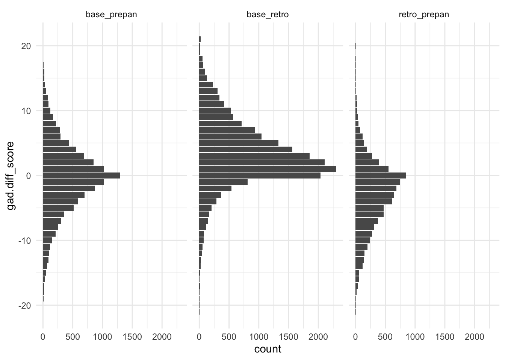


```
Warning: Removed 33099 rows containing non-finite values (stat_bin).
```

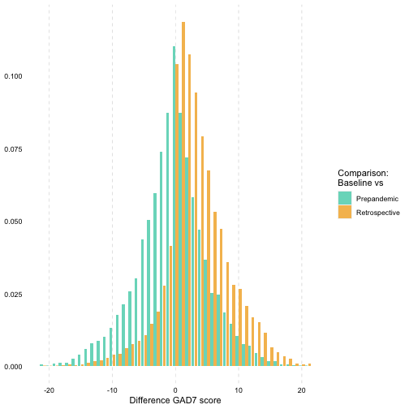


```
Warning: Removed 33099 rows containing non-finite values (stat_bin).
```

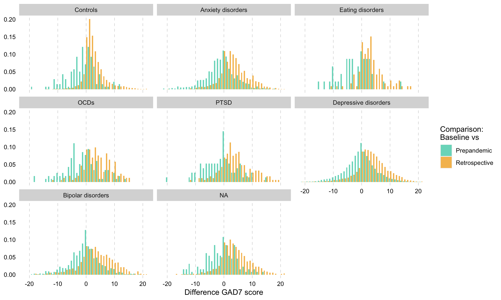


```
Warning: Removed 23437 rows containing non-finite values (stat_bin).
```

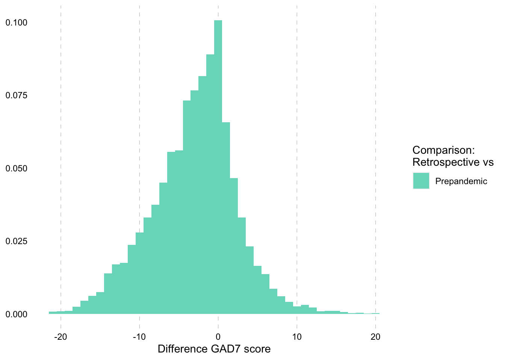

### Plots sum


```
Warning: Removed 33099 rows containing non-finite values (stat_bin).
```

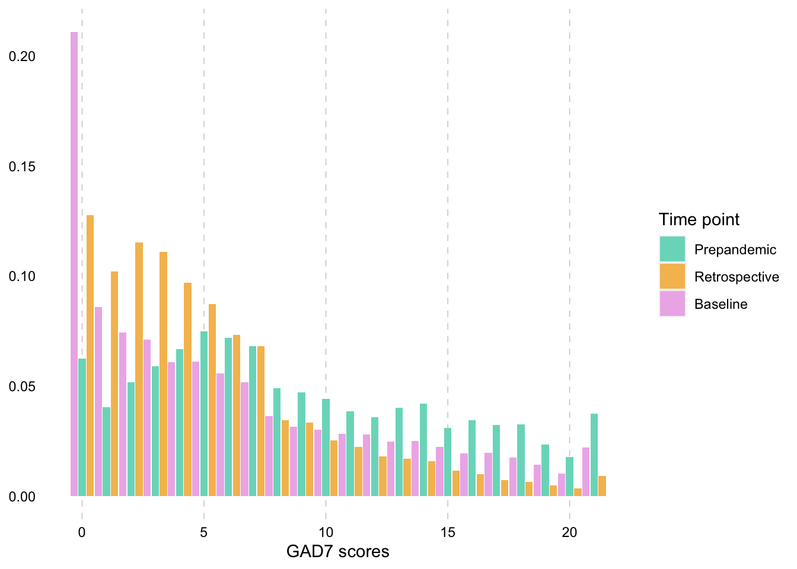


```
Warning: Removed 33099 rows containing non-finite values (stat_bin).
```

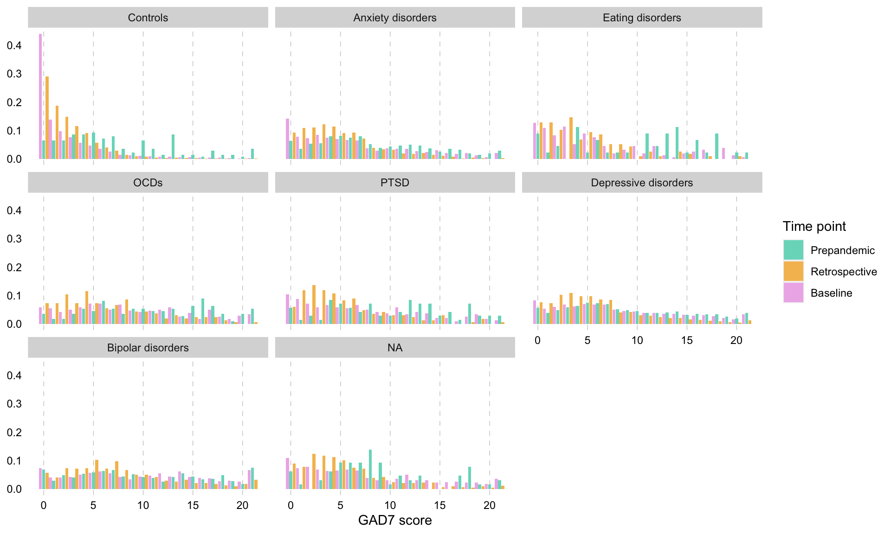

### Violin plots


```
Warning: `fun.y` is deprecated. Use `fun` instead.
```

```
Warning: `fun.ymin` is deprecated. Use `fun.min` instead.
```

```
Warning: `fun.ymax` is deprecated. Use `fun.max` instead.
```

```
Warning: Removed 33099 rows containing non-finite values (stat_ydensity).
```

```
Warning: Removed 33099 rows containing non-finite values (stat_summary).
```

```
Warning: Removed 33099 rows containing missing values (geom_point).
```

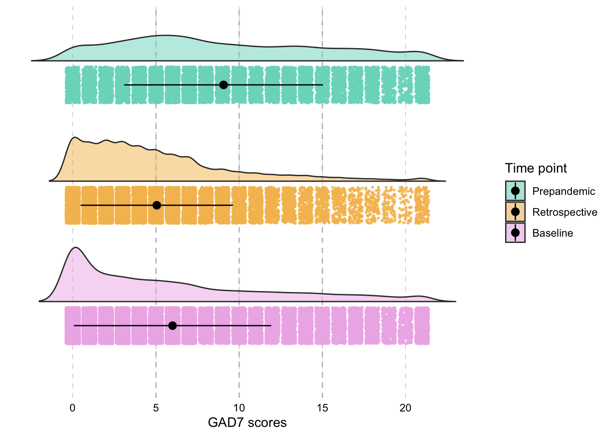


```
Warning: `fun.y` is deprecated. Use `fun` instead.
```

```
Warning: `fun.ymin` is deprecated. Use `fun.min` instead.
```

```
Warning: `fun.ymax` is deprecated. Use `fun.max` instead.
```

```
Warning: Removed 33099 rows containing non-finite values (stat_ydensity).
```

```
Warning: Removed 33099 rows containing non-finite values (stat_summary).
```

```
Warning: Removed 33099 rows containing missing values (geom_point).
```

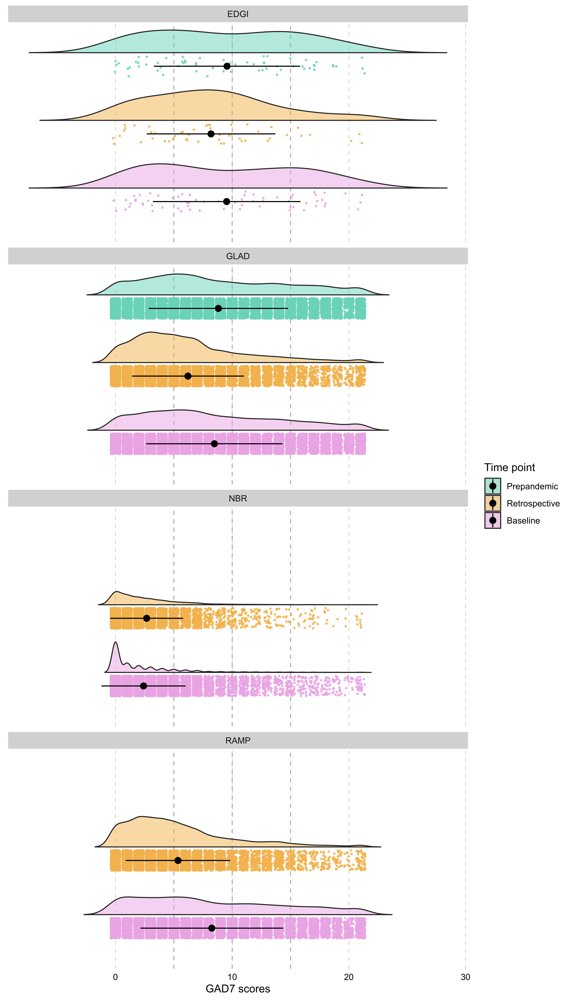


```
Warning: `fun.y` is deprecated. Use `fun` instead.
```

```
Warning: `fun.ymin` is deprecated. Use `fun.min` instead.
```

```
Warning: `fun.ymax` is deprecated. Use `fun.max` instead.
```

```
Warning: Removed 33099 rows containing non-finite values (stat_ydensity).
```

```
Warning: Removed 33099 rows containing non-finite values (stat_summary).
```

```
Warning: Removed 33099 rows containing missing values (geom_point).
```

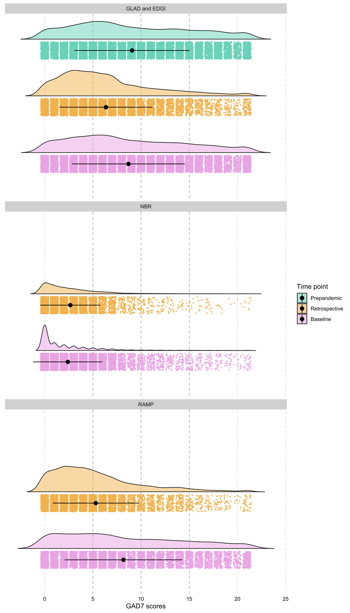


```
Warning: `fun.y` is deprecated. Use `fun` instead.
```

```
Warning: `fun.ymin` is deprecated. Use `fun.min` instead.
```

```
Warning: `fun.ymax` is deprecated. Use `fun.max` instead.
```

```
Warning: Removed 33099 rows containing non-finite values (stat_ydensity).
```

```
Warning: Removed 33099 rows containing non-finite values (stat_summary).
```

```
Warning: Removed 33099 rows containing missing values (geom_point).
```

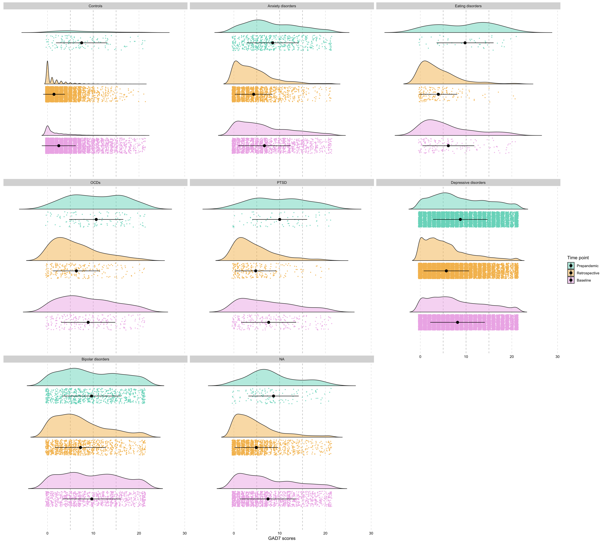


## phq

### Summary scores

```
Warning in min(., na.rm = T): no non-missing arguments to min; returning Inf

Warning in min(., na.rm = T): no non-missing arguments to min; returning Inf
```

```
Warning in max(., na.rm = T): no non-missing arguments to max; returning -Inf

Warning in max(., na.rm = T): no non-missing arguments to max; returning -Inf
```

```
Warning in gzfile(file, "wb"): cannot open compressed file '/Users/kirstin/.rstudio-desktop/notebooks/4B75133E-PANCHANGE_analysis/
1/3BE413B1410ED5D1/cpwss7xlr3opb_t/_rs_rdf_171322bbe795d.rdf', probable reason 'No such file or directory'
```

```
Error in gzfile(file, "wb"): cannot open the connection
```


```
Warning in gzfile(file, "wb"): cannot open compressed file '/Users/kirstin/.rstudio-desktop/notebooks/4B75133E-PANCHANGE_analysis/
1/3BE413B1410ED5D1/cpwss7xlr3opb_t/_rs_rdf_171321f4e5850.rdf', probable reason 'No such file or directory'
```

```
Error in gzfile(file, "wb"): cannot open the connection
```

Table for knitting
phq sum score summary table

|Phq.change_binary |Variable | Min|  Max|      Mean| Median|       SD|      Skew|   Kurtosis|
|:-----------------|:--------|---:|----:|---------:|------:|--------:|---------:|----------:|
|No change         |Base     |   0|   27|  3.779763|      2| 5.481075| 2.0240159|  3.8206843|
|No change         |Prepan   |   0|   27| 10.489318|      9| 7.211689| 0.4737527| -0.7484781|
|No change         |Retro    | Inf| -Inf|       NaN|     NA|       NA|        NA|         NA|
|Worsening         |Base     |   0|   27| 10.318865|      9| 6.601230| 0.5934998| -0.5407978|
|Worsening         |Prepan   |   0|   27| 11.731892|     11| 6.742218| 0.3025175| -0.7730617|
|Worsening         |Retro    |   0|   27|  5.713298|      4| 5.275219| 1.4212461|  1.9501353|
|Improvement       |Base     |   0|   27|  6.759112|      5| 5.758644| 1.0575115|  0.7067317|
|Improvement       |Prepan   |   0|   27| 11.511645|     11| 6.718528| 0.3046296| -0.8118759|
|Improvement       |Retro    |   0|   27|  9.813261|      9| 6.780903| 0.5958911| -0.4615114|
|NA                |Base     |   0|   27|  5.884892|      3| 6.885270| 1.1461385|  0.3684788|
|NA                |Prepan   |   0|   25| 11.424242|      9| 7.583000| 0.3851207| -1.1446285|
|NA                |Retro    | Inf| -Inf|       NaN|     NA|       NA|        NA|         NA|

### Differences score


```
Warning in min(., na.rm = T): no non-missing arguments to min; returning Inf

Warning in min(., na.rm = T): no non-missing arguments to min; returning Inf

Warning in min(., na.rm = T): no non-missing arguments to min; returning Inf

Warning in min(., na.rm = T): no non-missing arguments to min; returning Inf
```

```
Warning in max(., na.rm = T): no non-missing arguments to max; returning -Inf

Warning in max(., na.rm = T): no non-missing arguments to max; returning -Inf

Warning in max(., na.rm = T): no non-missing arguments to max; returning -Inf

Warning in max(., na.rm = T): no non-missing arguments to max; returning -Inf
```

```
Warning in gzfile(file, "wb"): cannot open compressed file '/Users/kirstin/.rstudio-desktop/notebooks/4B75133E-PANCHANGE_analysis/
1/3BE413B1410ED5D1/cpwss7xlr3opb_t/_rs_rdf_1713265964a54.rdf', probable reason 'No such file or directory'
```

```
Error in gzfile(file, "wb"): cannot open the connection
```


```
Warning in gzfile(file, "wb"): cannot open compressed file '/Users/kirstin/.rstudio-desktop/notebooks/4B75133E-PANCHANGE_analysis/
1/3BE413B1410ED5D1/cpwss7xlr3opb_t/_rs_rdf_171321ee7d06a.rdf', probable reason 'No such file or directory'
```

```
Error in gzfile(file, "wb"): cannot open the connection
```

Table for knitting
phq diff summary table

|Phq.change_binary |Variable       | Min|  Max|       Mean| Median|       SD|       Skew|  Kurtosis|
|:-----------------|:--------------|---:|----:|----------:|------:|--------:|----------:|---------:|
|No change         |Base - prepan  | -25|   23| -1.9826472|     -1| 5.133551| -0.3168253| 1.6880781|
|No change         |Base - retro   | Inf| -Inf|        NaN|     NA|       NA|         NA|        NA|
|No change         |Prepan - retro | Inf| -Inf|        NaN|     NA|       NA|         NA|        NA|
|Worsening         |Base - prepan  | -23|   24|  0.7995943|      1| 5.546920| -0.0685706| 0.8779614|
|Worsening         |Base - retro   | -18|   27|  4.6013154|      4| 4.537987|  0.9270470| 1.3367436|
|Worsening         |Prepan - retro | -27|   21| -4.2498646|     -4| 5.496923| -0.3766182| 0.6037092|
|Improvement       |Base - prepan  | -22|   14| -4.0313183|     -3| 5.595035| -0.4118415| 0.2308405|
|Improvement       |Base - retro   | -24|   23| -3.0461797|     -3| 5.576957|  0.0339898| 1.8480119|
|Improvement       |Prepan - retro | -27|   22| -0.1211679|      0| 6.134474| -0.0254236| 0.7299648|
|NA                |Base - prepan  | -21|    8| -0.5312500|      0| 6.111778| -1.1041870| 1.8755762|
|NA                |Base - retro   | Inf| -Inf|        NaN|     NA|       NA|         NA|        NA|
|NA                |Prepan - retro | Inf| -Inf|        NaN|     NA|       NA|         NA|        NA|

### Long format


```
Warning in gzfile(file, "wb"): cannot open compressed file '/Users/kirstin/.rstudio-desktop/notebooks/4B75133E-PANCHANGE_analysis/
1/3BE413B1410ED5D1/cpwss7xlr3opb_t/_rs_rdf_1713245a71751.rdf', probable reason 'No such file or directory'
```

```
Error in gzfile(file, "wb"): cannot open the connection
```


```
Warning in gzfile(file, "wb"): cannot open compressed file '/Users/kirstin/.rstudio-desktop/notebooks/4B75133E-PANCHANGE_analysis/
1/3BE413B1410ED5D1/cpwss7xlr3opb_t/_rs_rdf_17132474c399.rdf', probable reason 'No such file or directory'
```

```
Error in gzfile(file, "wb"): cannot open the connection
```

### Plots

makes this into percentages

```
Warning: Removed 55288 rows containing non-finite values (stat_count).
```

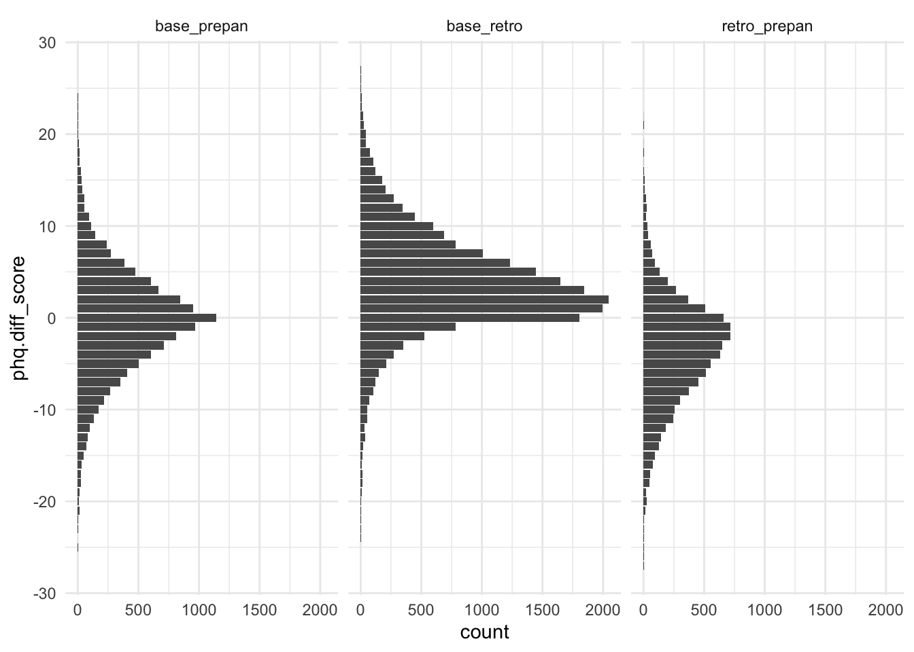


```
Warning: Removed 32162 rows containing non-finite values (stat_bin).
```

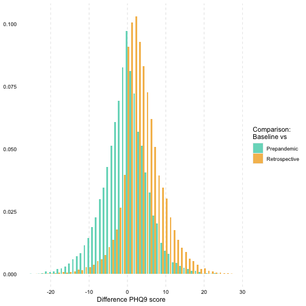


```
Warning: Removed 23126 rows containing non-finite values (stat_bin).
```

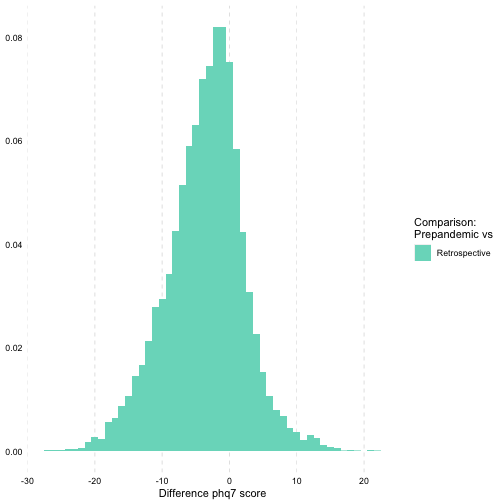


```
Warning: Removed 32162 rows containing non-finite values (stat_bin).
```

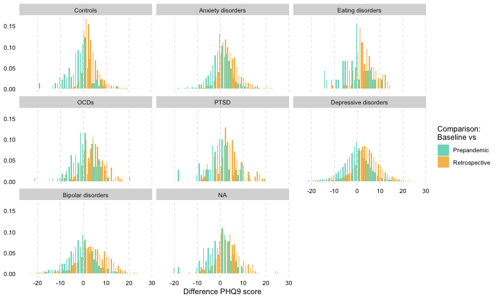

### Plots sum


```
Warning: Removed 32162 rows containing non-finite values (stat_bin).
```

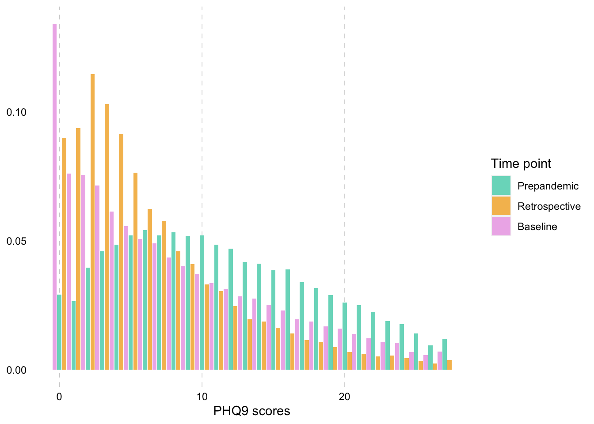


```
Warning: Removed 32162 rows containing non-finite values (stat_bin).
```

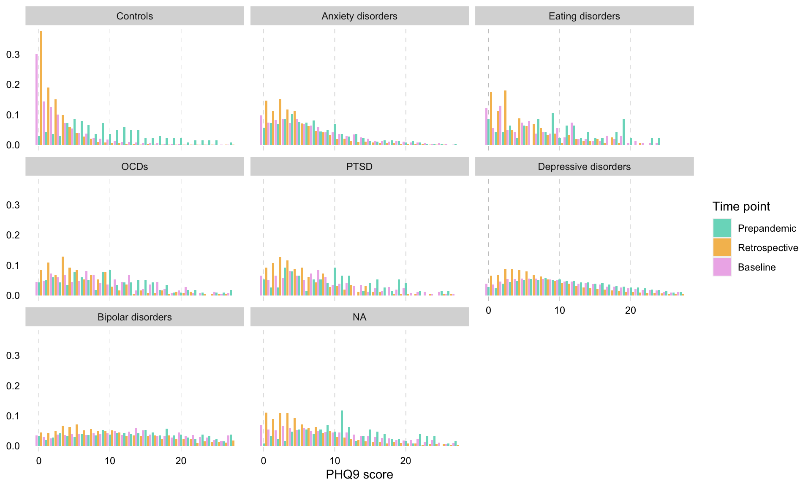


### Violin plots


```
Warning: `fun.y` is deprecated. Use `fun` instead.
```

```
Warning: `fun.ymin` is deprecated. Use `fun.min` instead.
```

```
Warning: `fun.ymax` is deprecated. Use `fun.max` instead.
```

```
Warning: Removed 32162 rows containing non-finite values (stat_ydensity).
```

```
Warning: Removed 32162 rows containing non-finite values (stat_summary).
```

```
Warning: Removed 32162 rows containing missing values (geom_point).
```

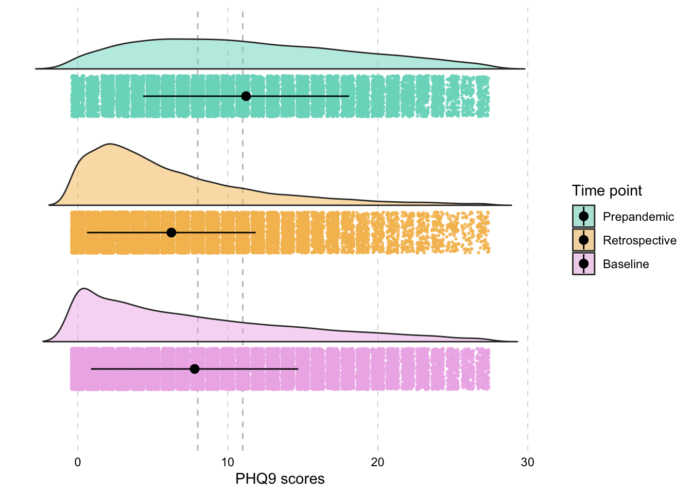


```
Warning: `fun.y` is deprecated. Use `fun` instead.
```

```
Warning: `fun.ymin` is deprecated. Use `fun.min` instead.
```

```
Warning: `fun.ymax` is deprecated. Use `fun.max` instead.
```

```
Warning: Removed 32162 rows containing non-finite values (stat_ydensity).
```

```
Warning: Removed 32162 rows containing non-finite values (stat_summary).
```

```
Warning: Removed 32162 rows containing missing values (geom_point).
```

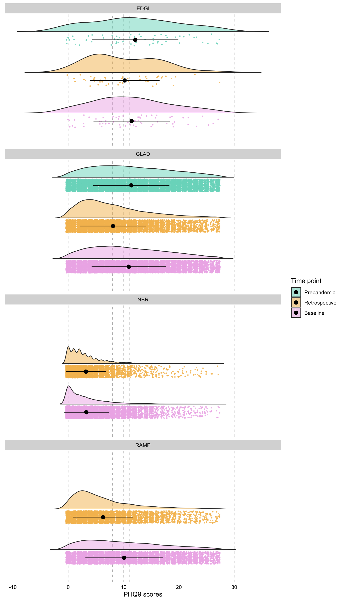


```
Warning: `fun.y` is deprecated. Use `fun` instead.
```

```
Warning: `fun.ymin` is deprecated. Use `fun.min` instead.
```

```
Warning: `fun.ymax` is deprecated. Use `fun.max` instead.
```

```
Warning: Removed 32162 rows containing non-finite values (stat_ydensity).
```

```
Warning: Removed 32162 rows containing non-finite values (stat_summary).
```

```
Warning: Removed 32162 rows containing missing values (geom_point).
```

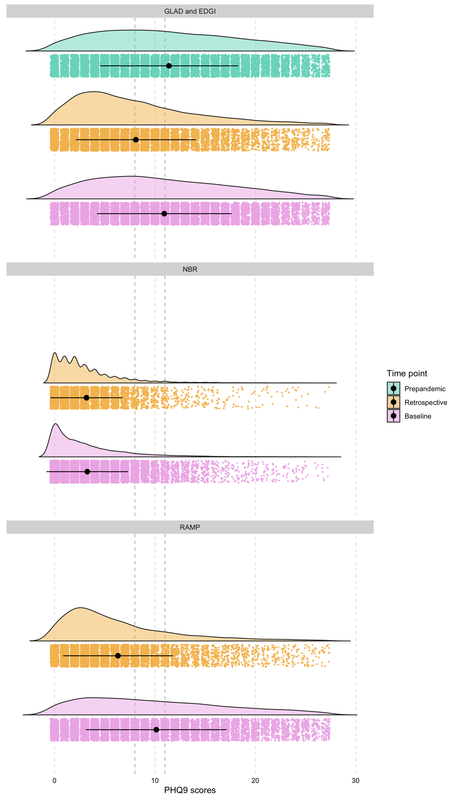


```
Warning: `fun.y` is deprecated. Use `fun` instead.
```

```
Warning: `fun.ymin` is deprecated. Use `fun.min` instead.
```

```
Warning: `fun.ymax` is deprecated. Use `fun.max` instead.
```

```
Warning: Removed 32162 rows containing non-finite values (stat_ydensity).
```

```
Warning: Removed 32162 rows containing non-finite values (stat_summary).
```

```
Warning: Removed 32162 rows containing missing values (geom_point).
```

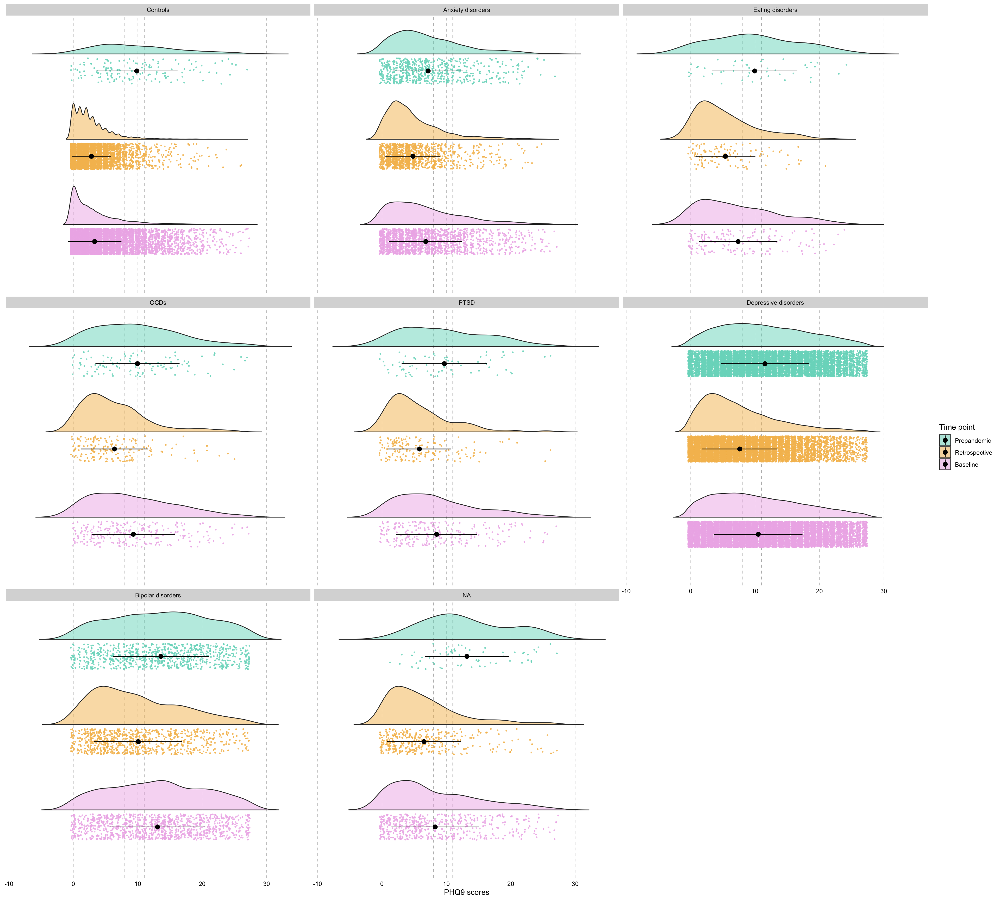


## ocir

### Summary scores

```
Warning in min(., na.rm = T): no non-missing arguments to min; returning Inf
```

```
Warning in max(., na.rm = T): no non-missing arguments to max; returning -Inf
```

```
Warning in gzfile(file, "wb"): cannot open compressed file '/Users/kirstin/.rstudio-desktop/notebooks/4B75133E-PANCHANGE_analysis/
1/3BE413B1410ED5D1/cpwss7xlr3opb_t/_rs_rdf_17132b0955df.rdf', probable reason 'No such file or directory'
```

```
Error in gzfile(file, "wb"): cannot open the connection
```


```
Warning in gzfile(file, "wb"): cannot open compressed file '/Users/kirstin/.rstudio-desktop/notebooks/4B75133E-PANCHANGE_analysis/
1/3BE413B1410ED5D1/cpwss7xlr3opb_t/_rs_rdf_171323b1c005b.rdf', probable reason 'No such file or directory'
```

```
Error in gzfile(file, "wb"): cannot open the connection
```

Table for knitting
ocir sum score summary table

|Variable | Min| Max|     Mean| Median|       SD|      Skew|   Kurtosis|
|:--------|---:|---:|--------:|------:|--------:|---------:|----------:|
|Base     |   0|  72| 17.80762|     15| 12.88086| 1.1272426|  1.1744348|
|Prepan   |   1|  71| 27.48730|     26| 14.13691| 0.6265723| -0.0286904|
|Retro    |   0|  71| 16.99466|     14| 12.83344| 1.0979581|  0.9647110|

### Differences scores


```
Warning in gzfile(file, "wb"): cannot open compressed file '/Users/kirstin/.rstudio-desktop/notebooks/4B75133E-PANCHANGE_analysis/
1/3BE413B1410ED5D1/cpwss7xlr3opb_t/_rs_rdf_1713278b04341.rdf', probable reason 'No such file or directory'
```

```
Error in gzfile(file, "wb"): cannot open the connection
```


```
Warning in gzfile(file, "wb"): cannot open compressed file '/Users/kirstin/.rstudio-desktop/notebooks/4B75133E-PANCHANGE_analysis/
1/3BE413B1410ED5D1/cpwss7xlr3opb_t/_rs_rdf_17132656210dc.rdf', probable reason 'No such file or directory'
```

```
Error in gzfile(file, "wb"): cannot open the connection
```

Table for knitting
ocir diff summary table

|Variable       | Min| Max|       Mean| Median|        SD|       Skew|  Kurtosis|
|:--------------|---:|---:|----------:|------:|---------:|----------:|---------:|
|Base - prepan  | -40|  34| -8.0439560|     -7| 10.749154| -0.1101172| 0.6746143|
|Base - retro   | -44|  72|  0.9100517|      0|  9.658776|  0.2846682| 2.4704171|
|Prepan - retro | -30|  27| -3.5058005|     -3|  9.301472| -0.0619316| 0.3779813|

### Long format


```
Warning in gzfile(file, "wb"): cannot open compressed file '/Users/kirstin/.rstudio-desktop/notebooks/4B75133E-PANCHANGE_analysis/
1/3BE413B1410ED5D1/cpwss7xlr3opb_t/_rs_rdf_171322d53223d.rdf', probable reason 'No such file or directory'
```

```
Error in gzfile(file, "wb"): cannot open the connection
```


```
Warning in gzfile(file, "wb"): cannot open compressed file '/Users/kirstin/.rstudio-desktop/notebooks/4B75133E-PANCHANGE_analysis/
1/3BE413B1410ED5D1/cpwss7xlr3opb_t/_rs_rdf_1713275f94d90.rdf', probable reason 'No such file or directory'
```

```
Error in gzfile(file, "wb"): cannot open the connection
```

### Plots

makes this into percentages

```
Warning: Removed 89888 rows containing non-finite values (stat_count).
```

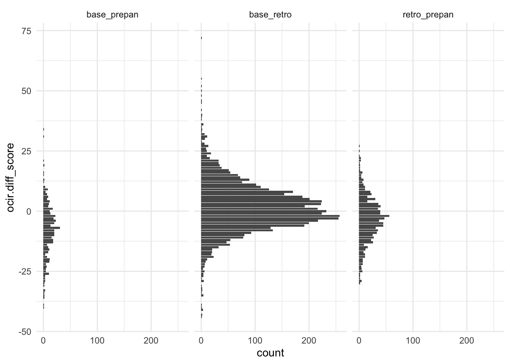


```
Warning: Removed 58866 rows containing non-finite values (stat_bin).
```

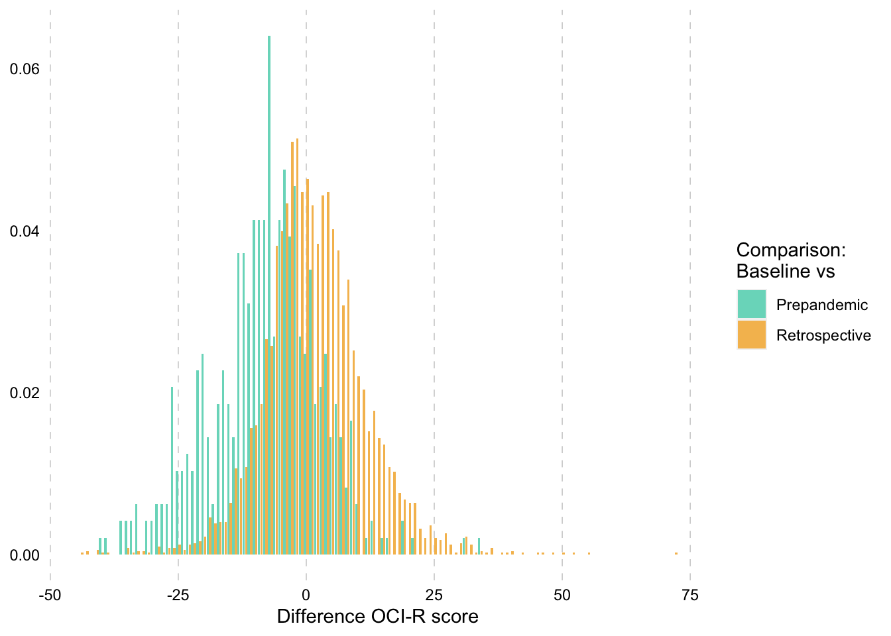


```
Warning: Removed 31022 rows containing non-finite values (stat_bin).
```

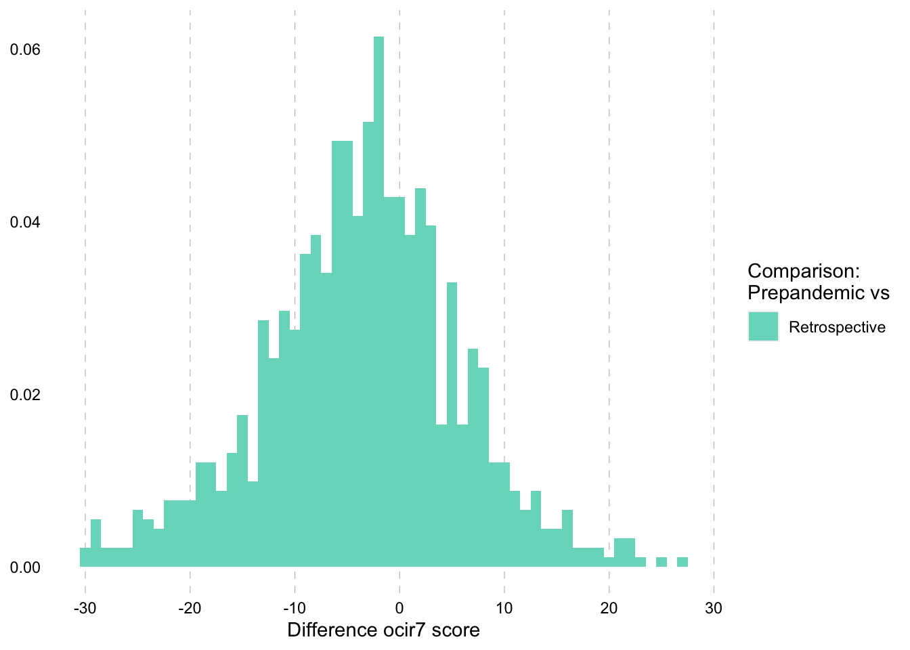


```
Warning: Removed 58866 rows containing non-finite values (stat_bin).
```

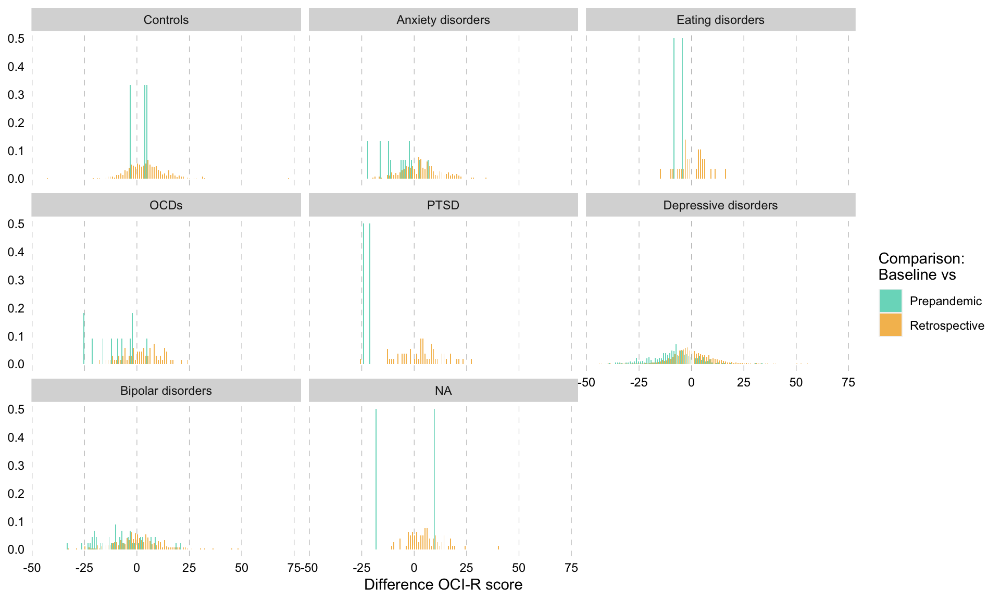

### Plots sum


```
Warning: Removed 81548 rows containing non-finite values (stat_bin).
```

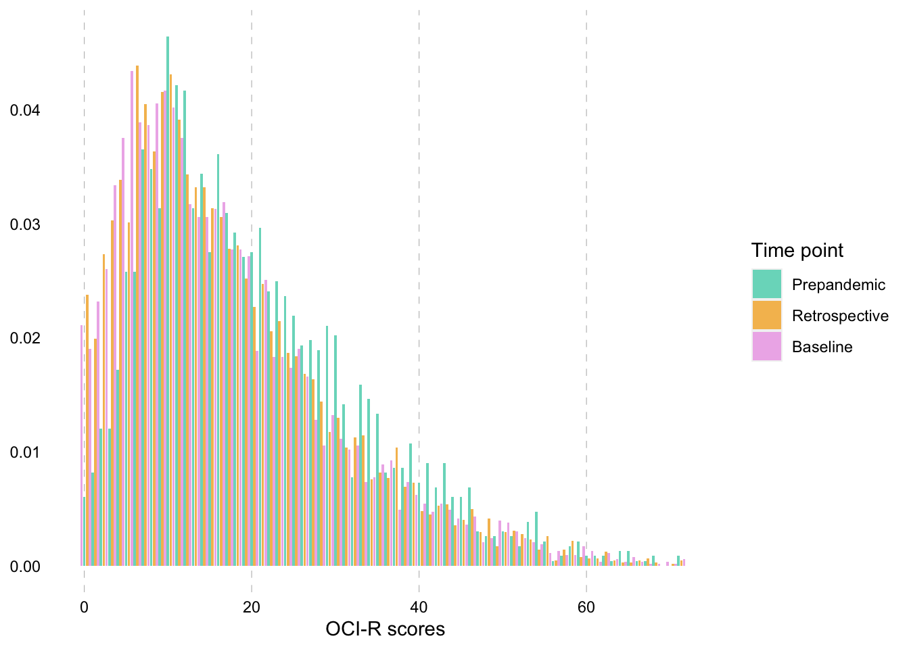


```
Warning: Removed 81548 rows containing non-finite values (stat_bin).
```

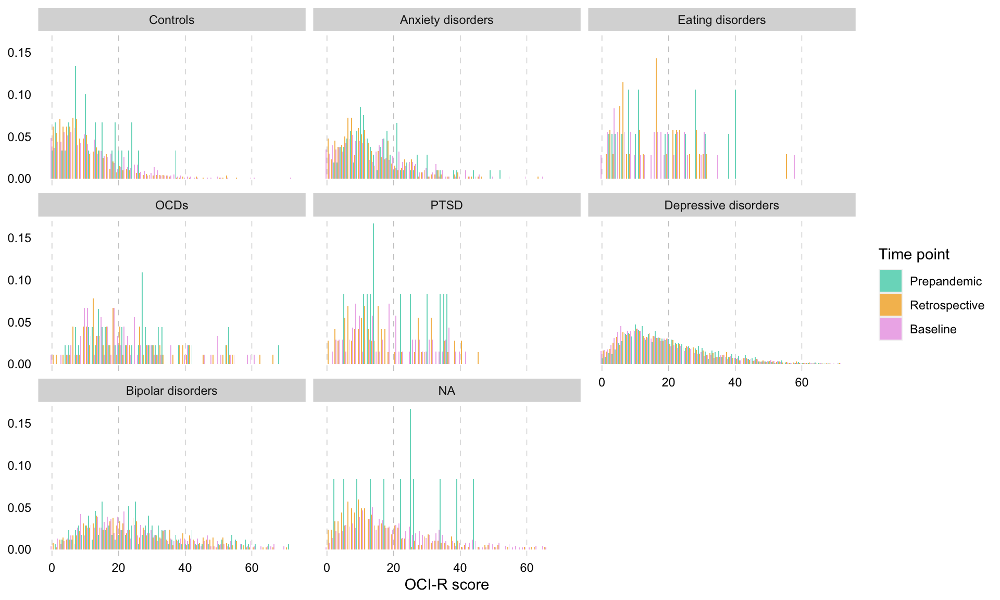


### Violin plots


```
Warning: `fun.y` is deprecated. Use `fun` instead.
```

```
Warning: `fun.ymin` is deprecated. Use `fun.min` instead.
```

```
Warning: `fun.ymax` is deprecated. Use `fun.max` instead.
```

```
Warning: Removed 81548 rows containing non-finite values (stat_ydensity).
```

```
Warning: Removed 81548 rows containing non-finite values (stat_summary).
```

```
Warning: Removed 81548 rows containing missing values (geom_point).
```

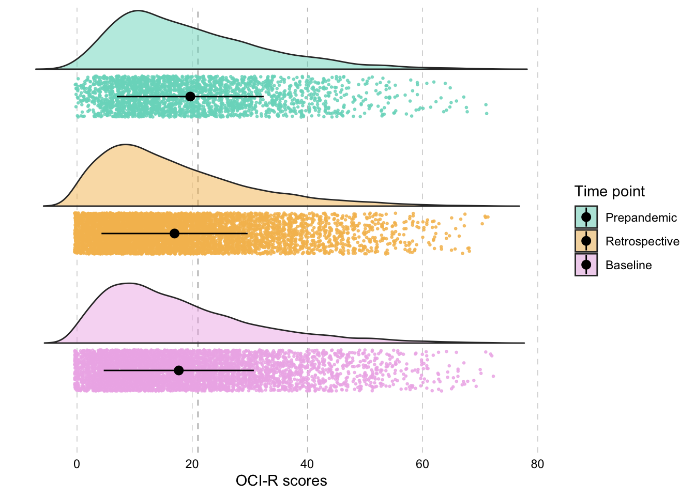


```
Warning: `fun.y` is deprecated. Use `fun` instead.
```

```
Warning: `fun.ymin` is deprecated. Use `fun.min` instead.
```

```
Warning: `fun.ymax` is deprecated. Use `fun.max` instead.
```

```
Warning: Removed 81548 rows containing non-finite values (stat_ydensity).
```

```
Warning: Removed 81548 rows containing non-finite values (stat_summary).
```

```
Warning: Removed 81548 rows containing missing values (geom_point).
```

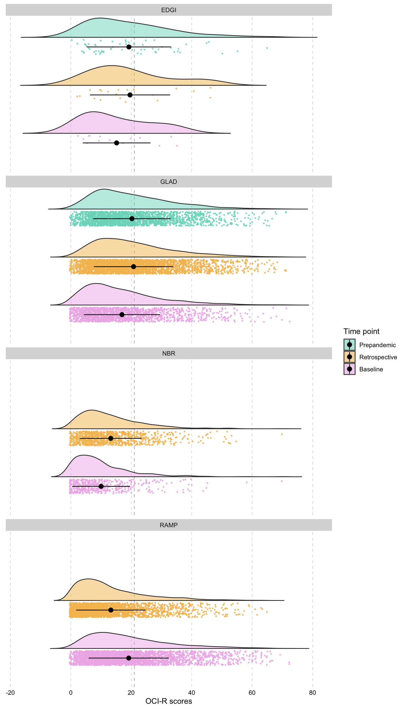


```
Warning: `fun.y` is deprecated. Use `fun` instead.
```

```
Warning: `fun.ymin` is deprecated. Use `fun.min` instead.
```

```
Warning: `fun.ymax` is deprecated. Use `fun.max` instead.
```

```
Warning: Removed 81548 rows containing non-finite values (stat_ydensity).
```

```
Warning: Removed 81548 rows containing non-finite values (stat_summary).
```

```
Warning: Removed 81548 rows containing missing values (geom_point).
```

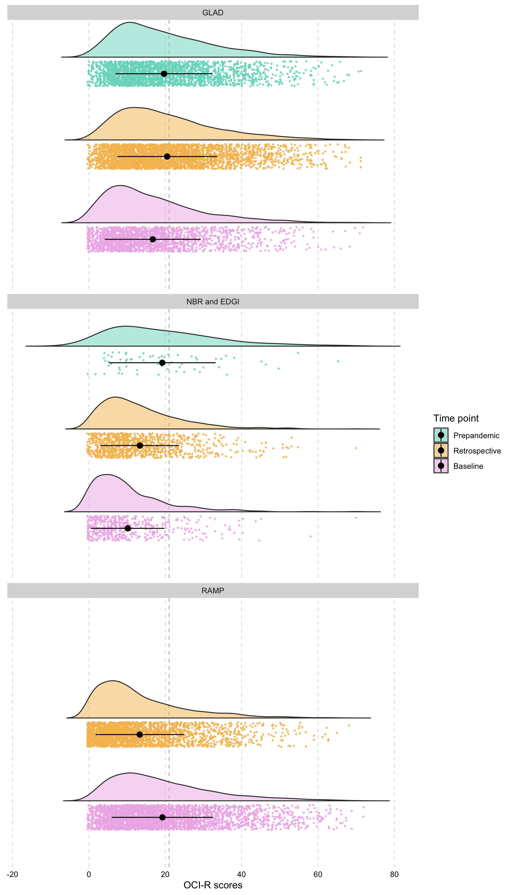


```
Warning: `fun.y` is deprecated. Use `fun` instead.
```

```
Warning: `fun.ymin` is deprecated. Use `fun.min` instead.
```

```
Warning: `fun.ymax` is deprecated. Use `fun.max` instead.
```

```
Warning: Removed 81548 rows containing non-finite values (stat_ydensity).
```

```
Warning: Removed 81548 rows containing non-finite values (stat_summary).
```

```
Warning: Removed 81548 rows containing missing values (geom_point).
```

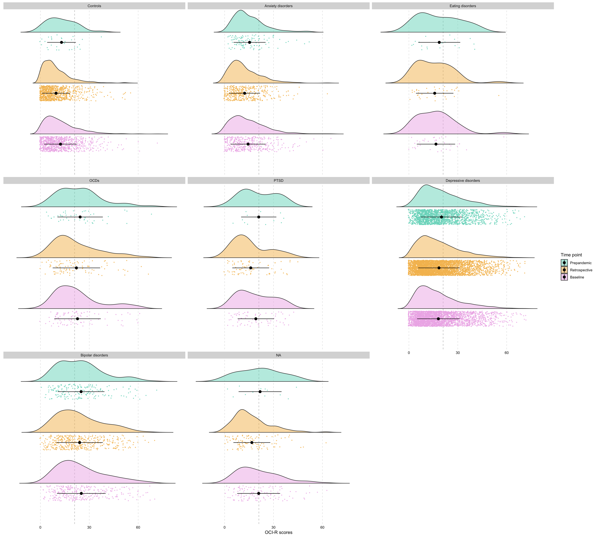

++CH: Rank the disorders by the size of the change


PCL:
Calculate the total GLAD, COPING, RAMP baseline
## PCL


```
Warning in gzfile(file, "wb"): cannot open compressed file '/Users/kirstin/.rstudio-desktop/notebooks/4B75133E-PANCHANGE_analysis/
1/3BE413B1410ED5D1/cpwss7xlr3opb_t/_rs_rdf_171328fb8ded.rdf', probable reason 'No such file or directory'
```

```
Error in gzfile(file, "wb"): cannot open the connection
```


```
Warning in gzfile(file, "wb"): cannot open compressed file '/Users/kirstin/.rstudio-desktop/notebooks/4B75133E-PANCHANGE_analysis/
1/3BE413B1410ED5D1/cpwss7xlr3opb_t/_rs_rdf_171326844c88e.rdf', probable reason 'No such file or directory'
```

```
Error in gzfile(file, "wb"): cannot open the connection
```

Table for knitting
pcl sum score summary table

|Variable      | Min| Max|      Mean| Median|       SD|       Skew|  Kurtosis|
|:-------------|---:|---:|---------:|------:|--------:|----------:|---------:|
|Base - prepan | -23|  24| 0.2068164|      0| 5.666463| -0.0743275| 0.6542706|


```
Warning in gzfile(file, "wb"): cannot open compressed file '/Users/kirstin/.rstudio-desktop/notebooks/4B75133E-PANCHANGE_analysis/
1/3BE413B1410ED5D1/cpwss7xlr3opb_t/_rs_rdf_171325589ded.rdf', probable reason 'No such file or directory'
```

```
Error in gzfile(file, "wb"): cannot open the connection
```


```
Warning in gzfile(file, "wb"): cannot open compressed file '/Users/kirstin/.rstudio-desktop/notebooks/4B75133E-PANCHANGE_analysis/
1/3BE413B1410ED5D1/cpwss7xlr3opb_t/_rs_rdf_1713271066478.rdf', probable reason 'No such file or directory'
```

```
Error in gzfile(file, "wb"): cannot open the connection
```

Table for knitting
pcl diff summary table

|Variable | Min| Max|     Mean| Median|       SD|      Skew|   Kurtosis|
|:--------|---:|---:|--------:|------:|--------:|---------:|----------:|
|Base     |   6|  30| 12.33784|     11| 6.051631| 0.9357645| -0.0152704|
|Prepan   |   6|  30| 15.63577|     15| 6.120978| 0.3799305| -0.7386952|


```
Warning in gzfile(file, "wb"): cannot open compressed file '/Users/kirstin/.rstudio-desktop/notebooks/4B75133E-PANCHANGE_analysis/
1/3BE413B1410ED5D1/cpwss7xlr3opb_t/_rs_rdf_17132411ac4d6.rdf', probable reason 'No such file or directory'
```

```
Error in gzfile(file, "wb"): cannot open the connection
```

For each item
present percentages of how say that this is due to the pandemic

|PCL Item                                                      |Binary_score |     n| prop|n_prop        |
|:-------------------------------------------------------------|:------------|-----:|----:|:-------------|
|pcl.cut_people_feeling_distant_retro_numeric                  |0            |  5970| 18.7|5970 (18.7%)  |
|pcl.cut_people_feeling_distant_retro_numeric                  |1            | 15402| 48.3|15402 (48.3%) |
|pcl.cut_people_feeling_distant_retro_numeric                  |Missing      | 10512| 33.0|10512 (33%)   |
|pcl.difficulty_concentrating_retro_numeric                    |0            |  9916| 31.1|9916 (31.1%)  |
|pcl.difficulty_concentrating_retro_numeric                    |1            | 10289| 32.3|10289 (32.3%) |
|pcl.difficulty_concentrating_retro_numeric                    |Missing      | 11679| 36.6|11679 (36.6%) |
|pcl.feeling_irritable_or_having_angry_outbursts_retro_numeric |0            |  8756| 27.5|8756 (27.5%)  |
|pcl.feeling_irritable_or_having_angry_outbursts_retro_numeric |1            |  9870| 31.0|9870 (31%)    |
|pcl.feeling_irritable_or_having_angry_outbursts_retro_numeric |Missing      | 13258| 41.6|13258 (41.6%) |
|pcl.stressful_experience_repeated_images_retro_numeric        |0            | 13112| 41.1|13112 (41.1%) |
|pcl.stressful_experience_repeated_images_retro_numeric        |1            |  2902|  9.1|2902 (9.1%)   |
|pcl.stressful_experience_repeated_images_retro_numeric        |Missing      | 15870| 49.8|15870 (49.8%) |
|pcl.stressful_experience_upset_reminded_retro_numeric         |0            | 13848| 43.4|13848 (43.4%) |
|pcl.stressful_experience_upset_reminded_retro_numeric         |1            |  3742| 11.7|3742 (11.7%)  |
|pcl.stressful_experience_upset_reminded_retro_numeric         |Missing      | 14294| 44.8|14294 (44.8%) |
|pcl.stressful_situation_avoiding_activities_retro_numeric     |0            |  9158| 28.7|9158 (28.7%)  |
|pcl.stressful_situation_avoiding_activities_retro_numeric     |1            |  2465|  7.7|2465 (7.7%)   |
|pcl.stressful_situation_avoiding_activities_retro_numeric     |Missing      | 20261| 63.5|20261 (63.5%) |

```
Warning in gzfile(file, "wb"): cannot open compressed file '/Users/kirstin/.rstudio-desktop/notebooks/4B75133E-PANCHANGE_analysis/
1/3BE413B1410ED5D1/cpwss7xlr3opb_t/_rs_rdf_171324e4018cc.rdf', probable reason 'No such file or directory'
```

```
Error in gzfile(file, "wb"): cannot open the connection
```


### Plots sum


```
Warning: Removed 43815 rows containing non-finite values (stat_bin).
```

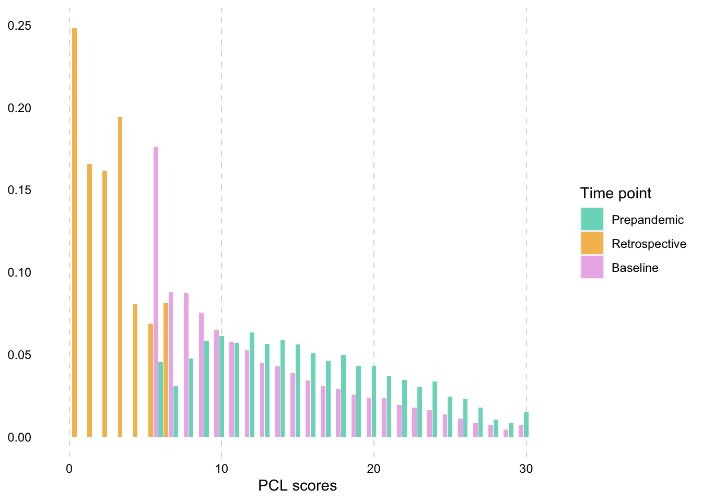


```
Warning: Removed 43815 rows containing non-finite values (stat_bin).
```

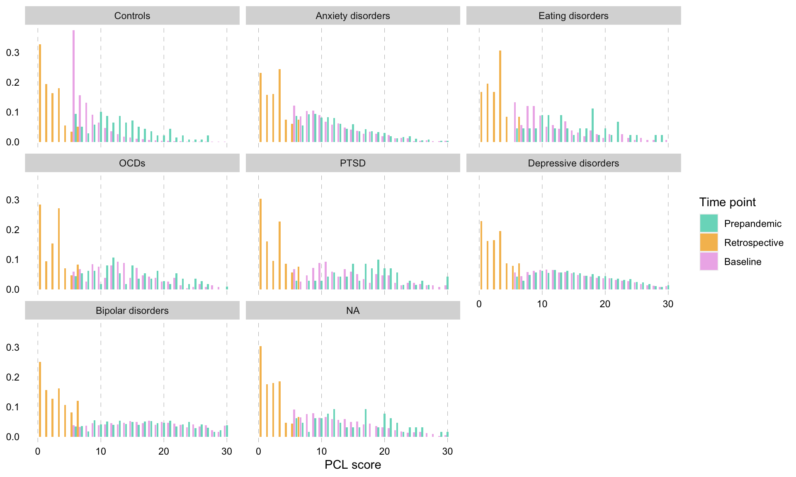


# Create subsets of data for analyses
Filter data frame to create 2 additional datasets. Additional exclusion criteria (beyond those listed above) are specified below:

  1. Retrospective - baseline change anlyses
        i. Exclude individuals missing retrospective and/or baseline data
  2. Prepandemic - baseline change analyses
          i. Exclude individuals missing pandemic and/or baseline data
          ii. Exclude individuals with prepandemic data collected after 1st March.

Retro-baseline analyses


```
[1] 23539   641
```

Prepan-baseline analyses
Exclude individuals with NA for MHD, age, gender; exclude if prepan data collected after 1 March


```
[1] 11230   641
```

Prepan-baseline analyses
Exclude individuals with NA for MHD, age, gender; exclude if prepan data collected after 1 March (to ensure comparability with prepan analyses)


```
[1] 9745  641
```
age^2 sensitivity
Exclude individuals with NA for continuous Age variable

```
[1] 24816   641
```

```
[1] 17092   641
```

```
[1] 11230   641
```

Sensitivity analysis for individuals who signed up to GLAD (prepan) either 3, 6 or 9 months before the pendemic began.


2. Regression models (Regress covariates out of the change? Which?)
    i. Model 0: Disorders
    ii. Model 1: Model 0 + Sex + Age + Ethnicity + Time registration and baseline

3. Re-calculate change

4. Re-rank the change again

5. PCL:
    i. Calculate the total GLAD, COPING, RAMP baseline
    ii. For each item:
          a. present percentages of how say that this is due to the pandemic
          b. Calculate a variable PCL pandemic score
          c. If one item is highly endorsed due to pandemic -> exclude in sensitivity analysis


# 2. Regression
Regress covariates out of the change? Which?

Model naming conventions:
0 - unadjusted
1 - adjusted
2 - adjusted with age^2
a - hierarchical disorders
b - overlapping disorder categories

++MD: We may want to exclude disorders from Model b that aren't including in the hierarchy (e.g. ADHD, ASD)

# Functions


# GAD baseline, not controlling for prior symptoms
### Model 0a: Disorder_hierarchical, Unadjusted

#SB Hashing out this chunk of code as it is not included in our final analysis and is currently breaking the code.

```
Warning in gzfile(file, "wb"): cannot open compressed file '/Users/kirstin/.rstudio-desktop/notebooks/4B75133E-PANCHANGE_analysis/
1/3BE413B1410ED5D1/cpwss7xlr3opb_t/_rs_rdf_171321824540a.rdf', probable reason 'No such file or directory'
```

```
Error in gzfile(file, "wb"): cannot open the connection
```

```
Warning in gzfile(file, "wb"): cannot open compressed file '/Users/kirstin/.rstudio-desktop/notebooks/4B75133E-PANCHANGE_analysis/
1/3BE413B1410ED5D1/cpwss7xlr3opb_t/_rs_rdf_17132790968e7.rdf', probable reason 'No such file or directory'
```

```
Error in gzfile(file, "wb"): cannot open the connection
```

### Model 0b: Overlapping disorders, Unadjusted

|Indepent variable               |Estimate |95% CI low |95% CI up |SE   |p value   |
|:-------------------------------|:--------|:----------|:---------|:----|:---------|
|Intercept                       |2.67     |2.59       |2.76      |0.04 |0.00e+00  |
|Depressive and anxiety disorder |5.63     |5.50       |5.77      |0.07 |0.00e+00  |
|Only depressive disorder        |2.08     |1.90       |2.25      |0.09 |4.32e-117 |
|Only anxiety disorder           |4.03     |3.81       |4.26      |0.11 |1.97e-264 |
|Eating disorders                |1.46     |1.22       |1.69      |0.12 |1.10e-33  |
|OCDs                            |1.94     |1.71       |2.17      |0.12 |8.53e-63  |
|Psychotic and bipolar disorder  |0.38     |-0.26      |1.02      |0.33 |0.24      |
|Only psychotic disorder         |0.35     |-0.20      |0.90      |0.28 |0.21      |
|Only bipolar disorder           |0.46     |0.11       |0.80      |0.18 |0.009     |
|PTSD                            |1.56     |1.35       |1.77      |0.11 |2.35e-48  |
|ASD                             |2.18     |1.77       |2.59      |0.21 |1.80e-25  |
|ADHD                            |1.17     |0.63       |1.71      |0.28 |2.36e-05  |
|Personality disorder            |2.19     |1.89       |2.49      |0.15 |5.79e-46  |

```
Warning in gzfile(file, "wb"): cannot open compressed file '/Users/kirstin/.rstudio-desktop/notebooks/4B75133E-PANCHANGE_analysis/
1/3BE413B1410ED5D1/cpwss7xlr3opb_t/_rs_rdf_1713244a5d80b.rdf', probable reason 'No such file or directory'
```

```
Error in gzfile(file, "wb"): cannot open the connection
```


|n     |R2   |adjust. R2 |F       |p value  | df|
|:-----|:----|:----------|:-------|:--------|--:|
|31331 |0.22 |0.22       |1503.62 |0.00e+00 |  6|

```
Warning in gzfile(file, "wb"): cannot open compressed file '/Users/kirstin/.rstudio-desktop/notebooks/4B75133E-PANCHANGE_analysis/
1/3BE413B1410ED5D1/cpwss7xlr3opb_t/_rs_rdf_17132640add62.rdf', probable reason 'No such file or directory'
```

```
Error in gzfile(file, "wb"): cannot open the connection
```

### Model 1a: Disorder hierarchical, Adjusted
Model 0a + Gender_collapsed + age_category_collapsed_reordered + Ethnicity_collapsed + Time registration and baseline

|Indepent variable                     |Estimate |95% CI low |95% CI up |SE   |p value   |
|:-------------------------------------|:--------|:----------|:---------|:----|:---------|
|Intercept                             |5.67     |5.38       |5.96      |0.15 |9.14e-313 |
|Anxiety disorders                     |2.96     |2.70       |3.22      |0.13 |1.10e-109 |
|Eating disorders                      |2.10     |1.30       |2.91      |0.41 |3.42e-07  |
|OCDs                                  |4.01     |3.35       |4.67      |0.34 |1.26e-32  |
|PTSD                                  |3.96     |3.30       |4.63      |0.34 |2.24e-31  |
|Depressive disorders                  |4.53     |4.39       |4.66      |0.07 |0.00e+00  |
|Bipolar disorders                     |6.08     |5.76       |6.39      |0.16 |1.26e-299 |
|Female                                |1.00     |0.86       |1.14      |0.07 |3.17e-44  |
|Non-binary/Self-defined               |1.60     |1.04       |2.16      |0.29 |2.64e-08  |
|age_category_collapsed_reordered16-18 |3.23     |2.85       |3.60      |0.19 |1.44e-63  |
|19-25 years                           |1.74     |1.48       |2.00      |0.13 |9.41e-40  |
|36-45 years                           |-0.84    |-1.05      |-0.62     |0.11 |2.78e-14  |
|46-55 years                           |-1.57    |-1.77      |-1.37     |0.10 |1.41e-53  |
|56-65 years                           |-2.60    |-2.80      |-2.40     |0.10 |4.06e-145 |
|66-70 years                           |-3.58    |-3.83      |-3.33     |0.13 |5.63e-169 |
|71-75 years                           |-3.78    |-4.07      |-3.49     |0.15 |6.57e-143 |
|76+ years                             |-3.69    |-4.13      |-3.25     |0.22 |2.30e-60  |
|Mixed or multiple ethnic origins      |0.04     |-0.41      |0.49      |0.23 |0.85      |
|Asian or Asian British                |-0.31    |-0.86      |0.23      |0.28 |0.26      |
|African or African British            |-0.25    |-1.18      |0.68      |0.47 |0.59      |
|Other ethnicity                       |0.97     |0.15       |1.80      |0.42 |0.02      |
|Time difference: Lockdown to baseline |-0.24    |-0.27      |-0.21     |0.02 |1.66e-55  |

```
Warning in gzfile(file, "wb"): cannot open compressed file '/Users/kirstin/.rstudio-desktop/notebooks/4B75133E-PANCHANGE_analysis/
1/3BE413B1410ED5D1/cpwss7xlr3opb_t/_rs_rdf_1713261776929.rdf', probable reason 'No such file or directory'
```

```
Error in gzfile(file, "wb"): cannot open the connection
```


|n     |R2   |adjust. R2 |F       |p value  | df|
|:-----|:----|:----------|:-------|:--------|--:|
|31331 |0.22 |0.22       |1503.62 |0.00e+00 |  6|

```
Warning in gzfile(file, "wb"): cannot open compressed file '/Users/kirstin/.rstudio-desktop/notebooks/4B75133E-PANCHANGE_analysis/
1/3BE413B1410ED5D1/cpwss7xlr3opb_t/_rs_rdf_17132669934bc.rdf', probable reason 'No such file or directory'
```

```
Error in gzfile(file, "wb"): cannot open the connection
```

### Model 1b: Overlapping disorders, Adjusted
Model 0a + Gender_collapsed + age_category_collapsed_reordered + Ethnicity_collapsed + Time registration and baseline

|Indepent variable                     |Estimate |95% CI low |95% CI up |SE   |p value   |
|:-------------------------------------|:--------|:----------|:---------|:----|:---------|
|Intercept                             |5.57     |5.28       |5.85      |0.14 |2.40e-317 |
|Depressive and anxiety disorder       |4.60     |4.46       |4.75      |0.07 |0.00e+00  |
|Only depressive disorder              |1.81     |1.63       |1.99      |0.09 |2.60e-83  |
|Only anxiety disorder                 |3.05     |2.82       |3.28      |0.12 |6.22e-145 |
|Eating disorders                      |0.90     |0.67       |1.13      |0.12 |3.61e-14  |
|OCDs                                  |1.45     |1.23       |1.67      |0.11 |5.23e-37  |
|Psychotic and bipolar disorder        |0.74     |0.11       |1.37      |0.32 |0.02      |
|Only psychotic disorder               |0.51     |-0.03      |1.05      |0.27 |0.06      |
|Only bipolar disorder                 |0.65     |0.31       |0.99      |0.17 |1.79e-04  |
|PTSD                                  |1.58     |1.38       |1.79      |0.11 |1.05e-50  |
|ASD                                   |1.31     |0.90       |1.71      |0.21 |2.89e-10  |
|ADHD                                  |0.46     |-0.08      |0.99      |0.27 |0.09      |
|Personality disorder                  |1.82     |1.52       |2.11      |0.15 |2.55e-33  |
|Female                                |0.94     |0.81       |1.08      |0.07 |1.36e-42  |
|Non-binary/Self-defined               |0.69     |0.15       |1.23      |0.28 |0.01      |
|age_category_collapsed_reordered16-18 |3.33     |2.98       |3.68      |0.18 |7.57e-76  |
|19-25 years                           |1.61     |1.36       |1.86      |0.13 |2.50e-37  |
|36-45 years                           |-0.64    |-0.85      |-0.44     |0.11 |1.15e-09  |
|46-55 years                           |-1.15    |-1.35      |-0.96     |0.10 |8.01e-32  |
|56-65 years                           |-2.02    |-2.21      |-1.83     |0.10 |7.82e-93  |
|66-70 years                           |-2.98    |-3.23      |-2.73     |0.13 |1.70e-120 |
|71-75 years                           |-3.19    |-3.47      |-2.90     |0.15 |6.34e-106 |
|76+ years                             |-3.08    |-3.50      |-2.65     |0.22 |1.24e-45  |
|Mixed or multiple ethnic origins      |0.10     |-0.33      |0.53      |0.22 |0.66      |
|Asian or Asian British                |0.16     |-0.36      |0.67      |0.26 |0.55      |
|African or African British            |-0.17    |-1.05      |0.71      |0.45 |0.71      |
|Other ethnicity                       |0.74     |-0.05      |1.52      |0.40 |0.06      |
|Key worker                            |-0.35    |-0.47      |-0.22     |0.06 |4.42e-08  |
|Time difference: Lockdown to baseline |-0.25    |-0.27      |-0.22     |0.01 |1.60e-65  |

```
Warning in gzfile(file, "wb"): cannot open compressed file '/Users/kirstin/.rstudio-desktop/notebooks/4B75133E-PANCHANGE_analysis/
1/3BE413B1410ED5D1/cpwss7xlr3opb_t/_rs_rdf_171322ed41af6.rdf', probable reason 'No such file or directory'
```

```
Error in gzfile(file, "wb"): cannot open the connection
```


|n     |R2   |adjust. R2 |F       |p value  | df|
|:-----|:----|:----------|:-------|:--------|--:|
|31331 |0.22 |0.22       |1503.62 |0.00e+00 |  6|

```
Warning in gzfile(file, "wb"): cannot open compressed file '/Users/kirstin/.rstudio-desktop/notebooks/4B75133E-PANCHANGE_analysis/
1/3BE413B1410ED5D1/cpwss7xlr3opb_t/_rs_rdf_171326736247e.rdf', probable reason 'No such file or directory'
```

```
Error in gzfile(file, "wb"): cannot open the connection
```

### Model 2a: Disorder hierarchical, Adjusted with Age^2

|Indepent variable                     |Estimate |95% CI low |95% CI up |SE   |p value   |
|:-------------------------------------|:--------|:----------|:---------|:----|:---------|
|Intercept                             |1.78     |1.48       |2.09      |0.16 |4.29e-30  |
|Anxiety disorders                     |2.79     |2.49       |3.10      |0.15 |3.88e-72  |
|Eating disorders                      |2.27     |1.33       |3.20      |0.48 |2.04e-06  |
|OCDs                                  |4.46     |3.65       |5.26      |0.41 |3.29e-27  |
|PTSD                                  |4.24     |3.37       |5.12      |0.45 |2.15e-21  |
|Depressive disorders                  |4.80     |4.64       |4.95      |0.08 |0.00e+00  |
|Bipolar disorders                     |6.26     |5.92       |6.60      |0.17 |6.20e-274 |
|Female                                |0.71     |0.56       |0.86      |0.08 |2.18e-20  |
|Non-binary/Self-defined               |1.44     |0.84       |2.05      |0.31 |2.84e-06  |
|Age                                   |-248.64  |-259.74    |-237.54   |5.66 |0.00e+00  |
|Age^2                                 |29.43    |19.41      |39.45     |5.11 |8.72e-09  |
|Mixed or multiple ethnic origins      |0.03     |-0.46      |0.53      |0.25 |0.90      |
|Asian or Asian British                |-0.06    |-0.71      |0.60      |0.33 |0.87      |
|African or African British            |0.02     |-1.01      |1.06      |0.53 |0.96      |
|Other ethnicity                       |1.44     |0.51       |2.38      |0.48 |0.002     |
|Time difference: Lockdown to baseline |0.04     |0.00       |0.08      |0.02 |0.03      |

```
Warning in gzfile(file, "wb"): cannot open compressed file '/Users/kirstin/.rstudio-desktop/notebooks/4B75133E-PANCHANGE_analysis/
1/3BE413B1410ED5D1/cpwss7xlr3opb_t/_rs_rdf_171325d246939.rdf', probable reason 'No such file or directory'
```

```
Error in gzfile(file, "wb"): cannot open the connection
```


|n     |R2   |adjust. R2 |F       |p value  | df|
|:-----|:----|:----------|:-------|:--------|--:|
|24462 |0.27 |0.27       |1541.15 |0.00e+00 |  6|

```
Warning in gzfile(file, "wb"): cannot open compressed file '/Users/kirstin/.rstudio-desktop/notebooks/4B75133E-PANCHANGE_analysis/
1/3BE413B1410ED5D1/cpwss7xlr3opb_t/_rs_rdf_171321784cf5.rdf', probable reason 'No such file or directory'
```

```
Error in gzfile(file, "wb"): cannot open the connection
```
### Model 2b: Disorder hierarchical, Adjusted with Age^2

|Indepent variable                     |Estimate |95% CI low |95% CI up |SE   |p value   |
|:-------------------------------------|:--------|:----------|:---------|:----|:---------|
|Intercept                             |1.86     |1.56       |2.15      |0.15 |1.11e-34  |
|Depressive and anxiety disorder       |4.91     |4.75       |5.07      |0.08 |0.00e+00  |
|Only depressive disorder              |1.98     |1.78       |2.19      |0.10 |8.03e-79  |
|Only anxiety disorder                 |3.02     |2.75       |3.29      |0.14 |1.46e-104 |
|Eating disorders                      |1.09     |0.84       |1.34      |0.13 |2.20e-17  |
|OCDs                                  |1.38     |1.13       |1.62      |0.12 |8.44e-29  |
|Psychotic and bipolar disorder        |0.44     |-0.27      |1.15      |0.36 |0.23      |
|Only psychotic disorder               |0.48     |-0.10      |1.06      |0.30 |0.10      |
|Only bipolar disorder                 |0.64     |0.29       |0.99      |0.18 |3.50e-04  |
|PTSD                                  |1.69     |1.47       |1.92      |0.11 |3.91e-49  |
|ASD                                   |1.25     |0.78       |1.71      |0.24 |1.44e-07  |
|ADHD                                  |0.25     |-0.37      |0.87      |0.32 |0.43      |
|Personality disorder                  |1.75     |1.43       |2.06      |0.16 |4.68e-27  |
|Female                                |0.60     |0.45       |0.74      |0.07 |3.60e-16  |
|Non-binary/Self-defined               |0.55     |-0.03      |1.12      |0.30 |0.07      |
|Age                                   |-209.28  |-220.39    |-198.16   |5.67 |3.08e-289 |
|Age^2                                 |19.55    |9.65       |29.45     |5.05 |1.09e-04  |
|Mixed or multiple ethnic origins      |0.00     |-0.47      |0.48      |0.24 |0.99      |
|Asian or Asian British                |0.34     |-0.28      |0.95      |0.31 |0.28      |
|African or African British            |0.03     |-0.95      |1.01      |0.50 |0.96      |
|Other ethnicity                       |1.05     |0.16       |1.93      |0.45 |0.02      |
|Key worker                            |-0.35    |-0.48      |-0.22     |0.07 |2.70e-07  |
|Time difference: Lockdown to baseline |0.05     |0.02       |0.09      |0.02 |0.004     |

```
Warning in gzfile(file, "wb"): cannot open compressed file '/Users/kirstin/.rstudio-desktop/notebooks/4B75133E-PANCHANGE_analysis/
1/3BE413B1410ED5D1/cpwss7xlr3opb_t/_rs_rdf_1713248af7411.rdf', probable reason 'No such file or directory'
```

```
Error in gzfile(file, "wb"): cannot open the connection
```


|n     |R2   |adjust. R2 |F       |p value  | df|
|:-----|:----|:----------|:-------|:--------|--:|
|24462 |0.27 |0.27       |1541.15 |0.00e+00 |  6|

```
Warning in gzfile(file, "wb"): cannot open compressed file '/Users/kirstin/.rstudio-desktop/notebooks/4B75133E-PANCHANGE_analysis/
1/3BE413B1410ED5D1/cpwss7xlr3opb_t/_rs_rdf_1713276ed2d5e.rdf', probable reason 'No such file or directory'
```

```
Error in gzfile(file, "wb"): cannot open the connection
```

# GAD prepan
## Regression: Change scores
### Model 0a: Disorder_hierarchical, Unadjusted

|Indepent variable    |Estimate |95% CI low |95% CI up |SE   |p value |
|:--------------------|:--------|:----------|:---------|:----|:-------|
|Intercept            |-1.16    |-2.09      |-0.22     |0.48 |0.02    |
|Anxiety disorders    |0.19     |-0.84      |1.22      |0.53 |0.72    |
|Eating disorders     |-0.57    |-2.60      |1.47      |1.04 |0.59    |
|OCDs                 |-0.14    |-1.55      |1.26      |0.72 |0.84    |
|PTSD                 |-0.06    |-1.68      |1.57      |0.83 |0.95    |
|Depressive disorders |0.85     |-0.09      |1.79      |0.48 |0.08    |
|Bipolar disorders    |0.80     |-0.21      |1.81      |0.52 |0.12    |

```
Warning in gzfile(file, "wb"): cannot open compressed file '/Users/kirstin/.rstudio-desktop/notebooks/4B75133E-PANCHANGE_analysis/
1/3BE413B1410ED5D1/cpwss7xlr3opb_t/_rs_rdf_17132dc7b275.rdf', probable reason 'No such file or directory'
```

```
Error in gzfile(file, "wb"): cannot open the connection
```


|n     |R2   |adjust. R2 |F    |p value | df|
|:-----|:----|:----------|:----|:-------|--:|
|11144 |0.00 |0.00       |2.98 |0.007   |  6|

```
Warning in gzfile(file, "wb"): cannot open compressed file '/Users/kirstin/.rstudio-desktop/notebooks/4B75133E-PANCHANGE_analysis/
1/3BE413B1410ED5D1/cpwss7xlr3opb_t/_rs_rdf_1713231952664.rdf', probable reason 'No such file or directory'
```

```
Error in gzfile(file, "wb"): cannot open the connection
```

### Model 0b: Overlapping disorders, Unadjusted

|Indepent variable               |Estimate |95% CI low |95% CI up |SE   |p value |
|:-------------------------------|:--------|:----------|:---------|:----|:-------|
|Intercept                       |-0.83    |-1.51      |-0.16     |0.34 |0.02    |
|Depressive and anxiety disorder |0.45     |-0.24      |1.13      |0.35 |0.20    |
|Only depressive disorder        |0.98     |0.24       |1.72      |0.38 |0.009   |
|Only anxiety disorder           |-0.24    |-1.01      |0.53      |0.40 |0.54    |
|Eating disorders                |0.18     |-0.15      |0.51      |0.17 |0.29    |
|OCDs                            |-0.26    |-0.57      |0.05      |0.16 |0.11    |
|Psychotic and bipolar disorder  |-0.51    |-1.42      |0.39      |0.46 |0.27    |
|Only psychotic disorder         |0.76     |0.00       |1.52      |0.39 |0.05    |
|Only bipolar disorder           |0.20     |-0.26      |0.65      |0.23 |0.40    |
|PTSD                            |0.14     |-0.16      |0.43      |0.15 |0.36    |
|ASD                             |0.16     |-0.44      |0.76      |0.31 |0.61    |
|ADHD                            |-0.74    |-1.56      |0.09      |0.42 |0.08    |
|Personality disorder            |-0.16    |-0.57      |0.24      |0.21 |0.43    |

```
Warning in gzfile(file, "wb"): cannot open compressed file '/Users/kirstin/.rstudio-desktop/notebooks/4B75133E-PANCHANGE_analysis/
1/3BE413B1410ED5D1/cpwss7xlr3opb_t/_rs_rdf_1713256396d21.rdf', probable reason 'No such file or directory'
```

```
Error in gzfile(file, "wb"): cannot open the connection
```


|n     |R2   |adjust. R2 |F    |p value | df|
|:-----|:----|:----------|:----|:-------|--:|
|11144 |0.00 |0.00       |2.98 |0.007   |  6|

```
Warning in gzfile(file, "wb"): cannot open compressed file '/Users/kirstin/.rstudio-desktop/notebooks/4B75133E-PANCHANGE_analysis/
1/3BE413B1410ED5D1/cpwss7xlr3opb_t/_rs_rdf_17132542bbdc0.rdf', probable reason 'No such file or directory'
```

```
Error in gzfile(file, "wb"): cannot open the connection
```

### Model 1a: Disorder hierarchical, Adjusted
Model 0a + Gender_collapsed + age_category_collapsed_reordered + Ethnicity_collapsed + Time registration and baseline

|Indepent variable                     |Estimate |95% CI low |95% CI up |SE   |p value  |
|:-------------------------------------|:--------|:----------|:---------|:----|:--------|
|Intercept                             |-1.46    |-2.56      |-0.37     |0.56 |0.009    |
|Anxiety disorders                     |0.13     |-0.91      |1.16      |0.53 |0.81     |
|Eating disorders                      |-0.72    |-2.75      |1.32      |1.04 |0.49     |
|OCDs                                  |-0.24    |-1.65      |1.16      |0.72 |0.74     |
|PTSD                                  |-0.21    |-1.85      |1.43      |0.84 |0.80     |
|Depressive disorders                  |0.75     |-0.19      |1.69      |0.48 |0.12     |
|Bipolar disorders                     |0.76     |-0.26      |1.77      |0.52 |0.14     |
|Female                                |0.49     |0.21       |0.77      |0.14 |5.29e-04 |
|Non-binary/Self-defined               |0.42     |-0.37      |1.22      |0.40 |0.29     |
|age_category_collapsed_reordered16-18 |-0.50    |-1.16      |0.17      |0.34 |0.14     |
|19-25 years                           |0.04     |-0.32      |0.40      |0.18 |0.84     |
|36-45 years                           |0.16     |-0.16      |0.48      |0.16 |0.33     |
|46-55 years                           |-0.03    |-0.34      |0.28      |0.16 |0.86     |
|56-65 years                           |0.16     |-0.19      |0.50      |0.18 |0.37     |
|66-70 years                           |-0.24    |-0.85      |0.36      |0.31 |0.43     |
|71-75 years                           |-0.31    |-1.12      |0.49      |0.41 |0.44     |
|76+ years                             |0.43     |-1.13      |1.99      |0.80 |0.59     |
|Mixed or multiple ethnic origins      |0.30     |-0.42      |1.01      |0.37 |0.42     |
|Asian or Asian British                |-0.25    |-1.41      |0.92      |0.60 |0.68     |
|African or African British            |-1.25    |-3.01      |0.51      |0.90 |0.16     |
|Other ethnicity                       |0.04     |-1.08      |1.17      |0.57 |0.94     |
|Time difference: Lockdown to baseline |0.00     |-0.07      |0.06      |0.03 |0.89     |

```
Warning in gzfile(file, "wb"): cannot open compressed file '/Users/kirstin/.rstudio-desktop/notebooks/4B75133E-PANCHANGE_analysis/
1/3BE413B1410ED5D1/cpwss7xlr3opb_t/_rs_rdf_171324fbd795b.rdf', probable reason 'No such file or directory'
```

```
Error in gzfile(file, "wb"): cannot open the connection
```


|n     |R2   |adjust. R2 |F    |p value | df|
|:-----|:----|:----------|:----|:-------|--:|
|11144 |0.00 |0.00       |2.98 |0.007   |  6|

```
Warning in gzfile(file, "wb"): cannot open compressed file '/Users/kirstin/.rstudio-desktop/notebooks/4B75133E-PANCHANGE_analysis/
1/3BE413B1410ED5D1/cpwss7xlr3opb_t/_rs_rdf_17132206a6e43.rdf', probable reason 'No such file or directory'
```

```
Error in gzfile(file, "wb"): cannot open the connection
```

### Model 1b: Overlapping disorders, Adjusted
Model 1b + Gender_collapsed + age_category_collapsed_reordered + Ethnicity_collapsed + Time registration and baseline

|Indepent variable                     |Estimate |95% CI low |95% CI up |SE   |p value |
|:-------------------------------------|:--------|:----------|:---------|:----|:-------|
|Intercept                             |-1.18    |-2.07      |-0.29     |0.46 |0.010   |
|Depressive and anxiety disorder       |0.38     |-0.31      |1.08      |0.35 |0.27    |
|Only depressive disorder              |0.92     |0.18       |1.67      |0.38 |0.02    |
|Only anxiety disorder                 |-0.29    |-1.07      |0.49      |0.40 |0.47    |
|Eating disorders                      |0.14     |-0.20      |0.47      |0.17 |0.42    |
|OCDs                                  |-0.26    |-0.58      |0.05      |0.16 |0.10    |
|Psychotic and bipolar disorder        |-0.40    |-1.31      |0.52      |0.47 |0.39    |
|Only psychotic disorder               |0.79     |0.02       |1.55      |0.39 |0.04    |
|Only bipolar disorder                 |0.29     |-0.17      |0.74      |0.23 |0.22    |
|PTSD                                  |0.11     |-0.18      |0.41      |0.15 |0.46    |
|ASD                                   |0.25     |-0.36      |0.87      |0.31 |0.42    |
|ADHD                                  |-0.72    |-1.55      |0.11      |0.42 |0.09    |
|Personality disorder                  |-0.19    |-0.60      |0.22      |0.21 |0.36    |
|Female                                |0.46     |0.18       |0.74      |0.14 |0.001   |
|Non-binary/Self-defined               |0.46     |-0.33      |1.25      |0.40 |0.26    |
|age_category_collapsed_reordered16-18 |-0.49    |-1.15      |0.17      |0.34 |0.15    |
|19-25 years                           |0.04     |-0.32      |0.41      |0.18 |0.81    |
|36-45 years                           |0.12     |-0.20      |0.43      |0.16 |0.47    |
|46-55 years                           |-0.09    |-0.40      |0.22      |0.16 |0.55    |
|56-65 years                           |0.09     |-0.26      |0.44      |0.18 |0.62    |
|66-70 years                           |-0.33    |-0.94      |0.28      |0.31 |0.29    |
|71-75 years                           |-0.30    |-1.11      |0.51      |0.41 |0.47    |
|76+ years                             |0.38     |-1.19      |1.94      |0.80 |0.64    |
|Mixed or multiple ethnic origins      |0.32     |-0.40      |1.04      |0.37 |0.39    |
|Asian or Asian British                |-0.18    |-1.35      |0.98      |0.60 |0.76    |
|African or African British            |-1.18    |-2.94      |0.58      |0.90 |0.19    |
|Other ethnicity                       |-0.06    |-1.17      |1.04      |0.56 |0.91    |
|Key worker                            |0.17     |-0.05      |0.39      |0.11 |0.12    |
|Time difference: Lockdown to baseline |-0.01    |-0.07      |0.06      |0.03 |0.85    |

```
Warning in gzfile(file, "wb"): cannot open compressed file '/Users/kirstin/.rstudio-desktop/notebooks/4B75133E-PANCHANGE_analysis/
1/3BE413B1410ED5D1/cpwss7xlr3opb_t/_rs_rdf_1713217289b9.rdf', probable reason 'No such file or directory'
```

```
Error in gzfile(file, "wb"): cannot open the connection
```


|n     |R2   |adjust. R2 |F    |p value | df|
|:-----|:----|:----------|:----|:-------|--:|
|11144 |0.00 |0.00       |2.98 |0.007   |  6|

### Model 2a: Disorder hierarchical, Adjusted with Age^2
Model 0a + Gender_collapsed + age^2+ Ethnicity_collapsed + Time registration and baseline

|Indepent variable                     |Estimate |95% CI low |95% CI up |SE   |p value  |
|:-------------------------------------|:--------|:----------|:---------|:----|:--------|
|Intercept                             |-1.44    |-2.51      |-0.36     |0.55 |0.009    |
|Anxiety disorders                     |0.13     |-0.90      |1.17      |0.53 |0.80     |
|Eating disorders                      |-0.70    |-2.74      |1.33      |1.04 |0.50     |
|OCDs                                  |-0.23    |-1.64      |1.17      |0.72 |0.75     |
|PTSD                                  |-0.19    |-1.83      |1.45      |0.84 |0.82     |
|Depressive disorders                  |0.76     |-0.18      |1.71      |0.48 |0.11     |
|Bipolar disorders                     |0.76     |-0.26      |1.78      |0.52 |0.14     |
|Female                                |0.49     |0.21       |0.77      |0.14 |5.24e-04 |
|Non-binary/Self-defined               |0.43     |-0.37      |1.22      |0.40 |0.29     |
|Age                                   |0.90     |-10.29     |12.09     |5.71 |0.87     |
|Age^2                                 |-9.06    |-20.02     |1.89      |5.59 |0.10     |
|Mixed or multiple ethnic origins      |0.30     |-0.42      |1.02      |0.37 |0.42     |
|Asian or Asian British                |-0.25    |-1.42      |0.92      |0.60 |0.67     |
|African or African British            |-1.26    |-3.02      |0.50      |0.90 |0.16     |
|Other ethnicity                       |0.04     |-1.08      |1.16      |0.57 |0.95     |
|Time difference: Lockdown to baseline |-0.01    |-0.07      |0.06      |0.03 |0.85     |

```
Warning in gzfile(file, "wb"): cannot open compressed file '/Users/kirstin/.rstudio-desktop/notebooks/4B75133E-PANCHANGE_analysis/
1/3BE413B1410ED5D1/cpwss7xlr3opb_t/_rs_rdf_17132de4e89.rdf', probable reason 'No such file or directory'
```

```
Error in gzfile(file, "wb"): cannot open the connection
```


|n     |R2   |adjust. R2 |F    |p value | df|
|:-----|:----|:----------|:----|:-------|--:|
|11144 |0.00 |0.00       |2.98 |0.007   |  6|

```
Warning in gzfile(file, "wb"): cannot open compressed file '/Users/kirstin/.rstudio-desktop/notebooks/4B75133E-PANCHANGE_analysis/
1/3BE413B1410ED5D1/cpwss7xlr3opb_t/_rs_rdf_171322f604d1.rdf', probable reason 'No such file or directory'
```

```
Error in gzfile(file, "wb"): cannot open the connection
```

### Model 2b: Overlapping disorders, Adjusted with Age^2
Model 0a + Gender_collapsed + age^2 + Ethnicity_collapsed + Time registration and baseline

|Indepent variable                     |Estimate |95% CI low |95% CI up |SE   |p value |
|:-------------------------------------|:--------|:----------|:---------|:----|:-------|
|Intercept                             |-1.19    |-2.06      |-0.33     |0.44 |0.007   |
|Depressive and anxiety disorder       |0.41     |-0.28      |1.10      |0.35 |0.25    |
|Only depressive disorder              |0.95     |0.21       |1.70      |0.38 |0.01    |
|Only anxiety disorder                 |-0.27    |-1.05      |0.51      |0.40 |0.50    |
|Eating disorders                      |0.13     |-0.20      |0.47      |0.17 |0.44    |
|OCDs                                  |-0.26    |-0.58      |0.05      |0.16 |0.10    |
|Psychotic and bipolar disorder        |-0.41    |-1.32      |0.50      |0.47 |0.38    |
|Only psychotic disorder               |0.79     |0.03       |1.55      |0.39 |0.04    |
|Only bipolar disorder                 |0.28     |-0.17      |0.74      |0.23 |0.23    |
|PTSD                                  |0.10     |-0.19      |0.40      |0.15 |0.50    |
|ASD                                   |0.24     |-0.37      |0.85      |0.31 |0.44    |
|ADHD                                  |-0.72    |-1.55      |0.10      |0.42 |0.09    |
|Personality disorder                  |-0.18    |-0.59      |0.23      |0.21 |0.39    |
|Female                                |0.46     |0.18       |0.74      |0.14 |0.001   |
|Non-binary/Self-defined               |0.46     |-0.33      |1.25      |0.40 |0.25    |
|Age                                   |-2.04    |-13.45     |9.36      |5.82 |0.73    |
|Age^2                                 |-8.20    |-19.49     |3.09      |5.76 |0.15    |
|Mixed or multiple ethnic origins      |0.32     |-0.40      |1.04      |0.37 |0.38    |
|Asian or Asian British                |-0.19    |-1.36      |0.98      |0.60 |0.75    |
|African or African British            |-1.19    |-2.95      |0.57      |0.90 |0.18    |
|Other ethnicity                       |-0.06    |-1.17      |1.04      |0.56 |0.91    |
|Key worker                            |0.16     |-0.06      |0.38      |0.11 |0.15    |
|Time difference: Lockdown to baseline |-0.01    |-0.07      |0.06      |0.03 |0.81    |

```
Warning in gzfile(file, "wb"): cannot open compressed file '/Users/kirstin/.rstudio-desktop/notebooks/4B75133E-PANCHANGE_analysis/
1/3BE413B1410ED5D1/cpwss7xlr3opb_t/_rs_rdf_171321dcb9808.rdf', probable reason 'No such file or directory'
```

```
Error in gzfile(file, "wb"): cannot open the connection
```


|n     |R2   |adjust. R2 |F    |p value | df|
|:-----|:----|:----------|:----|:-------|--:|
|11144 |0.00 |0.00       |2.98 |0.007   |  6|

```
Warning in gzfile(file, "wb"): cannot open compressed file '/Users/kirstin/.rstudio-desktop/notebooks/4B75133E-PANCHANGE_analysis/
1/3BE413B1410ED5D1/cpwss7xlr3opb_t/_rs_rdf_17132216a4480.rdf', probable reason 'No such file or directory'
```

```
Error in gzfile(file, "wb"): cannot open the connection
```
## Regression: Absolute scores
### Model 0a: Disorder_hierarchical, Unadjusted

|Indepent variable    |Estimate |95% CI low |95% CI up |SE   |p value  |
|:--------------------|:--------|:----------|:---------|:----|:--------|
|Intercept            |2.25     |1.42       |3.07      |0.42 |9.22e-08 |
|gad.sum_score_prepan |0.55     |0.53       |0.56      |0.01 |0.00e+00 |
|Anxiety disorders    |0.59     |-0.31      |1.49      |0.46 |0.20     |
|Eating disorders     |0.79     |-0.98      |2.57      |0.91 |0.38     |
|OCDs                 |1.42     |0.19       |2.65      |0.63 |0.02     |
|PTSD                 |1.15     |-0.27      |2.57      |0.73 |0.11     |
|Depressive disorders |1.51     |0.68       |2.33      |0.42 |3.39e-04 |
|Bipolar disorders    |1.86     |0.98       |2.75      |0.45 |3.80e-05 |

```
Warning in gzfile(file, "wb"): cannot open compressed file '/Users/kirstin/.rstudio-desktop/notebooks/4B75133E-PANCHANGE_analysis/
1/3BE413B1410ED5D1/cpwss7xlr3opb_t/_rs_rdf_171324ff4b21d.rdf', probable reason 'No such file or directory'
```

```
Error in gzfile(file, "wb"): cannot open the connection
```


|n     |R2   |adjust. R2 |F      |p value  | df|
|:-----|:----|:----------|:------|:--------|--:|
|11144 |0.32 |0.32       |743.84 |0.00e+00 |  7|

```
Warning in gzfile(file, "wb"): cannot open compressed file '/Users/kirstin/.rstudio-desktop/notebooks/4B75133E-PANCHANGE_analysis/
1/3BE413B1410ED5D1/cpwss7xlr3opb_t/_rs_rdf_1713249d9b6ed.rdf', probable reason 'No such file or directory'
```

```
Error in gzfile(file, "wb"): cannot open the connection
```

### Model 0b: Overlapping disorders, Unadjusted

|Indepent variable               |Estimate |95% CI low |95% CI up |SE   |p value  |
|:-------------------------------|:--------|:----------|:---------|:----|:--------|
|Intercept                       |2.98     |2.38       |3.58      |0.30 |1.34e-22 |
|gad.sum_score_prepan            |0.52     |0.50       |0.53      |0.01 |0.00e+00 |
|Depressive and anxiety disorder |0.83     |0.23       |1.42      |0.30 |0.006    |
|Only depressive disorder        |-0.24    |-0.88      |0.40      |0.33 |0.47     |
|Only anxiety disorder           |0.11     |-0.56      |0.78      |0.34 |0.76     |
|Eating disorders                |0.73     |0.44       |1.02      |0.15 |6.17e-07 |
|OCDs                            |0.61     |0.34       |0.88      |0.14 |1.08e-05 |
|Psychotic and bipolar disorder  |-0.53    |-1.31      |0.26      |0.40 |0.19     |
|Only psychotic disorder         |0.39     |-0.27      |1.05      |0.34 |0.24     |
|Only bipolar disorder           |0.17     |-0.23      |0.56      |0.20 |0.41     |
|PTSD                            |0.75     |0.50       |1.01      |0.13 |5.96e-09 |
|ASD                             |0.90     |0.38       |1.42      |0.27 |7.08e-04 |
|ADHD                            |-0.13    |-0.84      |0.59      |0.36 |0.73     |
|Personality disorder            |0.92     |0.56       |1.27      |0.18 |3.95e-07 |

```
Warning in gzfile(file, "wb"): cannot open compressed file '/Users/kirstin/.rstudio-desktop/notebooks/4B75133E-PANCHANGE_analysis/
1/3BE413B1410ED5D1/cpwss7xlr3opb_t/_rs_rdf_171321d3bb7fa.rdf', probable reason 'No such file or directory'
```

```
Error in gzfile(file, "wb"): cannot open the connection
```


|n     |R2   |adjust. R2 |F     |p value  | df|
|:-----|:----|:----------|:-----|:--------|--:|
|11165 |0.01 |0.01       |11.04 |2.61e-12 |  6|

```
Warning in gzfile(file, "wb"): cannot open compressed file '/Users/kirstin/.rstudio-desktop/notebooks/4B75133E-PANCHANGE_analysis/
1/3BE413B1410ED5D1/cpwss7xlr3opb_t/_rs_rdf_171323bab8d14.rdf', probable reason 'No such file or directory'
```

```
Error in gzfile(file, "wb"): cannot open the connection
```

### Model 1a: Disorder hierarchical, Adjusted
Model 0a + Gender_collapsed + age_category_collapsed_reordered + Ethnicity_collapsed + Time registration and baseline

|Indepent variable                     |Estimate |95% CI low |95% CI up |SE   |p value  |
|:-------------------------------------|:--------|:----------|:---------|:----|:--------|
|Intercept                             |2.44     |1.48       |3.41      |0.49 |7.57e-07 |
|gad.sum_score_prepan                  |0.52     |0.50       |0.53      |0.01 |0.00e+00 |
|Anxiety disorders                     |0.56     |-0.34      |1.46      |0.46 |0.22     |
|Eating disorders                      |0.67     |-1.09      |2.44      |0.90 |0.45     |
|OCDs                                  |1.21     |-0.01      |2.43      |0.62 |0.05     |
|PTSD                                  |1.42     |0.00       |2.84      |0.73 |0.05     |
|Depressive disorders                  |1.61     |0.79       |2.43      |0.42 |1.29e-04 |
|Bipolar disorders                     |2.08     |1.20       |2.97      |0.45 |4.22e-06 |
|Female                                |0.52     |0.28       |0.76      |0.12 |2.04e-05 |
|Non-binary/Self-defined               |0.81     |0.13       |1.50      |0.35 |0.02     |
|age_category_collapsed_reordered16-18 |0.95     |0.37       |1.54      |0.30 |0.001    |
|19-25 years                           |0.73     |0.41       |1.04      |0.16 |5.96e-06 |
|36-45 years                           |-0.18    |-0.45      |0.10      |0.14 |0.20     |
|46-55 years                           |-0.51    |-0.77      |-0.24     |0.14 |2.06e-04 |
|56-65 years                           |-1.00    |-1.30      |-0.70     |0.15 |1.02e-10 |
|66-70 years                           |-2.05    |-2.58      |-1.52     |0.27 |5.10e-14 |
|71-75 years                           |-2.35    |-3.06      |-1.65     |0.36 |6.05e-11 |
|76+ years                             |-1.76    |-3.12      |-0.41     |0.69 |0.01     |
|Mixed or multiple ethnic origins      |0.08     |-0.55      |0.71      |0.32 |0.80     |
|Asian or Asian British                |-0.16    |-1.18      |0.85      |0.52 |0.75     |
|African or African British            |-0.47    |-1.99      |1.05      |0.78 |0.55     |
|Other ethnicity                       |0.50     |-0.48      |1.47      |0.50 |0.32     |
|Key worker                            |-0.33    |-0.52      |-0.15     |0.10 |5.01e-04 |
|Time difference: Lockdown to baseline |0.00     |-0.06      |0.05      |0.03 |0.92     |

```
Warning in gzfile(file, "wb"): cannot open compressed file '/Users/kirstin/.rstudio-desktop/notebooks/4B75133E-PANCHANGE_analysis/
1/3BE413B1410ED5D1/cpwss7xlr3opb_t/_rs_rdf_171324107a7c0.rdf', probable reason 'No such file or directory'
```

```
Error in gzfile(file, "wb"): cannot open the connection
```


|n     |R2   |adjust. R2 |F     |p value  | df|
|:-----|:----|:----------|:-----|:--------|--:|
|11165 |0.01 |0.01       |11.04 |2.61e-12 |  6|

```
Warning in gzfile(file, "wb"): cannot open compressed file '/Users/kirstin/.rstudio-desktop/notebooks/4B75133E-PANCHANGE_analysis/
1/3BE413B1410ED5D1/cpwss7xlr3opb_t/_rs_rdf_171325d964f9a.rdf', probable reason 'No such file or directory'
```

```
Error in gzfile(file, "wb"): cannot open the connection
```

### Model 1b: Overlapping disorders, Adjusted
Model 0a + Gender_collapsed + age_category_collapsed_reordered + Ethnicity_collapsed + Time registration and baseline

|Indepent variable                     |Estimate |95% CI low |95% CI up |SE   |p value  |
|:-------------------------------------|:--------|:----------|:---------|:----|:--------|
|Intercept                             |3.08     |2.30       |3.85      |0.40 |1.02e-14 |
|gad.sum_score_prepan                  |0.49     |0.48       |0.51      |0.01 |0.00e+00 |
|Depressive and anxiety disorder       |0.92     |0.33       |1.52      |0.30 |0.002    |
|Only depressive disorder              |0.01     |-0.63      |0.66      |0.33 |0.96     |
|Only anxiety disorder                 |0.07     |-0.60      |0.74      |0.34 |0.83     |
|Eating disorders                      |0.61     |0.32       |0.89      |0.15 |3.79e-05 |
|OCDs                                  |0.53     |0.26       |0.80      |0.14 |1.22e-04 |
|Psychotic and bipolar disorder        |-0.26    |-1.05      |0.52      |0.40 |0.51     |
|Only psychotic disorder               |0.45     |-0.20      |1.10      |0.33 |0.18     |
|Only bipolar disorder                 |0.32     |-0.07      |0.71      |0.20 |0.11     |
|PTSD                                  |0.82     |0.56       |1.07      |0.13 |2.73e-10 |
|ASD                                   |0.70     |0.18       |1.23      |0.27 |0.009    |
|ADHD                                  |-0.21    |-0.92      |0.50      |0.36 |0.55     |
|Personality disorder                  |0.80     |0.44       |1.15      |0.18 |1.06e-05 |
|Female                                |0.40     |0.16       |0.64      |0.12 |9.85e-04 |
|Non-binary/Self-defined               |0.41     |-0.27      |1.09      |0.35 |0.23     |
|age_category_collapsed_reordered16-18 |1.04     |0.47       |1.61      |0.29 |3.54e-04 |
|19-25 years                           |0.75     |0.44       |1.06      |0.16 |2.43e-06 |
|36-45 years                           |-0.15    |-0.42      |0.12      |0.14 |0.29     |
|46-55 years                           |-0.43    |-0.70      |-0.17     |0.14 |0.001    |
|56-65 years                           |-0.87    |-1.17      |-0.56     |0.15 |1.85e-08 |
|66-70 years                           |-1.84    |-2.37      |-1.31     |0.27 |8.37e-12 |
|71-75 years                           |-2.03    |-2.73      |-1.34     |0.36 |1.04e-08 |
|76+ years                             |-1.53    |-2.87      |-0.18     |0.69 |0.03     |
|Mixed or multiple ethnic origins      |0.06     |-0.56      |0.68      |0.32 |0.86     |
|Asian or Asian British                |-0.03    |-1.03      |0.97      |0.51 |0.96     |
|African or African British            |-0.39    |-1.90      |1.12      |0.77 |0.62     |
|Other ethnicity                       |0.40     |-0.55      |1.34      |0.48 |0.41     |
|Key worker                            |-0.22    |-0.41      |-0.04     |0.09 |0.02     |
|Time difference: Lockdown to baseline |0.00     |-0.05      |0.06      |0.03 |0.89     |

```
Warning in gzfile(file, "wb"): cannot open compressed file '/Users/kirstin/.rstudio-desktop/notebooks/4B75133E-PANCHANGE_analysis/
1/3BE413B1410ED5D1/cpwss7xlr3opb_t/_rs_rdf_171325f954052.rdf', probable reason 'No such file or directory'
```

```
Error in gzfile(file, "wb"): cannot open the connection
```


|n     |R2   |adjust. R2 |F     |p value  | df|
|:-----|:----|:----------|:-----|:--------|--:|
|11165 |0.01 |0.01       |11.04 |2.61e-12 |  6|

```
Warning in gzfile(file, "wb"): cannot open compressed file '/Users/kirstin/.rstudio-desktop/notebooks/4B75133E-PANCHANGE_analysis/
1/3BE413B1410ED5D1/cpwss7xlr3opb_t/_rs_rdf_171323fb1f884.rdf', probable reason 'No such file or directory'
```

```
Error in gzfile(file, "wb"): cannot open the connection
```

### Model 2a: Disorder hierarchical, Adjusted with age^2
Model 0a + Gender_collapsed + age^2 + Ethnicity_collapsed + Time registration and baseline

|Indepent variable                     |Estimate |95% CI low |95% CI up |SE   |p value  |
|:-------------------------------------|:--------|:----------|:---------|:----|:--------|
|Intercept                             |2.18     |1.24       |3.13      |0.48 |6.32e-06 |
|gad.sum_score_prepan                  |0.52     |0.50       |0.53      |0.01 |0.00e+00 |
|Anxiety disorders                     |0.54     |-0.35      |1.44      |0.46 |0.24     |
|Eating disorders                      |0.65     |-1.12      |2.41      |0.90 |0.47     |
|OCDs                                  |1.22     |0.00       |2.44      |0.62 |0.05     |
|PTSD                                  |1.39     |-0.03      |2.81      |0.72 |0.05     |
|Depressive disorders                  |1.58     |0.76       |2.40      |0.42 |1.69e-04 |
|Bipolar disorders                     |2.05     |1.16       |2.94      |0.45 |5.84e-06 |
|Female                                |0.50     |0.26       |0.74      |0.12 |3.76e-05 |
|Non-binary/Self-defined               |0.79     |0.11       |1.48      |0.35 |0.02     |
|Age                                   |-71.59   |-81.58     |-61.60    |5.10 |2.00e-44 |
|Age^2                                 |-9.17    |-18.94     |0.60      |4.98 |0.07     |
|Mixed or multiple ethnic origins      |0.06     |-0.56      |0.69      |0.32 |0.85     |
|Asian or Asian British                |-0.16    |-1.17      |0.86      |0.52 |0.76     |
|African or African British            |-0.46    |-1.98      |1.06      |0.78 |0.55     |
|Other ethnicity                       |0.49     |-0.49      |1.46      |0.50 |0.33     |
|Key worker                            |-0.34    |-0.53      |-0.16     |0.10 |3.12e-04 |
|Time difference: Lockdown to baseline |0.00     |-0.06      |0.05      |0.03 |0.95     |

```
Warning in gzfile(file, "wb"): cannot open compressed file '/Users/kirstin/.rstudio-desktop/notebooks/4B75133E-PANCHANGE_analysis/
1/3BE413B1410ED5D1/cpwss7xlr3opb_t/_rs_rdf_171324f91b634.rdf', probable reason 'No such file or directory'
```

```
Error in gzfile(file, "wb"): cannot open the connection
```


|n     |R2   |adjust. R2 |F     |p value  | df|
|:-----|:----|:----------|:-----|:--------|--:|
|11165 |0.01 |0.01       |11.04 |2.61e-12 |  6|

```
Warning in gzfile(file, "wb"): cannot open compressed file '/Users/kirstin/.rstudio-desktop/notebooks/4B75133E-PANCHANGE_analysis/
1/3BE413B1410ED5D1/cpwss7xlr3opb_t/_rs_rdf_17132675138bb.rdf', probable reason 'No such file or directory'
```

```
Error in gzfile(file, "wb"): cannot open the connection
```

### Model 2b: Overlapping disorders, Adjusted with age^2
Model 0a + Gender_collapsed + age^2 + Ethnicity_collapsed + Time registration and baseline

|Indepent variable                     |Estimate |95% CI low |95% CI up |SE   |p value  |
|:-------------------------------------|:--------|:----------|:---------|:----|:--------|
|Intercept                             |2.88     |2.13       |3.63      |0.38 |5.85e-14 |
|gad.sum_score_prepan                  |0.49     |0.48       |0.51      |0.01 |0.00e+00 |
|Depressive and anxiety disorder       |0.88     |0.29       |1.47      |0.30 |0.004    |
|Only depressive disorder              |0.00     |-0.64      |0.64      |0.33 |0.99     |
|Only anxiety disorder                 |0.04     |-0.63      |0.71      |0.34 |0.90     |
|Eating disorders                      |0.61     |0.32       |0.90      |0.15 |3.27e-05 |
|OCDs                                  |0.52     |0.25       |0.79      |0.14 |1.44e-04 |
|Psychotic and bipolar disorder        |-0.25    |-1.03      |0.54      |0.40 |0.54     |
|Only psychotic disorder               |0.47     |-0.18      |1.12      |0.33 |0.16     |
|Only bipolar disorder                 |0.32     |-0.07      |0.71      |0.20 |0.11     |
|PTSD                                  |0.83     |0.57       |1.08      |0.13 |1.83e-10 |
|ASD                                   |0.73     |0.20       |1.25      |0.27 |0.007    |
|ADHD                                  |-0.25    |-0.96      |0.46      |0.36 |0.49     |
|Personality disorder                  |0.75     |0.40       |1.10      |0.18 |3.10e-05 |
|Female                                |0.39     |0.15       |0.63      |0.12 |0.002    |
|Non-binary/Self-defined               |0.40     |-0.28      |1.08      |0.35 |0.25     |
|Age                                   |-66.01   |-76.00     |-56.03    |5.09 |4.04e-38 |
|Age^2                                 |-5.69    |-15.38     |4.00      |4.94 |0.25     |
|Mixed or multiple ethnic origins      |0.04     |-0.58      |0.66      |0.32 |0.90     |
|Asian or Asian British                |-0.03    |-1.03      |0.97      |0.51 |0.95     |
|African or African British            |-0.38    |-1.89      |1.13      |0.77 |0.62     |
|Other ethnicity                       |0.39     |-0.56      |1.33      |0.48 |0.42     |
|Key worker                            |-0.23    |-0.42      |-0.05     |0.09 |0.01     |
|Time difference: Lockdown to baseline |0.00     |-0.05      |0.06      |0.03 |0.87     |

```
Warning in gzfile(file, "wb"): cannot open compressed file '/Users/kirstin/.rstudio-desktop/notebooks/4B75133E-PANCHANGE_analysis/
1/3BE413B1410ED5D1/cpwss7xlr3opb_t/_rs_rdf_171325439d880.rdf', probable reason 'No such file or directory'
```

```
Error in gzfile(file, "wb"): cannot open the connection
```


|n     |R2   |adjust. R2 |F     |p value  | df|
|:-----|:----|:----------|:-----|:--------|--:|
|11165 |0.01 |0.01       |11.04 |2.61e-12 |  6|

```
Warning in gzfile(file, "wb"): cannot open compressed file '/Users/kirstin/.rstudio-desktop/notebooks/4B75133E-PANCHANGE_analysis/
1/3BE413B1410ED5D1/cpwss7xlr3opb_t/_rs_rdf_1713221b4e6b3.rdf', probable reason 'No such file or directory'
```

```
Error in gzfile(file, "wb"): cannot open the connection
```
# GAD prepan: sensitivity
## Regression: Absolute scores
### Model 1b: Overlapping disorders, Adjusted
Model 0a + Gender_collapsed + age_category_collapsed_reordered + Ethnicity_collapsed + Time registration and baseline
#### Subset of participants 3 months prior to pandemic

|Indepent variable                     |Estimate |95% CI low |95% CI up |SE   |p value  |
|:-------------------------------------|:--------|:----------|:---------|:----|:--------|
|Intercept                             |2.34     |-0.05      |4.72      |1.21 |0.05     |
|gad.sum_score_prepan                  |0.54     |0.49       |0.60      |0.03 |1.22e-63 |
|Depressive and anxiety disorder       |0.73     |-0.92      |2.38      |0.84 |0.39     |
|Only depressive disorder              |-0.27    |-2.04      |1.51      |0.90 |0.77     |
|Only anxiety disorder                 |0.11     |-1.87      |2.08      |1.01 |0.92     |
|Eating disorders                      |0.88     |-0.16      |1.92      |0.53 |0.10     |
|OCDs                                  |0.03     |-1.02      |1.08      |0.54 |0.96     |
|Psychotic and bipolar disorder        |-0.81    |-3.33      |1.71      |1.28 |0.53     |
|Only psychotic disorder               |0.37     |-2.23      |2.96      |1.32 |0.78     |
|Only bipolar disorder                 |-0.53    |-2.17      |1.11      |0.84 |0.53     |
|PTSD                                  |2.02     |1.06       |2.98      |0.49 |3.84e-05 |
|ASD                                   |1.10     |-0.73      |2.92      |0.93 |0.24     |
|ADHD                                  |-0.19    |-2.74      |2.36      |1.30 |0.88     |
|Personality disorder                  |-0.51    |-1.83      |0.80      |0.67 |0.44     |
|Female                                |0.64     |-0.22      |1.49      |0.44 |0.14     |
|Non-binary/Self-defined               |-0.79    |-3.92      |2.33      |1.59 |0.62     |
|age_category_collapsed_reordered16-18 |1.36     |-0.51      |3.22      |0.95 |0.15     |
|19-25 years                           |0.83     |-0.44      |2.10      |0.64 |0.20     |
|36-45 years                           |-0.05    |-1.11      |1.01      |0.54 |0.93     |
|46-55 years                           |-0.36    |-1.42      |0.70      |0.54 |0.50     |
|56-65 years                           |-0.27    |-1.38      |0.84      |0.56 |0.63     |
|66-70 years                           |-1.36    |-3.33      |0.61      |1.00 |0.17     |
|71-75 years                           |-0.92    |-3.73      |1.88      |1.43 |0.52     |
|76+ years                             |0.39     |-3.07      |3.86      |1.76 |0.82     |
|Mixed or multiple ethnic origins      |-0.49    |-2.75      |1.78      |1.15 |0.67     |
|Asian or Asian British                |-0.18    |-3.79      |3.43      |1.84 |0.92     |
|African or African British            |-3.14    |-7.41      |1.13      |2.18 |0.15     |
|Other ethnicity                       |0.61     |-3.62      |4.84      |2.16 |0.78     |
|Key worker                            |0.25     |-0.48      |0.97      |0.37 |0.50     |
|Time difference: Lockdown to baseline |-0.01    |-0.18      |0.16      |0.09 |0.89     |

```
Warning in gzfile(file, "wb"): cannot open compressed file '/Users/kirstin/.rstudio-desktop/notebooks/4B75133E-PANCHANGE_analysis/
1/3BE413B1410ED5D1/cpwss7xlr3opb_t/_rs_rdf_1713245a2c350.rdf', probable reason 'No such file or directory'
```

```
Error in gzfile(file, "wb"): cannot open the connection
```


|n   |R2   |adjust. R2 |F    |p value | df|
|:---|:----|:----------|:----|:-------|--:|
|828 |0.01 |0.00       |1.47 |0.18    |  6|

```
Warning in gzfile(file, "wb"): cannot open compressed file '/Users/kirstin/.rstudio-desktop/notebooks/4B75133E-PANCHANGE_analysis/
1/3BE413B1410ED5D1/cpwss7xlr3opb_t/_rs_rdf_1713240c4dce7.rdf', probable reason 'No such file or directory'
```

```
Error in gzfile(file, "wb"): cannot open the connection
```

#### Subset of participants 6 months prior to pandemic

|Indepent variable                     |Estimate |95% CI low |95% CI up |SE   |p value   |
|:-------------------------------------|:--------|:----------|:---------|:----|:---------|
|Intercept                             |2.12     |0.46       |3.79      |0.85 |0.01      |
|gad.sum_score_prepan                  |0.54     |0.50       |0.58      |0.02 |1.01e-128 |
|Depressive and anxiety disorder       |0.82     |-0.26      |1.90      |0.55 |0.14      |
|Only depressive disorder              |-0.20    |-1.39      |0.98      |0.60 |0.74      |
|Only anxiety disorder                 |0.31     |-0.99      |1.62      |0.66 |0.64      |
|Eating disorders                      |0.55     |-0.20      |1.30      |0.38 |0.15      |
|OCDs                                  |0.58     |-0.12      |1.28      |0.36 |0.11      |
|Psychotic and bipolar disorder        |-0.47    |-2.50      |1.56      |1.03 |0.65      |
|Only psychotic disorder               |0.47     |-1.08      |2.02      |0.79 |0.55      |
|Only bipolar disorder                 |-0.10    |-1.15      |0.96      |0.54 |0.85      |
|PTSD                                  |1.73     |1.07       |2.40      |0.34 |4.05e-07  |
|ASD                                   |0.33     |-1.04      |1.69      |0.70 |0.64      |
|ADHD                                  |-0.61    |-2.22      |1.00      |0.82 |0.46      |
|Personality disorder                  |0.51     |-0.40      |1.43      |0.47 |0.27      |
|Female                                |0.58     |-0.02      |1.18      |0.31 |0.06      |
|Non-binary/Self-defined               |0.94     |-0.98      |2.86      |0.98 |0.34      |
|age_category_collapsed_reordered16-18 |1.26     |0.11       |2.41      |0.59 |0.03      |
|19-25 years                           |0.90     |0.02       |1.78      |0.45 |0.04      |
|36-45 years                           |-0.28    |-1.03      |0.47      |0.38 |0.47      |
|46-55 years                           |-0.59    |-1.33      |0.15      |0.38 |0.12      |
|56-65 years                           |-0.46    |-1.26      |0.33      |0.40 |0.25      |
|66-70 years                           |-1.02    |-2.36      |0.31      |0.68 |0.13      |
|71-75 years                           |-1.42    |-3.01      |0.17      |0.81 |0.08      |
|76+ years                             |0.41     |-2.05      |2.87      |1.25 |0.74      |
|Mixed or multiple ethnic origins      |0.71     |-0.84      |2.27      |0.79 |0.37      |
|Asian or Asian British                |-0.71    |-2.78      |1.36      |1.06 |0.50      |
|African or African British            |-3.09    |-6.58      |0.40      |1.78 |0.08      |
|Other ethnicity                       |-0.37    |-2.84      |2.10      |1.26 |0.77      |
|Key worker                            |0.06     |-0.43      |0.56      |0.25 |0.80      |
|Time difference: Lockdown to baseline |0.00     |-0.14      |0.13      |0.07 |0.95      |

```
Warning in gzfile(file, "wb"): cannot open compressed file '/Users/kirstin/.rstudio-desktop/notebooks/4B75133E-PANCHANGE_analysis/
1/3BE413B1410ED5D1/cpwss7xlr3opb_t/_rs_rdf_1713234ff4e08.rdf', probable reason 'No such file or directory'
```

```
Error in gzfile(file, "wb"): cannot open the connection
```


|n    |R2   |adjust. R2 |F    |p value | df|
|:----|:----|:----------|:----|:-------|--:|
|1634 |0.00 |0.00       |1.22 |0.29    |  6|

```
Warning in gzfile(file, "wb"): cannot open compressed file '/Users/kirstin/.rstudio-desktop/notebooks/4B75133E-PANCHANGE_analysis/
1/3BE413B1410ED5D1/cpwss7xlr3opb_t/_rs_rdf_17132655c0a66.rdf', probable reason 'No such file or directory'
```

```
Error in gzfile(file, "wb"): cannot open the connection
```

#### Subset of participants 9 months prior to pandemic

|Indepent variable                     |Estimate |95% CI low |95% CI up |SE   |p value   |
|:-------------------------------------|:--------|:----------|:---------|:----|:---------|
|Intercept                             |2.69     |1.39       |4.00      |0.67 |5.44e-05  |
|gad.sum_score_prepan                  |0.53     |0.50       |0.57      |0.02 |6.23e-209 |
|Depressive and anxiety disorder       |1.03     |0.18       |1.89      |0.44 |0.02      |
|Only depressive disorder              |0.23     |-0.70      |1.15      |0.47 |0.63      |
|Only anxiety disorder                 |0.50     |-0.54      |1.54      |0.53 |0.34      |
|Eating disorders                      |0.91     |0.34       |1.49      |0.29 |0.002     |
|OCDs                                  |0.57     |0.03       |1.12      |0.28 |0.04      |
|Psychotic and bipolar disorder        |-0.68    |-2.19      |0.82      |0.77 |0.37      |
|Only psychotic disorder               |0.74     |-0.47      |1.95      |0.62 |0.23      |
|Only bipolar disorder                 |0.21     |-0.59      |1.02      |0.41 |0.60      |
|PTSD                                  |1.36     |0.85       |1.87      |0.26 |1.51e-07  |
|ASD                                   |0.07     |-0.99      |1.13      |0.54 |0.90      |
|ADHD                                  |-0.62    |-1.94      |0.69      |0.67 |0.35      |
|Personality disorder                  |0.78     |0.08       |1.48      |0.36 |0.03      |
|Female                                |0.42     |-0.03      |0.87      |0.23 |0.07      |
|Non-binary/Self-defined               |0.99     |-0.43      |2.40      |0.72 |0.17      |
|age_category_collapsed_reordered16-18 |1.12     |0.12       |2.11      |0.51 |0.03      |
|19-25 years                           |0.48     |-0.21      |1.17      |0.35 |0.17      |
|36-45 years                           |-0.24    |-0.81      |0.33      |0.29 |0.41      |
|46-55 years                           |-0.53    |-1.09      |0.02      |0.28 |0.06      |
|56-65 years                           |-0.80    |-1.40      |-0.20     |0.30 |0.009     |
|66-70 years                           |-1.24    |-2.22      |-0.25     |0.50 |0.01      |
|71-75 years                           |-1.04    |-2.22      |0.15      |0.60 |0.09      |
|76+ years                             |-0.61    |-2.65      |1.43      |1.04 |0.56      |
|Mixed or multiple ethnic origins      |0.84     |-0.47      |2.15      |0.67 |0.21      |
|Asian or Asian British                |-0.16    |-1.77      |1.46      |0.83 |0.85      |
|African or African British            |0.84     |-1.78      |3.46      |1.34 |0.53      |
|Other ethnicity                       |-0.38    |-2.04      |1.29      |0.85 |0.66      |
|Key worker                            |-0.05    |-0.43      |0.32      |0.19 |0.78      |
|Time difference: Lockdown to baseline |-0.06    |-0.16      |0.05      |0.05 |0.28      |

```
Warning in gzfile(file, "wb"): cannot open compressed file '/Users/kirstin/.rstudio-desktop/notebooks/4B75133E-PANCHANGE_analysis/
1/3BE413B1410ED5D1/cpwss7xlr3opb_t/_rs_rdf_17132649a0be0.rdf', probable reason 'No such file or directory'
```

```
Error in gzfile(file, "wb"): cannot open the connection
```


|n    |R2   |adjust. R2 |F    |p value | df|
|:----|:----|:----------|:----|:-------|--:|
|2710 |0.01 |0.00       |2.99 |0.007   |  6|

```
Warning in gzfile(file, "wb"): cannot open compressed file '/Users/kirstin/.rstudio-desktop/notebooks/4B75133E-PANCHANGE_analysis/
1/3BE413B1410ED5D1/cpwss7xlr3opb_t/_rs_rdf_171323d81d2b9.rdf', probable reason 'No such file or directory'
```

```
Error in gzfile(file, "wb"): cannot open the connection
```
##KT

# GAD retro
## Regression: Change scores
### Model 0a: Disorder_hierarchical, Unadjusted

|Indepent variable    |Estimate |95% CI low |95% CI up |SE   |p value   |
|:--------------------|:--------|:----------|:---------|:----|:---------|
|Intercept            |2.58     |2.44       |2.72      |0.07 |9.69e-272 |
|Anxiety disorders    |0.82     |0.51       |1.13      |0.16 |1.80e-07  |
|Eating disorders     |0.41     |-0.51      |1.33      |0.47 |0.38      |
|OCDs                 |1.10     |0.32       |1.88      |0.40 |0.006     |
|PTSD                 |1.01     |0.24       |1.78      |0.39 |0.01      |
|Depressive disorders |0.87     |0.71       |1.04      |0.09 |4.00e-24  |
|Bipolar disorders    |0.86     |0.49       |1.24      |0.19 |5.71e-06  |

```
Warning in gzfile(file, "wb"): cannot open compressed file '/Users/kirstin/.rstudio-desktop/notebooks/4B75133E-PANCHANGE_analysis/
1/3BE413B1410ED5D1/cpwss7xlr3opb_t/_rs_rdf_17132fb275df.rdf', probable reason 'No such file or directory'
```

```
Error in gzfile(file, "wb"): cannot open the connection
```


|n     |R2   |adjust. R2 |F     |p value  | df|
|:-----|:----|:----------|:-----|:--------|--:|
|18588 |0.01 |0.01       |18.23 |3.23e-21 |  6|

```
Warning in gzfile(file, "wb"): cannot open compressed file '/Users/kirstin/.rstudio-desktop/notebooks/4B75133E-PANCHANGE_analysis/
1/3BE413B1410ED5D1/cpwss7xlr3opb_t/_rs_rdf_17132d588b86.rdf', probable reason 'No such file or directory'
```

```
Error in gzfile(file, "wb"): cannot open the connection
```

### Model 0b: Overlapping disorders, Unadjusted

|Indepent variable               |Estimate |95% CI low |95% CI up |SE   |p value   |
|:-------------------------------|:--------|:----------|:---------|:----|:---------|
|Intercept                       |2.58     |2.45       |2.71      |0.07 |2.17e-303 |
|Depressive and anxiety disorder |0.85     |0.68       |1.03      |0.09 |4.94e-21  |
|Only depressive disorder        |0.25     |0.01       |0.48      |0.12 |0.04      |
|Only anxiety disorder           |0.86     |0.58       |1.15      |0.14 |2.26e-09  |
|Eating disorders                |0.49     |0.22       |0.76      |0.14 |4.28e-04  |
|OCDs                            |0.05     |-0.21      |0.31      |0.13 |0.72      |
|Psychotic and bipolar disorder  |-0.20    |-0.96      |0.56      |0.39 |0.61      |
|Only psychotic disorder         |-0.28    |-0.94      |0.38      |0.34 |0.41      |
|Only bipolar disorder           |-0.21    |-0.62      |0.19      |0.21 |0.30      |
|PTSD                            |0.41     |0.17       |0.66      |0.12 |8.72e-04  |
|ASD                             |0.36     |-0.12      |0.83      |0.24 |0.14      |
|ADHD                            |0.01     |-0.63      |0.64      |0.32 |0.99      |
|Personality disorder            |0.29     |-0.06      |0.64      |0.18 |0.11      |

```
Warning in gzfile(file, "wb"): cannot open compressed file '/Users/kirstin/.rstudio-desktop/notebooks/4B75133E-PANCHANGE_analysis/
1/3BE413B1410ED5D1/cpwss7xlr3opb_t/_rs_rdf_1713223bd1cc5.rdf', probable reason 'No such file or directory'
```

```
Error in gzfile(file, "wb"): cannot open the connection
```


|n     |R2   |adjust. R2 |F     |p value  | df|
|:-----|:----|:----------|:-----|:--------|--:|
|18588 |0.01 |0.01       |18.23 |3.23e-21 |  6|

```
Warning in gzfile(file, "wb"): cannot open compressed file '/Users/kirstin/.rstudio-desktop/notebooks/4B75133E-PANCHANGE_analysis/
1/3BE413B1410ED5D1/cpwss7xlr3opb_t/_rs_rdf_1713254abdbd7.rdf', probable reason 'No such file or directory'
```

```
Error in gzfile(file, "wb"): cannot open the connection
```

### Model 1a: Disorder hierarchical, Adjusted
Model 0a + Gender_collapsed + age_category_collapsed_reordered + Ethnicity_collapsed + Time registration and baseline

|Indepent variable                     |Estimate |95% CI low |95% CI up |SE   |p value   |
|:-------------------------------------|:--------|:----------|:---------|:----|:---------|
|Intercept                             |4.16     |3.79       |4.52      |0.19 |4.36e-106 |
|Anxiety disorders                     |0.57     |0.25       |0.90      |0.17 |5.51e-04  |
|Eating disorders                      |0.02     |-0.91      |0.96      |0.48 |0.96      |
|OCDs                                  |0.54     |-0.25      |1.34      |0.41 |0.18      |
|PTSD                                  |0.78     |-0.02      |1.58      |0.41 |0.06      |
|Depressive disorders                  |0.63     |0.45       |0.82      |0.10 |3.17e-11  |
|Bipolar disorders                     |0.65     |0.26       |1.03      |0.20 |9.77e-04  |
|Female                                |0.77     |0.57       |0.97      |0.10 |2.26e-14  |
|Non-binary/Self-defined               |-0.24    |-0.90      |0.42      |0.34 |0.48      |
|age_category_collapsed_reordered16-18 |-0.31    |-0.74      |0.11      |0.22 |0.15      |
|19-25 years                           |0.70     |0.41       |0.99      |0.15 |3.16e-06  |
|36-45 years                           |-0.49    |-0.75      |-0.24     |0.13 |1.58e-04  |
|46-55 years                           |-0.69    |-0.93      |-0.45     |0.12 |2.15e-08  |
|56-65 years                           |-0.84    |-1.09      |-0.60     |0.12 |1.18e-11  |
|66-70 years                           |-1.13    |-1.49      |-0.78     |0.18 |4.01e-10  |
|71-75 years                           |-1.54    |-1.97      |-1.10     |0.22 |4.82e-12  |
|76+ years                             |-1.84    |-2.60      |-1.09     |0.38 |1.69e-06  |
|Mixed or multiple ethnic origins      |-0.65    |-1.19      |-0.11     |0.28 |0.02      |
|Asian or Asian British                |-0.45    |-1.16      |0.26      |0.36 |0.22      |
|African or African British            |-0.56    |-1.73      |0.62      |0.60 |0.35      |
|Other ethnicity                       |-0.03    |-0.99      |0.93      |0.49 |0.95      |
|Time difference: Lockdown to baseline |-0.23    |-0.26      |-0.19     |0.02 |5.86e-34  |

```
Warning in gzfile(file, "wb"): cannot open compressed file '/Users/kirstin/.rstudio-desktop/notebooks/4B75133E-PANCHANGE_analysis/
1/3BE413B1410ED5D1/cpwss7xlr3opb_t/_rs_rdf_171326675dd32.rdf', probable reason 'No such file or directory'
```

```
Error in gzfile(file, "wb"): cannot open the connection
```


|n     |R2   |adjust. R2 |F     |p value  | df|
|:-----|:----|:----------|:-----|:--------|--:|
|18588 |0.01 |0.01       |18.23 |3.23e-21 |  6|

```
Warning in gzfile(file, "wb"): cannot open compressed file '/Users/kirstin/.rstudio-desktop/notebooks/4B75133E-PANCHANGE_analysis/
1/3BE413B1410ED5D1/cpwss7xlr3opb_t/_rs_rdf_17132440d322b.rdf', probable reason 'No such file or directory'
```

```
Error in gzfile(file, "wb"): cannot open the connection
```

### Model 1b: Overlapping disorders, Adjusted
Model 0a + Gender_collapsed + age_category_collapsed_reordered + Ethnicity_collapsed + Time registration and baseline

|Indepent variable                     |Estimate |95% CI low |95% CI up |SE   |p value  |
|:-------------------------------------|:--------|:----------|:---------|:----|:--------|
|Intercept                             |3.94     |3.57       |4.31      |0.19 |2.84e-95 |
|Depressive and anxiety disorder       |0.65     |0.46       |0.85      |0.10 |4.95e-11 |
|Only depressive disorder              |0.25     |0.00       |0.51      |0.13 |0.05     |
|Only anxiety disorder                 |0.63     |0.34       |0.93      |0.15 |2.96e-05 |
|Eating disorders                      |0.29     |0.01       |0.56      |0.14 |0.04     |
|OCDs                                  |-0.09    |-0.36      |0.17      |0.14 |0.50     |
|Psychotic and bipolar disorder        |0.09     |-0.67      |0.86      |0.39 |0.81     |
|Only psychotic disorder               |-0.05    |-0.71      |0.62      |0.34 |0.89     |
|Only bipolar disorder                 |-0.11    |-0.52      |0.30      |0.21 |0.60     |
|PTSD                                  |0.43     |0.18       |0.68      |0.13 |6.93e-04 |
|ASD                                   |0.36     |-0.13      |0.85      |0.25 |0.15     |
|ADHD                                  |-0.06    |-0.70      |0.58      |0.33 |0.86     |
|Personality disorder                  |0.18     |-0.18      |0.54      |0.18 |0.32     |
|Female                                |0.73     |0.53       |0.93      |0.10 |4.31e-13 |
|Non-binary/Self-defined               |-0.32    |-0.98      |0.34      |0.34 |0.35     |
|age_category_collapsed_reordered16-18 |-0.20    |-0.62      |0.22      |0.21 |0.35     |
|19-25 years                           |0.74     |0.45       |1.03      |0.15 |7.36e-07 |
|36-45 years                           |-0.49    |-0.75      |-0.24     |0.13 |1.43e-04 |
|46-55 years                           |-0.67    |-0.91      |-0.43     |0.12 |5.39e-08 |
|56-65 years                           |-0.72    |-0.96      |-0.47     |0.13 |1.26e-08 |
|66-70 years                           |-0.87    |-1.23      |-0.50     |0.18 |2.68e-06 |
|71-75 years                           |-1.28    |-1.72      |-0.84     |0.22 |1.32e-08 |
|76+ years                             |-1.57    |-2.31      |-0.82     |0.38 |3.88e-05 |
|Mixed or multiple ethnic origins      |-0.57    |-1.10      |-0.04     |0.27 |0.04     |
|Asian or Asian British                |-0.22    |-0.90      |0.46      |0.35 |0.53     |
|African or African British            |-0.63    |-1.80      |0.53      |0.59 |0.29     |
|Other ethnicity                       |-0.10    |-1.04      |0.83      |0.48 |0.83     |
|Key worker                            |0.31     |0.15       |0.48      |0.08 |1.21e-04 |
|Time difference: Lockdown to baseline |-0.22    |-0.26      |-0.19     |0.02 |4.99e-34 |

```
Warning in gzfile(file, "wb"): cannot open compressed file '/Users/kirstin/.rstudio-desktop/notebooks/4B75133E-PANCHANGE_analysis/
1/3BE413B1410ED5D1/cpwss7xlr3opb_t/_rs_rdf_1713236af8426.rdf', probable reason 'No such file or directory'
```

```
Error in gzfile(file, "wb"): cannot open the connection
```


|n     |R2   |adjust. R2 |F     |p value  | df|
|:-----|:----|:----------|:-----|:--------|--:|
|18588 |0.01 |0.01       |18.23 |3.23e-21 |  6|

```
Warning in gzfile(file, "wb"): cannot open compressed file '/Users/kirstin/.rstudio-desktop/notebooks/4B75133E-PANCHANGE_analysis/
1/3BE413B1410ED5D1/cpwss7xlr3opb_t/_rs_rdf_171323d0cf6d6.rdf', probable reason 'No such file or directory'
```

```
Error in gzfile(file, "wb"): cannot open the connection
```
### Model 2a: Disorder hierarchical, Adjusted with age^2
Model 0a + Gender_collapsed + age^2 + Ethnicity_collapsed + Time registration and baseline

|Indepent variable                     |Estimate |95% CI low |95% CI up |SE   |p value  |
|:-------------------------------------|:--------|:----------|:---------|:----|:--------|
|Intercept                             |2.11     |1.67       |2.55      |0.22 |4.09e-21 |
|Anxiety disorders                     |0.54     |0.13       |0.95      |0.21 |0.010    |
|Eating disorders                      |0.38     |-0.80      |1.56      |0.60 |0.52     |
|OCDs                                  |0.30     |-0.73      |1.34      |0.53 |0.57     |
|PTSD                                  |1.17     |0.06       |2.28      |0.57 |0.04     |
|Depressive disorders                  |0.95     |0.72       |1.18      |0.12 |1.36e-15 |
|Bipolar disorders                     |1.00     |0.56       |1.44      |0.22 |7.90e-06 |
|Female                                |0.64     |0.41       |0.86      |0.11 |2.52e-08 |
|Non-binary/Self-defined               |-0.60    |-1.34      |0.14      |0.38 |0.11     |
|Age                                   |-78.52   |-90.65     |-66.40    |6.19 |1.10e-36 |
|Age^2                                 |7.26     |-4.22      |18.74     |5.86 |0.22     |
|Mixed or multiple ethnic origins      |-0.67    |-1.30      |-0.04     |0.32 |0.04     |
|Asian or Asian British                |-0.22    |-1.14      |0.69      |0.47 |0.63     |
|African or African British            |-0.67    |-2.12      |0.79      |0.74 |0.37     |
|Other ethnicity                       |0.16     |-0.97      |1.29      |0.58 |0.78     |
|Time difference: Lockdown to baseline |-0.07    |-0.12      |-0.02     |0.03 |0.007    |

```
Warning in gzfile(file, "wb"): cannot open compressed file '/Users/kirstin/.rstudio-desktop/notebooks/4B75133E-PANCHANGE_analysis/
1/3BE413B1410ED5D1/cpwss7xlr3opb_t/_rs_rdf_17132280ca81a.rdf', probable reason 'No such file or directory'
```

```
Error in gzfile(file, "wb"): cannot open the connection
```


|n     |R2   |adjust. R2 |F     |p value  | df|
|:-----|:----|:----------|:-----|:--------|--:|
|13420 |0.01 |0.01       |30.14 |4.04e-36 |  6|

```
Warning in gzfile(file, "wb"): cannot open compressed file '/Users/kirstin/.rstudio-desktop/notebooks/4B75133E-PANCHANGE_analysis/
1/3BE413B1410ED5D1/cpwss7xlr3opb_t/_rs_rdf_1713256f05780.rdf', probable reason 'No such file or directory'
```

```
Error in gzfile(file, "wb"): cannot open the connection
```

### Model 2b: Overlapping disorders, Adjusted with age^2
Model 0a + Gender_collapsed +  age^2 + Ethnicity_collapsed + Time registration and baseline

|Indepent variable                     |Estimate |95% CI low |95% CI up |SE   |p value  |
|:-------------------------------------|:--------|:----------|:---------|:----|:--------|
|Intercept                             |1.99     |1.55       |2.43      |0.22 |5.70e-19 |
|Depressive and anxiety disorder       |0.95     |0.71       |1.18      |0.12 |5.37e-15 |
|Only depressive disorder              |0.48     |0.17       |0.79      |0.16 |0.002    |
|Only anxiety disorder                 |0.60     |0.22       |0.98      |0.19 |0.002    |
|Eating disorders                      |0.26     |-0.05      |0.58      |0.16 |0.10     |
|OCDs                                  |-0.27    |-0.57      |0.03      |0.15 |0.08     |
|Psychotic and bipolar disorder        |0.33     |-0.58      |1.23      |0.46 |0.48     |
|Only psychotic disorder               |-0.06    |-0.81      |0.68      |0.38 |0.87     |
|Only bipolar disorder                 |-0.12    |-0.56      |0.33      |0.23 |0.61     |
|PTSD                                  |0.58     |0.30       |0.86      |0.14 |5.60e-05 |
|ASD                                   |0.15     |-0.44      |0.73      |0.30 |0.62     |
|ADHD                                  |0.09     |-0.69      |0.88      |0.40 |0.82     |
|Personality disorder                  |0.31     |-0.09      |0.71      |0.20 |0.13     |
|Female                                |0.57     |0.35       |0.79      |0.11 |5.73e-07 |
|Non-binary/Self-defined               |-0.73    |-1.46      |0.01      |0.38 |0.05     |
|Age                                   |-71.01   |-83.47     |-58.55    |6.35 |7.47e-29 |
|Age^2                                 |14.88    |3.18       |26.59     |5.97 |0.01     |
|Mixed or multiple ethnic origins      |-0.62    |-1.24      |0.01      |0.32 |0.05     |
|Asian or Asian British                |-0.10    |-0.99      |0.79      |0.45 |0.82     |
|African or African British            |-0.68    |-2.13      |0.77      |0.74 |0.36     |
|Other ethnicity                       |-0.04    |-1.15      |1.06      |0.56 |0.94     |
|Key worker                            |0.33     |0.14       |0.51      |0.09 |4.57e-04 |
|Time difference: Lockdown to baseline |-0.07    |-0.12      |-0.02     |0.03 |0.009    |

```
Warning in gzfile(file, "wb"): cannot open compressed file '/Users/kirstin/.rstudio-desktop/notebooks/4B75133E-PANCHANGE_analysis/
1/3BE413B1410ED5D1/cpwss7xlr3opb_t/_rs_rdf_171327c84ec4a.rdf', probable reason 'No such file or directory'
```

```
Error in gzfile(file, "wb"): cannot open the connection
```


|n     |R2   |adjust. R2 |F     |p value  | df|
|:-----|:----|:----------|:-----|:--------|--:|
|13420 |0.01 |0.01       |30.14 |4.04e-36 |  6|

```
Warning in gzfile(file, "wb"): cannot open compressed file '/Users/kirstin/.rstudio-desktop/notebooks/4B75133E-PANCHANGE_analysis/
1/3BE413B1410ED5D1/cpwss7xlr3opb_t/_rs_rdf_171327ab52e23.rdf', probable reason 'No such file or directory'
```

```
Error in gzfile(file, "wb"): cannot open the connection
```

## Regression: Absolute scores
### Model 0a: Disorder_hierarchical, Unadjusted

|Indepent variable    |Estimate |95% CI low |95% CI up |SE   |p value   |
|:--------------------|:--------|:----------|:---------|:----|:---------|
|Intercept            |3.53     |3.40       |3.67      |0.07 |0.00e+00  |
|gad.sum_score_retro  |0.61     |0.59       |0.62      |0.01 |0.00e+00  |
|Anxiety disorders    |1.81     |1.52       |2.11      |0.15 |1.59e-33  |
|Eating disorders     |1.26     |0.40       |2.13      |0.44 |0.004     |
|OCDs                 |2.70     |1.97       |3.44      |0.38 |5.91e-13  |
|PTSD                 |2.16     |1.43       |2.88      |0.37 |5.60e-09  |
|Depressive disorders |2.28     |2.11       |2.45      |0.09 |1.24e-151 |
|Bipolar disorders    |2.94     |2.57       |3.30      |0.18 |7.53e-57  |

```
Warning in gzfile(file, "wb"): cannot open compressed file '/Users/kirstin/.rstudio-desktop/notebooks/4B75133E-PANCHANGE_analysis/
1/3BE413B1410ED5D1/cpwss7xlr3opb_t/_rs_rdf_17132626a6221.rdf', probable reason 'No such file or directory'
```

```
Error in gzfile(file, "wb"): cannot open the connection
```


|n     |R2   |adjust. R2 |F       |p value  | df|
|:-----|:----|:----------|:-------|:--------|--:|
|18588 |0.32 |0.32       |1276.84 |0.00e+00 |  7|

```
Warning in gzfile(file, "wb"): cannot open compressed file '/Users/kirstin/.rstudio-desktop/notebooks/4B75133E-PANCHANGE_analysis/
1/3BE413B1410ED5D1/cpwss7xlr3opb_t/_rs_rdf_1713236509701.rdf', probable reason 'No such file or directory'
```

```
Error in gzfile(file, "wb"): cannot open the connection
```

### Model 0b: Overlapping disorders, Unadjusted

|Indepent variable               |Estimate |95% CI low |95% CI up |SE   |p value   |
|:-------------------------------|:--------|:----------|:---------|:----|:---------|
|Intercept                       |3.75     |3.62       |3.88      |0.07 |0.00e+00  |
|gad.sum_score_retro             |0.55     |0.54       |0.57      |0.01 |0.00e+00  |
|Depressive and anxiety disorder |2.31     |2.14       |2.49      |0.09 |3.78e-148 |
|Only depressive disorder        |0.67     |0.45       |0.89      |0.11 |2.55e-09  |
|Only anxiety disorder           |1.89     |1.63       |2.16      |0.14 |4.35e-44  |
|Eating disorders                |0.78     |0.53       |1.03      |0.13 |1.83e-09  |
|OCDs                            |0.75     |0.50       |0.99      |0.12 |2.15e-09  |
|Psychotic and bipolar disorder  |0.10     |-0.60      |0.81      |0.36 |0.77      |
|Only psychotic disorder         |0.03     |-0.58      |0.65      |0.31 |0.92      |
|Only bipolar disorder           |0.16     |-0.21      |0.54      |0.19 |0.40      |
|PTSD                            |0.84     |0.61       |1.07      |0.12 |3.49e-13  |
|ASD                             |1.02     |0.58       |1.46      |0.22 |6.19e-06  |
|ADHD                            |0.44     |-0.15      |1.03      |0.30 |0.14      |
|Personality disorder            |1.09     |0.76       |1.42      |0.17 |6.62e-11  |

```
Warning in gzfile(file, "wb"): cannot open compressed file '/Users/kirstin/.rstudio-desktop/notebooks/4B75133E-PANCHANGE_analysis/
1/3BE413B1410ED5D1/cpwss7xlr3opb_t/_rs_rdf_17132360f5c90.rdf', probable reason 'No such file or directory'
```

```
Error in gzfile(file, "wb"): cannot open the connection
```


|n     |R2   |adjust. R2 |F      |p value  | df|
|:-----|:----|:----------|:------|:--------|--:|
|23100 |0.15 |0.15       |660.52 |0.00e+00 |  6|

```
Warning in gzfile(file, "wb"): cannot open compressed file '/Users/kirstin/.rstudio-desktop/notebooks/4B75133E-PANCHANGE_analysis/
1/3BE413B1410ED5D1/cpwss7xlr3opb_t/_rs_rdf_171322a860daa.rdf', probable reason 'No such file or directory'
```

```
Error in gzfile(file, "wb"): cannot open the connection
```

### Model 1a: Disorder hierarchical, Adjusted
Model 0a + Gender_collapsed + age_category_collapsed_reordered + Ethnicity_collapsed + Time registration and baseline

|Indepent variable                     |Estimate |95% CI low |95% CI up |SE   |p value   |
|:-------------------------------------|:--------|:----------|:---------|:----|:---------|
|Intercept                             |5.56     |5.21       |5.92      |0.18 |3.96e-203 |
|gad.sum_score_retro                   |0.56     |0.54       |0.57      |0.01 |0.00e+00  |
|Anxiety disorders                     |1.48     |1.18       |1.79      |0.15 |1.29e-21  |
|Eating disorders                      |0.78     |-0.09      |1.65      |0.44 |0.08      |
|OCDs                                  |1.91     |1.17       |2.65      |0.38 |4.63e-07  |
|PTSD                                  |1.98     |1.24       |2.73      |0.38 |1.86e-07  |
|Depressive disorders                  |2.07     |1.89       |2.25      |0.09 |2.61e-109 |
|Bipolar disorders                     |2.77     |2.40       |3.14      |0.19 |2.68e-49  |
|Female                                |0.76     |0.57       |0.94      |0.09 |7.47e-16  |
|Non-binary/Self-defined               |0.28     |-0.34      |0.90      |0.31 |0.37      |
|age_category_collapsed_reordered16-18 |1.04     |0.64       |1.44      |0.21 |3.81e-07  |
|19-25 years                           |0.99     |0.72       |1.26      |0.14 |1.49e-12  |
|36-45 years                           |-0.59    |-0.82      |-0.35     |0.12 |1.18e-06  |
|46-55 years                           |-0.93    |-1.15      |-0.70     |0.11 |4.53e-16  |
|56-65 years                           |-1.38    |-1.61      |-1.15     |0.12 |3.41e-32  |
|66-70 years                           |-1.89    |-2.23      |-1.56     |0.17 |4.01e-28  |
|71-75 years                           |-2.34    |-2.75      |-1.93     |0.21 |8.42e-29  |
|76+ years                             |-2.38    |-3.08      |-1.68     |0.36 |3.47e-11  |
|Mixed or multiple ethnic origins      |-0.40    |-0.90      |0.10      |0.26 |0.12      |
|Asian or Asian British                |-0.28    |-0.94      |0.38      |0.34 |0.40      |
|African or African British            |-0.20    |-1.29      |0.89      |0.56 |0.72      |
|Other ethnicity                       |0.27     |-0.62      |1.16      |0.46 |0.56      |
|Key worker                            |-0.04    |-0.19      |0.11      |0.08 |0.58      |
|Time difference: Lockdown to baseline |-0.23    |-0.26      |-0.19     |0.02 |3.80e-39  |

```
Warning in gzfile(file, "wb"): cannot open compressed file '/Users/kirstin/.rstudio-desktop/notebooks/4B75133E-PANCHANGE_analysis/
1/3BE413B1410ED5D1/cpwss7xlr3opb_t/_rs_rdf_1713278ff4e72.rdf', probable reason 'No such file or directory'
```

```
Error in gzfile(file, "wb"): cannot open the connection
```


|n     |R2   |adjust. R2 |F      |p value  | df|
|:-----|:----|:----------|:------|:--------|--:|
|23100 |0.15 |0.15       |660.52 |0.00e+00 |  6|

```
Warning in gzfile(file, "wb"): cannot open compressed file '/Users/kirstin/.rstudio-desktop/notebooks/4B75133E-PANCHANGE_analysis/
1/3BE413B1410ED5D1/cpwss7xlr3opb_t/_rs_rdf_1713241775c6d.rdf', probable reason 'No such file or directory'
```

```
Error in gzfile(file, "wb"): cannot open the connection
```

### Model 1b: Overlapping disorders, Adjusted
Model 0a + Gender_collapsed + age_category_collapsed_reordered + Ethnicity_collapsed + Time registration and baseline

|Indepent variable                     |Estimate |95% CI low |95% CI up |SE   |p value   |
|:-------------------------------------|:--------|:----------|:---------|:----|:---------|
|Intercept                             |5.56     |5.22       |5.91      |0.18 |3.62e-213 |
|gad.sum_score_retro                   |0.51     |0.50       |0.53      |0.01 |0.00e+00  |
|Depressive and anxiety disorder       |2.15     |1.96       |2.33      |0.09 |2.61e-112 |
|Only depressive disorder              |0.79     |0.55       |1.02      |0.12 |3.46e-11  |
|Only anxiety disorder                 |1.61     |1.33       |1.89      |0.14 |2.57e-30  |
|Eating disorders                      |0.52     |0.26       |0.77      |0.13 |7.02e-05  |
|OCDs                                  |0.57     |0.33       |0.82      |0.13 |5.06e-06  |
|Psychotic and bipolar disorder        |0.42     |-0.28      |1.12      |0.36 |0.24      |
|Only psychotic disorder               |0.26     |-0.36      |0.87      |0.31 |0.41      |
|Only bipolar disorder                 |0.30     |-0.08      |0.67      |0.19 |0.13      |
|PTSD                                  |0.92     |0.69       |1.15      |0.12 |3.17e-15  |
|ASD                                   |0.78     |0.33       |1.23      |0.23 |6.65e-04  |
|ADHD                                  |0.25     |-0.34      |0.84      |0.30 |0.41      |
|Personality disorder                  |1.00     |0.67       |1.33      |0.17 |2.56e-09  |
|Female                                |0.70     |0.52       |0.88      |0.09 |2.87e-14  |
|Non-binary/Self-defined               |-0.11    |-0.71      |0.50      |0.31 |0.73      |
|age_category_collapsed_reordered16-18 |1.27     |0.88       |1.66      |0.20 |1.25e-10  |
|19-25 years                           |1.00     |0.73       |1.27      |0.14 |3.03e-13  |
|36-45 years                           |-0.53    |-0.77      |-0.30     |0.12 |7.90e-06  |
|46-55 years                           |-0.77    |-0.99      |-0.55     |0.11 |9.25e-12  |
|56-65 years                           |-1.11    |-1.33      |-0.88     |0.12 |1.24e-21  |
|66-70 years                           |-1.52    |-1.85      |-1.19     |0.17 |4.00e-19  |
|71-75 years                           |-1.93    |-2.33      |-1.52     |0.21 |1.12e-20  |
|76+ years                             |-1.98    |-2.67      |-1.30     |0.35 |1.48e-08  |
|Mixed or multiple ethnic origins      |-0.30    |-0.79      |0.19      |0.25 |0.23      |
|Asian or Asian British                |0.08     |-0.55      |0.71      |0.32 |0.81      |
|African or African British            |-0.17    |-1.24      |0.90      |0.55 |0.75      |
|Other ethnicity                       |0.19     |-0.68      |1.05      |0.44 |0.67      |
|Key worker                            |0.05     |-0.10      |0.19      |0.08 |0.53      |
|Time difference: Lockdown to baseline |-0.23    |-0.27      |-0.20     |0.02 |2.32e-42  |

```
Warning in gzfile(file, "wb"): cannot open compressed file '/Users/kirstin/.rstudio-desktop/notebooks/4B75133E-PANCHANGE_analysis/
1/3BE413B1410ED5D1/cpwss7xlr3opb_t/_rs_rdf_17132480931de.rdf', probable reason 'No such file or directory'
```

```
Error in gzfile(file, "wb"): cannot open the connection
```


|n     |R2   |adjust. R2 |F      |p value  | df|
|:-----|:----|:----------|:------|:--------|--:|
|23100 |0.15 |0.15       |660.52 |0.00e+00 |  6|

```
Warning in gzfile(file, "wb"): cannot open compressed file '/Users/kirstin/.rstudio-desktop/notebooks/4B75133E-PANCHANGE_analysis/
1/3BE413B1410ED5D1/cpwss7xlr3opb_t/_rs_rdf_1713253a90ac4.rdf', probable reason 'No such file or directory'
```

```
Error in gzfile(file, "wb"): cannot open the connection
```

### Model 2a: Disorder hierarchical, Adjusted with age^2
Model 0a + Gender_collapsed + age^2 + Ethnicity_collapsed + Time registration and baseline

|Indepent variable                     |Estimate |95% CI low |95% CI up |SE   |p value   |
|:-------------------------------------|:--------|:----------|:---------|:----|:---------|
|Intercept                             |2.86     |2.45       |3.27      |0.21 |3.52e-42  |
|gad.sum_score_retro                   |0.55     |0.53       |0.57      |0.01 |0.00e+00  |
|Anxiety disorders                     |1.53     |1.14       |1.91      |0.19 |4.59e-15  |
|Eating disorders                      |1.29     |0.21       |2.37      |0.55 |0.02      |
|OCDs                                  |2.09     |1.14       |3.05      |0.49 |1.75e-05  |
|PTSD                                  |2.58     |1.56       |3.61      |0.52 |7.56e-07  |
|Depressive disorders                  |2.53     |2.31       |2.75      |0.11 |1.56e-106 |
|Bipolar disorders                     |3.23     |2.81       |3.64      |0.21 |5.28e-52  |
|Female                                |0.58     |0.37       |0.79      |0.11 |3.42e-08  |
|Non-binary/Self-defined               |-0.04    |-0.72      |0.64      |0.35 |0.91      |
|Age                                   |-121.62  |-133.06    |-110.18   |5.84 |8.19e-95  |
|Age^2                                 |10.80    |-0.08      |21.68     |5.55 |0.05      |
|Mixed or multiple ethnic origins      |-0.45    |-1.03      |0.13      |0.30 |0.13      |
|Asian or Asian British                |0.08     |-0.76      |0.93      |0.43 |0.85      |
|African or African British            |-0.07    |-1.41      |1.27      |0.68 |0.92      |
|Other ethnicity                       |0.55     |-0.49      |1.59      |0.53 |0.30      |
|Key worker                            |-0.05    |-0.22      |0.12      |0.09 |0.57      |
|Time difference: Lockdown to baseline |-0.02    |-0.07      |0.02      |0.02 |0.34      |

```
Warning in gzfile(file, "wb"): cannot open compressed file '/Users/kirstin/.rstudio-desktop/notebooks/4B75133E-PANCHANGE_analysis/
1/3BE413B1410ED5D1/cpwss7xlr3opb_t/_rs_rdf_17132596cb100.rdf', probable reason 'No such file or directory'
```

```
Error in gzfile(file, "wb"): cannot open the connection
```


|n     |R2   |adjust. R2 |F      |p value  | df|
|:-----|:----|:----------|:------|:--------|--:|
|16839 |0.19 |0.19       |657.64 |0.00e+00 |  6|

```
Warning in gzfile(file, "wb"): cannot open compressed file '/Users/kirstin/.rstudio-desktop/notebooks/4B75133E-PANCHANGE_analysis/
1/3BE413B1410ED5D1/cpwss7xlr3opb_t/_rs_rdf_171326ed8a4dd.rdf', probable reason 'No such file or directory'
```

```
Error in gzfile(file, "wb"): cannot open the connection
```

### Model 2b: Overlapping disorders, Adjusted with age^2
Model 0a + Gender_collapsed + age^2 + Ethnicity_collapsed + Time registration and baseline

|Indepent variable                     |Estimate |95% CI low |95% CI up |SE   |p value   |
|:-------------------------------------|:--------|:----------|:---------|:----|:---------|
|Intercept                             |2.95     |2.55       |3.35      |0.20 |7.90e-47  |
|gad.sum_score_retro                   |0.51     |0.50       |0.53      |0.01 |0.00e+00  |
|Depressive and anxiety disorder       |2.57     |2.34       |2.79      |0.11 |2.83e-109 |
|Only depressive disorder              |1.14     |0.85       |1.42      |0.14 |4.22e-15  |
|Only anxiety disorder                 |1.70     |1.35       |2.05      |0.18 |7.64e-22  |
|Eating disorders                      |0.58     |0.30       |0.87      |0.15 |7.13e-05  |
|OCDs                                  |0.40     |0.12       |0.67      |0.14 |0.004     |
|Psychotic and bipolar disorder        |0.39     |-0.44      |1.21      |0.42 |0.36      |
|Only psychotic disorder               |0.34     |-0.34      |1.02      |0.35 |0.32      |
|Only bipolar disorder                 |0.32     |-0.09      |0.73      |0.21 |0.12      |
|PTSD                                  |1.06     |0.81       |1.32      |0.13 |5.80e-16  |
|ASD                                   |0.64     |0.11       |1.17      |0.27 |0.02      |
|ADHD                                  |0.40     |-0.32      |1.11      |0.36 |0.28      |
|Personality disorder                  |1.04     |0.68       |1.41      |0.19 |2.32e-08  |
|Female                                |0.48     |0.28       |0.69      |0.10 |3.22e-06  |
|Non-binary/Self-defined               |-0.43    |-1.10      |0.24      |0.34 |0.21      |
|Age                                   |-106.45  |-117.87    |-95.03    |5.83 |1.31e-73  |
|Age^2                                 |15.07    |4.41       |25.72     |5.44 |0.006     |
|Mixed or multiple ethnic origins      |-0.41    |-0.98      |0.16      |0.29 |0.16      |
|Asian or Asian British                |0.28     |-0.53      |1.09      |0.41 |0.50      |
|African or African British            |-0.07    |-1.39      |1.25      |0.67 |0.92      |
|Other ethnicity                       |0.38     |-0.63      |1.38      |0.51 |0.46      |
|Key worker                            |0.06     |-0.11      |0.23      |0.09 |0.48      |
|Time difference: Lockdown to baseline |-0.02    |-0.06      |0.03      |0.02 |0.47      |

```
Warning in gzfile(file, "wb"): cannot open compressed file '/Users/kirstin/.rstudio-desktop/notebooks/4B75133E-PANCHANGE_analysis/
1/3BE413B1410ED5D1/cpwss7xlr3opb_t/_rs_rdf_171321e9fdfe7.rdf', probable reason 'No such file or directory'
```

```
Error in gzfile(file, "wb"): cannot open the connection
```


|n     |R2   |adjust. R2 |F      |p value  | df|
|:-----|:----|:----------|:------|:--------|--:|
|16839 |0.19 |0.19       |657.64 |0.00e+00 |  6|

```
Warning in gzfile(file, "wb"): cannot open compressed file '/Users/kirstin/.rstudio-desktop/notebooks/4B75133E-PANCHANGE_analysis/
1/3BE413B1410ED5D1/cpwss7xlr3opb_t/_rs_rdf_171321224c666.rdf', probable reason 'No such file or directory'
```

```
Error in gzfile(file, "wb"): cannot open the connection
```
# GAD retro: sensitivity
## Regression: Change scores
### Model 0a: Disorder_hierarchical, Unadjusted

|Indepent variable    |Estimate |95% CI low |95% CI up |SE   |p value  |
|:--------------------|:--------|:----------|:---------|:----|:--------|
|Intercept            |2.16     |1.00       |3.32      |0.59 |2.65e-04 |
|Anxiety disorders    |1.11     |-0.16      |2.38      |0.65 |0.09     |
|Eating disorders     |1.99     |-0.40      |4.38      |1.22 |0.10     |
|OCDs                 |1.16     |-0.57      |2.88      |0.88 |0.19     |
|PTSD                 |1.80     |-0.09      |3.70      |0.97 |0.06     |
|Depressive disorders |1.19     |0.03       |2.36      |0.60 |0.05     |
|Bipolar disorders    |1.05     |-0.20      |2.30      |0.64 |0.10     |

```
Warning in gzfile(file, "wb"): cannot open compressed file '/Users/kirstin/.rstudio-desktop/notebooks/4B75133E-PANCHANGE_analysis/
1/3BE413B1410ED5D1/cpwss7xlr3opb_t/_rs_rdf_171322538d8a9.rdf', probable reason 'No such file or directory'
```

```
Error in gzfile(file, "wb"): cannot open the connection
```


|n    |R2   |adjust. R2 |F    |p value | df|
|:----|:----|:----------|:----|:-------|--:|
|8058 |0.00 |0.00       |0.94 |0.47    |  6|

```
Warning in gzfile(file, "wb"): cannot open compressed file '/Users/kirstin/.rstudio-desktop/notebooks/4B75133E-PANCHANGE_analysis/
1/3BE413B1410ED5D1/cpwss7xlr3opb_t/_rs_rdf_1713237185256.rdf', probable reason 'No such file or directory'
```

```
Error in gzfile(file, "wb"): cannot open the connection
```

### Model 0b: Overlapping disorders, Unadjusted

|Indepent variable               |Estimate |95% CI low |95% CI up |SE   |p value  |
|:-------------------------------|:--------|:----------|:---------|:----|:--------|
|Intercept                       |2.55     |1.72       |3.38      |0.42 |1.97e-09 |
|Depressive and anxiety disorder |0.73     |-0.11      |1.57      |0.43 |0.09     |
|Only depressive disorder        |0.15     |-0.76      |1.07      |0.47 |0.74     |
|Only anxiety disorder           |0.84     |-0.11      |1.78      |0.48 |0.08     |
|Eating disorders                |0.55     |0.16       |0.93      |0.20 |0.006    |
|OCDs                            |-0.21    |-0.57      |0.15      |0.18 |0.25     |
|Psychotic and bipolar disorder  |-0.30    |-1.39      |0.79      |0.56 |0.59     |
|Only psychotic disorder         |-0.16    |-1.07      |0.74      |0.46 |0.73     |
|Only bipolar disorder           |-0.29    |-0.83      |0.24      |0.27 |0.28     |
|PTSD                            |0.39     |0.06       |0.73      |0.17 |0.02     |
|ASD                             |0.22     |-0.49      |0.92      |0.36 |0.55     |
|ADHD                            |0.12     |-0.86      |1.09      |0.50 |0.81     |
|Personality disorder            |0.42     |-0.06      |0.90      |0.24 |0.09     |

```
Warning in gzfile(file, "wb"): cannot open compressed file '/Users/kirstin/.rstudio-desktop/notebooks/4B75133E-PANCHANGE_analysis/
1/3BE413B1410ED5D1/cpwss7xlr3opb_t/_rs_rdf_171321bb03f49.rdf', probable reason 'No such file or directory'
```

```
Error in gzfile(file, "wb"): cannot open the connection
```


|n    |R2   |adjust. R2 |F    |p value | df|
|:----|:----|:----------|:----|:-------|--:|
|8058 |0.00 |0.00       |0.94 |0.47    |  6|

```
Warning in gzfile(file, "wb"): cannot open compressed file '/Users/kirstin/.rstudio-desktop/notebooks/4B75133E-PANCHANGE_analysis/
1/3BE413B1410ED5D1/cpwss7xlr3opb_t/_rs_rdf_17132500adfd2.rdf', probable reason 'No such file or directory'
```

```
Error in gzfile(file, "wb"): cannot open the connection
```

### Model 1a: Disorder hierarchical, Adjusted
Model 0a + Gender_collapsed + age_category_collapsed_reordered + Ethnicity_collapsed + Time registration and baseline

|Indepent variable                     |Estimate |95% CI low |95% CI up |SE   |p value  |
|:-------------------------------------|:--------|:----------|:---------|:----|:--------|
|Intercept                             |2.52     |1.18       |3.86      |0.68 |2.21e-04 |
|Anxiety disorders                     |0.99     |-0.27      |2.25      |0.64 |0.12     |
|Eating disorders                      |1.69     |-0.69      |4.06      |1.21 |0.16     |
|OCDs                                  |0.90     |-0.81      |2.61      |0.87 |0.30     |
|PTSD                                  |1.94     |0.06       |3.82      |0.96 |0.04     |
|Depressive disorders                  |1.23     |0.06       |2.39      |0.59 |0.04     |
|Bipolar disorders                     |1.17     |-0.08      |2.41      |0.63 |0.07     |
|Female                                |0.67     |0.33       |1.01      |0.17 |1.22e-04 |
|Non-binary/Self-defined               |-0.64    |-1.56      |0.28      |0.47 |0.17     |
|age_category_collapsed_reordered16-18 |-0.22    |-0.99      |0.54      |0.39 |0.57     |
|19-25 years                           |0.72     |0.31       |1.12      |0.21 |6.13e-04 |
|36-45 years                           |-0.46    |-0.82      |-0.09     |0.19 |0.01     |
|46-55 years                           |-0.66    |-1.02      |-0.30     |0.18 |3.10e-04 |
|56-65 years                           |-1.17    |-1.58      |-0.75     |0.21 |2.79e-08 |
|66-70 years                           |-1.42    |-2.20      |-0.65     |0.40 |3.24e-04 |
|71-75 years                           |-2.06    |-3.10      |-1.02     |0.53 |1.11e-04 |
|76+ years                             |-2.91    |-5.13      |-0.69     |1.13 |0.01     |
|Mixed or multiple ethnic origins      |-0.80    |-1.63      |0.03      |0.42 |0.06     |
|Asian or Asian British                |0.11     |-1.24      |1.47      |0.69 |0.87     |
|African or African British            |-1.27    |-3.25      |0.71      |1.01 |0.21     |
|Other ethnicity                       |0.05     |-1.26      |1.36      |0.67 |0.94     |
|Time difference: Lockdown to baseline |-0.07    |-0.15      |0.00      |0.04 |0.05     |

```
Warning in gzfile(file, "wb"): cannot open compressed file '/Users/kirstin/.rstudio-desktop/notebooks/4B75133E-PANCHANGE_analysis/
1/3BE413B1410ED5D1/cpwss7xlr3opb_t/_rs_rdf_1713215059bb6.rdf', probable reason 'No such file or directory'
```

```
Error in gzfile(file, "wb"): cannot open the connection
```


|n    |R2   |adjust. R2 |F    |p value | df|
|:----|:----|:----------|:----|:-------|--:|
|8058 |0.00 |0.00       |0.94 |0.47    |  6|

```
Warning in gzfile(file, "wb"): cannot open compressed file '/Users/kirstin/.rstudio-desktop/notebooks/4B75133E-PANCHANGE_analysis/
1/3BE413B1410ED5D1/cpwss7xlr3opb_t/_rs_rdf_171322331d482.rdf', probable reason 'No such file or directory'
```

```
Error in gzfile(file, "wb"): cannot open the connection
```

### Model 1b: Overlapping disorders, Adjusted
Model 0a + Gender_collapsed + age_category_collapsed_reordered + Ethnicity_collapsed + Time registration and baseline

|Indepent variable                     |Estimate |95% CI low |95% CI up |SE   |p value  |
|:-------------------------------------|:--------|:----------|:---------|:----|:--------|
|Intercept                             |2.81     |1.73       |3.89      |0.55 |3.49e-07 |
|Depressive and anxiety disorder       |0.71     |-0.14      |1.55      |0.43 |0.10     |
|Only depressive disorder              |0.37     |-0.54      |1.29      |0.47 |0.43     |
|Only anxiety disorder                 |0.67     |-0.27      |1.62      |0.48 |0.16     |
|Eating disorders                      |0.37     |-0.02      |0.76      |0.20 |0.06     |
|OCDs                                  |-0.27    |-0.63      |0.09      |0.18 |0.15     |
|Psychotic and bipolar disorder        |0.03     |-1.05      |1.12      |0.55 |0.95     |
|Only psychotic disorder               |0.11     |-0.80      |1.02      |0.46 |0.81     |
|Only bipolar disorder                 |-0.17    |-0.70      |0.37      |0.27 |0.54     |
|PTSD                                  |0.46     |0.12       |0.80      |0.17 |0.008    |
|ASD                                   |0.25     |-0.46      |0.96      |0.36 |0.50     |
|ADHD                                  |0.21     |-0.76      |1.18      |0.50 |0.67     |
|Personality disorder                  |0.29     |-0.19      |0.77      |0.24 |0.23     |
|Female                                |0.59     |0.25       |0.93      |0.17 |7.07e-04 |
|Non-binary/Self-defined               |-0.76    |-1.68      |0.16      |0.47 |0.10     |
|age_category_collapsed_reordered16-18 |-0.09    |-0.86      |0.67      |0.39 |0.81     |
|19-25 years                           |0.74     |0.33       |1.15      |0.21 |3.64e-04 |
|36-45 years                           |-0.44    |-0.81      |-0.08     |0.19 |0.02     |
|46-55 years                           |-0.65    |-1.01      |-0.29     |0.18 |4.23e-04 |
|56-65 years                           |-1.05    |-1.47      |-0.64     |0.21 |6.77e-07 |
|66-70 years                           |-1.22    |-2.01      |-0.44     |0.40 |0.002    |
|71-75 years                           |-1.69    |-2.74      |-0.65     |0.53 |0.001    |
|76+ years                             |-2.61    |-4.83      |-0.39     |1.13 |0.02     |
|Mixed or multiple ethnic origins      |-0.74    |-1.57      |0.09      |0.42 |0.08     |
|Asian or Asian British                |0.14     |-1.20      |1.49      |0.69 |0.83     |
|African or African British            |-1.24    |-3.21      |0.74      |1.01 |0.22     |
|Other ethnicity                       |-0.14    |-1.42      |1.14      |0.65 |0.83     |
|Key worker                            |0.36     |0.11       |0.61      |0.13 |0.005    |
|Time difference: Lockdown to baseline |-0.07    |-0.15      |0.00      |0.04 |0.06     |

```
Warning in gzfile(file, "wb"): cannot open compressed file '/Users/kirstin/.rstudio-desktop/notebooks/4B75133E-PANCHANGE_analysis/
1/3BE413B1410ED5D1/cpwss7xlr3opb_t/_rs_rdf_17132355ba476.rdf', probable reason 'No such file or directory'
```

```
Error in gzfile(file, "wb"): cannot open the connection
```


|n    |R2   |adjust. R2 |F    |p value | df|
|:----|:----|:----------|:----|:-------|--:|
|8058 |0.00 |0.00       |0.94 |0.47    |  6|

```
Warning in gzfile(file, "wb"): cannot open compressed file '/Users/kirstin/.rstudio-desktop/notebooks/4B75133E-PANCHANGE_analysis/
1/3BE413B1410ED5D1/cpwss7xlr3opb_t/_rs_rdf_17132138a5a58.rdf', probable reason 'No such file or directory'
```

```
Error in gzfile(file, "wb"): cannot open the connection
```


## Regression: Absolute scores
### Model 0a: Disorder_hierarchical, Unadjusted

|Indepent variable    |Estimate |95% CI low |95% CI up |SE   |p value  |
|:--------------------|:--------|:----------|:---------|:----|:--------|
|Intercept            |4.62     |3.56       |5.69      |0.54 |2.04e-17 |
|gad.sum_score_retro  |0.52     |0.50       |0.55      |0.01 |0.00e+00 |
|Anxiety disorders    |1.15     |0.00       |2.31      |0.59 |0.05     |
|Eating disorders     |2.74     |0.56       |4.93      |1.11 |0.01     |
|OCDs                 |2.21     |0.64       |3.78      |0.80 |0.006    |
|PTSD                 |2.11     |0.39       |3.84      |0.88 |0.02     |
|Depressive disorders |1.73     |0.66       |2.79      |0.54 |0.001    |
|Bipolar disorders    |2.17     |1.03       |3.31      |0.58 |1.86e-04 |

```
Warning in gzfile(file, "wb"): cannot open compressed file '/Users/kirstin/.rstudio-desktop/notebooks/4B75133E-PANCHANGE_analysis/
1/3BE413B1410ED5D1/cpwss7xlr3opb_t/_rs_rdf_1713245d8fc71.rdf', probable reason 'No such file or directory'
```

```
Error in gzfile(file, "wb"): cannot open the connection
```


|n    |R2   |adjust. R2 |F      |p value  | df|
|:----|:----|:----------|:------|:--------|--:|
|8058 |0.20 |0.20       |290.49 |0.00e+00 |  7|

```
Warning in gzfile(file, "wb"): cannot open compressed file '/Users/kirstin/.rstudio-desktop/notebooks/4B75133E-PANCHANGE_analysis/
1/3BE413B1410ED5D1/cpwss7xlr3opb_t/_rs_rdf_1713228a5828a.rdf', probable reason 'No such file or directory'
```

```
Error in gzfile(file, "wb"): cannot open the connection
```

### Model 0b: Overlapping disorders, Unadjusted

|Indepent variable               |Estimate |95% CI low |95% CI up |SE   |p value  |
|:-------------------------------|:--------|:----------|:---------|:----|:--------|
|Intercept                       |5.45     |4.69       |6.21      |0.39 |2.82e-44 |
|gad.sum_score_retro             |0.48     |0.46       |0.51      |0.01 |0.00e+00 |
|Depressive and anxiety disorder |0.89     |0.13       |1.65      |0.39 |0.02     |
|Only depressive disorder        |-0.64    |-1.46      |0.18      |0.42 |0.13     |
|Only anxiety disorder           |0.67     |-0.18      |1.52      |0.43 |0.12     |
|Eating disorders                |0.88     |0.53       |1.23      |0.18 |8.46e-07 |
|OCDs                            |0.51     |0.19       |0.84      |0.17 |0.002    |
|Psychotic and bipolar disorder  |-0.33    |-1.31      |0.65      |0.50 |0.51     |
|Only psychotic disorder         |0.14     |-0.68      |0.95      |0.42 |0.74     |
|Only bipolar disorder           |0.07     |-0.41      |0.55      |0.25 |0.77     |
|PTSD                            |0.84     |0.54       |1.15      |0.16 |6.51e-08 |
|ASD                             |0.86     |0.23       |1.49      |0.32 |0.008    |
|ADHD                            |0.52     |-0.36      |1.39      |0.45 |0.25     |
|Personality disorder            |1.26     |0.83       |1.69      |0.22 |1.31e-08 |

```
Warning in gzfile(file, "wb"): cannot open compressed file '/Users/kirstin/.rstudio-desktop/notebooks/4B75133E-PANCHANGE_analysis/
1/3BE413B1410ED5D1/cpwss7xlr3opb_t/_rs_rdf_17132817dfa9.rdf', probable reason 'No such file or directory'
```

```
Error in gzfile(file, "wb"): cannot open the connection
```


|n    |R2   |adjust. R2 |F     |p value  | df|
|:----|:----|:----------|:-----|:--------|--:|
|9688 |0.01 |0.01       |11.18 |1.82e-12 |  6|

```
Warning in gzfile(file, "wb"): cannot open compressed file '/Users/kirstin/.rstudio-desktop/notebooks/4B75133E-PANCHANGE_analysis/
1/3BE413B1410ED5D1/cpwss7xlr3opb_t/_rs_rdf_17132575cd465.rdf', probable reason 'No such file or directory'
```

```
Error in gzfile(file, "wb"): cannot open the connection
```

### Model 1a: Disorder hierarchical, Adjusted
Model 0a + Gender_collapsed + age_category_collapsed_reordered + Ethnicity_collapsed + Time registration and baseline

|Indepent variable                     |Estimate |95% CI low |95% CI up |SE   |p value  |
|:-------------------------------------|:--------|:----------|:---------|:----|:--------|
|Intercept                             |4.78     |3.55       |6.01      |0.63 |2.77e-14 |
|gad.sum_score_retro                   |0.50     |0.48       |0.53      |0.01 |0.00e+00 |
|Anxiety disorders                     |1.16     |0.02       |2.31      |0.58 |0.05     |
|Eating disorders                      |2.59     |0.43       |4.74      |1.10 |0.02     |
|OCDs                                  |2.00     |0.44       |3.55      |0.79 |0.01     |
|PTSD                                  |2.51     |0.80       |4.22      |0.87 |0.004    |
|Depressive disorders                  |1.99     |0.93       |3.05      |0.54 |2.34e-04 |
|Bipolar disorders                     |2.54     |1.40       |3.67      |0.58 |1.17e-05 |
|Female                                |0.53     |0.22       |0.84      |0.16 |7.40e-04 |
|Non-binary/Self-defined               |0.01     |-0.82      |0.84      |0.42 |0.99     |
|age_category_collapsed_reordered16-18 |1.11     |0.41       |1.81      |0.36 |0.002    |
|19-25 years                           |0.99     |0.61       |1.36      |0.19 |2.01e-07 |
|36-45 years                           |-0.46    |-0.79      |-0.12     |0.17 |0.007    |
|46-55 years                           |-0.76    |-1.08      |-0.43     |0.17 |5.19e-06 |
|56-65 years                           |-1.48    |-1.85      |-1.10     |0.19 |1.13e-14 |
|66-70 years                           |-2.09    |-2.80      |-1.37     |0.36 |9.14e-09 |
|71-75 years                           |-2.93    |-3.88      |-1.98     |0.48 |1.50e-09 |
|76+ years                             |-2.70    |-4.71      |-0.68     |1.03 |0.009    |
|Mixed or multiple ethnic origins      |-0.60    |-1.35      |0.15      |0.38 |0.12     |
|Asian or Asian British                |0.20     |-1.03      |1.43      |0.63 |0.75     |
|African or African British            |-0.42    |-2.21      |1.37      |0.91 |0.64     |
|Other ethnicity                       |0.37     |-0.81      |1.56      |0.60 |0.53     |
|Key worker                            |-0.16    |-0.39      |0.07      |0.12 |0.18     |
|Time difference: Lockdown to baseline |-0.04    |-0.11      |0.03      |0.03 |0.30     |

```
Warning in gzfile(file, "wb"): cannot open compressed file '/Users/kirstin/.rstudio-desktop/notebooks/4B75133E-PANCHANGE_analysis/
1/3BE413B1410ED5D1/cpwss7xlr3opb_t/_rs_rdf_171322e6ea70f.rdf', probable reason 'No such file or directory'
```

```
Error in gzfile(file, "wb"): cannot open the connection
```


|n    |R2   |adjust. R2 |F     |p value  | df|
|:----|:----|:----------|:-----|:--------|--:|
|9688 |0.01 |0.01       |11.18 |1.82e-12 |  6|

```
Warning in gzfile(file, "wb"): cannot open compressed file '/Users/kirstin/.rstudio-desktop/notebooks/4B75133E-PANCHANGE_analysis/
1/3BE413B1410ED5D1/cpwss7xlr3opb_t/_rs_rdf_171326299e199.rdf', probable reason 'No such file or directory'
```

```
Error in gzfile(file, "wb"): cannot open the connection
```

### Model 1b: Overlapping disorders, Adjusted
Model 0a + Gender_collapsed + age_category_collapsed_reordered + Ethnicity_collapsed + Time registration and baseline

|Indepent variable                     |Estimate |95% CI low |95% CI up |SE   |p value   |
|:-------------------------------------|:--------|:----------|:---------|:----|:---------|
|Intercept                             |5.60     |4.63       |6.58      |0.50 |3.63e-29  |
|gad.sum_score_retro                   |0.47     |0.45       |0.49      |0.01 |2.49e-310 |
|Depressive and anxiety disorder       |1.03     |0.27       |1.79      |0.39 |0.008     |
|Only depressive disorder              |-0.21    |-1.03      |0.61      |0.42 |0.61      |
|Only anxiety disorder                 |0.58     |-0.27      |1.43      |0.43 |0.18      |
|Eating disorders                      |0.69     |0.34       |1.04      |0.18 |1.04e-04  |
|OCDs                                  |0.42     |0.10       |0.75      |0.17 |0.01      |
|Psychotic and bipolar disorder        |-0.02    |-0.99      |0.95      |0.50 |0.97      |
|Only psychotic disorder               |0.34     |-0.47      |1.16      |0.41 |0.41      |
|Only bipolar disorder                 |0.21     |-0.27      |0.69      |0.24 |0.39      |
|PTSD                                  |0.94     |0.63       |1.24      |0.16 |1.62e-09  |
|ASD                                   |0.65     |0.01       |1.29      |0.32 |0.05      |
|ADHD                                  |0.53     |-0.35      |1.40      |0.44 |0.24      |
|Personality disorder                  |1.12     |0.69       |1.55      |0.22 |3.69e-07  |
|Female                                |0.39     |0.09       |0.70      |0.16 |0.01      |
|Non-binary/Self-defined               |-0.43    |-1.26      |0.39      |0.42 |0.30      |
|age_category_collapsed_reordered16-18 |1.20     |0.51       |1.88      |0.35 |6.43e-04  |
|19-25 years                           |0.99     |0.62       |1.35      |0.19 |1.31e-07  |
|36-45 years                           |-0.40    |-0.73      |-0.07     |0.17 |0.02      |
|46-55 years                           |-0.63    |-0.95      |-0.31     |0.17 |1.41e-04  |
|56-65 years                           |-1.24    |-1.61      |-0.87     |0.19 |7.82e-11  |
|66-70 years                           |-1.80    |-2.51      |-1.10     |0.36 |5.13e-07  |
|71-75 years                           |-2.40    |-3.33      |-1.46     |0.48 |5.09e-07  |
|76+ years                             |-2.27    |-4.26      |-0.28     |1.01 |0.03      |
|Mixed or multiple ethnic origins      |-0.56    |-1.30      |0.18      |0.38 |0.14      |
|Asian or Asian British                |0.30     |-0.91      |1.51      |0.62 |0.63      |
|African or African British            |-0.32    |-2.10      |1.45      |0.90 |0.72      |
|Other ethnicity                       |0.23     |-0.91      |1.38      |0.58 |0.69      |
|Key worker                            |-0.03    |-0.25      |0.20      |0.12 |0.82      |
|Time difference: Lockdown to baseline |-0.03    |-0.10      |0.04      |0.03 |0.39      |

```
Warning in gzfile(file, "wb"): cannot open compressed file '/Users/kirstin/.rstudio-desktop/notebooks/4B75133E-PANCHANGE_analysis/
1/3BE413B1410ED5D1/cpwss7xlr3opb_t/_rs_rdf_1713262d84de8.rdf', probable reason 'No such file or directory'
```

```
Error in gzfile(file, "wb"): cannot open the connection
```


|n    |R2   |adjust. R2 |F     |p value  | df|
|:----|:----|:----------|:-----|:--------|--:|
|9688 |0.01 |0.01       |11.18 |1.82e-12 |  6|

```
Warning in gzfile(file, "wb"): cannot open compressed file '/Users/kirstin/.rstudio-desktop/notebooks/4B75133E-PANCHANGE_analysis/
1/3BE413B1410ED5D1/cpwss7xlr3opb_t/_rs_rdf_1713266e2ed0a.rdf', probable reason 'No such file or directory'
```

```
Error in gzfile(file, "wb"): cannot open the connection
```

# PHQ baseline, not controlling for prior symptoms
### Model 0a: Disorder_hierarchical, Unadjusted

|Indepent variable    |Estimate |95% CI low |95% CI up |SE   |p value   |
|:--------------------|:--------|:----------|:---------|:----|:---------|
|Intercept            |3.31     |3.20       |3.42      |0.05 |0.00e+00  |
|Anxiety disorders    |3.48     |3.20       |3.77      |0.15 |1.82e-122 |
|Eating disorders     |4.06     |3.14       |4.99      |0.47 |8.24e-18  |
|OCDs                 |6.00     |5.24       |6.76      |0.39 |3.57e-54  |
|PTSD                 |5.18     |4.42       |5.93      |0.39 |5.41e-41  |
|Depressive disorders |7.19     |7.05       |7.33      |0.07 |0.00e+00  |
|Bipolar disorders    |9.75     |9.39       |10.12     |0.19 |0.00e+00  |

```
Warning in gzfile(file, "wb"): cannot open compressed file '/Users/kirstin/.rstudio-desktop/notebooks/4B75133E-PANCHANGE_analysis/
1/3BE413B1410ED5D1/cpwss7xlr3opb_t/_rs_rdf_171321939fad0.rdf', probable reason 'No such file or directory'
```

```
Error in gzfile(file, "wb"): cannot open the connection
```


|n     |R2   |adjust. R2 |F       |p value  | df|
|:-----|:----|:----------|:-------|:--------|--:|
|31315 |0.26 |0.26       |1846.76 |0.00e+00 |  6|

```
Warning in gzfile(file, "wb"): cannot open compressed file '/Users/kirstin/.rstudio-desktop/notebooks/4B75133E-PANCHANGE_analysis/
1/3BE413B1410ED5D1/cpwss7xlr3opb_t/_rs_rdf_171322d817aa0.rdf', probable reason 'No such file or directory'
```

```
Error in gzfile(file, "wb"): cannot open the connection
```

### Model 0b: Overlapping disorders, Unadjusted

|Indepent variable               |Estimate |95% CI low |95% CI up |SE   |p value   |
|:-------------------------------|:--------|:----------|:---------|:----|:---------|
|Intercept                       |3.56     |3.46       |3.66      |0.05 |0.00e+00  |
|Depressive and anxiety disorder |6.64     |6.49       |6.79      |0.08 |0.00e+00  |
|Only depressive disorder        |3.53     |3.33       |3.73      |0.10 |7.11e-257 |
|Only anxiety disorder           |3.22     |2.97       |3.48      |0.13 |5.24e-133 |
|Eating disorders                |2.18     |1.92       |2.45      |0.14 |4.24e-57  |
|OCDs                            |2.04     |1.78       |2.30      |0.13 |4.62e-54  |
|Psychotic and bipolar disorder  |0.27     |-0.46      |1.00      |0.37 |0.47      |
|Only psychotic disorder         |0.80     |0.17       |1.42      |0.32 |0.01      |
|Only bipolar disorder           |1.31     |0.91       |1.70      |0.20 |6.16e-11  |
|PTSD                            |2.05     |1.81       |2.29      |0.12 |1.16e-63  |
|ASD                             |2.80     |2.34       |3.27      |0.24 |4.82e-32  |
|ADHD                            |1.90     |1.28       |2.51      |0.31 |1.73e-09  |
|Personality disorder            |3.40     |3.06       |3.74      |0.17 |6.36e-84  |

```
Warning in gzfile(file, "wb"): cannot open compressed file '/Users/kirstin/.rstudio-desktop/notebooks/4B75133E-PANCHANGE_analysis/
1/3BE413B1410ED5D1/cpwss7xlr3opb_t/_rs_rdf_1713234690961.rdf', probable reason 'No such file or directory'
```

```
Error in gzfile(file, "wb"): cannot open the connection
```


|n     |R2   |adjust. R2 |F       |p value  | df|
|:-----|:----|:----------|:-------|:--------|--:|
|31315 |0.26 |0.26       |1846.76 |0.00e+00 |  6|

```
Warning in gzfile(file, "wb"): cannot open compressed file '/Users/kirstin/.rstudio-desktop/notebooks/4B75133E-PANCHANGE_analysis/
1/3BE413B1410ED5D1/cpwss7xlr3opb_t/_rs_rdf_171325be6da28.rdf', probable reason 'No such file or directory'
```

```
Error in gzfile(file, "wb"): cannot open the connection
```

### Model 1a: Disorder hierarchical, Adjusted
Model 0a + Gender_collapsed + age_category_collapsed_reordered + Ethnicity_collapsed + Time registration and baseline

|Indepent variable                     |Estimate |95% CI low |95% CI up |SE   |p value   |
|:-------------------------------------|:--------|:----------|:---------|:----|:---------|
|Intercept                             |6.21     |5.88       |6.54      |0.17 |2.84e-294 |
|Anxiety disorders                     |2.11     |1.82       |2.40      |0.15 |4.71e-45  |
|Eating disorders                      |2.21     |1.30       |3.12      |0.46 |2.01e-06  |
|OCDs                                  |3.15     |2.41       |3.90      |0.38 |1.13e-16  |
|PTSD                                  |4.04     |3.29       |4.79      |0.38 |9.48e-26  |
|Depressive disorders                  |5.91     |5.76       |6.07      |0.08 |0.00e+00  |
|Bipolar disorders                     |8.33     |7.97       |8.69      |0.18 |0.00e+00  |
|Female                                |0.92     |0.76       |1.08      |0.08 |4.69e-30  |
|Non-binary/Self-defined               |2.57     |1.93       |3.20      |0.32 |2.88e-15  |
|age_category_collapsed_reordered16-18 |5.86     |5.43       |6.28      |0.22 |5.17e-160 |
|19-25 years                           |2.35     |2.06       |2.64      |0.15 |5.29e-56  |
|36-45 years                           |-0.77    |-1.01      |-0.52     |0.12 |6.56e-10  |
|46-55 years                           |-1.24    |-1.47      |-1.02     |0.11 |2.26e-27  |
|56-65 years                           |-2.42    |-2.64      |-2.19     |0.11 |3.89e-99  |
|66-70 years                           |-3.60    |-3.89      |-3.32     |0.14 |3.28e-135 |
|71-75 years                           |-3.75    |-4.07      |-3.42     |0.17 |6.47e-111 |
|76+ years                             |-3.60    |-4.10      |-3.10     |0.25 |2.18e-45  |
|Mixed or multiple ethnic origins      |0.38     |-0.12      |0.89      |0.26 |0.14      |
|Asian or Asian British                |-0.12    |-0.74      |0.49      |0.31 |0.70      |
|African or African British            |0.00     |-1.05      |1.05      |0.53 |1.00      |
|Other ethnicity                       |1.14     |0.21       |2.08      |0.48 |0.02      |
|Time difference: Lockdown to baseline |-0.21    |-0.25      |-0.18     |0.02 |9.53e-36  |

```
Warning in gzfile(file, "wb"): cannot open compressed file '/Users/kirstin/.rstudio-desktop/notebooks/4B75133E-PANCHANGE_analysis/
1/3BE413B1410ED5D1/cpwss7xlr3opb_t/_rs_rdf_171323b471b33.rdf', probable reason 'No such file or directory'
```

```
Error in gzfile(file, "wb"): cannot open the connection
```


|n     |R2   |adjust. R2 |F       |p value  | df|
|:-----|:----|:----------|:-------|:--------|--:|
|31315 |0.26 |0.26       |1846.76 |0.00e+00 |  6|

```
Warning in gzfile(file, "wb"): cannot open compressed file '/Users/kirstin/.rstudio-desktop/notebooks/4B75133E-PANCHANGE_analysis/
1/3BE413B1410ED5D1/cpwss7xlr3opb_t/_rs_rdf_17132394acfac.rdf', probable reason 'No such file or directory'
```

```
Error in gzfile(file, "wb"): cannot open the connection
```

### Model 1b: Overlapping disorders, Adjusted
Model 0a + Gender_collapsed + age_category_collapsed_reordered + Ethnicity_collapsed + Time registration and baseline

|Indepent variable                     |Estimate |95% CI low |95% CI up |SE   |p value   |
|:-------------------------------------|:--------|:----------|:---------|:----|:---------|
|Intercept                             |6.34     |6.02       |6.66      |0.16 |2.46e-321 |
|Depressive and anxiety disorder       |5.56     |5.39       |5.72      |0.08 |0.00e+00  |
|Only depressive disorder              |3.37     |3.17       |3.58      |0.11 |2.75e-220 |
|Only anxiety disorder                 |2.04     |1.78       |2.31      |0.13 |1.74e-52  |
|Eating disorders                      |1.56     |1.29       |1.82      |0.13 |4.43e-31  |
|OCDs                                  |1.44     |1.19       |1.69      |0.13 |6.49e-29  |
|Psychotic and bipolar disorder        |0.55     |-0.16      |1.26      |0.36 |0.13      |
|Only psychotic disorder               |0.87     |0.26       |1.48      |0.31 |0.005     |
|Only bipolar disorder                 |1.48     |1.10       |1.86      |0.20 |3.66e-14  |
|PTSD                                  |2.08     |1.84       |2.31      |0.12 |1.95e-67  |
|ASD                                   |1.47     |1.01       |1.93      |0.23 |3.46e-10  |
|ADHD                                  |1.11     |0.50       |1.71      |0.31 |3.42e-04  |
|Personality disorder                  |3.05     |2.72       |3.39      |0.17 |4.89e-71  |
|Female                                |0.84     |0.69       |0.99      |0.08 |3.12e-27  |
|Non-binary/Self-defined               |1.38     |0.77       |1.99      |0.31 |9.79e-06  |
|age_category_collapsed_reordered16-18 |5.95     |5.55       |6.35      |0.20 |1.42e-184 |
|19-25 years                           |2.16     |1.88       |2.44      |0.14 |7.55e-52  |
|36-45 years                           |-0.59    |-0.82      |-0.35     |0.12 |8.90e-07  |
|46-55 years                           |-0.84    |-1.06      |-0.62     |0.11 |4.21e-14  |
|56-65 years                           |-1.91    |-2.13      |-1.69     |0.11 |1.20e-65  |
|66-70 years                           |-3.15    |-3.43      |-2.87     |0.14 |4.83e-106 |
|71-75 years                           |-3.33    |-3.65      |-3.01     |0.16 |7.60e-91  |
|76+ years                             |-3.19    |-3.67      |-2.70     |0.25 |2.05e-38  |
|Mixed or multiple ethnic origins      |0.37     |-0.11      |0.86      |0.25 |0.13      |
|Asian or Asian British                |0.29     |-0.29      |0.87      |0.30 |0.33      |
|African or African British            |0.18     |-0.82      |1.18      |0.51 |0.72      |
|Other ethnicity                       |0.80     |-0.10      |1.69      |0.45 |0.08      |
|Key worker                            |-0.67    |-0.81      |-0.53     |0.07 |9.05e-21  |
|Time difference: Lockdown to baseline |-0.22    |-0.25      |-0.19     |0.02 |9.25e-42  |

```
Warning in gzfile(file, "wb"): cannot open compressed file '/Users/kirstin/.rstudio-desktop/notebooks/4B75133E-PANCHANGE_analysis/
1/3BE413B1410ED5D1/cpwss7xlr3opb_t/_rs_rdf_1713243cbb656.rdf', probable reason 'No such file or directory'
```

```
Error in gzfile(file, "wb"): cannot open the connection
```


|n     |R2   |adjust. R2 |F       |p value  | df|
|:-----|:----|:----------|:-------|:--------|--:|
|31315 |0.26 |0.26       |1846.76 |0.00e+00 |  6|

```
Warning in gzfile(file, "wb"): cannot open compressed file '/Users/kirstin/.rstudio-desktop/notebooks/4B75133E-PANCHANGE_analysis/
1/3BE413B1410ED5D1/cpwss7xlr3opb_t/_rs_rdf_17132732feadf.rdf', probable reason 'No such file or directory'
```

```
Error in gzfile(file, "wb"): cannot open the connection
```


### Model 2a: Disorder hierarchical, Adjusted with age^2
Model 0a + Gender_collapsed + age^2 + Ethnicity_collapsed + Time registration and baseline

|Indepent variable                     |Estimate |95% CI low |95% CI up |SE   |p value  |
|:-------------------------------------|:--------|:----------|:---------|:----|:--------|
|Intercept                             |2.34     |2.00       |2.69      |0.18 |1.27e-39 |
|Anxiety disorders                     |2.02     |1.68       |2.37      |0.18 |1.40e-30 |
|Eating disorders                      |2.44     |1.38       |3.49      |0.54 |6.42e-06 |
|OCDs                                  |3.94     |3.02       |4.86      |0.47 |3.70e-17 |
|PTSD                                  |4.00     |3.00       |5.00      |0.51 |3.81e-15 |
|Depressive disorders                  |6.15     |5.97       |6.32      |0.09 |0.00e+00 |
|Bipolar disorders                     |8.50     |8.11       |8.89      |0.20 |0.00e+00 |
|Female                                |0.56     |0.39       |0.73      |0.09 |1.01e-10 |
|Non-binary/Self-defined               |2.17     |1.48       |2.85      |0.35 |5.84e-10 |
|Age                                   |-280.44  |-293.04    |-267.84   |6.43 |0.00e+00 |
|Age^2                                 |31.51    |20.12      |42.89     |5.81 |5.88e-08 |
|Mixed or multiple ethnic origins      |0.44     |-0.13      |1.00      |0.29 |0.13     |
|Asian or Asian British                |0.04     |-0.70      |0.78      |0.38 |0.91     |
|African or African British            |-0.12    |-1.29      |1.06      |0.60 |0.84     |
|Other ethnicity                       |1.48     |0.42       |2.54      |0.54 |0.006    |
|Time difference: Lockdown to baseline |0.09     |0.04       |0.13      |0.02 |6.90e-05 |

```
Warning in gzfile(file, "wb"): cannot open compressed file '/Users/kirstin/.rstudio-desktop/notebooks/4B75133E-PANCHANGE_analysis/
1/3BE413B1410ED5D1/cpwss7xlr3opb_t/_rs_rdf_1713220e36872.rdf', probable reason 'No such file or directory'
```

```
Error in gzfile(file, "wb"): cannot open the connection
```


|n     |R2   |adjust. R2 |F       |p value  | df|
|:-----|:----|:----------|:-------|:--------|--:|
|24450 |0.31 |0.31       |1872.46 |0.00e+00 |  6|

```
Warning in gzfile(file, "wb"): cannot open compressed file '/Users/kirstin/.rstudio-desktop/notebooks/4B75133E-PANCHANGE_analysis/
1/3BE413B1410ED5D1/cpwss7xlr3opb_t/_rs_rdf_1713231de253c.rdf', probable reason 'No such file or directory'
```

```
Error in gzfile(file, "wb"): cannot open the connection
```

### Model 2b: Overlapping disorders, Adjusted with age^2
Model 0a + Gender_collapsed +  age^2 + Ethnicity_collapsed + Time registration and baseline

|Indepent variable                     |Estimate |95% CI low |95% CI up |SE   |p value   |
|:-------------------------------------|:--------|:----------|:---------|:----|:---------|
|Intercept                             |2.64     |2.30       |2.97      |0.17 |1.09e-52  |
|Depressive and anxiety disorder       |5.84     |5.66       |6.03      |0.09 |0.00e+00  |
|Only depressive disorder              |3.61     |3.37       |3.84      |0.12 |2.68e-196 |
|Only anxiety disorder                 |2.14     |1.83       |2.45      |0.16 |6.67e-42  |
|Eating disorders                      |1.79     |1.51       |2.08      |0.15 |1.61e-34  |
|OCDs                                  |1.46     |1.18       |1.74      |0.14 |3.17e-25  |
|Psychotic and bipolar disorder        |0.34     |-0.47      |1.14      |0.41 |0.42      |
|Only psychotic disorder               |0.83     |0.17       |1.49      |0.34 |0.01      |
|Only bipolar disorder                 |1.48     |1.08       |1.88      |0.20 |5.23e-13  |
|PTSD                                  |2.05     |1.80       |2.31      |0.13 |2.48e-55  |
|ASD                                   |1.57     |1.04       |2.10      |0.27 |6.06e-09  |
|ADHD                                  |0.77     |0.06       |1.47      |0.36 |0.03      |
|Personality disorder                  |2.85     |2.49       |3.21      |0.18 |1.47e-53  |
|Female                                |0.43     |0.27       |0.59      |0.08 |2.32e-07  |
|Non-binary/Self-defined               |1.09     |0.43       |1.75      |0.34 |0.001     |
|Age                                   |-250.23  |-262.89    |-237.58   |6.46 |1.07e-317 |
|Age^2                                 |14.63    |3.35       |25.91     |5.75 |0.01      |
|Mixed or multiple ethnic origins      |0.34     |-0.20      |0.88      |0.27 |0.22      |
|Asian or Asian British                |0.38     |-0.32      |1.09      |0.36 |0.28      |
|African or African British            |-0.02    |-1.14      |1.09      |0.57 |0.97      |
|Other ethnicity                       |1.07     |0.06       |2.07      |0.51 |0.04      |
|Key worker                            |-0.71    |-0.86      |-0.56     |0.08 |5.23e-20  |
|Time difference: Lockdown to baseline |0.10     |0.06       |0.14      |0.02 |4.65e-06  |

```
Warning in gzfile(file, "wb"): cannot open compressed file '/Users/kirstin/.rstudio-desktop/notebooks/4B75133E-PANCHANGE_analysis/
1/3BE413B1410ED5D1/cpwss7xlr3opb_t/_rs_rdf_171322d47e080.rdf', probable reason 'No such file or directory'
```

```
Error in gzfile(file, "wb"): cannot open the connection
```


|n     |R2   |adjust. R2 |F       |p value  | df|
|:-----|:----|:----------|:-------|:--------|--:|
|24450 |0.31 |0.31       |1872.46 |0.00e+00 |  6|

```
Warning in gzfile(file, "wb"): cannot open compressed file '/Users/kirstin/.rstudio-desktop/notebooks/4B75133E-PANCHANGE_analysis/
1/3BE413B1410ED5D1/cpwss7xlr3opb_t/_rs_rdf_1713249e40ab9.rdf', probable reason 'No such file or directory'
```

```
Error in gzfile(file, "wb"): cannot open the connection
```

# PHQ prepan
## Regression: Change scores
### Model 0a: Disorder_hierarchical, Unadjusted

|Indepent variable    |Estimate |95% CI low |95% CI up |SE   |p value  |
|:--------------------|:--------|:----------|:---------|:----|:--------|
|Intercept            |-1.65    |-2.63      |-0.67     |0.50 |9.81e-04 |
|Anxiety disorders    |1.89     |0.81       |2.97      |0.55 |5.93e-04 |
|Eating disorders     |0.02     |-2.07      |2.12      |1.07 |0.98     |
|OCDs                 |1.82     |0.36       |3.29      |0.75 |0.01     |
|PTSD                 |1.28     |-0.43      |2.99      |0.87 |0.14     |
|Depressive disorders |1.19     |0.20       |2.17      |0.50 |0.02     |
|Bipolar disorders    |0.79     |-0.27      |1.85      |0.54 |0.15     |

```
Warning in gzfile(file, "wb"): cannot open compressed file '/Users/kirstin/.rstudio-desktop/notebooks/4B75133E-PANCHANGE_analysis/
1/3BE413B1410ED5D1/cpwss7xlr3opb_t/_rs_rdf_171324a7a2ec8.rdf', probable reason 'No such file or directory'
```

```
Error in gzfile(file, "wb"): cannot open the connection
```


|n     |R2   |adjust. R2 |F    |p value | df|
|:-----|:----|:----------|:----|:-------|--:|
|11134 |0.00 |0.00       |3.57 |0.002   |  6|

```
Warning in gzfile(file, "wb"): cannot open compressed file '/Users/kirstin/.rstudio-desktop/notebooks/4B75133E-PANCHANGE_analysis/
1/3BE413B1410ED5D1/cpwss7xlr3opb_t/_rs_rdf_171321b9572ab.rdf', probable reason 'No such file or directory'
```

```
Error in gzfile(file, "wb"): cannot open the connection
```

### Model 0b: Overlapping disorders, Unadjusted

|Indepent variable               |Estimate |95% CI low |95% CI up |SE   |p value  |
|:-------------------------------|:--------|:----------|:---------|:----|:--------|
|Intercept                       |-1.55    |-2.26      |-0.84     |0.36 |1.69e-05 |
|Depressive and anxiety disorder |1.08     |0.36       |1.79      |0.37 |0.003    |
|Only depressive disorder        |0.94     |0.16       |1.71      |0.39 |0.02     |
|Only anxiety disorder           |1.75     |0.94       |2.56      |0.41 |2.28e-05 |
|Eating disorders                |0.37     |0.02       |0.72      |0.18 |0.04     |
|OCDs                            |0.01     |-0.32      |0.33      |0.17 |0.96     |
|Psychotic and bipolar disorder  |-0.79    |-1.75      |0.17      |0.49 |0.11     |
|Only psychotic disorder         |0.13     |-0.66      |0.92      |0.40 |0.75     |
|Only bipolar disorder           |-0.32    |-0.80      |0.15      |0.24 |0.18     |
|PTSD                            |-0.17    |-0.48      |0.13      |0.16 |0.26     |
|ASD                             |0.35     |-0.28      |0.98      |0.32 |0.28     |
|ADHD                            |0.07     |-0.79      |0.93      |0.44 |0.87     |
|Personality disorder            |-0.02    |-0.44      |0.41      |0.22 |0.93     |

```
Warning in gzfile(file, "wb"): cannot open compressed file '/Users/kirstin/.rstudio-desktop/notebooks/4B75133E-PANCHANGE_analysis/
1/3BE413B1410ED5D1/cpwss7xlr3opb_t/_rs_rdf_17132623e89df.rdf', probable reason 'No such file or directory'
```

```
Error in gzfile(file, "wb"): cannot open the connection
```


|n     |R2   |adjust. R2 |F    |p value | df|
|:-----|:----|:----------|:----|:-------|--:|
|11134 |0.00 |0.00       |3.57 |0.002   |  6|

```
Warning in gzfile(file, "wb"): cannot open compressed file '/Users/kirstin/.rstudio-desktop/notebooks/4B75133E-PANCHANGE_analysis/
1/3BE413B1410ED5D1/cpwss7xlr3opb_t/_rs_rdf_1713277cdc1dc.rdf', probable reason 'No such file or directory'
```

```
Error in gzfile(file, "wb"): cannot open the connection
```

### Model 1a: Disorder hierarchical, Adjusted
Model 0a + Gender_collapsed + age_category_collapsed_reordered + Ethnicity_collapsed + Time registration and baseline

|Indepent variable                     |Estimate |95% CI low |95% CI up |SE   |p value  |
|:-------------------------------------|:--------|:----------|:---------|:----|:--------|
|Intercept                             |-2.11    |-3.26      |-0.97     |0.58 |2.90e-04 |
|Anxiety disorders                     |1.82     |0.74       |2.90      |0.55 |9.92e-04 |
|Eating disorders                      |-0.14    |-2.24      |1.96      |1.07 |0.90     |
|OCDs                                  |1.65     |0.18       |3.11      |0.75 |0.03     |
|PTSD                                  |1.03     |-0.69      |2.75      |0.88 |0.24     |
|Depressive disorders                  |1.13     |0.14       |2.12      |0.50 |0.02     |
|Bipolar disorders                     |0.79     |-0.28      |1.85      |0.54 |0.15     |
|Female                                |0.29     |0.00       |0.58      |0.15 |0.05     |
|Non-binary/Self-defined               |-0.11    |-0.93      |0.72      |0.42 |0.80     |
|age_category_collapsed_reordered16-18 |0.03     |-0.66      |0.72      |0.35 |0.93     |
|19-25 years                           |0.06     |-0.32      |0.44      |0.19 |0.75     |
|36-45 years                           |-0.04    |-0.37      |0.29      |0.17 |0.83     |
|46-55 years                           |-0.34    |-0.66      |-0.02     |0.16 |0.04     |
|56-65 years                           |-0.36    |-0.72      |0.00      |0.18 |0.05     |
|66-70 years                           |-0.31    |-0.94      |0.32      |0.32 |0.34     |
|71-75 years                           |-0.67    |-1.51      |0.17      |0.43 |0.12     |
|76+ years                             |0.19     |-1.46      |1.83      |0.84 |0.82     |
|Mixed or multiple ethnic origins      |-0.01    |-0.76      |0.74      |0.38 |0.97     |
|Asian or Asian British                |-1.33    |-2.55      |-0.11     |0.62 |0.03     |
|African or African British            |-1.12    |-2.96      |0.71      |0.94 |0.23     |
|Other ethnicity                       |-0.05    |-1.22      |1.11      |0.60 |0.93     |
|Time difference: Lockdown to baseline |0.06     |0.00       |0.13      |0.03 |0.07     |

```
Warning in gzfile(file, "wb"): cannot open compressed file '/Users/kirstin/.rstudio-desktop/notebooks/4B75133E-PANCHANGE_analysis/
1/3BE413B1410ED5D1/cpwss7xlr3opb_t/_rs_rdf_1713244499382.rdf', probable reason 'No such file or directory'
```

```
Error in gzfile(file, "wb"): cannot open the connection
```


|n     |R2   |adjust. R2 |F    |p value | df|
|:-----|:----|:----------|:----|:-------|--:|
|11134 |0.00 |0.00       |3.57 |0.002   |  6|

```
Warning in gzfile(file, "wb"): cannot open compressed file '/Users/kirstin/.rstudio-desktop/notebooks/4B75133E-PANCHANGE_analysis/
1/3BE413B1410ED5D1/cpwss7xlr3opb_t/_rs_rdf_171323a735ed4.rdf', probable reason 'No such file or directory'
```

```
Error in gzfile(file, "wb"): cannot open the connection
```

### Model 1b: Overlapping disorders, Adjusted
Model 0a + Gender_collapsed + age_category_collapsed_reordered + Ethnicity_collapsed + Time registration and baseline

|Indepent variable                     |Estimate |95% CI low |95% CI up |SE   |p value  |
|:-------------------------------------|:--------|:----------|:---------|:----|:--------|
|Intercept                             |-2.15    |-3.08      |-1.21     |0.48 |6.66e-06 |
|Depressive and anxiety disorder       |1.09     |0.37       |1.81      |0.37 |0.003    |
|Only depressive disorder              |0.99     |0.21       |1.77      |0.40 |0.01     |
|Only anxiety disorder                 |1.72     |0.91       |2.54      |0.42 |3.42e-05 |
|Eating disorders                      |0.32     |-0.03      |0.67      |0.18 |0.07     |
|OCDs                                  |-0.02    |-0.34      |0.31      |0.17 |0.92     |
|Psychotic and bipolar disorder        |-0.69    |-1.65      |0.27      |0.49 |0.16     |
|Only psychotic disorder               |0.15     |-0.65      |0.94      |0.41 |0.72     |
|Only bipolar disorder                 |-0.22    |-0.70      |0.25      |0.24 |0.36     |
|PTSD                                  |-0.17    |-0.48      |0.14      |0.16 |0.27     |
|ASD                                   |0.35     |-0.29      |0.99      |0.33 |0.29     |
|ADHD                                  |0.05     |-0.81      |0.91      |0.44 |0.91     |
|Personality disorder                  |-0.05    |-0.48      |0.37      |0.22 |0.80     |
|Female                                |0.26     |-0.04      |0.55      |0.15 |0.09     |
|Non-binary/Self-defined               |-0.11    |-0.94      |0.72      |0.42 |0.79     |
|age_category_collapsed_reordered16-18 |0.05     |-0.64      |0.74      |0.35 |0.89     |
|19-25 years                           |0.04     |-0.34      |0.42      |0.19 |0.83     |
|36-45 years                           |-0.02    |-0.35      |0.31      |0.17 |0.92     |
|46-55 years                           |-0.32    |-0.64      |0.00      |0.16 |0.05     |
|56-65 years                           |-0.33    |-0.69      |0.04      |0.19 |0.08     |
|66-70 years                           |-0.20    |-0.84      |0.44      |0.32 |0.54     |
|71-75 years                           |-0.53    |-1.38      |0.32      |0.43 |0.22     |
|76+ years                             |0.29     |-1.36      |1.94      |0.84 |0.73     |
|Mixed or multiple ethnic origins      |0.02     |-0.73      |0.77      |0.38 |0.96     |
|Asian or Asian British                |-1.19    |-2.41      |0.03      |0.62 |0.06     |
|African or African British            |-1.09    |-2.93      |0.75      |0.94 |0.25     |
|Other ethnicity                       |-0.27    |-1.43      |0.89      |0.59 |0.64     |
|Key worker                            |0.12     |-0.10      |0.35      |0.12 |0.29     |
|Time difference: Lockdown to baseline |0.06     |0.00       |0.13      |0.03 |0.06     |

```
Warning in gzfile(file, "wb"): cannot open compressed file '/Users/kirstin/.rstudio-desktop/notebooks/4B75133E-PANCHANGE_analysis/
1/3BE413B1410ED5D1/cpwss7xlr3opb_t/_rs_rdf_1713237008d3b.rdf', probable reason 'No such file or directory'
```

```
Error in gzfile(file, "wb"): cannot open the connection
```


|n     |R2   |adjust. R2 |F    |p value | df|
|:-----|:----|:----------|:----|:-------|--:|
|11134 |0.00 |0.00       |3.57 |0.002   |  6|

```
Warning in gzfile(file, "wb"): cannot open compressed file '/Users/kirstin/.rstudio-desktop/notebooks/4B75133E-PANCHANGE_analysis/
1/3BE413B1410ED5D1/cpwss7xlr3opb_t/_rs_rdf_1713253838b3.rdf', probable reason 'No such file or directory'
```

```
Error in gzfile(file, "wb"): cannot open the connection
```

### Model 2a: Disorder hierarchical, Adjusted with age^2
Model 0a + Gender_collapsed + age^2 + Ethnicity_collapsed + Time registration and baseline

|Indepent variable                     |Estimate |95% CI low |95% CI up |SE   |p value  |
|:-------------------------------------|:--------|:----------|:---------|:----|:--------|
|Intercept                             |-2.27    |-3.39      |-1.15     |0.57 |7.10e-05 |
|Anxiety disorders                     |1.83     |0.75       |2.91      |0.55 |9.15e-04 |
|Eating disorders                      |-0.12    |-2.22      |1.98      |1.07 |0.91     |
|OCDs                                  |1.66     |0.19       |3.12      |0.75 |0.03     |
|PTSD                                  |1.07     |-0.65      |2.79      |0.88 |0.22     |
|Depressive disorders                  |1.15     |0.16       |2.14      |0.50 |0.02     |
|Bipolar disorders                     |0.81     |-0.25      |1.87      |0.54 |0.14     |
|Female                                |0.29     |0.00       |0.58      |0.15 |0.05     |
|Non-binary/Self-defined               |-0.12    |-0.94      |0.71      |0.42 |0.78     |
|Age                                   |-17.75   |-29.42     |-6.08     |5.95 |0.003    |
|Age^2                                 |-0.08    |-11.51     |11.35     |5.83 |0.99     |
|Mixed or multiple ethnic origins      |-0.01    |-0.77      |0.74      |0.38 |0.97     |
|Asian or Asian British                |-1.33    |-2.55      |-0.11     |0.62 |0.03     |
|African or African British            |-1.13    |-2.97      |0.70      |0.94 |0.23     |
|Other ethnicity                       |-0.05    |-1.22      |1.12      |0.60 |0.93     |
|Time difference: Lockdown to baseline |0.06     |0.00       |0.13      |0.03 |0.07     |

```
Warning in gzfile(file, "wb"): cannot open compressed file '/Users/kirstin/.rstudio-desktop/notebooks/4B75133E-PANCHANGE_analysis/
1/3BE413B1410ED5D1/cpwss7xlr3opb_t/_rs_rdf_171323d17b1ff.rdf', probable reason 'No such file or directory'
```

```
Error in gzfile(file, "wb"): cannot open the connection
```


|n     |R2   |adjust. R2 |F    |p value | df|
|:-----|:----|:----------|:----|:-------|--:|
|11134 |0.00 |0.00       |3.57 |0.002   |  6|

```
Warning in gzfile(file, "wb"): cannot open compressed file '/Users/kirstin/.rstudio-desktop/notebooks/4B75133E-PANCHANGE_analysis/
1/3BE413B1410ED5D1/cpwss7xlr3opb_t/_rs_rdf_171325ea6fbae.rdf', probable reason 'No such file or directory'
```

```
Error in gzfile(file, "wb"): cannot open the connection
```

### Model 2b: Overlapping disorders, Adjusted with age^2
Model 0a + Gender_collapsed +  age^2 + Ethnicity_collapsed + Time registration and baseline

|Indepent variable                     |Estimate |95% CI low |95% CI up |SE   |p value  |
|:-------------------------------------|:--------|:----------|:---------|:----|:--------|
|Intercept                             |-2.28    |-3.18      |-1.38     |0.46 |7.32e-07 |
|Depressive and anxiety disorder       |1.11     |0.38       |1.83      |0.37 |0.003    |
|Only depressive disorder              |1.01     |0.23       |1.78      |0.40 |0.01     |
|Only anxiety disorder                 |1.73     |0.92       |2.55      |0.42 |3.12e-05 |
|Eating disorders                      |0.32     |-0.03      |0.67      |0.18 |0.07     |
|OCDs                                  |-0.02    |-0.34      |0.31      |0.17 |0.92     |
|Psychotic and bipolar disorder        |-0.69    |-1.66      |0.27      |0.49 |0.16     |
|Only psychotic disorder               |0.16     |-0.63      |0.96      |0.41 |0.69     |
|Only bipolar disorder                 |-0.22    |-0.69      |0.26      |0.24 |0.37     |
|PTSD                                  |-0.18    |-0.48      |0.13      |0.16 |0.26     |
|ASD                                   |0.34     |-0.30      |0.98      |0.33 |0.30     |
|ADHD                                  |0.06     |-0.80      |0.92      |0.44 |0.89     |
|Personality disorder                  |-0.06    |-0.49      |0.37      |0.22 |0.79     |
|Female                                |0.25     |-0.04      |0.54      |0.15 |0.09     |
|Non-binary/Self-defined               |-0.12    |-0.95      |0.71      |0.42 |0.77     |
|Age                                   |-15.24   |-27.15     |-3.33     |6.08 |0.01     |
|Age^2                                 |0.65     |-11.14     |12.45     |6.02 |0.91     |
|Mixed or multiple ethnic origins      |0.02     |-0.74      |0.77      |0.38 |0.96     |
|Asian or Asian British                |-1.19    |-2.41      |0.03      |0.62 |0.06     |
|African or African British            |-1.10    |-2.94      |0.73      |0.94 |0.24     |
|Other ethnicity                       |-0.27    |-1.43      |0.89      |0.59 |0.65     |
|Key worker                            |0.12     |-0.11      |0.34      |0.12 |0.31     |
|Time difference: Lockdown to baseline |0.06     |0.00       |0.13      |0.03 |0.06     |

```
Warning in gzfile(file, "wb"): cannot open compressed file '/Users/kirstin/.rstudio-desktop/notebooks/4B75133E-PANCHANGE_analysis/
1/3BE413B1410ED5D1/cpwss7xlr3opb_t/_rs_rdf_17132401fa506.rdf', probable reason 'No such file or directory'
```

```
Error in gzfile(file, "wb"): cannot open the connection
```


|n     |R2   |adjust. R2 |F    |p value | df|
|:-----|:----|:----------|:----|:-------|--:|
|11134 |0.00 |0.00       |3.57 |0.002   |  6|

```
Warning in gzfile(file, "wb"): cannot open compressed file '/Users/kirstin/.rstudio-desktop/notebooks/4B75133E-PANCHANGE_analysis/
1/3BE413B1410ED5D1/cpwss7xlr3opb_t/_rs_rdf_171325d8b4dcd.rdf', probable reason 'No such file or directory'
```

```
Error in gzfile(file, "wb"): cannot open the connection
```
## Regression: Absolute scores
### Model 0a: Disorder_hierarchical, Unadjusted

|Indepent variable    |Estimate |95% CI low |95% CI up |SE   |p value  |
|:--------------------|:--------|:----------|:---------|:----|:--------|
|Intercept            |2.15     |1.27       |3.04      |0.45 |1.76e-06 |
|phq.sum_score_prepan |0.61     |0.60       |0.63      |0.01 |0.00e+00 |
|Anxiety disorders    |0.84     |-0.13      |1.80      |0.49 |0.09     |
|Eating disorders     |0.25     |-1.62      |2.12      |0.95 |0.79     |
|OCDs                 |1.91     |0.61       |3.21      |0.66 |0.004    |
|PTSD                 |1.14     |-0.38      |2.66      |0.78 |0.14     |
|Depressive disorders |1.83     |0.95       |2.71      |0.45 |4.61e-05 |
|Bipolar disorders    |2.21     |1.26       |3.16      |0.48 |4.76e-06 |

```
Warning in gzfile(file, "wb"): cannot open compressed file '/Users/kirstin/.rstudio-desktop/notebooks/4B75133E-PANCHANGE_analysis/
1/3BE413B1410ED5D1/cpwss7xlr3opb_t/_rs_rdf_17132570a9b0.rdf', probable reason 'No such file or directory'
```

```
Error in gzfile(file, "wb"): cannot open the connection
```


|n     |R2   |adjust. R2 |F       |p value  | df|
|:-----|:----|:----------|:-------|:--------|--:|
|11134 |0.41 |0.41       |1107.68 |0.00e+00 |  7|

```
Warning in gzfile(file, "wb"): cannot open compressed file '/Users/kirstin/.rstudio-desktop/notebooks/4B75133E-PANCHANGE_analysis/
1/3BE413B1410ED5D1/cpwss7xlr3opb_t/_rs_rdf_171322794649a.rdf', probable reason 'No such file or directory'
```

```
Error in gzfile(file, "wb"): cannot open the connection
```

### Model 0b: Overlapping disorders, Unadjusted

|Indepent variable               |Estimate |95% CI low |95% CI up |SE   |p value  |
|:-------------------------------|:--------|:----------|:---------|:----|:--------|
|Intercept                       |2.76     |2.12       |3.40      |0.33 |3.18e-17 |
|phq.sum_score_prepan            |0.59     |0.57       |0.60      |0.01 |0.00e+00 |
|Depressive and anxiety disorder |1.18     |0.55       |1.81      |0.32 |2.47e-04 |
|Only depressive disorder        |0.52     |-0.16      |1.20      |0.35 |0.13     |
|Only anxiety disorder           |0.40     |-0.32      |1.11      |0.37 |0.28     |
|Eating disorders                |1.02     |0.72       |1.33      |0.16 |6.68e-11 |
|OCDs                            |0.68     |0.39       |0.96      |0.15 |4.12e-06 |
|Psychotic and bipolar disorder  |-0.69    |-1.53      |0.16      |0.43 |0.11     |
|Only psychotic disorder         |0.19     |-0.50      |0.89      |0.36 |0.58     |
|Only bipolar disorder           |0.15     |-0.27      |0.56      |0.21 |0.49     |
|PTSD                            |0.58     |0.31       |0.85      |0.14 |2.86e-05 |
|ASD                             |1.04     |0.48       |1.59      |0.28 |2.62e-04 |
|ADHD                            |0.46     |-0.30      |1.22      |0.39 |0.23     |
|Personality disorder            |1.28     |0.90       |1.66      |0.19 |3.03e-11 |

```
Warning in gzfile(file, "wb"): cannot open compressed file '/Users/kirstin/.rstudio-desktop/notebooks/4B75133E-PANCHANGE_analysis/
1/3BE413B1410ED5D1/cpwss7xlr3opb_t/_rs_rdf_171321f6e63df.rdf', probable reason 'No such file or directory'
```

```
Error in gzfile(file, "wb"): cannot open the connection
```


|n     |R2   |adjust. R2 |F     |p value  | df|
|:-----|:----|:----------|:-----|:--------|--:|
|11162 |0.02 |0.02       |44.52 |4.15e-54 |  6|

```
Warning in gzfile(file, "wb"): cannot open compressed file '/Users/kirstin/.rstudio-desktop/notebooks/4B75133E-PANCHANGE_analysis/
1/3BE413B1410ED5D1/cpwss7xlr3opb_t/_rs_rdf_1713285ed598.rdf', probable reason 'No such file or directory'
```

```
Error in gzfile(file, "wb"): cannot open the connection
```

### Model 1a: Disorder hierarchical, Adjusted
Model 0a + Gender_collapsed + age_category_collapsed_reordered + Ethnicity_collapsed + Time registration and baseline

|Indepent variable                     |Estimate |95% CI low |95% CI up |SE   |p value  |
|:-------------------------------------|:--------|:----------|:---------|:----|:--------|
|Intercept                             |2.13     |1.09       |3.16      |0.53 |5.46e-05 |
|phq.sum_score_prepan                  |0.58     |0.57       |0.60      |0.01 |0.00e+00 |
|Anxiety disorders                     |0.74     |-0.22      |1.70      |0.49 |0.13     |
|Eating disorders                      |0.16     |-1.69      |2.02      |0.95 |0.86     |
|OCDs                                  |1.60     |0.31       |2.90      |0.66 |0.02     |
|PTSD                                  |1.26     |-0.26      |2.78      |0.78 |0.10     |
|Depressive disorders                  |2.01     |1.13       |2.89      |0.45 |7.48e-06 |
|Bipolar disorders                     |2.51     |1.56       |3.46      |0.48 |2.07e-07 |
|Female                                |0.29     |0.03       |0.54      |0.13 |0.03     |
|Non-binary/Self-defined               |0.69     |-0.04      |1.42      |0.37 |0.06     |
|age_category_collapsed_reordered16-18 |1.75     |1.14       |2.37      |0.32 |2.79e-08 |
|19-25 years                           |0.83     |0.49       |1.16      |0.17 |1.39e-06 |
|36-45 years                           |-0.22    |-0.51      |0.08      |0.15 |0.15     |
|46-55 years                           |-0.44    |-0.73      |-0.16     |0.14 |0.002    |
|56-65 years                           |-1.04    |-1.36      |-0.72     |0.16 |2.25e-10 |
|66-70 years                           |-2.05    |-2.62      |-1.49     |0.29 |9.97e-13 |
|71-75 years                           |-2.59    |-3.34      |-1.84     |0.38 |1.46e-11 |
|76+ years                             |-1.93    |-3.39      |-0.48     |0.74 |0.009    |
|Mixed or multiple ethnic origins      |0.10     |-0.56      |0.77      |0.34 |0.76     |
|Asian or Asian British                |-0.91    |-1.99      |0.17      |0.55 |0.10     |
|African or African British            |-0.47    |-2.09      |1.15      |0.83 |0.57     |
|Other ethnicity                       |0.32     |-0.72      |1.36      |0.53 |0.55     |
|Key worker                            |-0.55    |-0.75      |-0.35     |0.10 |6.75e-08 |
|Time difference: Lockdown to baseline |0.06     |0.00       |0.12      |0.03 |0.04     |

```
Warning in gzfile(file, "wb"): cannot open compressed file '/Users/kirstin/.rstudio-desktop/notebooks/4B75133E-PANCHANGE_analysis/
1/3BE413B1410ED5D1/cpwss7xlr3opb_t/_rs_rdf_171326bd56132.rdf', probable reason 'No such file or directory'
```

```
Error in gzfile(file, "wb"): cannot open the connection
```


|n     |R2   |adjust. R2 |F     |p value  | df|
|:-----|:----|:----------|:-----|:--------|--:|
|11162 |0.02 |0.02       |44.52 |4.15e-54 |  6|

```
Warning in gzfile(file, "wb"): cannot open compressed file '/Users/kirstin/.rstudio-desktop/notebooks/4B75133E-PANCHANGE_analysis/
1/3BE413B1410ED5D1/cpwss7xlr3opb_t/_rs_rdf_171325e050ed.rdf', probable reason 'No such file or directory'
```

```
Error in gzfile(file, "wb"): cannot open the connection
```

### Model 1b: Overlapping disorders, Adjusted
Model 0a + Gender_collapsed + age_category_collapsed_reordered + Ethnicity_collapsed + Time registration and baseline

|Indepent variable                     |Estimate |95% CI low |95% CI up |SE   |p value  |
|:-------------------------------------|:--------|:----------|:---------|:----|:--------|
|Intercept                             |2.70     |1.87       |3.53      |0.42 |2.12e-10 |
|phq.sum_score_prepan                  |0.56     |0.55       |0.58      |0.01 |0.00e+00 |
|Depressive and anxiety disorder       |1.35     |0.72       |1.98      |0.32 |2.87e-05 |
|Only depressive disorder              |0.90     |0.22       |1.58      |0.35 |0.010    |
|Only anxiety disorder                 |0.30     |-0.41      |1.02      |0.36 |0.40     |
|Eating disorders                      |0.92     |0.62       |1.23      |0.16 |3.80e-09 |
|OCDs                                  |0.57     |0.28       |0.86      |0.15 |9.41e-05 |
|Psychotic and bipolar disorder        |-0.50    |-1.34      |0.34      |0.43 |0.24     |
|Only psychotic disorder               |0.24     |-0.45      |0.94      |0.35 |0.50     |
|Only bipolar disorder                 |0.31     |-0.10      |0.73      |0.21 |0.14     |
|PTSD                                  |0.66     |0.39       |0.93      |0.14 |1.94e-06 |
|ASD                                   |0.68     |0.12       |1.24      |0.29 |0.02     |
|ADHD                                  |0.32     |-0.43      |1.08      |0.39 |0.40     |
|Personality disorder                  |1.19     |0.82       |1.57      |0.19 |5.78e-10 |
|Female                                |0.12     |-0.14      |0.37      |0.13 |0.38     |
|Non-binary/Self-defined               |0.28     |-0.44      |1.01      |0.37 |0.44     |
|age_category_collapsed_reordered16-18 |1.89     |1.28       |2.50      |0.31 |1.06e-09 |
|19-25 years                           |0.83     |0.50       |1.16      |0.17 |8.77e-07 |
|36-45 years                           |-0.18    |-0.47      |0.11      |0.15 |0.23     |
|46-55 years                           |-0.35    |-0.63      |-0.07     |0.14 |0.02     |
|56-65 years                           |-0.90    |-1.22      |-0.58     |0.16 |4.16e-08 |
|66-70 years                           |-1.80    |-2.36      |-1.24     |0.29 |2.78e-10 |
|71-75 years                           |-2.29    |-3.04      |-1.55     |0.38 |1.66e-09 |
|76+ years                             |-1.68    |-3.12      |-0.23     |0.74 |0.02     |
|Mixed or multiple ethnic origins      |0.07     |-0.58      |0.73      |0.34 |0.83     |
|Asian or Asian British                |-0.67    |-1.74      |0.39      |0.54 |0.21     |
|African or African British            |-0.31    |-1.92      |1.29      |0.82 |0.70     |
|Other ethnicity                       |0.13     |-0.88      |1.15      |0.52 |0.79     |
|Key worker                            |-0.45    |-0.65      |-0.25     |0.10 |8.99e-06 |
|Time difference: Lockdown to baseline |0.07     |0.01       |0.13      |0.03 |0.02     |

```
Warning in gzfile(file, "wb"): cannot open compressed file '/Users/kirstin/.rstudio-desktop/notebooks/4B75133E-PANCHANGE_analysis/
1/3BE413B1410ED5D1/cpwss7xlr3opb_t/_rs_rdf_171325165c0f6.rdf', probable reason 'No such file or directory'
```

```
Error in gzfile(file, "wb"): cannot open the connection
```


|n     |R2   |adjust. R2 |F     |p value  | df|
|:-----|:----|:----------|:-----|:--------|--:|
|11162 |0.02 |0.02       |44.52 |4.15e-54 |  6|

```
Warning in gzfile(file, "wb"): cannot open compressed file '/Users/kirstin/.rstudio-desktop/notebooks/4B75133E-PANCHANGE_analysis/
1/3BE413B1410ED5D1/cpwss7xlr3opb_t/_rs_rdf_171326f5f8039.rdf', probable reason 'No such file or directory'
```

```
Error in gzfile(file, "wb"): cannot open the connection
```

### Model 2a: Disorder hierarchical, Adjusted with age^2
Model 0a + Gender_collapsed + age^2 + Ethnicity_collapsed + Time registration and baseline

|Indepent variable                     |Estimate |95% CI low |95% CI up |SE   |p value  |
|:-------------------------------------|:--------|:----------|:---------|:----|:--------|
|Intercept                             |1.87     |0.86       |2.88      |0.52 |3.01e-04 |
|phq.sum_score_prepan                  |0.59     |0.57       |0.60      |0.01 |0.00e+00 |
|Anxiety disorders                     |0.73     |-0.23      |1.69      |0.49 |0.13     |
|Eating disorders                      |0.12     |-1.73      |1.98      |0.95 |0.90     |
|OCDs                                  |1.64     |0.34       |2.93      |0.66 |0.01     |
|PTSD                                  |1.21     |-0.31      |2.73      |0.78 |0.12     |
|Depressive disorders                  |1.96     |1.08       |2.84      |0.45 |1.25e-05 |
|Bipolar disorders                     |2.45     |1.51       |3.40      |0.48 |3.81e-07 |
|Female                                |0.26     |0.01       |0.52      |0.13 |0.04     |
|Non-binary/Self-defined               |0.66     |-0.07      |1.39      |0.37 |0.07     |
|Age                                   |-77.24   |-87.78     |-66.69    |5.38 |2.46e-46 |
|Age^2                                 |-3.49    |-13.89     |6.91      |5.31 |0.51     |
|Mixed or multiple ethnic origins      |0.08     |-0.58      |0.75      |0.34 |0.80     |
|Asian or Asian British                |-0.88    |-1.96      |0.20      |0.55 |0.11     |
|African or African British            |-0.45    |-2.07      |1.17      |0.83 |0.59     |
|Other ethnicity                       |0.31     |-0.73      |1.34      |0.53 |0.56     |
|Key worker                            |-0.55    |-0.75      |-0.35     |0.10 |5.63e-08 |
|Time difference: Lockdown to baseline |0.07     |0.01       |0.12      |0.03 |0.03     |

```
Warning in gzfile(file, "wb"): cannot open compressed file '/Users/kirstin/.rstudio-desktop/notebooks/4B75133E-PANCHANGE_analysis/
1/3BE413B1410ED5D1/cpwss7xlr3opb_t/_rs_rdf_171324a40f6a3.rdf', probable reason 'No such file or directory'
```

```
Error in gzfile(file, "wb"): cannot open the connection
```


|n     |R2   |adjust. R2 |F     |p value  | df|
|:-----|:----|:----------|:-----|:--------|--:|
|11162 |0.02 |0.02       |44.52 |4.15e-54 |  6|

```
Warning in gzfile(file, "wb"): cannot open compressed file '/Users/kirstin/.rstudio-desktop/notebooks/4B75133E-PANCHANGE_analysis/
1/3BE413B1410ED5D1/cpwss7xlr3opb_t/_rs_rdf_171326f006d6a.rdf', probable reason 'No such file or directory'
```

```
Error in gzfile(file, "wb"): cannot open the connection
```

### Model 2b: Overlapping disorders, Adjusted
Model 0a + Gender_collapsed + age^2 + Ethnicity_collapsed + Time registration and baseline

|Indepent variable                     |Estimate |95% CI low |95% CI up |SE   |p value  |
|:-------------------------------------|:--------|:----------|:---------|:----|:--------|
|Intercept                             |2.53     |1.73       |3.34      |0.41 |7.05e-10 |
|phq.sum_score_prepan                  |0.57     |0.55       |0.58      |0.01 |0.00e+00 |
|Depressive and anxiety disorder       |1.26     |0.63       |1.89      |0.32 |8.78e-05 |
|Only depressive disorder              |0.85     |0.16       |1.53      |0.35 |0.02     |
|Only anxiety disorder                 |0.26     |-0.45      |0.98      |0.36 |0.47     |
|Eating disorders                      |0.93     |0.62       |1.24      |0.16 |2.98e-09 |
|OCDs                                  |0.56     |0.28       |0.85      |0.15 |1.15e-04 |
|Psychotic and bipolar disorder        |-0.47    |-1.31      |0.37      |0.43 |0.28     |
|Only psychotic disorder               |0.27     |-0.42      |0.97      |0.35 |0.44     |
|Only bipolar disorder                 |0.31     |-0.11      |0.73      |0.21 |0.14     |
|PTSD                                  |0.67     |0.40       |0.94      |0.14 |1.31e-06 |
|ASD                                   |0.74     |0.18       |1.30      |0.29 |0.009    |
|ADHD                                  |0.28     |-0.47      |1.04      |0.39 |0.46     |
|Personality disorder                  |1.12     |0.74       |1.49      |0.19 |6.66e-09 |
|Female                                |0.10     |-0.16      |0.35      |0.13 |0.46     |
|Non-binary/Self-defined               |0.26     |-0.47      |0.98      |0.37 |0.48     |
|Age                                   |-71.08   |-81.67     |-60.49    |5.40 |3.03e-39 |
|Age^2                                 |-0.13    |-10.45     |10.20     |5.27 |0.98     |
|Mixed or multiple ethnic origins      |0.05     |-0.60      |0.71      |0.34 |0.87     |
|Asian or Asian British                |-0.66    |-1.73      |0.40      |0.54 |0.22     |
|African or African British            |-0.30    |-1.91      |1.31      |0.82 |0.71     |
|Other ethnicity                       |0.12     |-0.89      |1.13      |0.52 |0.82     |
|Key worker                            |-0.46    |-0.65      |-0.26     |0.10 |6.82e-06 |
|Time difference: Lockdown to baseline |0.07     |0.01       |0.13      |0.03 |0.02     |

```
Warning in gzfile(file, "wb"): cannot open compressed file '/Users/kirstin/.rstudio-desktop/notebooks/4B75133E-PANCHANGE_analysis/
1/3BE413B1410ED5D1/cpwss7xlr3opb_t/_rs_rdf_171323d66da4b.rdf', probable reason 'No such file or directory'
```

```
Error in gzfile(file, "wb"): cannot open the connection
```


|n     |R2   |adjust. R2 |F     |p value  | df|
|:-----|:----|:----------|:-----|:--------|--:|
|11162 |0.02 |0.02       |44.52 |4.15e-54 |  6|

```
Warning in gzfile(file, "wb"): cannot open compressed file '/Users/kirstin/.rstudio-desktop/notebooks/4B75133E-PANCHANGE_analysis/
1/3BE413B1410ED5D1/cpwss7xlr3opb_t/_rs_rdf_171322b85916b.rdf', probable reason 'No such file or directory'
```

```
Error in gzfile(file, "wb"): cannot open the connection
```

# PHQ prepan: sensitivity
## Regression: Absolute scores
### Model 1b: Overlapping disorders, Adjusted
Model 0a + Gender_collapsed + age_category_collapsed_reordered + Ethnicity_collapsed + Time registration and baseline
#### Subset of participants 3 months prior to pandemic

|Indepent variable                     |Estimate |95% CI low |95% CI up |SE   |p value  |
|:-------------------------------------|:--------|:----------|:---------|:----|:--------|
|Intercept                             |2.20     |-0.23      |4.63      |1.24 |0.08     |
|phq.sum_score_prepan                  |0.64     |0.59       |0.69      |0.03 |1.62e-99 |
|Depressive and anxiety disorder       |0.09     |-1.58      |1.76      |0.85 |0.92     |
|Only depressive disorder              |-0.11    |-1.91      |1.69      |0.92 |0.91     |
|Only anxiety disorder                 |-0.15    |-2.15      |1.85      |1.02 |0.88     |
|Eating disorders                      |1.14     |0.09       |2.20      |0.54 |0.03     |
|OCDs                                  |0.04     |-1.02      |1.11      |0.54 |0.94     |
|Psychotic and bipolar disorder        |-0.82    |-3.46      |1.83      |1.35 |0.55     |
|Only psychotic disorder               |-0.84    |-3.47      |1.78      |1.34 |0.53     |
|Only bipolar disorder                 |-0.13    |-1.80      |1.53      |0.85 |0.88     |
|PTSD                                  |1.41     |0.43       |2.39      |0.50 |0.005    |
|ASD                                   |2.51     |0.66       |4.37      |0.94 |0.008    |
|ADHD                                  |-1.75    |-4.34      |0.83      |1.32 |0.18     |
|Personality disorder                  |0.46     |-0.87      |1.79      |0.68 |0.49     |
|Female                                |0.41     |-0.46      |1.28      |0.44 |0.35     |
|Non-binary/Self-defined               |0.17     |-3.00      |3.33      |1.61 |0.92     |
|age_category_collapsed_reordered16-18 |1.56     |-0.35      |3.47      |0.97 |0.11     |
|19-25 years                           |0.28     |-1.00      |1.56      |0.65 |0.67     |
|36-45 years                           |0.24     |-0.83      |1.31      |0.55 |0.66     |
|46-55 years                           |-0.75    |-1.82      |0.32      |0.55 |0.17     |
|56-65 years                           |-0.06    |-1.19      |1.06      |0.57 |0.91     |
|66-70 years                           |-0.89    |-2.89      |1.11      |1.02 |0.38     |
|71-75 years                           |-2.96    |-5.81      |-0.11     |1.45 |0.04     |
|76+ years                             |1.21     |-2.30      |4.72      |1.79 |0.50     |
|Mixed or multiple ethnic origins      |-1.60    |-3.90      |0.70      |1.17 |0.17     |
|Asian or Asian British                |-0.15    |-3.81      |3.51      |1.86 |0.94     |
|African or African British            |-2.48    |-6.81      |1.85      |2.21 |0.26     |
|Other ethnicity                       |-2.58    |-6.87      |1.71      |2.19 |0.24     |
|Key worker                            |-0.18    |-0.91      |0.56      |0.37 |0.64     |
|Time difference: Lockdown to baseline |0.06     |-0.12      |0.23      |0.09 |0.52     |

```
Warning in gzfile(file, "wb"): cannot open compressed file '/Users/kirstin/.rstudio-desktop/notebooks/4B75133E-PANCHANGE_analysis/
1/3BE413B1410ED5D1/cpwss7xlr3opb_t/_rs_rdf_17132dbad42.rdf', probable reason 'No such file or directory'
```

```
Error in gzfile(file, "wb"): cannot open the connection
```


|n   |R2   |adjust. R2 |F    |p value | df|
|:---|:----|:----------|:----|:-------|--:|
|827 |0.02 |0.01       |2.97 |0.007   |  6|

```
Warning in gzfile(file, "wb"): cannot open compressed file '/Users/kirstin/.rstudio-desktop/notebooks/4B75133E-PANCHANGE_analysis/
1/3BE413B1410ED5D1/cpwss7xlr3opb_t/_rs_rdf_17132564bc87e.rdf', probable reason 'No such file or directory'
```

```
Error in gzfile(file, "wb"): cannot open the connection
```

#### Subset of participants 6 months prior to pandemic

|Indepent variable                     |Estimate |95% CI low |95% CI up |SE   |p value   |
|:-------------------------------------|:--------|:----------|:---------|:----|:---------|
|Intercept                             |1.94     |0.22       |3.66      |0.88 |0.03      |
|phq.sum_score_prepan                  |0.62     |0.59       |0.66      |0.02 |1.08e-190 |
|Depressive and anxiety disorder       |0.57     |-0.55      |1.68      |0.57 |0.32      |
|Only depressive disorder              |0.29     |-0.93      |1.52      |0.62 |0.64      |
|Only anxiety disorder                 |-0.13    |-1.47      |1.21      |0.69 |0.85      |
|Eating disorders                      |1.35     |0.58       |2.13      |0.39 |5.91e-04  |
|OCDs                                  |0.40     |-0.33      |1.12      |0.37 |0.28      |
|Psychotic and bipolar disorder        |-1.39    |-3.53      |0.75      |1.09 |0.20      |
|Only psychotic disorder               |-0.05    |-1.65      |1.55      |0.81 |0.95      |
|Only bipolar disorder                 |-0.02    |-1.11      |1.07      |0.55 |0.97      |
|PTSD                                  |1.33     |0.64       |2.03      |0.35 |1.59e-04  |
|ASD                                   |1.25     |-0.15      |2.65      |0.72 |0.08      |
|ADHD                                  |-1.00    |-2.66      |0.65      |0.84 |0.24      |
|Personality disorder                  |1.35     |0.40       |2.29      |0.48 |0.005     |
|Female                                |0.30     |-0.32      |0.92      |0.32 |0.34      |
|Non-binary/Self-defined               |0.53     |-1.45      |2.50      |1.01 |0.60      |
|age_category_collapsed_reordered16-18 |1.98     |0.79       |3.17      |0.61 |0.001     |
|19-25 years                           |0.29     |-0.61      |1.20      |0.46 |0.53      |
|36-45 years                           |-0.38    |-1.15      |0.39      |0.39 |0.33      |
|46-55 years                           |-0.82    |-1.58      |-0.05     |0.39 |0.04      |
|56-65 years                           |-0.47    |-1.29      |0.34      |0.41 |0.25      |
|66-70 years                           |-1.28    |-2.66      |0.09      |0.70 |0.07      |
|71-75 years                           |-2.98    |-4.65      |-1.31     |0.85 |4.65e-04  |
|76+ years                             |-0.07    |-2.60      |2.45      |1.29 |0.95      |
|Mixed or multiple ethnic origins      |-0.84    |-2.44      |0.76      |0.82 |0.30      |
|Asian or Asian British                |-1.05    |-3.18      |1.07      |1.09 |0.33      |
|African or African British            |-1.68    |-5.27      |1.91      |1.83 |0.36      |
|Other ethnicity                       |-1.30    |-3.92      |1.33      |1.34 |0.33      |
|Key worker                            |-0.23    |-0.74      |0.27      |0.26 |0.37      |
|Time difference: Lockdown to baseline |0.09     |-0.04      |0.23      |0.07 |0.19      |

```
Warning in gzfile(file, "wb"): cannot open compressed file '/Users/kirstin/.rstudio-desktop/notebooks/4B75133E-PANCHANGE_analysis/
1/3BE413B1410ED5D1/cpwss7xlr3opb_t/_rs_rdf_171326d72321d.rdf', probable reason 'No such file or directory'
```

```
Error in gzfile(file, "wb"): cannot open the connection
```


|n    |R2   |adjust. R2 |F    |p value  | df|
|:----|:----|:----------|:----|:--------|--:|
|1633 |0.02 |0.02       |5.49 |1.22e-05 |  6|

```
Warning in gzfile(file, "wb"): cannot open compressed file '/Users/kirstin/.rstudio-desktop/notebooks/4B75133E-PANCHANGE_analysis/
1/3BE413B1410ED5D1/cpwss7xlr3opb_t/_rs_rdf_171326438460d.rdf', probable reason 'No such file or directory'
```

```
Error in gzfile(file, "wb"): cannot open the connection
```

#### Subset of participants 9 months prior to pandemic

|Indepent variable                     |Estimate |95% CI low |95% CI up |SE   |p value   |
|:-------------------------------------|:--------|:----------|:---------|:----|:---------|
|Intercept                             |3.03     |1.62       |4.43      |0.72 |2.51e-05  |
|phq.sum_score_prepan                  |0.60     |0.57       |0.63      |0.01 |6.22e-281 |
|Depressive and anxiety disorder       |0.78     |-0.13      |1.70      |0.47 |0.09      |
|Only depressive disorder              |0.52     |-0.47      |1.51      |0.51 |0.30      |
|Only anxiety disorder                 |-0.29    |-1.40      |0.82      |0.57 |0.60      |
|Eating disorders                      |1.40     |0.78       |2.02      |0.32 |9.53e-06  |
|OCDs                                  |0.38     |-0.20      |0.96      |0.30 |0.20      |
|Psychotic and bipolar disorder        |-0.75    |-2.36      |0.87      |0.82 |0.36      |
|Only psychotic disorder               |0.55     |-0.74      |1.85      |0.66 |0.40      |
|Only bipolar disorder                 |0.40     |-0.46      |1.27      |0.44 |0.36      |
|PTSD                                  |1.17     |0.63       |1.72      |0.28 |2.52e-05  |
|ASD                                   |0.79     |-0.34      |1.93      |0.58 |0.17      |
|ADHD                                  |-0.86    |-2.27      |0.54      |0.72 |0.23      |
|Personality disorder                  |1.35     |0.60       |2.10      |0.38 |4.21e-04  |
|Female                                |-0.08    |-0.56      |0.41      |0.25 |0.76      |
|Non-binary/Self-defined               |0.11     |-1.40      |1.63      |0.77 |0.89      |
|age_category_collapsed_reordered16-18 |2.11     |1.04       |3.17      |0.54 |1.11e-04  |
|19-25 years                           |0.37     |-0.37      |1.11      |0.38 |0.33      |
|36-45 years                           |-0.19    |-0.80      |0.42      |0.31 |0.54      |
|46-55 years                           |-0.43    |-1.02      |0.16      |0.30 |0.15      |
|56-65 years                           |-0.69    |-1.32      |-0.05     |0.33 |0.04      |
|66-70 years                           |-1.07    |-2.11      |-0.02     |0.53 |0.05      |
|71-75 years                           |-2.31    |-3.60      |-1.02     |0.66 |4.63e-04  |
|76+ years                             |-0.53    |-2.71      |1.65      |1.11 |0.63      |
|Mixed or multiple ethnic origins      |0.01     |-1.39      |1.42      |0.72 |0.99      |
|Asian or Asian British                |-1.04    |-2.77      |0.69      |0.88 |0.24      |
|African or African British            |0.51     |-2.30      |3.32      |1.43 |0.72      |
|Other ethnicity                       |-1.53    |-3.34      |0.29      |0.92 |0.10      |
|Key worker                            |-0.37    |-0.78      |0.03      |0.21 |0.07      |
|Time difference: Lockdown to baseline |0.00     |-0.11      |0.12      |0.06 |0.94      |

```
Warning in gzfile(file, "wb"): cannot open compressed file '/Users/kirstin/.rstudio-desktop/notebooks/4B75133E-PANCHANGE_analysis/
1/3BE413B1410ED5D1/cpwss7xlr3opb_t/_rs_rdf_171324e5a93a.rdf', probable reason 'No such file or directory'
```

```
Error in gzfile(file, "wb"): cannot open the connection
```


|n    |R2   |adjust. R2 |F     |p value  | df|
|:----|:----|:----------|:-----|:--------|--:|
|2709 |0.03 |0.03       |13.19 |9.03e-15 |  6|

```
Warning in gzfile(file, "wb"): cannot open compressed file '/Users/kirstin/.rstudio-desktop/notebooks/4B75133E-PANCHANGE_analysis/
1/3BE413B1410ED5D1/cpwss7xlr3opb_t/_rs_rdf_171321c92159.rdf', probable reason 'No such file or directory'
```

```
Error in gzfile(file, "wb"): cannot open the connection
```


# PHQ retro
## Regression: Change scores
### Model 0a: Disorder_hierarchical, Unadjusted

|Indepent variable    |Estimate |95% CI low |95% CI up |SE   |p value  |
|:--------------------|:--------|:----------|:---------|:----|:--------|
|Intercept            |3.04     |2.90       |3.18      |0.07 |0.00e+00 |
|Anxiety disorders    |0.61     |0.28       |0.93      |0.17 |2.45e-04 |
|Eating disorders     |0.57     |-0.40      |1.54      |0.50 |0.25     |
|OCDs                 |1.07     |0.29       |1.85      |0.40 |0.007    |
|PTSD                 |1.06     |0.26       |1.86      |0.41 |0.010    |
|Depressive disorders |0.92     |0.74       |1.09      |0.09 |1.60e-25 |
|Bipolar disorders    |0.89     |0.50       |1.27      |0.20 |7.07e-06 |

```
Warning in gzfile(file, "wb"): cannot open compressed file '/Users/kirstin/.rstudio-desktop/notebooks/4B75133E-PANCHANGE_analysis/
1/3BE413B1410ED5D1/cpwss7xlr3opb_t/_rs_rdf_171323088b00a.rdf', probable reason 'No such file or directory'
```

```
Error in gzfile(file, "wb"): cannot open the connection
```


|n     |R2   |adjust. R2 |F     |p value  | df|
|:-----|:----|:----------|:-----|:--------|--:|
|19512 |0.01 |0.01       |18.92 |4.40e-22 |  6|

```
Warning in gzfile(file, "wb"): cannot open compressed file '/Users/kirstin/.rstudio-desktop/notebooks/4B75133E-PANCHANGE_analysis/
1/3BE413B1410ED5D1/cpwss7xlr3opb_t/_rs_rdf_171325ddd796a.rdf', probable reason 'No such file or directory'
```

```
Error in gzfile(file, "wb"): cannot open the connection
```

### Model 0b: Overlapping disorders, Unadjusted

|Indepent variable               |Estimate |95% CI low |95% CI up |SE   |p value  |
|:-------------------------------|:--------|:----------|:---------|:----|:--------|
|Intercept                       |3.08     |2.95       |3.22      |0.07 |0.00e+00 |
|Depressive and anxiety disorder |0.74     |0.56       |0.92      |0.09 |1.08e-15 |
|Only depressive disorder        |0.41     |0.17       |0.65      |0.12 |8.67e-04 |
|Only anxiety disorder           |0.59     |0.29       |0.88      |0.15 |9.74e-05 |
|Eating disorders                |0.66     |0.37       |0.94      |0.14 |5.62e-06 |
|OCDs                            |0.19     |-0.08      |0.47      |0.14 |0.16     |
|Psychotic and bipolar disorder  |-0.92    |-1.71      |-0.14     |0.40 |0.02     |
|Only psychotic disorder         |-0.55    |-1.23      |0.13      |0.35 |0.11     |
|Only bipolar disorder           |-0.09    |-0.51      |0.34      |0.22 |0.69     |
|PTSD                            |0.56     |0.30       |0.81      |0.13 |1.57e-05 |
|ASD                             |0.51     |0.02       |1.00      |0.25 |0.04     |
|ADHD                            |0.08     |-0.57      |0.73      |0.33 |0.80     |
|Personality disorder            |0.29     |-0.07      |0.65      |0.18 |0.11     |

```
Warning in gzfile(file, "wb"): cannot open compressed file '/Users/kirstin/.rstudio-desktop/notebooks/4B75133E-PANCHANGE_analysis/
1/3BE413B1410ED5D1/cpwss7xlr3opb_t/_rs_rdf_1713235f61977.rdf', probable reason 'No such file or directory'
```

```
Error in gzfile(file, "wb"): cannot open the connection
```


|n     |R2   |adjust. R2 |F     |p value  | df|
|:-----|:----|:----------|:-----|:--------|--:|
|19512 |0.01 |0.01       |18.92 |4.40e-22 |  6|

```
Warning in gzfile(file, "wb"): cannot open compressed file '/Users/kirstin/.rstudio-desktop/notebooks/4B75133E-PANCHANGE_analysis/
1/3BE413B1410ED5D1/cpwss7xlr3opb_t/_rs_rdf_171323001ef4e.rdf', probable reason 'No such file or directory'
```

```
Error in gzfile(file, "wb"): cannot open the connection
```

### Model 1a: Disorder hierarchical, Adjusted
Model 0a + Gender_collapsed + age_category_collapsed_reordered + Ethnicity_collapsed + Time registration and baseline

|Indepent variable                     |Estimate |95% CI low |95% CI up |SE   |p value   |
|:-------------------------------------|:--------|:----------|:---------|:----|:---------|
|Intercept                             |4.47     |4.09       |4.84      |0.19 |1.67e-119 |
|Anxiety disorders                     |0.24     |-0.11      |0.58      |0.17 |0.18      |
|Eating disorders                      |0.03     |-0.97      |1.04      |0.51 |0.95      |
|OCDs                                  |0.35     |-0.46      |1.15      |0.41 |0.40      |
|PTSD                                  |0.75     |-0.09      |1.58      |0.43 |0.08      |
|Depressive disorders                  |0.69     |0.50       |0.88      |0.10 |1.63e-12  |
|Bipolar disorders                     |0.70     |0.30       |1.10      |0.20 |6.20e-04  |
|Female                                |0.75     |0.55       |0.95      |0.10 |2.56e-13  |
|Non-binary/Self-defined               |0.16     |-0.52      |0.84      |0.35 |0.64      |
|age_category_collapsed_reordered16-18 |1.41     |0.98       |1.84      |0.22 |1.45e-10  |
|19-25 years                           |0.82     |0.52       |1.12      |0.15 |7.67e-08  |
|36-45 years                           |-0.41    |-0.68      |-0.15     |0.13 |0.002     |
|46-55 years                           |-0.43    |-0.68      |-0.18     |0.13 |6.63e-04  |
|56-65 years                           |-0.58    |-0.83      |-0.33     |0.13 |5.95e-06  |
|66-70 years                           |-0.95    |-1.31      |-0.59     |0.19 |3.03e-07  |
|71-75 years                           |-1.05    |-1.50      |-0.60     |0.23 |5.38e-06  |
|76+ years                             |-1.28    |-2.05      |-0.51     |0.39 |0.001     |
|Mixed or multiple ethnic origins      |-0.21    |-0.77      |0.34      |0.28 |0.45      |
|Asian or Asian British                |-0.19    |-0.90      |0.52      |0.36 |0.60      |
|African or African British            |-0.28    |-1.46      |0.91      |0.60 |0.65      |
|Other ethnicity                       |-0.40    |-1.39      |0.58      |0.50 |0.42      |
|Time difference: Lockdown to baseline |-0.24    |-0.27      |-0.20     |0.02 |9.59e-36  |

```
Warning in gzfile(file, "wb"): cannot open compressed file '/Users/kirstin/.rstudio-desktop/notebooks/4B75133E-PANCHANGE_analysis/
1/3BE413B1410ED5D1/cpwss7xlr3opb_t/_rs_rdf_17132138e8baf.rdf', probable reason 'No such file or directory'
```

```
Error in gzfile(file, "wb"): cannot open the connection
```


|n     |R2   |adjust. R2 |F     |p value  | df|
|:-----|:----|:----------|:-----|:--------|--:|
|19512 |0.01 |0.01       |18.92 |4.40e-22 |  6|

```
Warning in gzfile(file, "wb"): cannot open compressed file '/Users/kirstin/.rstudio-desktop/notebooks/4B75133E-PANCHANGE_analysis/
1/3BE413B1410ED5D1/cpwss7xlr3opb_t/_rs_rdf_1713273749830.rdf', probable reason 'No such file or directory'
```

```
Error in gzfile(file, "wb"): cannot open the connection
```

### Model 1b: Overlapping disorders, Adjusted
Model 0a + Gender_collapsed + age_category_collapsed_reordered + Ethnicity_collapsed + Time registration and baseline

|Indepent variable                     |Estimate |95% CI low |95% CI up |SE   |p value   |
|:-------------------------------------|:--------|:----------|:---------|:----|:---------|
|Intercept                             |4.35     |3.98       |4.73      |0.19 |9.70e-113 |
|Depressive and anxiety disorder       |0.59     |0.39       |0.79      |0.10 |8.12e-09  |
|Only depressive disorder              |0.45     |0.20       |0.71      |0.13 |5.25e-04  |
|Only anxiety disorder                 |0.26     |-0.05      |0.57      |0.16 |0.11      |
|Eating disorders                      |0.43     |0.15       |0.72      |0.15 |0.003     |
|OCDs                                  |0.04     |-0.23      |0.32      |0.14 |0.76      |
|Psychotic and bipolar disorder        |-0.69    |-1.48      |0.10      |0.40 |0.09      |
|Only psychotic disorder               |-0.42    |-1.11      |0.27      |0.35 |0.23      |
|Only bipolar disorder                 |0.05     |-0.38      |0.48      |0.22 |0.83      |
|PTSD                                  |0.57     |0.31       |0.83      |0.13 |1.50e-05  |
|ASD                                   |0.20     |-0.30      |0.70      |0.26 |0.44      |
|ADHD                                  |0.00     |-0.66      |0.67      |0.34 |1.00      |
|Personality disorder                  |0.26     |-0.11      |0.63      |0.19 |0.17      |
|Female                                |0.68     |0.48       |0.88      |0.10 |2.01e-11  |
|Non-binary/Self-defined               |0.03     |-0.64      |0.71      |0.34 |0.92      |
|age_category_collapsed_reordered16-18 |1.60     |1.17       |2.02      |0.22 |1.35e-13  |
|19-25 years                           |0.85     |0.55       |1.14      |0.15 |2.28e-08  |
|36-45 years                           |-0.41    |-0.68      |-0.15     |0.13 |0.002     |
|46-55 years                           |-0.41    |-0.66      |-0.17     |0.13 |0.001     |
|56-65 years                           |-0.49    |-0.75      |-0.24     |0.13 |1.49e-04  |
|66-70 years                           |-0.73    |-1.10      |-0.36     |0.19 |1.11e-04  |
|71-75 years                           |-0.87    |-1.33      |-0.42     |0.23 |1.72e-04  |
|76+ years                             |-1.12    |-1.88      |-0.36     |0.39 |0.004     |
|Mixed or multiple ethnic origins      |-0.11    |-0.66      |0.44      |0.28 |0.70      |
|Asian or Asian British                |0.00     |-0.69      |0.69      |0.35 |1.00      |
|African or African British            |-0.20    |-1.36      |0.96      |0.59 |0.73      |
|Other ethnicity                       |-0.53    |-1.49      |0.44      |0.49 |0.28      |
|Key worker                            |0.26     |0.09       |0.42      |0.08 |0.002     |
|Time difference: Lockdown to baseline |-0.24    |-0.27      |-0.20     |0.02 |1.00e-36  |

```
Warning in gzfile(file, "wb"): cannot open compressed file '/Users/kirstin/.rstudio-desktop/notebooks/4B75133E-PANCHANGE_analysis/
1/3BE413B1410ED5D1/cpwss7xlr3opb_t/_rs_rdf_17132628df44e.rdf', probable reason 'No such file or directory'
```

```
Error in gzfile(file, "wb"): cannot open the connection
```


|n     |R2   |adjust. R2 |F     |p value  | df|
|:-----|:----|:----------|:-----|:--------|--:|
|19512 |0.01 |0.01       |18.92 |4.40e-22 |  6|

```
Warning in gzfile(file, "wb"): cannot open compressed file '/Users/kirstin/.rstudio-desktop/notebooks/4B75133E-PANCHANGE_analysis/
1/3BE413B1410ED5D1/cpwss7xlr3opb_t/_rs_rdf_1713255a25f6e.rdf', probable reason 'No such file or directory'
```

```
Error in gzfile(file, "wb"): cannot open the connection
```

### Model 2a: Disorder hierarchical, Adjusted with age^2
Model 0a + Gender_collapsed + age^2 + Ethnicity_collapsed + Time registration and baseline

|Indepent variable                     |Estimate |95% CI low |95% CI up |SE   |p value  |
|:-------------------------------------|:--------|:----------|:---------|:----|:--------|
|Intercept                             |2.70     |2.28       |3.13      |0.22 |2.00e-35 |
|Anxiety disorders                     |0.27     |-0.15      |0.69      |0.21 |0.21     |
|Eating disorders                      |0.19     |-1.03      |1.41      |0.62 |0.76     |
|OCDs                                  |0.17     |-0.84      |1.18      |0.51 |0.74     |
|PTSD                                  |0.93     |-0.26      |2.11      |0.60 |0.12     |
|Depressive disorders                  |0.94     |0.71       |1.17      |0.12 |1.12e-15 |
|Bipolar disorders                     |0.94     |0.49       |1.38      |0.23 |3.45e-05 |
|Female                                |0.51     |0.29       |0.73      |0.11 |6.00e-06 |
|Non-binary/Self-defined               |-0.56    |-1.30      |0.18      |0.38 |0.14     |
|Age                                   |-77.73   |-89.91     |-65.54    |6.22 |1.14e-35 |
|Age^2                                 |7.11     |-4.48      |18.71     |5.92 |0.23     |
|Mixed or multiple ethnic origins      |-0.30    |-0.93      |0.32      |0.32 |0.34     |
|Asian or Asian British                |-0.53    |-1.42      |0.35      |0.45 |0.23     |
|African or African British            |-0.16    |-1.60      |1.28      |0.73 |0.83     |
|Other ethnicity                       |-0.12    |-1.24      |1.00      |0.57 |0.84     |
|Time difference: Lockdown to baseline |-0.08    |-0.13      |-0.04     |0.02 |7.29e-04 |

```
Warning in gzfile(file, "wb"): cannot open compressed file '/Users/kirstin/.rstudio-desktop/notebooks/4B75133E-PANCHANGE_analysis/
1/3BE413B1410ED5D1/cpwss7xlr3opb_t/_rs_rdf_1713218b26162.rdf', probable reason 'No such file or directory'
```

```
Error in gzfile(file, "wb"): cannot open the connection
```


|n     |R2   |adjust. R2 |F     |p value  | df|
|:-----|:----|:----------|:-----|:--------|--:|
|14206 |0.01 |0.01       |31.21 |1.73e-37 |  6|

```
Warning in gzfile(file, "wb"): cannot open compressed file '/Users/kirstin/.rstudio-desktop/notebooks/4B75133E-PANCHANGE_analysis/
1/3BE413B1410ED5D1/cpwss7xlr3opb_t/_rs_rdf_1713267177598.rdf', probable reason 'No such file or directory'
```

```
Error in gzfile(file, "wb"): cannot open the connection
```

### Model 2b: Overlapping disorders, Adjusted with age^2
Model 0a + Gender_collapsed + age^2 + Ethnicity_collapsed + Time registration and baseline

|Indepent variable                     |Estimate |95% CI low |95% CI up |SE   |p value  |
|:-------------------------------------|:--------|:----------|:---------|:----|:--------|
|Intercept                             |2.63     |2.20       |3.05      |0.22 |1.95e-33 |
|Depressive and anxiety disorder       |0.84     |0.60       |1.08      |0.12 |3.13e-12 |
|Only depressive disorder              |0.70     |0.40       |1.01      |0.16 |6.54e-06 |
|Only anxiety disorder                 |0.28     |-0.11      |0.66      |0.20 |0.16     |
|Eating disorders                      |0.36     |0.04       |0.68      |0.16 |0.03     |
|OCDs                                  |-0.10    |-0.40      |0.21      |0.16 |0.53     |
|Psychotic and bipolar disorder        |-0.55    |-1.47      |0.37      |0.47 |0.24     |
|Only psychotic disorder               |-0.26    |-1.01      |0.49      |0.38 |0.50     |
|Only bipolar disorder                 |0.01     |-0.45      |0.47      |0.23 |0.97     |
|PTSD                                  |0.64     |0.35       |0.93      |0.15 |1.45e-05 |
|ASD                                   |-0.07    |-0.65      |0.52      |0.30 |0.83     |
|ADHD                                  |0.09     |-0.70      |0.88      |0.40 |0.82     |
|Personality disorder                  |0.32     |-0.09      |0.72      |0.21 |0.13     |
|Female                                |0.44     |0.22       |0.66      |0.11 |9.60e-05 |
|Non-binary/Self-defined               |-0.65    |-1.39      |0.08      |0.38 |0.08     |
|Age                                   |-73.53   |-86.03     |-61.02    |6.38 |1.39e-30 |
|Age^2                                 |12.99    |1.14       |24.84     |6.05 |0.03     |
|Mixed or multiple ethnic origins      |-0.28    |-0.91      |0.34      |0.32 |0.37     |
|Asian or Asian British                |-0.41    |-1.27      |0.45      |0.44 |0.35     |
|African or African British            |-0.14    |-1.54      |1.27      |0.72 |0.85     |
|Other ethnicity                       |-0.30    |-1.40      |0.80      |0.56 |0.59     |
|Key worker                            |0.27     |0.09       |0.45      |0.09 |0.004    |
|Time difference: Lockdown to baseline |-0.08    |-0.13      |-0.03     |0.02 |7.77e-04 |

```
Warning in gzfile(file, "wb"): cannot open compressed file '/Users/kirstin/.rstudio-desktop/notebooks/4B75133E-PANCHANGE_analysis/
1/3BE413B1410ED5D1/cpwss7xlr3opb_t/_rs_rdf_1713238599d7c.rdf', probable reason 'No such file or directory'
```

```
Error in gzfile(file, "wb"): cannot open the connection
```


|n     |R2   |adjust. R2 |F     |p value  | df|
|:-----|:----|:----------|:-----|:--------|--:|
|14206 |0.01 |0.01       |31.21 |1.73e-37 |  6|

```
Warning in gzfile(file, "wb"): cannot open compressed file '/Users/kirstin/.rstudio-desktop/notebooks/4B75133E-PANCHANGE_analysis/
1/3BE413B1410ED5D1/cpwss7xlr3opb_t/_rs_rdf_1713237254cb.rdf', probable reason 'No such file or directory'
```

```
Error in gzfile(file, "wb"): cannot open the connection
```
## Regression: Absolute scores
### Model 0a: Disorder_hierarchical, Unadjusted

|Indepent variable    |Estimate |95% CI low |95% CI up |SE   |p value   |
|:--------------------|:--------|:----------|:---------|:----|:---------|
|Intercept            |3.98     |3.84       |4.12      |0.07 |0.00e+00  |
|phq.sum_score_retro  |0.67     |0.65       |0.68      |0.01 |0.00e+00  |
|Anxiety disorders    |1.27     |0.96       |1.58      |0.16 |5.42e-16  |
|Eating disorders     |1.44     |0.52       |2.36      |0.47 |0.002     |
|OCDs                 |2.27     |1.53       |3.01      |0.38 |1.97e-09  |
|PTSD                 |2.06     |1.30       |2.83      |0.39 |1.05e-07  |
|Depressive disorders |2.53     |2.35       |2.70      |0.09 |4.76e-173 |
|Bipolar disorders    |3.32     |2.94       |3.70      |0.19 |7.81e-66  |

```
Warning in gzfile(file, "wb"): cannot open compressed file '/Users/kirstin/.rstudio-desktop/notebooks/4B75133E-PANCHANGE_analysis/
1/3BE413B1410ED5D1/cpwss7xlr3opb_t/_rs_rdf_1713237fde070.rdf', probable reason 'No such file or directory'
```

```
Error in gzfile(file, "wb"): cannot open the connection
```


|n     |R2   |adjust. R2 |F       |p value  | df|
|:-----|:----|:----------|:-------|:--------|--:|
|19512 |0.43 |0.43       |2104.41 |0.00e+00 |  7|

```
Warning in gzfile(file, "wb"): cannot open compressed file '/Users/kirstin/.rstudio-desktop/notebooks/4B75133E-PANCHANGE_analysis/
1/3BE413B1410ED5D1/cpwss7xlr3opb_t/_rs_rdf_171327c99f5c7.rdf', probable reason 'No such file or directory'
```

```
Error in gzfile(file, "wb"): cannot open the connection
```

### Model 0b: Overlapping disorders, Unadjusted

|Indepent variable               |Estimate |95% CI low |95% CI up |SE   |p value   |
|:-------------------------------|:--------|:----------|:---------|:----|:---------|
|Intercept                       |4.22     |4.09       |4.36      |0.07 |0.00e+00  |
|phq.sum_score_retro             |0.63     |0.61       |0.64      |0.01 |0.00e+00  |
|Depressive and anxiety disorder |2.33     |2.15       |2.51      |0.09 |1.27e-140 |
|Only depressive disorder        |1.19     |0.96       |1.42      |0.12 |1.20e-24  |
|Only anxiety disorder           |1.22     |0.94       |1.49      |0.14 |9.57e-18  |
|Eating disorders                |1.08     |0.81       |1.34      |0.14 |1.85e-15  |
|OCDs                            |0.78     |0.52       |1.03      |0.13 |2.12e-09  |
|Psychotic and bipolar disorder  |-0.59    |-1.32      |0.14      |0.37 |0.12      |
|Only psychotic disorder         |-0.16    |-0.80      |0.48      |0.32 |0.62      |
|Only bipolar disorder           |0.45     |0.05       |0.84      |0.20 |0.03      |
|PTSD                            |1.01     |0.77       |1.25      |0.12 |8.41e-17  |
|ASD                             |1.31     |0.85       |1.76      |0.23 |1.83e-08  |
|ADHD                            |0.74     |0.13       |1.35      |0.31 |0.02      |
|Personality disorder            |1.39     |1.05       |1.73      |0.17 |1.23e-15  |

```
Warning in gzfile(file, "wb"): cannot open compressed file '/Users/kirstin/.rstudio-desktop/notebooks/4B75133E-PANCHANGE_analysis/
1/3BE413B1410ED5D1/cpwss7xlr3opb_t/_rs_rdf_17132235d3fd7.rdf', probable reason 'No such file or directory'
```

```
Error in gzfile(file, "wb"): cannot open the connection
```


|n     |R2   |adjust. R2 |F      |p value  | df|
|:-----|:----|:----------|:------|:--------|--:|
|23090 |0.18 |0.18       |844.05 |0.00e+00 |  6|

```
Warning in gzfile(file, "wb"): cannot open compressed file '/Users/kirstin/.rstudio-desktop/notebooks/4B75133E-PANCHANGE_analysis/
1/3BE413B1410ED5D1/cpwss7xlr3opb_t/_rs_rdf_171323f0a4e64.rdf', probable reason 'No such file or directory'
```

```
Error in gzfile(file, "wb"): cannot open the connection
```

### Model 1a: Disorder hierarchical, Adjusted
Model 0a + Gender_collapsed + age_category_collapsed_reordered + Ethnicity_collapsed + Time registration and baseline

|Indepent variable                     |Estimate |95% CI low |95% CI up |SE   |p value   |
|:-------------------------------------|:--------|:----------|:---------|:----|:---------|
|Intercept                             |5.76     |5.40       |6.12      |0.18 |7.54e-213 |
|phq.sum_score_retro                   |0.62     |0.60       |0.63      |0.01 |0.00e+00  |
|Anxiety disorders                     |0.78     |0.46       |1.10      |0.16 |1.72e-06  |
|Eating disorders                      |0.80     |-0.13      |1.73      |0.48 |0.09      |
|OCDs                                  |1.22     |0.47       |1.97      |0.38 |0.001     |
|PTSD                                  |1.72     |0.94       |2.50      |0.40 |1.57e-05  |
|Depressive disorders                  |2.37     |2.18       |2.56      |0.10 |3.02e-132 |
|Bipolar disorders                     |3.26     |2.88       |3.65      |0.20 |1.30e-61  |
|Female                                |0.76     |0.57       |0.95      |0.10 |1.27e-15  |
|Non-binary/Self-defined               |0.96     |0.33       |1.59      |0.32 |0.003     |
|age_category_collapsed_reordered16-18 |2.80     |2.39       |3.21      |0.21 |4.59e-41  |
|19-25 years                           |1.27     |0.99       |1.54      |0.14 |7.88e-19  |
|36-45 years                           |-0.47    |-0.72      |-0.23     |0.12 |1.43e-04  |
|46-55 years                           |-0.56    |-0.79      |-0.33     |0.12 |2.13e-06  |
|56-65 years                           |-1.00    |-1.24      |-0.77     |0.12 |9.46e-17  |
|66-70 years                           |-1.70    |-2.04      |-1.35     |0.18 |6.23e-22  |
|71-75 years                           |-1.79    |-2.21      |-1.36     |0.22 |2.16e-16  |
|76+ years                             |-1.86    |-2.58      |-1.14     |0.37 |4.02e-07  |
|Mixed or multiple ethnic origins      |-0.02    |-0.54      |0.49      |0.26 |0.93      |
|Asian or Asian British                |-0.10    |-0.76      |0.56      |0.34 |0.76      |
|African or African British            |-0.15    |-1.25      |0.94      |0.56 |0.78      |
|Other ethnicity                       |0.06     |-0.87      |0.98      |0.47 |0.91      |
|Key worker                            |-0.17    |-0.33      |-0.02     |0.08 |0.03      |
|Time difference: Lockdown to baseline |-0.22    |-0.26      |-0.19     |0.02 |3.56e-37  |

```
Warning in gzfile(file, "wb"): cannot open compressed file '/Users/kirstin/.rstudio-desktop/notebooks/4B75133E-PANCHANGE_analysis/
1/3BE413B1410ED5D1/cpwss7xlr3opb_t/_rs_rdf_171327e594032.rdf', probable reason 'No such file or directory'
```

```
Error in gzfile(file, "wb"): cannot open the connection
```


|n     |R2   |adjust. R2 |F      |p value  | df|
|:-----|:----|:----------|:------|:--------|--:|
|23090 |0.18 |0.18       |844.05 |0.00e+00 |  6|

```
Warning in gzfile(file, "wb"): cannot open compressed file '/Users/kirstin/.rstudio-desktop/notebooks/4B75133E-PANCHANGE_analysis/
1/3BE413B1410ED5D1/cpwss7xlr3opb_t/_rs_rdf_171321585d36c.rdf', probable reason 'No such file or directory'
```

```
Error in gzfile(file, "wb"): cannot open the connection
```

### Model 1b: Overlapping disorders, Adjusted
Model 0a + Gender_collapsed + age_category_collapsed_reordered + Ethnicity_collapsed + Time registration and baseline

|Indepent variable                     |Estimate |95% CI low |95% CI up |SE   |p value   |
|:-------------------------------------|:--------|:----------|:---------|:----|:---------|
|Intercept                             |5.82     |5.47       |6.17      |0.18 |1.94e-227 |
|phq.sum_score_retro                   |0.58     |0.57       |0.60      |0.01 |0.00e+00  |
|Depressive and anxiety disorder       |2.24     |2.05       |2.44      |0.10 |2.38e-114 |
|Only depressive disorder              |1.39     |1.15       |1.63      |0.12 |4.57e-30  |
|Only anxiety disorder                 |0.79     |0.50       |1.08      |0.15 |8.38e-08  |
|Eating disorders                      |0.81     |0.54       |1.08      |0.14 |2.63e-09  |
|OCDs                                  |0.58     |0.32       |0.84      |0.13 |8.74e-06  |
|Psychotic and bipolar disorder        |-0.30    |-1.02      |0.43      |0.37 |0.42      |
|Only psychotic disorder               |-0.01    |-0.64      |0.63      |0.32 |0.99      |
|Only bipolar disorder                 |0.65     |0.26       |1.05      |0.20 |0.001     |
|PTSD                                  |1.10     |0.86       |1.34      |0.12 |2.66e-19  |
|ASD                                   |0.74     |0.28       |1.20      |0.24 |0.002     |
|ADHD                                  |0.54     |-0.08      |1.15      |0.31 |0.09      |
|Personality disorder                  |1.41     |1.06       |1.75      |0.17 |7.55e-16  |
|Female                                |0.66     |0.47       |0.84      |0.09 |2.66e-12  |
|Non-binary/Self-defined               |0.48     |-0.14      |1.10      |0.32 |0.13      |
|age_category_collapsed_reordered16-18 |3.12     |2.73       |3.52      |0.20 |1.50e-54  |
|19-25 years                           |1.27     |1.00       |1.55      |0.14 |9.47e-20  |
|36-45 years                           |-0.44    |-0.68      |-0.20     |0.12 |3.64e-04  |
|46-55 years                           |-0.44    |-0.66      |-0.21     |0.12 |1.79e-04  |
|56-65 years                           |-0.78    |-1.02      |-0.55     |0.12 |6.23e-11  |
|66-70 years                           |-1.37    |-1.71      |-1.03     |0.17 |2.87e-15  |
|71-75 years                           |-1.45    |-1.87      |-1.03     |0.21 |1.21e-11  |
|76+ years                             |-1.57    |-2.27      |-0.87     |0.36 |1.15e-05  |
|Mixed or multiple ethnic origins      |0.07     |-0.44      |0.57      |0.26 |0.80      |
|Asian or Asian British                |0.18     |-0.45      |0.81      |0.32 |0.57      |
|African or African British            |-0.01    |-1.08      |1.06      |0.54 |0.98      |
|Other ethnicity                       |-0.13    |-1.02      |0.76      |0.45 |0.77      |
|Key worker                            |-0.08    |-0.23      |0.07      |0.08 |0.29      |
|Time difference: Lockdown to baseline |-0.23    |-0.26      |-0.19     |0.02 |6.65e-39  |

```
Warning in gzfile(file, "wb"): cannot open compressed file '/Users/kirstin/.rstudio-desktop/notebooks/4B75133E-PANCHANGE_analysis/
1/3BE413B1410ED5D1/cpwss7xlr3opb_t/_rs_rdf_1713213ff40c0.rdf', probable reason 'No such file or directory'
```

```
Error in gzfile(file, "wb"): cannot open the connection
```


|n     |R2   |adjust. R2 |F      |p value  | df|
|:-----|:----|:----------|:------|:--------|--:|
|23090 |0.18 |0.18       |844.05 |0.00e+00 |  6|

```
Warning in gzfile(file, "wb"): cannot open compressed file '/Users/kirstin/.rstudio-desktop/notebooks/4B75133E-PANCHANGE_analysis/
1/3BE413B1410ED5D1/cpwss7xlr3opb_t/_rs_rdf_171325af40781.rdf', probable reason 'No such file or directory'
```

```
Error in gzfile(file, "wb"): cannot open the connection
```

### Model 2a: Disorder hierarchical, Adjusted with age^2
Model 0a + Gender_collapsed + age^2 + Ethnicity_collapsed + Time registration and baseline

|Indepent variable                     |Estimate |95% CI low |95% CI up |SE   |p value   |
|:-------------------------------------|:--------|:----------|:---------|:----|:---------|
|Intercept                             |3.43     |3.03       |3.83      |0.20 |3.48e-62  |
|phq.sum_score_retro                   |0.63     |0.62       |0.65      |0.01 |0.00e+00  |
|Anxiety disorders                     |0.83     |0.44       |1.22      |0.20 |2.94e-05  |
|Eating disorders                      |1.25     |0.12       |2.38      |0.58 |0.03      |
|OCDs                                  |1.51     |0.57       |2.44      |0.48 |0.002     |
|PTSD                                  |2.16     |1.06       |3.25      |0.56 |1.13e-04  |
|Depressive disorders                  |2.69     |2.47       |2.92      |0.12 |2.45e-118 |
|Bipolar disorders                     |3.52     |3.10       |3.95      |0.22 |1.37e-58  |
|Female                                |0.51     |0.30       |0.71      |0.10 |1.28e-06  |
|Non-binary/Self-defined               |0.32     |-0.37      |1.00      |0.35 |0.36      |
|Age                                   |-119.55  |-131.11    |-107.99   |5.90 |5.87e-90  |
|Age^2                                 |11.33    |0.25       |22.41     |5.65 |0.05      |
|Mixed or multiple ethnic origins      |-0.09    |-0.67      |0.49      |0.30 |0.76      |
|Asian or Asian British                |-0.26    |-1.07      |0.56      |0.42 |0.54      |
|African or African British            |-0.16    |-1.49      |1.17      |0.68 |0.82      |
|Other ethnicity                       |0.34     |-0.71      |1.39      |0.53 |0.52      |
|Key worker                            |-0.17    |-0.34      |0.00      |0.09 |0.05      |
|Time difference: Lockdown to baseline |-0.04    |-0.08      |0.01      |0.02 |0.12      |

```
Warning in gzfile(file, "wb"): cannot open compressed file '/Users/kirstin/.rstudio-desktop/notebooks/4B75133E-PANCHANGE_analysis/
1/3BE413B1410ED5D1/cpwss7xlr3opb_t/_rs_rdf_171324b3b053f.rdf', probable reason 'No such file or directory'
```

```
Error in gzfile(file, "wb"): cannot open the connection
```


|n     |R2   |adjust. R2 |F      |p value  | df|
|:-----|:----|:----------|:------|:--------|--:|
|16833 |0.23 |0.23       |815.64 |0.00e+00 |  6|

```
Warning in gzfile(file, "wb"): cannot open compressed file '/Users/kirstin/.rstudio-desktop/notebooks/4B75133E-PANCHANGE_analysis/
1/3BE413B1410ED5D1/cpwss7xlr3opb_t/_rs_rdf_17132fd591af.rdf', probable reason 'No such file or directory'
```

```
Error in gzfile(file, "wb"): cannot open the connection
```

### Model 2b: Overlapping disorders, Adjusted with age^2
Model 0a + Gender_collapsed + age^2 + Ethnicity_collapsed + Time registration and baseline

|Indepent variable                     |Estimate |95% CI low |95% CI up |SE   |p value   |
|:-------------------------------------|:--------|:----------|:---------|:----|:---------|
|Intercept                             |3.54     |3.15       |3.94      |0.20 |3.53e-69  |
|phq.sum_score_retro                   |0.60     |0.59       |0.62      |0.01 |0.00e+00  |
|Depressive and anxiety disorder       |2.55     |2.32       |2.78      |0.12 |2.42e-105 |
|Only depressive disorder              |1.74     |1.45       |2.02      |0.14 |5.79e-33  |
|Only anxiety disorder                 |0.91     |0.56       |1.27      |0.18 |4.19e-07  |
|Eating disorders                      |0.84     |0.55       |1.14      |0.15 |2.07e-08  |
|OCDs                                  |0.45     |0.17       |0.74      |0.14 |0.002     |
|Psychotic and bipolar disorder        |-0.36    |-1.20      |0.49      |0.43 |0.41      |
|Only psychotic disorder               |0.12     |-0.56      |0.81      |0.35 |0.72      |
|Only bipolar disorder                 |0.62     |0.20       |1.04      |0.21 |0.004     |
|PTSD                                  |1.11     |0.85       |1.38      |0.14 |2.08e-16  |
|ASD                                   |0.52     |-0.02      |1.06      |0.28 |0.06      |
|ADHD                                  |0.51     |-0.22      |1.23      |0.37 |0.17      |
|Personality disorder                  |1.30     |0.93       |1.67      |0.19 |8.20e-12  |
|Female                                |0.37     |0.17       |0.58      |0.10 |3.07e-04  |
|Non-binary/Self-defined               |-0.03    |-0.71      |0.64      |0.35 |0.92      |
|Age                                   |-109.60  |-121.17    |-98.04    |5.90 |4.38e-76  |
|Age^2                                 |15.56    |4.69       |26.44     |5.55 |0.005     |
|Mixed or multiple ethnic origins      |-0.09    |-0.66      |0.48      |0.29 |0.76      |
|Asian or Asian British                |-0.06    |-0.85      |0.73      |0.40 |0.88      |
|African or African British            |-0.12    |-1.41      |1.17      |0.66 |0.86      |
|Other ethnicity                       |0.08     |-0.93      |1.09      |0.51 |0.87      |
|Key worker                            |-0.07    |-0.24      |0.10      |0.09 |0.40      |
|Time difference: Lockdown to baseline |-0.03    |-0.07      |0.02      |0.02 |0.20      |

```
Warning in gzfile(file, "wb"): cannot open compressed file '/Users/kirstin/.rstudio-desktop/notebooks/4B75133E-PANCHANGE_analysis/
1/3BE413B1410ED5D1/cpwss7xlr3opb_t/_rs_rdf_1713256efe4f.rdf', probable reason 'No such file or directory'
```

```
Error in gzfile(file, "wb"): cannot open the connection
```


|n     |R2   |adjust. R2 |F      |p value  | df|
|:-----|:----|:----------|:------|:--------|--:|
|16833 |0.23 |0.23       |815.64 |0.00e+00 |  6|

```
Warning in gzfile(file, "wb"): cannot open compressed file '/Users/kirstin/.rstudio-desktop/notebooks/4B75133E-PANCHANGE_analysis/
1/3BE413B1410ED5D1/cpwss7xlr3opb_t/_rs_rdf_1713239f9f752.rdf', probable reason 'No such file or directory'
```

```
Error in gzfile(file, "wb"): cannot open the connection
```

# PHQ retro: Sensitivity
## Regression: Change scores
### Model 0a: Disorder_hierarchical, Unadjusted

|Indepent variable    |Estimate |95% CI low |95% CI up |SE   |p value  |
|:--------------------|:--------|:----------|:---------|:----|:--------|
|Intercept            |2.75     |1.61       |3.89      |0.58 |2.21e-06 |
|Anxiety disorders    |0.64     |-0.62      |1.90      |0.64 |0.32     |
|Eating disorders     |0.84     |-1.60      |3.28      |1.25 |0.50     |
|OCDs                 |0.73     |-0.96      |2.42      |0.86 |0.40     |
|PTSD                 |1.07     |-0.87      |3.01      |0.99 |0.28     |
|Depressive disorders |0.99     |-0.15      |2.14      |0.59 |0.09     |
|Bipolar disorders    |0.79     |-0.44      |2.02      |0.63 |0.21     |

```
Warning in gzfile(file, "wb"): cannot open compressed file '/Users/kirstin/.rstudio-desktop/notebooks/4B75133E-PANCHANGE_analysis/
1/3BE413B1410ED5D1/cpwss7xlr3opb_t/_rs_rdf_171321c86afb8.rdf', probable reason 'No such file or directory'
```

```
Error in gzfile(file, "wb"): cannot open the connection
```


|n    |R2   |adjust. R2 |F    |p value | df|
|:----|:----|:----------|:----|:-------|--:|
|8319 |0.00 |0.00       |0.83 |0.55    |  6|

```
Warning in gzfile(file, "wb"): cannot open compressed file '/Users/kirstin/.rstudio-desktop/notebooks/4B75133E-PANCHANGE_analysis/
1/3BE413B1410ED5D1/cpwss7xlr3opb_t/_rs_rdf_171324e7a67a9.rdf', probable reason 'No such file or directory'
```

```
Error in gzfile(file, "wb"): cannot open the connection
```

### Model 0b: Overlapping disorders, Unadjusted

|Indepent variable               |Estimate |95% CI low |95% CI up |SE   |p value  |
|:-------------------------------|:--------|:----------|:---------|:----|:--------|
|Intercept                       |2.95     |2.13       |3.77      |0.42 |1.94e-12 |
|Depressive and anxiety disorder |0.68     |-0.16      |1.51      |0.42 |0.11     |
|Only depressive disorder        |0.48     |-0.42      |1.38      |0.46 |0.30     |
|Only anxiety disorder           |0.50     |-0.44      |1.44      |0.48 |0.30     |
|Eating disorders                |0.55     |0.16       |0.95      |0.20 |0.006    |
|OCDs                            |-0.12    |-0.49      |0.24      |0.19 |0.51     |
|Psychotic and bipolar disorder  |-0.74    |-1.85      |0.38      |0.57 |0.19     |
|Only psychotic disorder         |-0.46    |-1.38      |0.47      |0.47 |0.33     |
|Only bipolar disorder           |-0.27    |-0.81      |0.27      |0.28 |0.33     |
|PTSD                            |0.43     |0.09       |0.78      |0.18 |0.01     |
|ASD                             |0.01     |-0.70      |0.71      |0.36 |0.99     |
|ADHD                            |0.27     |-0.72      |1.26      |0.50 |0.59     |
|Personality disorder            |0.38     |-0.10      |0.86      |0.25 |0.12     |

```
Warning in gzfile(file, "wb"): cannot open compressed file '/Users/kirstin/.rstudio-desktop/notebooks/4B75133E-PANCHANGE_analysis/
1/3BE413B1410ED5D1/cpwss7xlr3opb_t/_rs_rdf_171325e5085d6.rdf', probable reason 'No such file or directory'
```

```
Error in gzfile(file, "wb"): cannot open the connection
```


|n    |R2   |adjust. R2 |F    |p value | df|
|:----|:----|:----------|:----|:-------|--:|
|8319 |0.00 |0.00       |0.83 |0.55    |  6|

```
Warning in gzfile(file, "wb"): cannot open compressed file '/Users/kirstin/.rstudio-desktop/notebooks/4B75133E-PANCHANGE_analysis/
1/3BE413B1410ED5D1/cpwss7xlr3opb_t/_rs_rdf_171327882d4f9.rdf', probable reason 'No such file or directory'
```

```
Error in gzfile(file, "wb"): cannot open the connection
```

### Model 1a: Disorder hierarchical, Adjusted
Model 0a + Gender_collapsed + age_category_collapsed_reordered + Ethnicity_collapsed + Time registration and baseline

|Indepent variable                     |Estimate |95% CI low |95% CI up |SE   |p value  |
|:-------------------------------------|:--------|:----------|:---------|:----|:--------|
|Intercept                             |3.01     |1.69       |4.33      |0.67 |8.01e-06 |
|Anxiety disorders                     |0.51     |-0.75      |1.76      |0.64 |0.43     |
|Eating disorders                      |0.54     |-1.89      |2.97      |1.24 |0.66     |
|OCDs                                  |0.41     |-1.28      |2.09      |0.86 |0.64     |
|PTSD                                  |1.08     |-0.87      |3.03      |0.99 |0.28     |
|Depressive disorders                  |1.02     |-0.13      |2.17      |0.58 |0.08     |
|Bipolar disorders                     |0.93     |-0.30      |2.16      |0.63 |0.14     |
|Female                                |0.57     |0.22       |0.91      |0.17 |0.001    |
|Non-binary/Self-defined               |-0.47    |-1.39      |0.45      |0.47 |0.32     |
|age_category_collapsed_reordered16-18 |0.70     |-0.05      |1.44      |0.38 |0.07     |
|19-25 years                           |0.63     |0.22       |1.04      |0.21 |0.003    |
|36-45 years                           |-0.37    |-0.74      |0.00      |0.19 |0.05     |
|46-55 years                           |-0.40    |-0.77      |-0.04     |0.19 |0.03     |
|56-65 years                           |-1.13    |-1.55      |-0.71     |0.21 |1.32e-07 |
|66-70 years                           |-1.17    |-1.97      |-0.38     |0.40 |0.004    |
|71-75 years                           |-1.96    |-3.09      |-0.83     |0.58 |7.07e-04 |
|76+ years                             |-1.95    |-4.20      |0.30      |1.15 |0.09     |
|Mixed or multiple ethnic origins      |-0.57    |-1.40      |0.26      |0.42 |0.18     |
|Asian or Asian British                |-0.86    |-2.18      |0.47      |0.68 |0.21     |
|African or African British            |-0.29    |-2.33      |1.76      |1.04 |0.78     |
|Other ethnicity                       |-0.29    |-1.60      |1.02      |0.67 |0.66     |
|Time difference: Lockdown to baseline |-0.06    |-0.14      |0.01      |0.04 |0.10     |

```
Warning in gzfile(file, "wb"): cannot open compressed file '/Users/kirstin/.rstudio-desktop/notebooks/4B75133E-PANCHANGE_analysis/
1/3BE413B1410ED5D1/cpwss7xlr3opb_t/_rs_rdf_171323f6af542.rdf', probable reason 'No such file or directory'
```

```
Error in gzfile(file, "wb"): cannot open the connection
```


|n    |R2   |adjust. R2 |F    |p value | df|
|:----|:----|:----------|:----|:-------|--:|
|8319 |0.00 |0.00       |0.83 |0.55    |  6|

```
Warning in gzfile(file, "wb"): cannot open compressed file '/Users/kirstin/.rstudio-desktop/notebooks/4B75133E-PANCHANGE_analysis/
1/3BE413B1410ED5D1/cpwss7xlr3opb_t/_rs_rdf_1713270be095.rdf', probable reason 'No such file or directory'
```

```
Error in gzfile(file, "wb"): cannot open the connection
```

### Model 1b: Overlapping disorders, Adjusted
Model 0a + Gender_collapsed + age_category_collapsed_reordered + Ethnicity_collapsed + Time registration and baseline

|Indepent variable                     |Estimate |95% CI low |95% CI up |SE   |p value  |
|:-------------------------------------|:--------|:----------|:---------|:----|:--------|
|Intercept                             |3.08     |2.01       |4.15      |0.55 |1.94e-08 |
|Depressive and anxiety disorder       |0.77     |-0.07      |1.60      |0.43 |0.07     |
|Only depressive disorder              |0.80     |-0.11      |1.71      |0.46 |0.08     |
|Only anxiety disorder                 |0.42     |-0.52      |1.37      |0.48 |0.38     |
|Eating disorders                      |0.40     |0.01       |0.80      |0.20 |0.05     |
|OCDs                                  |-0.17    |-0.54      |0.19      |0.19 |0.36     |
|Psychotic and bipolar disorder        |-0.49    |-1.61      |0.62      |0.57 |0.38     |
|Only psychotic disorder               |-0.23    |-1.15      |0.70      |0.47 |0.63     |
|Only bipolar disorder                 |-0.10    |-0.65      |0.44      |0.28 |0.71     |
|PTSD                                  |0.48     |0.13       |0.83      |0.18 |0.007    |
|ASD                                   |-0.09    |-0.80      |0.63      |0.36 |0.81     |
|ADHD                                  |0.28     |-0.70      |1.27      |0.50 |0.57     |
|Personality disorder                  |0.32     |-0.16      |0.80      |0.25 |0.19     |
|Female                                |0.49     |0.14       |0.83      |0.18 |0.005    |
|Non-binary/Self-defined               |-0.55    |-1.47      |0.37      |0.47 |0.24     |
|age_category_collapsed_reordered16-18 |0.80     |0.06       |1.54      |0.38 |0.03     |
|19-25 years                           |0.64     |0.23       |1.05      |0.21 |0.002    |
|36-45 years                           |-0.37    |-0.74      |0.00      |0.19 |0.05     |
|46-55 years                           |-0.41    |-0.78      |-0.04     |0.19 |0.03     |
|56-65 years                           |-1.08    |-1.51      |-0.66     |0.22 |6.34e-07 |
|66-70 years                           |-1.01    |-1.81      |-0.22     |0.41 |0.01     |
|71-75 years                           |-1.71    |-2.84      |-0.58     |0.58 |0.003    |
|76+ years                             |-1.75    |-3.99      |0.50      |1.15 |0.13     |
|Mixed or multiple ethnic origins      |-0.58    |-1.41      |0.25      |0.42 |0.17     |
|Asian or Asian British                |-0.75    |-2.07      |0.56      |0.67 |0.26     |
|African or African British            |-0.20    |-2.24      |1.84      |1.04 |0.85     |
|Other ethnicity                       |-0.44    |-1.73      |0.85      |0.66 |0.50     |
|Key worker                            |0.24     |-0.01      |0.50      |0.13 |0.06     |
|Time difference: Lockdown to baseline |-0.06    |-0.14      |0.01      |0.04 |0.10     |

```
Warning in gzfile(file, "wb"): cannot open compressed file '/Users/kirstin/.rstudio-desktop/notebooks/4B75133E-PANCHANGE_analysis/
1/3BE413B1410ED5D1/cpwss7xlr3opb_t/_rs_rdf_17132608b7571.rdf', probable reason 'No such file or directory'
```

```
Error in gzfile(file, "wb"): cannot open the connection
```


|n    |R2   |adjust. R2 |F    |p value | df|
|:----|:----|:----------|:----|:-------|--:|
|8319 |0.00 |0.00       |0.83 |0.55    |  6|

```
Warning in gzfile(file, "wb"): cannot open compressed file '/Users/kirstin/.rstudio-desktop/notebooks/4B75133E-PANCHANGE_analysis/
1/3BE413B1410ED5D1/cpwss7xlr3opb_t/_rs_rdf_1713263cb7f3b.rdf', probable reason 'No such file or directory'
```

```
Error in gzfile(file, "wb"): cannot open the connection
```

## Regression: Absolute scores
### Model 0a: Disorder_hierarchical, Unadjusted

|Indepent variable    |Estimate |95% CI low |95% CI up |SE   |p value  |
|:--------------------|:--------|:----------|:---------|:----|:--------|
|Intercept            |5.30     |4.25       |6.35      |0.54 |8.28e-23 |
|phq.sum_score_retro  |0.61     |0.60       |0.63      |0.01 |0.00e+00 |
|Anxiety disorders    |0.02     |-1.14      |1.17      |0.59 |0.98     |
|Eating disorders     |1.40     |-0.84      |3.65      |1.14 |0.22     |
|OCDs                 |1.16     |-0.39      |2.71      |0.79 |0.14     |
|PTSD                 |1.08     |-0.70      |2.86      |0.91 |0.24     |
|Depressive disorders |1.56     |0.51       |2.62      |0.54 |0.004    |
|Bipolar disorders    |2.10     |0.97       |3.24      |0.58 |2.74e-04 |

```
Warning in gzfile(file, "wb"): cannot open compressed file '/Users/kirstin/.rstudio-desktop/notebooks/4B75133E-PANCHANGE_analysis/
1/3BE413B1410ED5D1/cpwss7xlr3opb_t/_rs_rdf_1713225d89a9f.rdf', probable reason 'No such file or directory'
```

```
Error in gzfile(file, "wb"): cannot open the connection
```


|n    |R2   |adjust. R2 |F      |p value  | df|
|:----|:----|:----------|:------|:--------|--:|
|8319 |0.34 |0.34       |602.29 |0.00e+00 |  7|

```
Warning in gzfile(file, "wb"): cannot open compressed file '/Users/kirstin/.rstudio-desktop/notebooks/4B75133E-PANCHANGE_analysis/
1/3BE413B1410ED5D1/cpwss7xlr3opb_t/_rs_rdf_171322f8f5022.rdf', probable reason 'No such file or directory'
```

```
Error in gzfile(file, "wb"): cannot open the connection
```

### Model 0b: Overlapping disorders, Unadjusted

|Indepent variable               |Estimate |95% CI low |95% CI up |SE   |p value  |
|:-------------------------------|:--------|:----------|:---------|:----|:--------|
|Intercept                       |5.91     |5.15       |6.67      |0.39 |7.36e-52 |
|phq.sum_score_retro             |0.59     |0.57       |0.61      |0.01 |0.00e+00 |
|Depressive and anxiety disorder |0.80     |0.04       |1.56      |0.39 |0.04     |
|Only depressive disorder        |0.18     |-0.64      |1.00      |0.42 |0.67     |
|Only anxiety disorder           |-0.35    |-1.20      |0.51      |0.44 |0.43     |
|Eating disorders                |1.04     |0.69       |1.40      |0.18 |1.14e-08 |
|OCDs                            |0.51     |0.17       |0.84      |0.17 |0.003    |
|Psychotic and bipolar disorder  |-0.75    |-1.77      |0.26      |0.52 |0.15     |
|Only psychotic disorder         |-0.14    |-0.98      |0.70      |0.43 |0.74     |
|Only bipolar disorder           |0.25     |-0.24      |0.75      |0.25 |0.31     |
|PTSD                            |0.84     |0.52       |1.15      |0.16 |1.90e-07 |
|ASD                             |0.72     |0.07       |1.36      |0.33 |0.03     |
|ADHD                            |0.73     |-0.17      |1.62      |0.46 |0.11     |
|Personality disorder            |1.50     |1.06       |1.94      |0.22 |3.07e-11 |

```
Warning in gzfile(file, "wb"): cannot open compressed file '/Users/kirstin/.rstudio-desktop/notebooks/4B75133E-PANCHANGE_analysis/
1/3BE413B1410ED5D1/cpwss7xlr3opb_t/_rs_rdf_1713260bfa786.rdf', probable reason 'No such file or directory'
```

```
Error in gzfile(file, "wb"): cannot open the connection
```


|n    |R2   |adjust. R2 |F     |p value  | df|
|:----|:----|:----------|:-----|:--------|--:|
|9687 |0.02 |0.02       |39.82 |3.86e-48 |  6|

```
Warning in gzfile(file, "wb"): cannot open compressed file '/Users/kirstin/.rstudio-desktop/notebooks/4B75133E-PANCHANGE_analysis/
1/3BE413B1410ED5D1/cpwss7xlr3opb_t/_rs_rdf_17132468f8009.rdf', probable reason 'No such file or directory'
```

```
Error in gzfile(file, "wb"): cannot open the connection
```

### Model 1a: Disorder hierarchical, Adjusted
Model 0a + Gender_collapsed + age_category_collapsed_reordered + Ethnicity_collapsed + Time registration and baseline

|Indepent variable                     |Estimate |95% CI low |95% CI up |SE   |p value  |
|:-------------------------------------|:--------|:----------|:---------|:----|:--------|
|Intercept                             |5.37     |4.15       |6.60      |0.63 |1.15e-17 |
|phq.sum_score_retro                   |0.59     |0.57       |0.61      |0.01 |0.00e+00 |
|Anxiety disorders                     |0.01     |-1.14      |1.17      |0.59 |0.98     |
|Eating disorders                      |1.28     |-0.94      |3.50      |1.13 |0.26     |
|OCDs                                  |0.89     |-0.65      |2.43      |0.79 |0.26     |
|PTSD                                  |1.38     |-0.40      |3.16      |0.91 |0.13     |
|Depressive disorders                  |1.87     |0.81       |2.93      |0.54 |5.19e-04 |
|Bipolar disorders                     |2.56     |1.42       |3.70      |0.58 |1.02e-05 |
|Female                                |0.45     |0.14       |0.76      |0.16 |0.005    |
|Non-binary/Self-defined               |0.50     |-0.34      |1.34      |0.43 |0.25     |
|age_category_collapsed_reordered16-18 |2.02     |1.34       |2.71      |0.35 |7.28e-09 |
|19-25 years                           |1.03     |0.66       |1.41      |0.19 |7.37e-08 |
|36-45 years                           |-0.37    |-0.71      |-0.03     |0.17 |0.03     |
|46-55 years                           |-0.37    |-0.70      |-0.03     |0.17 |0.03     |
|56-65 years                           |-1.27    |-1.66      |-0.89     |0.20 |1.12e-10 |
|66-70 years                           |-2.06    |-2.80      |-1.33     |0.37 |3.26e-08 |
|71-75 years                           |-2.77    |-3.80      |-1.73     |0.53 |1.84e-07 |
|76+ years                             |-2.39    |-4.44      |-0.34     |1.05 |0.02     |
|Mixed or multiple ethnic origins      |-0.33    |-1.10      |0.43      |0.39 |0.39     |
|Asian or Asian British                |-0.56    |-1.77      |0.64      |0.62 |0.36     |
|African or African British            |-0.30    |-2.16      |1.56      |0.95 |0.75     |
|Other ethnicity                       |0.03     |-1.17      |1.24      |0.61 |0.96     |
|Key worker                            |-0.35    |-0.58      |-0.11     |0.12 |0.004    |
|Time difference: Lockdown to baseline |-0.03    |-0.10      |0.04      |0.04 |0.39     |

```
Warning in gzfile(file, "wb"): cannot open compressed file '/Users/kirstin/.rstudio-desktop/notebooks/4B75133E-PANCHANGE_analysis/
1/3BE413B1410ED5D1/cpwss7xlr3opb_t/_rs_rdf_1713210e79ae2.rdf', probable reason 'No such file or directory'
```

```
Error in gzfile(file, "wb"): cannot open the connection
```


|n    |R2   |adjust. R2 |F     |p value  | df|
|:----|:----|:----------|:-----|:--------|--:|
|9687 |0.02 |0.02       |39.82 |3.86e-48 |  6|

```
Warning in gzfile(file, "wb"): cannot open compressed file '/Users/kirstin/.rstudio-desktop/notebooks/4B75133E-PANCHANGE_analysis/
1/3BE413B1410ED5D1/cpwss7xlr3opb_t/_rs_rdf_1713255697419.rdf', probable reason 'No such file or directory'
```

```
Error in gzfile(file, "wb"): cannot open the connection
```

### Model 1b: Overlapping disorders, Adjusted
Model 0a + Gender_collapsed + age_category_collapsed_reordered + Ethnicity_collapsed + Time registration and baseline

|Indepent variable                     |Estimate |95% CI low |95% CI up |SE   |p value  |
|:-------------------------------------|:--------|:----------|:---------|:----|:--------|
|Intercept                             |6.03     |5.05       |7.01      |0.50 |3.16e-33 |
|phq.sum_score_retro                   |0.57     |0.55       |0.59      |0.01 |0.00e+00 |
|Depressive and anxiety disorder       |1.05     |0.30       |1.81      |0.39 |0.006    |
|Only depressive disorder              |0.71     |-0.10      |1.53      |0.42 |0.09     |
|Only anxiety disorder                 |-0.39    |-1.24      |0.47      |0.44 |0.37     |
|Eating disorders                      |0.88     |0.52       |1.24      |0.18 |1.37e-06 |
|OCDs                                  |0.43     |0.09       |0.76      |0.17 |0.01     |
|Psychotic and bipolar disorder        |-0.49    |-1.49      |0.52      |0.51 |0.34     |
|Only psychotic disorder               |0.05     |-0.79      |0.88      |0.43 |0.91     |
|Only bipolar disorder                 |0.45     |-0.04      |0.94      |0.25 |0.07     |
|PTSD                                  |0.93     |0.61       |1.24      |0.16 |7.73e-09 |
|ASD                                   |0.33     |-0.31      |0.98      |0.33 |0.31     |
|ADHD                                  |0.64     |-0.26      |1.53      |0.45 |0.16     |
|Personality disorder                  |1.40     |0.97       |1.84      |0.22 |3.86e-10 |
|Female                                |0.26     |-0.05      |0.57      |0.16 |0.10     |
|Non-binary/Self-defined               |0.11     |-0.72      |0.94      |0.42 |0.80     |
|age_category_collapsed_reordered16-18 |2.16     |1.49       |2.83      |0.34 |3.01e-10 |
|19-25 years                           |1.02     |0.65       |1.39      |0.19 |6.87e-08 |
|36-45 years                           |-0.35    |-0.68      |-0.01     |0.17 |0.04     |
|46-55 years                           |-0.31    |-0.64      |0.03      |0.17 |0.07     |
|56-65 years                           |-1.14    |-1.53      |-0.76     |0.20 |6.06e-09 |
|66-70 years                           |-1.83    |-2.55      |-1.10     |0.37 |7.29e-07 |
|71-75 years                           |-2.41    |-3.43      |-1.39     |0.52 |3.93e-06 |
|76+ years                             |-2.09    |-4.12      |-0.06     |1.04 |0.04     |
|Mixed or multiple ethnic origins      |-0.41    |-1.16      |0.34      |0.38 |0.28     |
|Asian or Asian British                |-0.43    |-1.62      |0.76      |0.61 |0.48     |
|African or African British            |-0.10    |-1.95      |1.74      |0.94 |0.91     |
|Other ethnicity                       |-0.20    |-1.36      |0.96      |0.59 |0.74     |
|Key worker                            |-0.25    |-0.48      |-0.01     |0.12 |0.04     |
|Time difference: Lockdown to baseline |-0.02    |-0.09      |0.04      |0.03 |0.48     |

```
Warning in gzfile(file, "wb"): cannot open compressed file '/Users/kirstin/.rstudio-desktop/notebooks/4B75133E-PANCHANGE_analysis/
1/3BE413B1410ED5D1/cpwss7xlr3opb_t/_rs_rdf_1713274b617ae.rdf', probable reason 'No such file or directory'
```

```
Error in gzfile(file, "wb"): cannot open the connection
```


|n    |R2   |adjust. R2 |F     |p value  | df|
|:----|:----|:----------|:-----|:--------|--:|
|9687 |0.02 |0.02       |39.82 |3.86e-48 |  6|

```
Warning in gzfile(file, "wb"): cannot open compressed file '/Users/kirstin/.rstudio-desktop/notebooks/4B75133E-PANCHANGE_analysis/
1/3BE413B1410ED5D1/cpwss7xlr3opb_t/_rs_rdf_171325eccdc5e.rdf', probable reason 'No such file or directory'
```

```
Error in gzfile(file, "wb"): cannot open the connection
```


# OCI-R baseline, not controlling for prior symptoms
### Model 0a: Disorder_hierarchical, Unadjusted

|Indepent variable    |Estimate |95% CI low |95% CI up |SE   |p value   |
|:--------------------|:--------|:----------|:---------|:----|:---------|
|Intercept            |12.34    |11.53      |13.16     |0.41 |2.57e-180 |
|Anxiety disorders    |2.05     |0.59       |3.52      |0.75 |0.006     |
|Eating disorders     |4.27     |0.09       |8.44      |2.13 |0.05      |
|OCDs                 |10.43    |7.72       |13.15     |1.38 |5.70e-14  |
|PTSD                 |6.78     |3.74       |9.83      |1.55 |1.30e-05  |
|Depressive disorders |5.74     |4.83       |6.66      |0.47 |3.07e-34  |
|Bipolar disorders    |12.77    |11.15      |14.38     |0.82 |4.97e-53  |

```
Warning in gzfile(file, "wb"): cannot open compressed file '/Users/kirstin/.rstudio-desktop/notebooks/4B75133E-PANCHANGE_analysis/
1/3BE413B1410ED5D1/cpwss7xlr3opb_t/_rs_rdf_171324bd50631.rdf', probable reason 'No such file or directory'
```

```
Error in gzfile(file, "wb"): cannot open the connection
```


|n    |R2   |adjust. R2 |F     |p value  | df|
|:----|:----|:----------|:-----|:--------|--:|
|5187 |0.06 |0.06       |52.91 |1.40e-63 |  6|

```
Warning in gzfile(file, "wb"): cannot open compressed file '/Users/kirstin/.rstudio-desktop/notebooks/4B75133E-PANCHANGE_analysis/
1/3BE413B1410ED5D1/cpwss7xlr3opb_t/_rs_rdf_17132e89a1dc.rdf', probable reason 'No such file or directory'
```

```
Error in gzfile(file, "wb"): cannot open the connection
```

### Model 0b: Overlapping disorders, Unadjusted

|Indepent variable               |Estimate |95% CI low |95% CI up |SE   |p value   |
|:-------------------------------|:--------|:----------|:---------|:----|:---------|
|Intercept                       |13.33    |12.63      |14.03     |0.36 |1.93e-271 |
|Depressive and anxiety disorder |2.50     |1.63       |3.36      |0.44 |1.64e-08  |
|Only depressive disorder        |-0.78    |-1.98      |0.41      |0.61 |0.20      |
|Only anxiety disorder           |0.78     |-0.45      |2.01      |0.63 |0.21      |
|Eating disorders                |0.62     |-0.45      |1.68      |0.54 |0.26      |
|OCDs                            |7.47     |6.53       |8.41      |0.48 |1.21e-53  |
|Psychotic and bipolar disorder  |7.02     |4.50       |9.54      |1.29 |5.11e-08  |
|Only psychotic disorder         |4.35     |2.05       |6.65      |1.17 |2.09e-04  |
|Only bipolar disorder           |3.31     |1.66       |4.97      |0.84 |8.90e-05  |
|PTSD                            |1.96     |1.03       |2.89      |0.47 |3.42e-05  |
|ASD                             |9.07     |7.38       |10.75     |0.86 |7.54e-26  |
|ADHD                            |2.71     |0.39       |5.03      |1.18 |0.02      |
|Personality disorder            |3.43     |2.16       |4.71      |0.65 |1.23e-07  |

```
Warning in gzfile(file, "wb"): cannot open compressed file '/Users/kirstin/.rstudio-desktop/notebooks/4B75133E-PANCHANGE_analysis/
1/3BE413B1410ED5D1/cpwss7xlr3opb_t/_rs_rdf_171326e0ec123.rdf', probable reason 'No such file or directory'
```

```
Error in gzfile(file, "wb"): cannot open the connection
```


|n    |R2   |adjust. R2 |F     |p value  | df|
|:----|:----|:----------|:-----|:--------|--:|
|5187 |0.06 |0.06       |52.91 |1.40e-63 |  6|

```
Warning in gzfile(file, "wb"): cannot open compressed file '/Users/kirstin/.rstudio-desktop/notebooks/4B75133E-PANCHANGE_analysis/
1/3BE413B1410ED5D1/cpwss7xlr3opb_t/_rs_rdf_17132aaa1948.rdf', probable reason 'No such file or directory'
```

```
Error in gzfile(file, "wb"): cannot open the connection
```

### Model 1a: Disorder hierarchical, Adjusted
Model 0a + Gender_collapsed + age_category_collapsed_reordered + Ethnicity_collapsed + Time registration and baseline

|Indepent variable                     |Estimate |95% CI low |95% CI up |SE   |p value  |
|:-------------------------------------|:--------|:----------|:---------|:----|:--------|
|Intercept                             |15.44    |13.75      |17.13     |0.86 |2.03e-69 |
|Anxiety disorders                     |1.67     |0.21       |3.14      |0.75 |0.03     |
|Eating disorders                      |3.33     |-0.84      |7.49      |2.13 |0.12     |
|OCDs                                  |8.67     |5.97       |11.37     |1.38 |3.21e-10 |
|PTSD                                  |6.49     |3.45       |9.53      |1.55 |2.85e-05 |
|Depressive disorders                  |6.05     |5.10       |7.00      |0.48 |2.77e-35 |
|Bipolar disorders                     |12.70    |11.08      |14.33     |0.83 |6.51e-52 |
|Female                                |-0.91    |-1.87      |0.05      |0.49 |0.06     |
|Non-binary/Self-defined               |1.82     |-0.80      |4.45      |1.34 |0.17     |
|age_category_collapsed_reordered16-18 |8.24     |6.60       |9.89      |0.84 |1.47e-22 |
|19-25 years                           |1.70     |0.39       |3.01      |0.67 |0.01     |
|36-45 years                           |-0.47    |-1.69      |0.74      |0.62 |0.45     |
|46-55 years                           |-0.67    |-1.78      |0.45      |0.57 |0.24     |
|56-65 years                           |-1.89    |-3.00      |-0.78     |0.57 |8.48e-04 |
|66-70 years                           |-2.50    |-4.13      |-0.88     |0.83 |0.003    |
|71-75 years                           |-3.47    |-5.45      |-1.49     |1.01 |5.92e-04 |
|76+ years                             |-4.77    |-8.43      |-1.11     |1.87 |0.01     |
|Mixed or multiple ethnic origins      |1.17     |-1.15      |3.50      |1.19 |0.32     |
|Asian or Asian British                |4.45     |1.34       |7.56      |1.59 |0.005    |
|African or African British            |3.10     |-2.44      |8.65      |2.83 |0.27     |
|Other ethnicity                       |2.59     |-0.83      |6.02      |1.75 |0.14     |
|Time difference: Lockdown to baseline |-0.39    |-0.56      |-0.23     |0.08 |1.84e-06 |

```
Warning in gzfile(file, "wb"): cannot open compressed file '/Users/kirstin/.rstudio-desktop/notebooks/4B75133E-PANCHANGE_analysis/
1/3BE413B1410ED5D1/cpwss7xlr3opb_t/_rs_rdf_171323773393c.rdf', probable reason 'No such file or directory'
```

```
Error in gzfile(file, "wb"): cannot open the connection
```


|n    |R2   |adjust. R2 |F     |p value  | df|
|:----|:----|:----------|:-----|:--------|--:|
|5187 |0.06 |0.06       |52.91 |1.40e-63 |  6|

```
Warning in gzfile(file, "wb"): cannot open compressed file '/Users/kirstin/.rstudio-desktop/notebooks/4B75133E-PANCHANGE_analysis/
1/3BE413B1410ED5D1/cpwss7xlr3opb_t/_rs_rdf_171326db2ae94.rdf', probable reason 'No such file or directory'
```

```
Error in gzfile(file, "wb"): cannot open the connection
```

### Model 1b: Overlapping disorders, Adjusted
Model 0a + Gender_collapsed + age_category_collapsed_reordered + Ethnicity_collapsed + Time registration and baseline

|Indepent variable                     |Estimate |95% CI low |95% CI up |SE   |p value  |
|:-------------------------------------|:--------|:----------|:---------|:----|:--------|
|Intercept                             |15.69    |14.10      |17.29     |0.81 |4.46e-80 |
|Depressive and anxiety disorder       |3.34     |2.44       |4.24      |0.46 |3.43e-13 |
|Only depressive disorder              |0.35     |-0.86      |1.55      |0.62 |0.58     |
|Only anxiety disorder                 |0.92     |-0.31      |2.16      |0.63 |0.14     |
|Eating disorders                      |0.25     |-0.81      |1.31      |0.54 |0.64     |
|OCDs                                  |7.03     |6.10       |7.96      |0.48 |2.32e-48 |
|Psychotic and bipolar disorder        |6.97     |4.48       |9.46      |1.27 |4.23e-08 |
|Only psychotic disorder               |3.92     |1.66       |6.19      |1.15 |6.78e-04 |
|Only bipolar disorder                 |3.29     |1.64       |4.93      |0.84 |9.11e-05 |
|PTSD                                  |2.30     |1.38       |3.23      |0.47 |1.14e-06 |
|ASD                                   |7.54     |5.85       |9.24      |0.86 |3.53e-18 |
|ADHD                                  |1.68     |-0.61      |3.98      |1.17 |0.15     |
|Personality disorder                  |3.36     |2.10       |4.63      |0.64 |1.82e-07 |
|Female                                |-0.86    |-1.78      |0.05      |0.47 |0.06     |
|Non-binary/Self-defined               |-1.12    |-3.62      |1.38      |1.28 |0.38     |
|age_category_collapsed_reordered16-18 |8.06     |6.53       |9.58      |0.78 |7.54e-25 |
|19-25 years                           |1.69     |0.46       |2.92      |0.63 |0.007    |
|36-45 years                           |-0.01    |-1.17      |1.14      |0.59 |0.98     |
|46-55 years                           |0.13     |-0.93      |1.20      |0.54 |0.80     |
|56-65 years                           |-0.62    |-1.69      |0.45      |0.54 |0.26     |
|66-70 years                           |-0.80    |-2.38      |0.79      |0.81 |0.32     |
|71-75 years                           |-1.91    |-3.82      |0.00      |0.97 |0.05     |
|76+ years                             |-3.54    |-7.03      |-0.05     |1.78 |0.05     |
|Mixed or multiple ethnic origins      |0.66     |-1.55      |2.86      |1.13 |0.56     |
|Asian or Asian British                |5.21     |2.34       |8.08      |1.46 |3.74e-04 |
|African or African British            |4.16     |-0.98      |9.30      |2.62 |0.11     |
|Other ethnicity                       |1.40     |-1.86      |4.66      |1.66 |0.40     |
|Key worker                            |-1.05    |-1.76      |-0.35     |0.36 |0.003    |
|Time difference: Lockdown to baseline |-0.39    |-0.54      |-0.24     |0.08 |5.58e-07 |

```
Warning in gzfile(file, "wb"): cannot open compressed file '/Users/kirstin/.rstudio-desktop/notebooks/4B75133E-PANCHANGE_analysis/
1/3BE413B1410ED5D1/cpwss7xlr3opb_t/_rs_rdf_171327ee9d065.rdf', probable reason 'No such file or directory'
```

```
Error in gzfile(file, "wb"): cannot open the connection
```


|n    |R2   |adjust. R2 |F     |p value  | df|
|:----|:----|:----------|:-----|:--------|--:|
|5187 |0.06 |0.06       |52.91 |1.40e-63 |  6|

```
Warning in gzfile(file, "wb"): cannot open compressed file '/Users/kirstin/.rstudio-desktop/notebooks/4B75133E-PANCHANGE_analysis/
1/3BE413B1410ED5D1/cpwss7xlr3opb_t/_rs_rdf_171322870d7fb.rdf', probable reason 'No such file or directory'
```

```
Error in gzfile(file, "wb"): cannot open the connection
```

### Model 2a: Disorder hierarchical, Adjusted with age^2
Model 0a + Gender_collapsed + age^2 + Ethnicity_collapsed + Time registration and baseline

|Indepent variable                     |Estimate |95% CI low |95% CI up |SE    |p value  |
|:-------------------------------------|:--------|:----------|:---------|:-----|:--------|
|Intercept                             |6.35     |3.59       |9.10      |1.41  |6.71e-06 |
|Anxiety disorders                     |0.17     |-2.64      |2.99      |1.43  |0.90     |
|Eating disorders                      |8.06     |2.15       |13.98     |3.02  |0.008    |
|OCDs                                  |11.04    |6.42       |15.66     |2.36  |2.98e-06 |
|PTSD                                  |9.49     |3.54       |15.44     |3.03  |0.002    |
|Depressive disorders                  |7.29     |5.47       |9.12      |0.93  |7.14e-15 |
|Bipolar disorders                     |12.92    |10.40      |15.43     |1.28  |2.13e-23 |
|Female                                |-0.44    |-1.81      |0.93      |0.70  |0.53     |
|Non-binary/Self-defined               |2.94     |-0.64      |6.52      |1.82  |0.11     |
|Age                                   |-228.51  |-325.53    |-131.48   |49.48 |4.09e-06 |
|Age^2                                 |-37.91   |-127.72    |51.91     |45.80 |0.41     |
|Mixed or multiple ethnic origins      |1.96     |-1.24      |5.16      |1.63  |0.23     |
|Asian or Asian British                |10.02    |3.52       |16.52     |3.32  |0.003    |
|African or African British            |4.66     |-4.87      |14.20     |4.86  |0.34     |
|Other ethnicity                       |3.60     |-1.10      |8.29      |2.39  |0.13     |
|Time difference: Lockdown to baseline |0.29     |0.02       |0.56      |0.14  |0.03     |

```
Warning in gzfile(file, "wb"): cannot open compressed file '/Users/kirstin/.rstudio-desktop/notebooks/4B75133E-PANCHANGE_analysis/
1/3BE413B1410ED5D1/cpwss7xlr3opb_t/_rs_rdf_17132644dfb92.rdf', probable reason 'No such file or directory'
```

```
Error in gzfile(file, "wb"): cannot open the connection
```


|n    |R2   |adjust. R2 |F     |p value  | df|
|:----|:----|:----------|:-----|:--------|--:|
|2351 |0.07 |0.07       |30.38 |2.76e-35 |  6|

```
Warning in gzfile(file, "wb"): cannot open compressed file '/Users/kirstin/.rstudio-desktop/notebooks/4B75133E-PANCHANGE_analysis/
1/3BE413B1410ED5D1/cpwss7xlr3opb_t/_rs_rdf_171323bbf61b0.rdf', probable reason 'No such file or directory'
```

```
Error in gzfile(file, "wb"): cannot open the connection
```

### Model 2b: Overlapping disorders, Adjusted with age^2
Model 0a + Gender_collapsed + age^2 + Ethnicity_collapsed + Time registration and baseline

|Indepent variable                     |Estimate |95% CI low |95% CI up |SE    |p value  |
|:-------------------------------------|:--------|:----------|:---------|:-----|:--------|
|Intercept                             |8.06     |5.49       |10.63     |1.31  |9.66e-10 |
|Depressive and anxiety disorder       |4.47     |2.83       |6.10      |0.83  |9.06e-08 |
|Only depressive disorder              |2.32     |0.15       |4.49      |1.11  |0.04     |
|Only anxiety disorder                 |0.91     |-1.42      |3.23      |1.19  |0.45     |
|Eating disorders                      |1.43     |-0.01      |2.87      |0.73  |0.05     |
|OCDs                                  |6.94     |5.67       |8.21      |0.65  |2.50e-26 |
|Psychotic and bipolar disorder        |6.19     |2.53       |9.84      |1.86  |9.23e-04 |
|Only psychotic disorder               |3.02     |0.07       |5.97      |1.50  |0.04     |
|Only bipolar disorder                 |3.51     |1.41       |5.61      |1.07  |0.001    |
|PTSD                                  |2.23     |0.97       |3.49      |0.64  |5.21e-04 |
|ASD                                   |6.10     |3.40       |8.80      |1.38  |9.63e-06 |
|ADHD                                  |0.07     |-3.76      |3.90      |1.95  |0.97     |
|Personality disorder                  |2.76     |1.10       |4.41      |0.84  |0.001    |
|Female                                |-0.76    |-2.06      |0.55      |0.66  |0.25     |
|Non-binary/Self-defined               |1.41     |-2.04      |4.86      |1.76  |0.42     |
|Age                                   |-166.95  |-262.51    |-71.39    |48.73 |6.24e-04 |
|Age^2                                 |-38.78   |-126.23    |48.68     |44.60 |0.38     |
|Mixed or multiple ethnic origins      |1.11     |-1.96      |4.18      |1.57  |0.48     |
|Asian or Asian British                |8.94     |2.96       |14.92     |3.05  |0.003    |
|African or African British            |5.35     |-3.71      |14.42     |4.62  |0.25     |
|Other ethnicity                       |1.58     |-2.99      |6.14      |2.33  |0.50     |
|Key worker                            |-1.39    |-2.39      |-0.40     |0.51  |0.006    |
|Time difference: Lockdown to baseline |0.26     |0.01       |0.51      |0.13  |0.04     |

```
Warning in gzfile(file, "wb"): cannot open compressed file '/Users/kirstin/.rstudio-desktop/notebooks/4B75133E-PANCHANGE_analysis/
1/3BE413B1410ED5D1/cpwss7xlr3opb_t/_rs_rdf_171324c48c260.rdf', probable reason 'No such file or directory'
```

```
Error in gzfile(file, "wb"): cannot open the connection
```


|n    |R2   |adjust. R2 |F     |p value  | df|
|:----|:----|:----------|:-----|:--------|--:|
|2351 |0.07 |0.07       |30.38 |2.76e-35 |  6|

```
Warning in gzfile(file, "wb"): cannot open compressed file '/Users/kirstin/.rstudio-desktop/notebooks/4B75133E-PANCHANGE_analysis/
1/3BE413B1410ED5D1/cpwss7xlr3opb_t/_rs_rdf_171323cd153c0.rdf', probable reason 'No such file or directory'
```

```
Error in gzfile(file, "wb"): cannot open the connection
```

# OCIR prepan
## Regression: Change scores
### Model 0a: Disorder_hierarchical, Unadjusted

|Indepent variable    |Estimate |95% CI low |95% CI up |SE   |p value |
|:--------------------|:--------|:----------|:---------|:----|:-------|
|Intercept            |2.00     |-10.15     |14.15     |6.18 |0.75    |
|Anxiety disorders    |-10.07   |-23.37     |3.24      |6.77 |0.14    |
|Eating disorders     |-8.00    |-27.20     |11.20     |9.77 |0.41    |
|OCDs                 |-12.64   |-26.34     |1.07      |6.97 |0.07    |
|PTSD                 |-24.50   |-43.70     |-5.30     |9.77 |0.01    |
|Depressive disorders |-10.11   |-22.30     |2.09      |6.20 |0.10    |
|Bipolar disorders    |-9.36    |-21.92     |3.19      |6.39 |0.14    |

```
Warning in gzfile(file, "wb"): cannot open compressed file '/Users/kirstin/.rstudio-desktop/notebooks/4B75133E-PANCHANGE_analysis/
1/3BE413B1410ED5D1/cpwss7xlr3opb_t/_rs_rdf_1713238894c31.rdf', probable reason 'No such file or directory'
```

```
Error in gzfile(file, "wb"): cannot open the connection
```


|n   |R2   |adjust. R2 |F    |p value | df|
|:---|:----|:----------|:----|:-------|--:|
|436 |0.02 |0.00       |1.20 |0.31    |  6|

```
Warning in gzfile(file, "wb"): cannot open compressed file '/Users/kirstin/.rstudio-desktop/notebooks/4B75133E-PANCHANGE_analysis/
1/3BE413B1410ED5D1/cpwss7xlr3opb_t/_rs_rdf_171323de941f6.rdf', probable reason 'No such file or directory'
```

```
Error in gzfile(file, "wb"): cannot open the connection
```

### Model 0b: Overlapping disorders, Unadjusted

|Indepent variable               |Estimate |95% CI low |95% CI up |SE   |p value  |
|:-------------------------------|:--------|:----------|:---------|:----|:--------|
|Intercept                       |-1.97    |-9.82      |5.88      |3.99 |0.62     |
|Depressive and anxiety disorder |-4.69    |-12.65     |3.26      |4.05 |0.25     |
|Only depressive disorder        |-4.49    |-13.22     |4.24      |4.44 |0.31     |
|Only anxiety disorder           |-8.20    |-16.94     |0.54      |4.45 |0.07     |
|Eating disorders                |-0.11    |-2.79      |2.58      |1.37 |0.94     |
|OCDs                            |-1.25    |-3.47      |0.98      |1.13 |0.27     |
|Psychotic and bipolar disorder  |12.95    |5.33       |20.57     |3.88 |9.07e-04 |
|Only psychotic disorder         |-0.95    |-6.48      |4.59      |2.82 |0.74     |
|Only bipolar disorder           |-1.15    |-4.80      |2.50      |1.86 |0.54     |
|PTSD                            |-3.79    |-6.25      |-1.33     |1.25 |0.003    |
|ASD                             |-0.45    |-4.77      |3.88      |2.20 |0.84     |
|ADHD                            |6.08     |-0.41      |12.57     |3.30 |0.07     |
|Personality disorder            |-1.65    |-4.91      |1.61      |1.66 |0.32     |

```
Warning in gzfile(file, "wb"): cannot open compressed file '/Users/kirstin/.rstudio-desktop/notebooks/4B75133E-PANCHANGE_analysis/
1/3BE413B1410ED5D1/cpwss7xlr3opb_t/_rs_rdf_171322d519b51.rdf', probable reason 'No such file or directory'
```

```
Error in gzfile(file, "wb"): cannot open the connection
```


|n   |R2   |adjust. R2 |F    |p value | df|
|:---|:----|:----------|:----|:-------|--:|
|436 |0.02 |0.00       |1.20 |0.31    |  6|

```
Warning in gzfile(file, "wb"): cannot open compressed file '/Users/kirstin/.rstudio-desktop/notebooks/4B75133E-PANCHANGE_analysis/
1/3BE413B1410ED5D1/cpwss7xlr3opb_t/_rs_rdf_1713248abfa15.rdf', probable reason 'No such file or directory'
```

```
Error in gzfile(file, "wb"): cannot open the connection
```

### Model 1a: Disorder hierarchical, Adjusted
Model 0a + Gender_collapsed + age_category_collapsed_reordered + Ethnicity_collapsed + Time registration and baseline

|Indepent variable                     |Estimate |95% CI low |95% CI up |SE    |p value  |
|:-------------------------------------|:--------|:----------|:---------|:-----|:--------|
|Intercept                             |2.04     |-11.93     |16.02     |7.11  |0.77     |
|Anxiety disorders                     |-8.89    |-22.30     |4.52      |6.82  |0.19     |
|Eating disorders                      |-6.73    |-25.88     |12.42     |9.74  |0.49     |
|OCDs                                  |-11.92   |-25.71     |1.86      |7.01  |0.09     |
|PTSD                                  |-23.03   |-42.29     |-3.77     |9.80  |0.02     |
|Depressive disorders                  |-9.92    |-22.25     |2.40      |6.27  |0.11     |
|Bipolar disorders                     |-9.57    |-22.24     |3.09      |6.44  |0.14     |
|Female                                |-2.40    |-5.48      |0.68      |1.57  |0.13     |
|Non-binary/Self-defined               |-2.97    |-8.90      |2.96      |3.02  |0.33     |
|age_category_collapsed_reordered16-18 |-7.23    |-14.16     |-0.30     |3.52  |0.04     |
|19-25 years                           |-3.44    |-6.41      |-0.48     |1.51  |0.02     |
|36-45 years                           |-0.26    |-3.36      |2.83      |1.57  |0.87     |
|46-55 years                           |-0.15    |-3.14      |2.84      |1.52  |0.92     |
|56-65 years                           |-2.75    |-6.44      |0.93      |1.88  |0.14     |
|66-70 years                           |-2.21    |-8.75      |4.32      |3.32  |0.51     |
|71-75 years                           |0.51     |-11.60     |12.62     |6.16  |0.93     |
|Mixed or multiple ethnic origins      |2.32     |-4.36      |8.99      |3.40  |0.50     |
|Asian or Asian British                |-25.07   |-39.77     |-10.37    |7.48  |8.73e-04 |
|African or African British            |17.03    |-4.71      |38.78     |11.06 |0.12     |
|Other ethnicity                       |-1.26    |-9.90      |7.39      |4.40  |0.77     |
|Time difference: Lockdown to baseline |0.46     |-0.30      |1.22      |0.39  |0.23     |

```
Warning in gzfile(file, "wb"): cannot open compressed file '/Users/kirstin/.rstudio-desktop/notebooks/4B75133E-PANCHANGE_analysis/
1/3BE413B1410ED5D1/cpwss7xlr3opb_t/_rs_rdf_1713247ac5004.rdf', probable reason 'No such file or directory'
```

```
Error in gzfile(file, "wb"): cannot open the connection
```


|n   |R2   |adjust. R2 |F    |p value | df|
|:---|:----|:----------|:----|:-------|--:|
|436 |0.02 |0.00       |1.20 |0.31    |  6|

```
Warning in gzfile(file, "wb"): cannot open compressed file '/Users/kirstin/.rstudio-desktop/notebooks/4B75133E-PANCHANGE_analysis/
1/3BE413B1410ED5D1/cpwss7xlr3opb_t/_rs_rdf_171321b95b5f.rdf', probable reason 'No such file or directory'
```

```
Error in gzfile(file, "wb"): cannot open the connection
```

### Model 1b: Overlapping disorders, Adjusted
Model 0a + Gender_collapsed + age_category_collapsed_reordered + Ethnicity_collapsed + Time registration and baseline

|Indepent variable                     |Estimate |95% CI low |95% CI up |SE    |p value |
|:-------------------------------------|:--------|:----------|:---------|:-----|:-------|
|Intercept                             |-3.92    |-14.68     |6.84      |5.47  |0.47    |
|Depressive and anxiety disorder       |-4.23    |-13.00     |4.54      |4.46  |0.34    |
|Only depressive disorder              |-4.32    |-13.77     |5.14      |4.81  |0.37    |
|Only anxiety disorder                 |-6.76    |-16.24     |2.72      |4.82  |0.16    |
|Eating disorders                      |0.10     |-2.63      |2.83      |1.39  |0.94    |
|OCDs                                  |-1.13    |-3.38      |1.11      |1.14  |0.32    |
|Psychotic and bipolar disorder        |11.21    |3.49       |18.93     |3.93  |0.005   |
|Only psychotic disorder               |-1.54    |-7.19      |4.10      |2.87  |0.59    |
|Only bipolar disorder                 |-1.19    |-4.91      |2.53      |1.89  |0.53    |
|PTSD                                  |-3.44    |-5.97      |-0.91     |1.29  |0.008   |
|ASD                                   |-0.47    |-4.83      |3.90      |2.22  |0.83    |
|ADHD                                  |5.20     |-1.33      |11.72     |3.32  |0.12    |
|Personality disorder                  |-1.05    |-4.32      |2.23      |1.67  |0.53    |
|Female                                |-1.66    |-4.79      |1.48      |1.59  |0.30    |
|Non-binary/Self-defined               |-1.50    |-7.58      |4.58      |3.09  |0.63    |
|age_category_collapsed_reordered16-18 |-6.20    |-13.06     |0.66      |3.49  |0.08    |
|19-25 years                           |-3.51    |-6.48      |-0.54     |1.51  |0.02    |
|36-45 years                           |-0.52    |-3.60      |2.56      |1.57  |0.74    |
|46-55 years                           |-0.10    |-3.12      |2.92      |1.54  |0.95    |
|56-65 years                           |-2.08    |-5.82      |1.66      |1.90  |0.27    |
|66-70 years                           |-2.36    |-8.96      |4.25      |3.36  |0.48    |
|71-75 years                           |2.49     |-8.24      |13.22     |5.46  |0.65    |
|Mixed or multiple ethnic origins      |2.65     |-4.05      |9.34      |3.41  |0.44    |
|Asian or Asian British                |-22.96   |-37.78     |-8.15     |7.54  |0.002   |
|African or African British            |17.05    |-4.50      |38.59     |10.96 |0.12    |
|Other ethnicity                       |-1.47    |-10.07     |7.14      |4.38  |0.74    |
|Key worker                            |1.12     |-1.09      |3.33      |1.12  |0.32    |
|Time difference: Lockdown to baseline |0.52     |-0.23      |1.27      |0.38  |0.17    |

```
Warning in gzfile(file, "wb"): cannot open compressed file '/Users/kirstin/.rstudio-desktop/notebooks/4B75133E-PANCHANGE_analysis/
1/3BE413B1410ED5D1/cpwss7xlr3opb_t/_rs_rdf_171326fd6988a.rdf', probable reason 'No such file or directory'
```

```
Error in gzfile(file, "wb"): cannot open the connection
```


|n   |R2   |adjust. R2 |F    |p value | df|
|:---|:----|:----------|:----|:-------|--:|
|436 |0.02 |0.00       |1.20 |0.31    |  6|

```
Warning in gzfile(file, "wb"): cannot open compressed file '/Users/kirstin/.rstudio-desktop/notebooks/4B75133E-PANCHANGE_analysis/
1/3BE413B1410ED5D1/cpwss7xlr3opb_t/_rs_rdf_1713271b8c562.rdf', probable reason 'No such file or directory'
```

```
Error in gzfile(file, "wb"): cannot open the connection
```

### Model 2a: Disorder hierarchical, Adjusted with age^2
Model 0a + Gender_collapsed + age^2 + Ethnicity_collapsed + Time registration and baseline

|Indepent variable                     |Estimate |95% CI low |95% CI up |SE    |p value  |
|:-------------------------------------|:--------|:----------|:---------|:-----|:--------|
|Intercept                             |0.82     |-12.88     |14.52     |6.97  |0.91     |
|Anxiety disorders                     |-9.53    |-22.75     |3.69      |6.73  |0.16     |
|Eating disorders                      |-5.99    |-24.93     |12.94     |9.63  |0.53     |
|OCDs                                  |-11.80   |-25.29     |1.68      |6.86  |0.09     |
|PTSD                                  |-23.80   |-42.78     |-4.82     |9.65  |0.01     |
|Depressive disorders                  |-9.84    |-21.94     |2.26      |6.16  |0.11     |
|Bipolar disorders                     |-9.78    |-22.24     |2.67      |6.34  |0.12     |
|Female                                |-2.36    |-5.43      |0.70      |1.56  |0.13     |
|Non-binary/Self-defined               |-2.80    |-8.69      |3.09      |3.00  |0.35     |
|Age                                   |6.51     |-113.13    |126.16    |60.87 |0.91     |
|Age^2                                 |-163.21  |-285.29    |-41.12    |62.11 |0.009    |
|Mixed or multiple ethnic origins      |2.26     |-4.38      |8.91      |3.38  |0.50     |
|Asian or Asian British                |-25.30   |-39.96     |-10.65    |7.46  |7.55e-04 |
|African or African British            |19.00    |-2.12      |40.11     |10.74 |0.08     |
|Other ethnicity                       |-1.18    |-9.78      |7.43      |4.38  |0.79     |
|Time difference: Lockdown to baseline |0.45     |-0.30      |1.21      |0.38  |0.24     |

```
Warning in gzfile(file, "wb"): cannot open compressed file '/Users/kirstin/.rstudio-desktop/notebooks/4B75133E-PANCHANGE_analysis/
1/3BE413B1410ED5D1/cpwss7xlr3opb_t/_rs_rdf_171321a8b7336.rdf', probable reason 'No such file or directory'
```

```
Error in gzfile(file, "wb"): cannot open the connection
```


|n   |R2   |adjust. R2 |F    |p value | df|
|:---|:----|:----------|:----|:-------|--:|
|436 |0.02 |0.00       |1.20 |0.31    |  6|

```
Warning in gzfile(file, "wb"): cannot open compressed file '/Users/kirstin/.rstudio-desktop/notebooks/4B75133E-PANCHANGE_analysis/
1/3BE413B1410ED5D1/cpwss7xlr3opb_t/_rs_rdf_171323938ebd7.rdf', probable reason 'No such file or directory'
```

```
Error in gzfile(file, "wb"): cannot open the connection
```

### Model 2b: Overlapping disorders, Adjusted with age^2
Model 0a + Gender_collapsed + age^2 + Ethnicity_collapsed + Time registration and baseline

|Indepent variable                     |Estimate |95% CI low |95% CI up |SE    |p value |
|:-------------------------------------|:--------|:----------|:---------|:-----|:-------|
|Intercept                             |-3.88    |-14.22     |6.46      |5.26  |0.46    |
|Depressive and anxiety disorder       |-5.09    |-13.66     |3.49      |4.36  |0.24    |
|Only depressive disorder              |-5.61    |-14.87     |3.65      |4.71  |0.23    |
|Only anxiety disorder                 |-8.09    |-17.40     |1.21      |4.73  |0.09    |
|Eating disorders                      |0.06     |-2.66      |2.78      |1.38  |0.97    |
|OCDs                                  |-1.21    |-3.43      |1.02      |1.13  |0.29    |
|Psychotic and bipolar disorder        |10.86    |3.17       |18.55     |3.91  |0.006   |
|Only psychotic disorder               |-1.50    |-7.07      |4.07      |2.83  |0.60    |
|Only bipolar disorder                 |-1.37    |-5.06      |2.32      |1.88  |0.47    |
|PTSD                                  |-3.64    |-6.15      |-1.12     |1.28  |0.005   |
|ASD                                   |-0.28    |-4.63      |4.07      |2.21  |0.90    |
|ADHD                                  |5.40     |-1.07      |11.87     |3.29  |0.10    |
|Personality disorder                  |-1.20    |-4.46      |2.05      |1.66  |0.47    |
|Female                                |-1.73    |-4.84      |1.38      |1.58  |0.27    |
|Non-binary/Self-defined               |-1.47    |-7.49      |4.56      |3.07  |0.63    |
|Age                                   |29.85    |-91.87     |151.56    |61.92 |0.63    |
|Age^2                                 |-138.78  |-261.27    |-16.30    |62.31 |0.03    |
|Mixed or multiple ethnic origins      |2.62     |-4.05      |9.28      |3.39  |0.44    |
|Asian or Asian British                |-23.04   |-37.80     |-8.29     |7.51  |0.002   |
|African or African British            |17.70    |-3.19      |38.59     |10.63 |0.10    |
|Other ethnicity                       |-1.34    |-9.89      |7.21      |4.35  |0.76    |
|Key worker                            |1.15     |-1.05      |3.36      |1.12  |0.30    |
|Time difference: Lockdown to baseline |0.51     |-0.24      |1.26      |0.38  |0.18    |

```
Warning in gzfile(file, "wb"): cannot open compressed file '/Users/kirstin/.rstudio-desktop/notebooks/4B75133E-PANCHANGE_analysis/
1/3BE413B1410ED5D1/cpwss7xlr3opb_t/_rs_rdf_1713261459e65.rdf', probable reason 'No such file or directory'
```

```
Error in gzfile(file, "wb"): cannot open the connection
```


|n   |R2   |adjust. R2 |F    |p value | df|
|:---|:----|:----------|:----|:-------|--:|
|436 |0.02 |0.00       |1.20 |0.31    |  6|

```
Warning in gzfile(file, "wb"): cannot open compressed file '/Users/kirstin/.rstudio-desktop/notebooks/4B75133E-PANCHANGE_analysis/
1/3BE413B1410ED5D1/cpwss7xlr3opb_t/_rs_rdf_1713221a22ac7.rdf', probable reason 'No such file or directory'
```

```
Error in gzfile(file, "wb"): cannot open the connection
```

## Regression: Absolute scores
### Model 0a: Disorder_hierarchical, Unadjusted

|Indepent variable     |Estimate |95% CI low |95% CI up |SE   |p value  |
|:---------------------|:--------|:----------|:---------|:----|:--------|
|Intercept             |9.60     |-1.32      |20.52     |5.56 |0.08     |
|ocir.sum_score_prepan |0.65     |0.58       |0.71      |0.03 |3.49e-61 |
|Anxiety disorders     |-11.49   |-23.36     |0.38      |6.04 |0.06     |
|Eating disorders      |-9.29    |-26.42     |7.84      |8.71 |0.29     |
|OCDs                  |-9.11    |-21.35     |3.13      |6.23 |0.14     |
|PTSD                  |-20.88   |-38.02     |-3.73     |8.72 |0.02     |
|Depressive disorders  |-8.32    |-19.20     |2.56      |5.54 |0.13     |
|Bipolar disorders     |-5.59    |-16.81     |5.63      |5.71 |0.33     |

```
Warning in gzfile(file, "wb"): cannot open compressed file '/Users/kirstin/.rstudio-desktop/notebooks/4B75133E-PANCHANGE_analysis/
1/3BE413B1410ED5D1/cpwss7xlr3opb_t/_rs_rdf_171321e21eb4c.rdf', probable reason 'No such file or directory'
```

```
Error in gzfile(file, "wb"): cannot open the connection
```


|n   |R2   |adjust. R2 |F     |p value  | df|
|:---|:----|:----------|:-----|:--------|--:|
|436 |0.49 |0.49       |59.80 |1.44e-59 |  7|

```
Warning in gzfile(file, "wb"): cannot open compressed file '/Users/kirstin/.rstudio-desktop/notebooks/4B75133E-PANCHANGE_analysis/
1/3BE413B1410ED5D1/cpwss7xlr3opb_t/_rs_rdf_1713244deda08.rdf', probable reason 'No such file or directory'
```

```
Error in gzfile(file, "wb"): cannot open the connection
```

### Model 0b: Overlapping disorders, Unadjusted

|Indepent variable               |Estimate |95% CI low |95% CI up |SE   |p value  |
|:-------------------------------|:--------|:----------|:---------|:----|:--------|
|Intercept                       |5.70     |-1.50      |12.89     |3.66 |0.12     |
|ocir.sum_score_prepan           |0.64     |0.57       |0.71      |0.04 |1.22e-53 |
|Depressive and anxiety disorder |-4.17    |-11.31     |2.97      |3.63 |0.25     |
|Only depressive disorder        |-5.37    |-13.21     |2.46      |3.99 |0.18     |
|Only anxiety disorder           |-8.62    |-16.46     |-0.78     |3.99 |0.03     |
|Eating disorders                |0.48     |-1.94      |2.89      |1.23 |0.70     |
|OCDs                            |2.28     |0.17       |4.39      |1.07 |0.03     |
|Psychotic and bipolar disorder  |11.83    |4.99       |18.67     |3.48 |7.37e-04 |
|Only psychotic disorder         |0.58     |-4.40      |5.55      |2.53 |0.82     |
|Only bipolar disorder           |0.87     |-2.43      |4.17      |1.68 |0.61     |
|PTSD                            |-2.65    |-4.87      |-0.43     |1.13 |0.02     |
|ASD                             |0.22     |-3.66      |4.10      |1.97 |0.91     |
|ADHD                            |4.02     |-1.82      |9.85      |2.97 |0.18     |
|Personality disorder            |-0.69    |-3.62      |2.25      |1.49 |0.65     |

```
Warning in gzfile(file, "wb"): cannot open compressed file '/Users/kirstin/.rstudio-desktop/notebooks/4B75133E-PANCHANGE_analysis/
1/3BE413B1410ED5D1/cpwss7xlr3opb_t/_rs_rdf_171321ef03114.rdf', probable reason 'No such file or directory'
```

```
Error in gzfile(file, "wb"): cannot open the connection
```


|n    |R2   |adjust. R2 |F     |p value  | df|
|:----|:----|:----------|:-----|:--------|--:|
|1786 |0.03 |0.03       |10.03 |6.36e-11 |  6|

```
Warning in gzfile(file, "wb"): cannot open compressed file '/Users/kirstin/.rstudio-desktop/notebooks/4B75133E-PANCHANGE_analysis/
1/3BE413B1410ED5D1/cpwss7xlr3opb_t/_rs_rdf_171322b2627ea.rdf', probable reason 'No such file or directory'
```

```
Error in gzfile(file, "wb"): cannot open the connection
```

### Model 1a: Disorder hierarchical, Adjusted
Model 0a + Gender_collapsed + age_category_collapsed_reordered + Ethnicity_collapsed + Time registration and baseline

|Indepent variable                     |Estimate |95% CI low |95% CI up |SE   |p value  |
|:-------------------------------------|:--------|:----------|:---------|:----|:--------|
|Intercept                             |14.34    |-1.04      |29.71     |7.82 |0.07     |
|ocir.sum_score_prepan                 |0.66     |0.59       |0.73      |0.03 |4.03e-59 |
|Anxiety disorders                     |-15.86   |-30.44     |-1.27     |7.42 |0.03     |
|Eating disorders                      |-13.66   |-32.79     |5.48      |9.73 |0.16     |
|OCDs                                  |-14.11   |-28.95     |0.73      |7.55 |0.06     |
|PTSD                                  |-25.47   |-44.67     |-6.27     |9.77 |0.009    |
|Depressive disorders                  |-13.35   |-27.11     |0.42      |7.00 |0.06     |
|Bipolar disorders                     |-10.79   |-24.80     |3.22      |7.13 |0.13     |
|Female                                |-1.78    |-4.57      |1.01      |1.42 |0.21     |
|Non-binary/Self-defined               |-1.60    |-6.96      |3.77      |2.73 |0.56     |
|age_category_collapsed_reordered16-18 |-6.17    |-12.49     |0.15      |3.21 |0.06     |
|19-25 years                           |-1.43    |-4.15      |1.30      |1.39 |0.30     |
|36-45 years                           |0.16     |-2.63      |2.96      |1.42 |0.91     |
|46-55 years                           |0.59     |-2.12      |3.31      |1.38 |0.67     |
|56-65 years                           |-2.25    |-5.61      |1.11      |1.71 |0.19     |
|66-70 years                           |-3.11    |-9.08      |2.86      |3.04 |0.31     |
|71-75 years                           |-3.87    |-14.88     |7.13      |5.60 |0.49     |
|Mixed or multiple ethnic origins      |0.73     |-5.31      |6.77      |3.07 |0.81     |
|Asian or Asian British                |-16.33   |-29.77     |-2.89     |6.84 |0.02     |
|African or African British            |21.98    |2.34       |41.61     |9.99 |0.03     |
|Other ethnicity                       |1.08     |-6.75      |8.92      |3.99 |0.79     |
|Key worker                            |0.18     |-1.81      |2.17      |1.01 |0.86     |
|Time difference: Lockdown to baseline |0.29     |-0.40      |0.99      |0.35 |0.40     |

```
Warning in gzfile(file, "wb"): cannot open compressed file '/Users/kirstin/.rstudio-desktop/notebooks/4B75133E-PANCHANGE_analysis/
1/3BE413B1410ED5D1/cpwss7xlr3opb_t/_rs_rdf_17132473f93f0.rdf', probable reason 'No such file or directory'
```

```
Error in gzfile(file, "wb"): cannot open the connection
```


|n    |R2   |adjust. R2 |F     |p value  | df|
|:----|:----|:----------|:-----|:--------|--:|
|1786 |0.03 |0.03       |10.03 |6.36e-11 |  6|

```
Warning in gzfile(file, "wb"): cannot open compressed file '/Users/kirstin/.rstudio-desktop/notebooks/4B75133E-PANCHANGE_analysis/
1/3BE413B1410ED5D1/cpwss7xlr3opb_t/_rs_rdf_171321f09961b.rdf', probable reason 'No such file or directory'
```

```
Error in gzfile(file, "wb"): cannot open the connection
```

### Model 1b: Overlapping disorders, Adjusted
Model 0a + Gender_collapsed + age_category_collapsed_reordered + Ethnicity_collapsed + Time registration and baseline

|Indepent variable                     |Estimate |95% CI low |95% CI up |SE   |p value  |
|:-------------------------------------|:--------|:----------|:---------|:----|:--------|
|Intercept                             |4.70     |-5.19      |14.59     |5.03 |0.35     |
|ocir.sum_score_prepan                 |0.64     |0.57       |0.72      |0.04 |7.34e-51 |
|Depressive and anxiety disorder       |-5.06    |-12.99     |2.87      |4.03 |0.21     |
|Only depressive disorder              |-6.01    |-14.57     |2.55      |4.35 |0.17     |
|Only anxiety disorder                 |-8.84    |-17.42     |-0.25     |4.37 |0.04     |
|Eating disorders                      |0.86     |-1.61      |3.33      |1.26 |0.49     |
|OCDs                                  |2.41     |0.26       |4.57      |1.10 |0.03     |
|Psychotic and bipolar disorder        |10.72    |3.74       |17.70     |3.55 |0.003    |
|Only psychotic disorder               |0.10     |-5.02      |5.21      |2.60 |0.97     |
|Only bipolar disorder                 |0.61     |-2.78      |3.99      |1.72 |0.73     |
|PTSD                                  |-2.34    |-4.64      |-0.04     |1.17 |0.05     |
|ASD                                   |-0.19    |-4.14      |3.76      |2.01 |0.92     |
|ADHD                                  |3.54     |-2.37      |9.45      |3.01 |0.24     |
|Personality disorder                  |-0.21    |-3.17      |2.76      |1.51 |0.89     |
|Female                                |-1.56    |-4.39      |1.27      |1.44 |0.28     |
|Non-binary/Self-defined               |-0.84    |-6.34      |4.66      |2.80 |0.77     |
|age_category_collapsed_reordered16-18 |-5.12    |-11.32     |1.09      |3.16 |0.11     |
|19-25 years                           |-1.40    |-4.13      |1.32      |1.39 |0.31     |
|36-45 years                           |-0.13    |-2.92      |2.66      |1.42 |0.93     |
|46-55 years                           |1.33     |-1.42      |4.08      |1.40 |0.34     |
|56-65 years                           |-1.99    |-5.38      |1.39      |1.72 |0.25     |
|66-70 years                           |-2.86    |-8.84      |3.11      |3.04 |0.35     |
|71-75 years                           |-0.05    |-9.77      |9.67      |4.94 |0.99     |
|Mixed or multiple ethnic origins      |-0.02    |-6.10      |6.06      |3.09 |1.00     |
|Asian or Asian British                |-12.62   |-26.19     |0.94      |6.90 |0.07     |
|African or African British            |22.55    |3.03       |42.06     |9.93 |0.02     |
|Other ethnicity                       |0.67     |-7.12      |8.47      |3.97 |0.87     |
|Key worker                            |0.00     |-2.01      |2.01      |1.02 |1.00     |
|Time difference: Lockdown to baseline |0.47     |-0.21      |1.15      |0.35 |0.17     |

```
Warning in gzfile(file, "wb"): cannot open compressed file '/Users/kirstin/.rstudio-desktop/notebooks/4B75133E-PANCHANGE_analysis/
1/3BE413B1410ED5D1/cpwss7xlr3opb_t/_rs_rdf_1713212af9280.rdf', probable reason 'No such file or directory'
```

```
Error in gzfile(file, "wb"): cannot open the connection
```


|n    |R2   |adjust. R2 |F     |p value  | df|
|:----|:----|:----------|:-----|:--------|--:|
|1786 |0.03 |0.03       |10.03 |6.36e-11 |  6|

```
Warning in gzfile(file, "wb"): cannot open compressed file '/Users/kirstin/.rstudio-desktop/notebooks/4B75133E-PANCHANGE_analysis/
1/3BE413B1410ED5D1/cpwss7xlr3opb_t/_rs_rdf_1713244bb1b15.rdf', probable reason 'No such file or directory'
```

```
Error in gzfile(file, "wb"): cannot open the connection
```

### Model 2a: Disorder hierarchical, Adjusted with age^2
Model 0a + Gender_collapsed + age^2 + Ethnicity_collapsed + Time registration and baseline

|Indepent variable                     |Estimate |95% CI low |95% CI up |SE    |p value  |
|:-------------------------------------|:--------|:----------|:---------|:-----|:--------|
|Intercept                             |12.31    |-2.62      |27.24     |7.59  |0.11     |
|ocir.sum_score_prepan                 |0.66     |0.60       |0.73      |0.03  |9.77e-61 |
|Anxiety disorders                     |-14.89   |-29.15     |-0.63     |7.25  |0.04     |
|Eating disorders                      |-11.62   |-30.39     |7.15      |9.55  |0.22     |
|OCDs                                  |-12.41   |-26.82     |2.00      |7.33  |0.09     |
|PTSD                                  |-24.34   |-43.16     |-5.53     |9.57  |0.01     |
|Depressive disorders                  |-11.88   |-25.27     |1.52      |6.82  |0.08     |
|Bipolar disorders                     |-9.39    |-23.07     |4.28      |6.96  |0.18     |
|Female                                |-1.75    |-4.51      |1.02      |1.41  |0.22     |
|Non-binary/Self-defined               |-1.46    |-6.78      |3.86      |2.71  |0.59     |
|Age                                   |-34.22   |-143.84    |75.40     |55.77 |0.54     |
|Age^2                                 |-146.19  |-258.05    |-34.33    |56.90 |0.01     |
|Mixed or multiple ethnic origins      |0.79     |-5.21      |6.79      |3.05  |0.80     |
|Asian or Asian British                |-16.72   |-30.09     |-3.36     |6.80  |0.01     |
|African or African British            |22.89    |3.86       |41.91     |9.68  |0.02     |
|Other ethnicity                       |0.88     |-6.89      |8.66      |3.95  |0.82     |
|Key worker                            |0.09     |-1.90      |2.07      |1.01  |0.93     |
|Time difference: Lockdown to baseline |0.28     |-0.40      |0.97      |0.35  |0.42     |

```
Warning in gzfile(file, "wb"): cannot open compressed file '/Users/kirstin/.rstudio-desktop/notebooks/4B75133E-PANCHANGE_analysis/
1/3BE413B1410ED5D1/cpwss7xlr3opb_t/_rs_rdf_1713214dfac9f.rdf', probable reason 'No such file or directory'
```

```
Error in gzfile(file, "wb"): cannot open the connection
```


|n    |R2   |adjust. R2 |F     |p value  | df|
|:----|:----|:----------|:-----|:--------|--:|
|1786 |0.03 |0.03       |10.03 |6.36e-11 |  6|

```
Warning in gzfile(file, "wb"): cannot open compressed file '/Users/kirstin/.rstudio-desktop/notebooks/4B75133E-PANCHANGE_analysis/
1/3BE413B1410ED5D1/cpwss7xlr3opb_t/_rs_rdf_1713268be056d.rdf', probable reason 'No such file or directory'
```

```
Error in gzfile(file, "wb"): cannot open the connection
```

### Model 2b: Overlapping disorders, Adjusted with age^2
Model 0a + Gender_collapsed + age^2 + Ethnicity_collapsed + Time registration and baseline

|Indepent variable                     |Estimate |95% CI low |95% CI up |SE    |p value  |
|:-------------------------------------|:--------|:----------|:---------|:-----|:--------|
|Intercept                             |4.86     |-4.65      |14.37     |4.84  |0.32     |
|ocir.sum_score_prepan                 |0.65     |0.58       |0.72      |0.04  |5.32e-53 |
|Depressive and anxiety disorder       |-5.20    |-12.95     |2.55      |3.94  |0.19     |
|Only depressive disorder              |-6.59    |-14.96     |1.78      |4.26  |0.12     |
|Only anxiety disorder                 |-9.27    |-17.69     |-0.86     |4.28  |0.03     |
|Eating disorders                      |0.72     |-1.74      |3.18      |1.25  |0.57     |
|OCDs                                  |2.22     |0.09       |4.35      |1.08  |0.04     |
|Psychotic and bipolar disorder        |10.57    |3.62       |17.52     |3.54  |0.003    |
|Only psychotic disorder               |-0.11    |-5.16      |4.93      |2.57  |0.97     |
|Only bipolar disorder                 |0.67     |-2.69      |4.03      |1.71  |0.69     |
|PTSD                                  |-2.54    |-4.83      |-0.26     |1.16  |0.03     |
|ASD                                   |0.09     |-3.84      |4.02      |2.00  |0.96     |
|ADHD                                  |3.40     |-2.46      |9.26      |2.98  |0.26     |
|Personality disorder                  |-0.42    |-3.37      |2.53      |1.50  |0.78     |
|Female                                |-1.58    |-4.39      |1.23      |1.43  |0.27     |
|Non-binary/Self-defined               |-0.71    |-6.16      |4.74      |2.77  |0.80     |
|Age                                   |-2.43    |-112.61    |107.75    |56.05 |0.97     |
|Age^2                                 |-125.54  |-236.26    |-14.82    |56.32 |0.03     |
|Mixed or multiple ethnic origins      |0.16     |-5.88      |6.21      |3.07  |0.96     |
|Asian or Asian British                |-13.23   |-26.71     |0.25      |6.86  |0.05     |
|African or African British            |22.25    |3.35       |41.15     |9.62  |0.02     |
|Other ethnicity                       |0.47     |-7.27      |8.21      |3.94  |0.90     |
|Key worker                            |-0.03    |-2.03      |1.98      |1.02  |0.98     |
|Time difference: Lockdown to baseline |0.43     |-0.25      |1.10      |0.34  |0.21     |

```
Warning in gzfile(file, "wb"): cannot open compressed file '/Users/kirstin/.rstudio-desktop/notebooks/4B75133E-PANCHANGE_analysis/
1/3BE413B1410ED5D1/cpwss7xlr3opb_t/_rs_rdf_17132f02dc37.rdf', probable reason 'No such file or directory'
```

```
Error in gzfile(file, "wb"): cannot open the connection
```


|n    |R2   |adjust. R2 |F     |p value  | df|
|:----|:----|:----------|:-----|:--------|--:|
|1786 |0.03 |0.03       |10.03 |6.36e-11 |  6|

```
Warning in gzfile(file, "wb"): cannot open compressed file '/Users/kirstin/.rstudio-desktop/notebooks/4B75133E-PANCHANGE_analysis/
1/3BE413B1410ED5D1/cpwss7xlr3opb_t/_rs_rdf_171324c7a694.rdf', probable reason 'No such file or directory'
```

```
Error in gzfile(file, "wb"): cannot open the connection
```
# OCIR retro
## Regression: Change scores
### Model 0a: Disorder_hierarchical, Unadjusted

|Indepent variable    |Estimate |95% CI low |95% CI up |SE   |p value  |
|:--------------------|:--------|:----------|:---------|:----|:--------|
|Intercept            |3.87     |3.16       |4.58      |0.36 |1.93e-26 |
|Anxiety disorders    |-0.87    |-2.14      |0.41      |0.65 |0.18     |
|Eating disorders     |-3.63    |-7.18      |-0.07     |1.81 |0.05     |
|OCDs                 |-1.87    |-4.22      |0.48      |1.20 |0.12     |
|PTSD                 |-0.55    |-3.15      |2.06      |1.33 |0.68     |
|Depressive disorders |-3.95    |-4.74      |-3.17     |0.40 |1.59e-22 |
|Bipolar disorders    |-3.57    |-4.89      |-2.24     |0.68 |1.40e-07 |

```
Warning in gzfile(file, "wb"): cannot open compressed file '/Users/kirstin/.rstudio-desktop/notebooks/4B75133E-PANCHANGE_analysis/
1/3BE413B1410ED5D1/cpwss7xlr3opb_t/_rs_rdf_171323c0a4e24.rdf', probable reason 'No such file or directory'
```

```
Error in gzfile(file, "wb"): cannot open the connection
```


|n    |R2   |adjust. R2 |F     |p value  | df|
|:----|:----|:----------|:-----|:--------|--:|
|4329 |0.03 |0.03       |19.83 |5.68e-23 |  6|

```
Warning in gzfile(file, "wb"): cannot open compressed file '/Users/kirstin/.rstudio-desktop/notebooks/4B75133E-PANCHANGE_analysis/
1/3BE413B1410ED5D1/cpwss7xlr3opb_t/_rs_rdf_1713248903c47.rdf', probable reason 'No such file or directory'
```

```
Error in gzfile(file, "wb"): cannot open the connection
```

### Model 0b: Overlapping disorders, Unadjusted

|Indepent variable               |Estimate |95% CI low |95% CI up |SE   |p value  |
|:-------------------------------|:--------|:----------|:---------|:----|:--------|
|Intercept                       |3.83     |3.19       |4.47      |0.33 |4.16e-31 |
|Depressive and anxiety disorder |-4.38    |-5.16      |-3.60     |0.40 |6.38e-28 |
|Only depressive disorder        |-2.11    |-3.19      |-1.03     |0.55 |1.37e-04 |
|Only anxiety disorder           |-1.42    |-2.54      |-0.31     |0.57 |0.01     |
|Eating disorders                |-0.25    |-1.18      |0.68      |0.47 |0.60     |
|OCDs                            |0.30     |-0.50      |1.11      |0.41 |0.46     |
|Psychotic and bipolar disorder  |2.22     |0.03       |4.40      |1.11 |0.05     |
|Only psychotic disorder         |0.58     |-1.38      |2.53      |1.00 |0.56     |
|Only bipolar disorder           |-0.55    |-1.93      |0.82      |0.70 |0.43     |
|PTSD                            |0.21     |-0.58      |1.00      |0.40 |0.60     |
|ASD                             |1.82     |0.35       |3.30      |0.75 |0.02     |
|ADHD                            |2.21     |0.12       |4.29      |1.06 |0.04     |
|Personality disorder            |-0.61    |-1.69      |0.47      |0.55 |0.27     |

```
Warning in gzfile(file, "wb"): cannot open compressed file '/Users/kirstin/.rstudio-desktop/notebooks/4B75133E-PANCHANGE_analysis/
1/3BE413B1410ED5D1/cpwss7xlr3opb_t/_rs_rdf_171325a564eee.rdf', probable reason 'No such file or directory'
```

```
Error in gzfile(file, "wb"): cannot open the connection
```


|n    |R2   |adjust. R2 |F     |p value  | df|
|:----|:----|:----------|:-----|:--------|--:|
|4329 |0.03 |0.03       |19.83 |5.68e-23 |  6|

```
Warning in gzfile(file, "wb"): cannot open compressed file '/Users/kirstin/.rstudio-desktop/notebooks/4B75133E-PANCHANGE_analysis/
1/3BE413B1410ED5D1/cpwss7xlr3opb_t/_rs_rdf_1713258581997.rdf', probable reason 'No such file or directory'
```

```
Error in gzfile(file, "wb"): cannot open the connection
```

### Model 1a: Disorder hierarchical, Adjusted
Model 0a + Gender_collapsed + age_category_collapsed_reordered + Ethnicity_collapsed + Time registration and baseline

|Indepent variable                     |Estimate |95% CI low |95% CI up |SE   |p value   |
|:-------------------------------------|:--------|:----------|:---------|:----|:---------|
|Intercept                             |11.33    |9.98       |12.69     |0.69 |1.48e-58  |
|Anxiety disorders                     |-0.24    |-1.45      |0.97      |0.62 |0.70      |
|Eating disorders                      |-2.11    |-5.41      |1.18      |1.68 |0.21      |
|OCDs                                  |-0.32    |-2.52      |1.89      |1.13 |0.78      |
|PTSD                                  |-0.45    |-2.91      |2.01      |1.25 |0.72      |
|Depressive disorders                  |-2.12    |-2.90      |-1.35     |0.40 |8.11e-08  |
|Bipolar disorders                     |-1.61    |-2.87      |-0.35     |0.64 |0.01      |
|Female                                |0.19     |-0.57      |0.95      |0.39 |0.62      |
|Non-binary/Self-defined               |-0.14    |-2.20      |1.91      |1.05 |0.89      |
|age_category_collapsed_reordered16-18 |4.14     |2.72       |5.56      |0.72 |1.14e-08  |
|19-25 years                           |-0.54    |-1.57      |0.48      |0.52 |0.30      |
|36-45 years                           |0.26     |-0.68      |1.19      |0.48 |0.59      |
|46-55 years                           |0.37     |-0.50      |1.23      |0.44 |0.40      |
|56-65 years                           |1.96     |1.09       |2.83      |0.44 |1.05e-05  |
|66-70 years                           |2.12     |0.81       |3.43      |0.67 |0.002     |
|71-75 years                           |2.71     |1.11       |4.31      |0.82 |9.01e-04  |
|76+ years                             |-0.03    |-3.38      |3.32      |1.71 |0.99      |
|Mixed or multiple ethnic origins      |1.54     |-0.25      |3.33      |0.91 |0.09      |
|Asian or Asian British                |2.65     |-0.05      |5.36      |1.38 |0.05      |
|African or African British            |0.77     |-3.58      |5.12      |2.22 |0.73      |
|Other ethnicity                       |-0.64    |-3.24      |1.96      |1.33 |0.63      |
|Time difference: Lockdown to baseline |-1.65    |-1.77      |-1.52     |0.06 |6.65e-134 |

```
Warning in gzfile(file, "wb"): cannot open compressed file '/Users/kirstin/.rstudio-desktop/notebooks/4B75133E-PANCHANGE_analysis/
1/3BE413B1410ED5D1/cpwss7xlr3opb_t/_rs_rdf_17132952c53.rdf', probable reason 'No such file or directory'
```

```
Error in gzfile(file, "wb"): cannot open the connection
```


|n    |R2   |adjust. R2 |F     |p value  | df|
|:----|:----|:----------|:-----|:--------|--:|
|4329 |0.03 |0.03       |19.83 |5.68e-23 |  6|

```
Warning in gzfile(file, "wb"): cannot open compressed file '/Users/kirstin/.rstudio-desktop/notebooks/4B75133E-PANCHANGE_analysis/
1/3BE413B1410ED5D1/cpwss7xlr3opb_t/_rs_rdf_171324190fd71.rdf', probable reason 'No such file or directory'
```

```
Error in gzfile(file, "wb"): cannot open the connection
```

### Model 1b: Overlapping disorders, Adjusted
Model 0a + Gender_collapsed + age_category_collapsed_reordered + Ethnicity_collapsed + Time registration and baseline

|Indepent variable                     |Estimate |95% CI low |95% CI up |SE   |p value   |
|:-------------------------------------|:--------|:----------|:---------|:----|:---------|
|Intercept                             |11.18    |9.84       |12.53     |0.69 |3.87e-58  |
|Depressive and anxiety disorder       |-2.52    |-3.28      |-1.75     |0.39 |1.10e-10  |
|Only depressive disorder              |-1.45    |-2.49      |-0.42     |0.53 |0.006     |
|Only anxiety disorder                 |-0.73    |-1.79      |0.33      |0.54 |0.18      |
|Eating disorders                      |-0.09    |-0.96      |0.77      |0.44 |0.83      |
|OCDs                                  |0.38     |-0.38      |1.13      |0.38 |0.33      |
|Psychotic and bipolar disorder        |2.27     |0.23       |4.30      |1.04 |0.03      |
|Only psychotic disorder               |0.30     |-1.51      |2.12      |0.93 |0.74      |
|Only bipolar disorder                 |-0.31    |-1.61      |0.98      |0.66 |0.64      |
|PTSD                                  |0.16     |-0.59      |0.91      |0.38 |0.68      |
|ASD                                   |1.01     |-0.40      |2.41      |0.72 |0.16      |
|ADHD                                  |1.67     |-0.26      |3.61      |0.99 |0.09      |
|Personality disorder                  |-0.24    |-1.25      |0.77      |0.52 |0.63      |
|Female                                |0.30     |-0.45      |1.06      |0.39 |0.43      |
|Non-binary/Self-defined               |-0.66    |-2.72      |1.40      |1.05 |0.53      |
|age_category_collapsed_reordered16-18 |4.01     |2.64       |5.39      |0.70 |1.07e-08  |
|19-25 years                           |-0.48    |-1.50      |0.54      |0.52 |0.35      |
|36-45 years                           |0.22     |-0.71      |1.15      |0.47 |0.64      |
|46-55 years                           |0.30     |-0.56      |1.17      |0.44 |0.50      |
|56-65 years                           |1.86     |0.98       |2.73      |0.45 |3.55e-05  |
|66-70 years                           |2.17     |0.84       |3.50      |0.68 |0.001     |
|71-75 years                           |2.14     |0.52       |3.76      |0.83 |0.010     |
|76+ years                             |0.02     |-3.32      |3.37      |1.71 |0.99      |
|Mixed or multiple ethnic origins      |1.35     |-0.44      |3.14      |0.91 |0.14      |
|Asian or Asian British                |2.32     |-0.28      |4.92      |1.33 |0.08      |
|African or African British            |0.91     |-3.41      |5.24      |2.21 |0.68      |
|Other ethnicity                       |-0.67    |-3.28      |1.95      |1.33 |0.62      |
|Key worker                            |-0.08    |-0.65      |0.50      |0.29 |0.80      |
|Time difference: Lockdown to baseline |-1.61    |-1.73      |-1.48     |0.06 |8.63e-132 |

```
Warning in gzfile(file, "wb"): cannot open compressed file '/Users/kirstin/.rstudio-desktop/notebooks/4B75133E-PANCHANGE_analysis/
1/3BE413B1410ED5D1/cpwss7xlr3opb_t/_rs_rdf_171328000da8.rdf', probable reason 'No such file or directory'
```

```
Error in gzfile(file, "wb"): cannot open the connection
```


|n    |R2   |adjust. R2 |F     |p value  | df|
|:----|:----|:----------|:-----|:--------|--:|
|4329 |0.03 |0.03       |19.83 |5.68e-23 |  6|

```
Warning in gzfile(file, "wb"): cannot open compressed file '/Users/kirstin/.rstudio-desktop/notebooks/4B75133E-PANCHANGE_analysis/
1/3BE413B1410ED5D1/cpwss7xlr3opb_t/_rs_rdf_171323b8094b2.rdf', probable reason 'No such file or directory'
```

```
Error in gzfile(file, "wb"): cannot open the connection
```

### Model 2a: Disorder hierarchical, Adjusted with age^2
Model 0a + Gender_collapsed + age^2 + Ethnicity_collapsed + Time registration and baseline

|Indepent variable                     |Estimate |95% CI low |95% CI up |SE    |p value  |
|:-------------------------------------|:--------|:----------|:---------|:-----|:--------|
|Intercept                             |-3.61    |-5.25      |-1.98     |0.83  |1.55e-05 |
|Anxiety disorders                     |-0.51    |-2.15      |1.14      |0.84  |0.55     |
|Eating disorders                      |1.23     |-2.21      |4.66      |1.75  |0.48     |
|OCDs                                  |-1.05    |-3.73      |1.63      |1.37  |0.44     |
|PTSD                                  |-2.80    |-6.26      |0.65      |1.76  |0.11     |
|Depressive disorders                  |-0.86    |-1.92      |0.20      |0.54  |0.11     |
|Bipolar disorders                     |-1.17    |-2.64      |0.29      |0.75  |0.12     |
|Female                                |-0.59    |-1.40      |0.21      |0.41  |0.15     |
|Non-binary/Self-defined               |-0.72    |-2.80      |1.36      |1.06  |0.50     |
|Age                                   |74.54    |31.90      |117.17    |21.74 |6.19e-04 |
|Age^2                                 |-24.16   |-65.99     |17.67     |21.33 |0.26     |
|Mixed or multiple ethnic origins      |2.68     |0.82       |4.54      |0.95  |0.005    |
|Asian or Asian British                |-0.83    |-4.61      |2.94      |1.92  |0.67     |
|African or African British            |-0.67    |-6.20      |4.86      |2.82  |0.81     |
|Other ethnicity                       |1.15     |-1.58      |3.88      |1.39  |0.41     |
|Time difference: Lockdown to baseline |-0.03    |-0.19      |0.12      |0.08  |0.67     |

```
Warning in gzfile(file, "wb"): cannot open compressed file '/Users/kirstin/.rstudio-desktop/notebooks/4B75133E-PANCHANGE_analysis/
1/3BE413B1410ED5D1/cpwss7xlr3opb_t/_rs_rdf_171321a5bf887.rdf', probable reason 'No such file or directory'
```

```
Error in gzfile(file, "wb"): cannot open the connection
```


|n    |R2   |adjust. R2 |F    |p value | df|
|:----|:----|:----------|:----|:-------|--:|
|2307 |0.00 |0.00       |1.72 |0.11    |  6|

```
Warning in gzfile(file, "wb"): cannot open compressed file '/Users/kirstin/.rstudio-desktop/notebooks/4B75133E-PANCHANGE_analysis/
1/3BE413B1410ED5D1/cpwss7xlr3opb_t/_rs_rdf_17132c197496.rdf', probable reason 'No such file or directory'
```

```
Error in gzfile(file, "wb"): cannot open the connection
```

### Model 2b: Overlapping disorders, Adjusted with age^2
Model 0a + Gender_collapsed + age^2 + Ethnicity_collapsed + Time registration and baseline

|Indepent variable                     |Estimate |95% CI low |95% CI up |SE    |p value  |
|:-------------------------------------|:--------|:----------|:---------|:-----|:--------|
|Intercept                             |-3.62    |-5.23      |-2.02     |0.82  |9.55e-06 |
|Depressive and anxiety disorder       |-0.65    |-1.64      |0.35      |0.51  |0.21     |
|Only depressive disorder              |-1.15    |-2.48      |0.19      |0.68  |0.09     |
|Only anxiety disorder                 |-1.06    |-2.49      |0.36      |0.73  |0.14     |
|Eating disorders                      |0.46     |-0.42      |1.34      |0.45  |0.30     |
|OCDs                                  |-0.27    |-1.04      |0.50      |0.39  |0.50     |
|Psychotic and bipolar disorder        |0.49     |-1.77      |2.74      |1.15  |0.67     |
|Only psychotic disorder               |0.11     |-1.70      |1.92      |0.92  |0.91     |
|Only bipolar disorder                 |-0.27    |-1.54      |1.01      |0.65  |0.68     |
|PTSD                                  |-0.60    |-1.37      |0.17      |0.39  |0.13     |
|ASD                                   |0.14     |-1.50      |1.78      |0.84  |0.87     |
|ADHD                                  |2.02     |-0.35      |4.38      |1.20  |0.09     |
|Personality disorder                  |-0.90    |-1.91      |0.12      |0.52  |0.08     |
|Female                                |-0.54    |-1.34      |0.25      |0.41  |0.18     |
|Non-binary/Self-defined               |-0.95    |-3.05      |1.16      |1.07  |0.38     |
|Age                                   |75.67    |31.94      |119.39    |22.30 |7.02e-04 |
|Age^2                                 |-24.24   |-66.89     |18.42     |21.75 |0.27     |
|Mixed or multiple ethnic origins      |2.69     |0.82       |4.56      |0.95  |0.005    |
|Asian or Asian British                |-1.51    |-5.14      |2.13      |1.85  |0.42     |
|African or African British            |-0.56    |-6.07      |4.96      |2.81  |0.84     |
|Other ethnicity                       |1.47     |-1.31      |4.24      |1.42  |0.30     |
|Key worker                            |0.11     |-0.50      |0.72      |0.31  |0.73     |
|Time difference: Lockdown to baseline |-0.04    |-0.19      |0.12      |0.08  |0.64     |

```
Warning in gzfile(file, "wb"): cannot open compressed file '/Users/kirstin/.rstudio-desktop/notebooks/4B75133E-PANCHANGE_analysis/
1/3BE413B1410ED5D1/cpwss7xlr3opb_t/_rs_rdf_171327f5c2be9.rdf', probable reason 'No such file or directory'
```

```
Error in gzfile(file, "wb"): cannot open the connection
```


|n    |R2   |adjust. R2 |F    |p value | df|
|:----|:----|:----------|:----|:-------|--:|
|2307 |0.00 |0.00       |1.72 |0.11    |  6|

```
Warning in gzfile(file, "wb"): cannot open compressed file '/Users/kirstin/.rstudio-desktop/notebooks/4B75133E-PANCHANGE_analysis/
1/3BE413B1410ED5D1/cpwss7xlr3opb_t/_rs_rdf_171327c470f51.rdf', probable reason 'No such file or directory'
```

```
Error in gzfile(file, "wb"): cannot open the connection
```

## Regression: Absolute scores
### Model 0a: Disorder_hierarchical, Unadjusted

|Indepent variable    |Estimate |95% CI low |95% CI up |SE   |p value  |
|:--------------------|:--------|:----------|:---------|:----|:--------|
|Intercept            |6.44     |5.74       |7.13      |0.36 |1.09e-70 |
|ocir.sum_score_retro |0.73     |0.71       |0.75      |0.01 |0.00e+00 |
|Anxiety disorders    |-0.10    |-1.30      |1.10      |0.61 |0.87     |
|Eating disorders     |-1.54    |-4.88      |1.80      |1.70 |0.37     |
|OCDs                 |1.47     |-0.76      |3.69      |1.13 |0.20     |
|PTSD                 |1.43     |-1.02      |3.88      |1.25 |0.25     |
|Depressive disorders |-1.50    |-2.27      |-0.73     |0.39 |1.33e-04 |
|Bipolar disorders    |0.55     |-0.74      |1.84      |0.66 |0.40     |

```
Warning in gzfile(file, "wb"): cannot open compressed file '/Users/kirstin/.rstudio-desktop/notebooks/4B75133E-PANCHANGE_analysis/
1/3BE413B1410ED5D1/cpwss7xlr3opb_t/_rs_rdf_1713266ca733.rdf', probable reason 'No such file or directory'
```

```
Error in gzfile(file, "wb"): cannot open the connection
```


|n    |R2   |adjust. R2 |F      |p value  | df|
|:----|:----|:----------|:------|:--------|--:|
|4329 |0.52 |0.52       |665.07 |0.00e+00 |  7|

```
Warning in gzfile(file, "wb"): cannot open compressed file '/Users/kirstin/.rstudio-desktop/notebooks/4B75133E-PANCHANGE_analysis/
1/3BE413B1410ED5D1/cpwss7xlr3opb_t/_rs_rdf_1713247550890.rdf', probable reason 'No such file or directory'
```

```
Error in gzfile(file, "wb"): cannot open the connection
```

### Model 0b: Overlapping disorders, Unadjusted

|Indepent variable               |Estimate |95% CI low |95% CI up |SE   |p value  |
|:-------------------------------|:--------|:----------|:---------|:----|:--------|
|Intercept                       |6.91     |6.26       |7.55      |0.33 |1.85e-93 |
|ocir.sum_score_retro            |0.70     |0.68       |0.73      |0.01 |0.00e+00 |
|Depressive and anxiety disorder |-2.55    |-3.29      |-1.81     |0.38 |1.67e-11 |
|Only depressive disorder        |-1.71    |-2.72      |-0.69     |0.52 |9.57e-04 |
|Only anxiety disorder           |-0.70    |-1.74      |0.35      |0.53 |0.19     |
|Eating disorders                |-0.09    |-0.95      |0.78      |0.44 |0.84     |
|OCDs                            |2.46     |1.69       |3.23      |0.39 |4.48e-10 |
|Psychotic and bipolar disorder  |3.47     |1.43       |5.51      |1.04 |8.69e-04 |
|Only psychotic disorder         |1.72     |-0.11      |3.55      |0.93 |0.07     |
|Only bipolar disorder           |0.59     |-0.69      |1.88      |0.66 |0.37     |
|PTSD                            |0.78     |0.04       |1.52      |0.38 |0.04     |
|ASD                             |3.70     |2.31       |5.08      |0.71 |1.73e-07 |
|ADHD                            |2.01     |0.06       |3.95      |0.99 |0.04     |
|Personality disorder            |0.67     |-0.34      |1.69      |0.52 |0.19     |

```
Warning in gzfile(file, "wb"): cannot open compressed file '/Users/kirstin/.rstudio-desktop/notebooks/4B75133E-PANCHANGE_analysis/
1/3BE413B1410ED5D1/cpwss7xlr3opb_t/_rs_rdf_171321cbfb3a5.rdf', probable reason 'No such file or directory'
```

```
Error in gzfile(file, "wb"): cannot open the connection
```


|n    |R2   |adjust. R2 |F     |p value  | df|
|:----|:----|:----------|:-----|:--------|--:|
|5094 |0.06 |0.06       |51.24 |1.63e-61 |  6|

```
Warning in gzfile(file, "wb"): cannot open compressed file '/Users/kirstin/.rstudio-desktop/notebooks/4B75133E-PANCHANGE_analysis/
1/3BE413B1410ED5D1/cpwss7xlr3opb_t/_rs_rdf_171326dab2461.rdf', probable reason 'No such file or directory'
```

```
Error in gzfile(file, "wb"): cannot open the connection
```

### Model 1a: Disorder hierarchical, Adjusted
Model 0a + Gender_collapsed + age_category_collapsed_reordered + Ethnicity_collapsed + Time registration and baseline

|Indepent variable                     |Estimate |95% CI low |95% CI up |SE   |p value   |
|:-------------------------------------|:--------|:----------|:---------|:----|:---------|
|Intercept                             |12.90    |11.58      |14.22     |0.67 |1.24e-78  |
|ocir.sum_score_retro                  |0.77     |0.75       |0.79      |0.01 |0.00e+00  |
|Anxiety disorders                     |0.15     |-1.00      |1.30      |0.59 |0.79      |
|Eating disorders                      |-0.79    |-3.92      |2.34      |1.60 |0.62      |
|OCDs                                  |1.71     |-0.41      |3.83      |1.08 |0.11      |
|PTSD                                  |1.12     |-1.24      |3.48      |1.20 |0.35      |
|Depressive disorders                  |-0.46    |-1.21      |0.30      |0.39 |0.24      |
|Bipolar disorders                     |1.41     |0.17       |2.65      |0.63 |0.03      |
|Female                                |0.14     |-0.58      |0.87      |0.37 |0.69      |
|Non-binary/Self-defined               |0.56     |-1.40      |2.51      |1.00 |0.58      |
|age_category_collapsed_reordered16-18 |4.78     |3.42       |6.14      |0.69 |6.34e-12  |
|19-25 years                           |-0.18    |-1.16      |0.79      |0.50 |0.71      |
|36-45 years                           |-0.02    |-0.91      |0.86      |0.45 |0.96      |
|46-55 years                           |0.10     |-0.73      |0.92      |0.42 |0.82      |
|56-65 years                           |1.10     |0.27       |1.94      |0.43 |0.010     |
|66-70 years                           |1.05     |-0.22      |2.32      |0.65 |0.10      |
|71-75 years                           |0.83     |-0.71      |2.37      |0.79 |0.29      |
|76+ years                             |-1.03    |-4.26      |2.21      |1.65 |0.53      |
|Mixed or multiple ethnic origins      |1.45     |-0.26      |3.17      |0.87 |0.10      |
|Asian or Asian British                |3.38     |0.81       |5.95      |1.31 |0.010     |
|African or African British            |1.02     |-3.11      |5.15      |2.11 |0.63      |
|Other ethnicity                       |0.19     |-2.30      |2.69      |1.27 |0.88      |
|Key worker                            |-0.50    |-1.05      |0.05      |0.28 |0.07      |
|Time difference: Lockdown to baseline |-1.40    |-1.52      |-1.28     |0.06 |1.25e-105 |

```
Warning in gzfile(file, "wb"): cannot open compressed file '/Users/kirstin/.rstudio-desktop/notebooks/4B75133E-PANCHANGE_analysis/
1/3BE413B1410ED5D1/cpwss7xlr3opb_t/_rs_rdf_17132bde2a7e.rdf', probable reason 'No such file or directory'
```

```
Error in gzfile(file, "wb"): cannot open the connection
```


|n    |R2   |adjust. R2 |F     |p value  | df|
|:----|:----|:----------|:-----|:--------|--:|
|5094 |0.06 |0.06       |51.24 |1.63e-61 |  6|

```
Warning in gzfile(file, "wb"): cannot open compressed file '/Users/kirstin/.rstudio-desktop/notebooks/4B75133E-PANCHANGE_analysis/
1/3BE413B1410ED5D1/cpwss7xlr3opb_t/_rs_rdf_1713226b7bc48.rdf', probable reason 'No such file or directory'
```

```
Error in gzfile(file, "wb"): cannot open the connection
```

### Model 1b: Overlapping disorders, Adjusted
Model 0a + Gender_collapsed + age_category_collapsed_reordered + Ethnicity_collapsed + Time registration and baseline

|Indepent variable                     |Estimate |95% CI low |95% CI up |SE   |p value   |
|:-------------------------------------|:--------|:----------|:---------|:----|:---------|
|Intercept                             |12.78    |11.50      |14.06     |0.65 |8.31e-82  |
|ocir.sum_score_retro                  |0.75     |0.72       |0.77      |0.01 |0.00e+00  |
|Depressive and anxiety disorder       |-1.21    |-1.94      |-0.48     |0.37 |0.001     |
|Only depressive disorder              |-1.02    |-2.00      |-0.03     |0.50 |0.04      |
|Only anxiety disorder                 |-0.29    |-1.29      |0.72      |0.51 |0.57      |
|Eating disorders                      |-0.05    |-0.87      |0.78      |0.42 |0.91      |
|OCDs                                  |2.11     |1.38       |2.84      |0.37 |1.56e-08  |
|Psychotic and bipolar disorder        |3.34     |1.41       |5.27      |0.98 |6.97e-04  |
|Only psychotic disorder               |1.23     |-0.50      |2.95      |0.88 |0.16      |
|Only bipolar disorder                 |0.58     |-0.65      |1.81      |0.63 |0.35      |
|PTSD                                  |0.72     |0.01       |1.43      |0.36 |0.05      |
|ASD                                   |2.48     |1.14       |3.81      |0.68 |2.80e-04  |
|ADHD                                  |1.46     |-0.37      |3.29      |0.93 |0.12      |
|Personality disorder                  |0.74     |-0.22      |1.70      |0.49 |0.13      |
|Female                                |0.17     |-0.55      |0.88      |0.37 |0.65      |
|Non-binary/Self-defined               |-0.52    |-2.47      |1.43      |0.99 |0.60      |
|age_category_collapsed_reordered16-18 |5.02     |3.72       |6.32      |0.66 |5.04e-14  |
|19-25 years                           |0.04     |-0.92      |1.00      |0.49 |0.93      |
|36-45 years                           |0.11     |-0.77      |0.98      |0.45 |0.81      |
|46-55 years                           |0.27     |-0.55      |1.08      |0.42 |0.52      |
|56-65 years                           |1.33     |0.49       |2.16      |0.42 |0.002     |
|66-70 years                           |1.55     |0.29       |2.81      |0.64 |0.02      |
|71-75 years                           |1.18     |-0.35      |2.71      |0.78 |0.13      |
|76+ years                             |-0.81    |-3.98      |2.36      |1.62 |0.62      |
|Mixed or multiple ethnic origins      |1.10     |-0.60      |2.79      |0.86 |0.20      |
|Asian or Asian British                |3.38     |0.92       |5.85      |1.26 |0.007     |
|African or African British            |1.35     |-2.75      |5.44      |2.09 |0.52      |
|Other ethnicity                       |-0.05    |-2.53      |2.42      |1.26 |0.97      |
|Key worker                            |-0.39    |-0.94      |0.15      |0.28 |0.16      |
|Time difference: Lockdown to baseline |-1.35    |-1.47      |-1.23     |0.06 |7.16e-102 |

```
Warning in gzfile(file, "wb"): cannot open compressed file '/Users/kirstin/.rstudio-desktop/notebooks/4B75133E-PANCHANGE_analysis/
1/3BE413B1410ED5D1/cpwss7xlr3opb_t/_rs_rdf_171327ce85453.rdf', probable reason 'No such file or directory'
```

```
Error in gzfile(file, "wb"): cannot open the connection
```


|n    |R2   |adjust. R2 |F     |p value  | df|
|:----|:----|:----------|:-----|:--------|--:|
|5094 |0.06 |0.06       |51.24 |1.63e-61 |  6|

```
Warning in gzfile(file, "wb"): cannot open compressed file '/Users/kirstin/.rstudio-desktop/notebooks/4B75133E-PANCHANGE_analysis/
1/3BE413B1410ED5D1/cpwss7xlr3opb_t/_rs_rdf_1713278f85535.rdf', probable reason 'No such file or directory'
```

```
Error in gzfile(file, "wb"): cannot open the connection
```
### Model 2a: Disorder hierarchical, Adjusted with age^2
Model 0a + Gender_collapsed + age^2 + Ethnicity_collapsed + Time registration and baseline

|Indepent variable                     |Estimate |95% CI low |95% CI up |SE    |p value  |
|:-------------------------------------|:--------|:----------|:---------|:-----|:--------|
|Intercept                             |-1.38    |-2.95      |0.20      |0.80  |0.09     |
|ocir.sum_score_retro                  |0.81     |0.78       |0.83      |0.01  |0.00e+00 |
|Anxiety disorders                     |-0.39    |-1.94      |1.15      |0.79  |0.62     |
|Eating disorders                      |2.53     |-0.68      |5.75      |1.64  |0.12     |
|OCDs                                  |1.25     |-1.27      |3.78      |1.29  |0.33     |
|PTSD                                  |-0.42    |-3.66      |2.82      |1.65  |0.80     |
|Depressive disorders                  |0.68     |-0.33      |1.70      |0.52  |0.19     |
|Bipolar disorders                     |1.65     |0.24       |3.06      |0.72  |0.02     |
|Female                                |-0.52    |-1.27      |0.23      |0.38  |0.17     |
|Non-binary/Self-defined               |-0.02    |-1.97      |1.93      |0.99  |0.98     |
|Age                                   |21.02    |-19.75     |61.79     |20.79 |0.31     |
|Age^2                                 |-30.35   |-70.33     |9.63      |20.39 |0.14     |
|Mixed or multiple ethnic origins      |2.54     |0.77       |4.31      |0.90  |0.005    |
|Asian or Asian British                |1.26     |-2.28      |4.80      |1.80  |0.48     |
|African or African British            |0.31     |-4.87      |5.49      |2.64  |0.91     |
|Other ethnicity                       |1.49     |-1.11      |4.10      |1.33  |0.26     |
|Key worker                            |-0.34    |-0.91      |0.23      |0.29  |0.24     |
|Time difference: Lockdown to baseline |0.02     |-0.13      |0.17      |0.08  |0.80     |

```
Warning in gzfile(file, "wb"): cannot open compressed file '/Users/kirstin/.rstudio-desktop/notebooks/4B75133E-PANCHANGE_analysis/
1/3BE413B1410ED5D1/cpwss7xlr3opb_t/_rs_rdf_171323f4dba6e.rdf', probable reason 'No such file or directory'
```

```
Error in gzfile(file, "wb"): cannot open the connection
```


|n    |R2   |adjust. R2 |F     |p value  | df|
|:----|:----|:----------|:-----|:--------|--:|
|2313 |0.07 |0.07       |30.36 |3.08e-35 |  6|

```
Warning in gzfile(file, "wb"): cannot open compressed file '/Users/kirstin/.rstudio-desktop/notebooks/4B75133E-PANCHANGE_analysis/
1/3BE413B1410ED5D1/cpwss7xlr3opb_t/_rs_rdf_1713280aac3a.rdf', probable reason 'No such file or directory'
```

```
Error in gzfile(file, "wb"): cannot open the connection
```

### Model 2b: Overlapping disorders, Adjusted with age^2
Model 0a + Gender_collapsed + age^2 + Ethnicity_collapsed + Time registration and baseline

|Indepent variable                     |Estimate |95% CI low |95% CI up |SE    |p value  |
|:-------------------------------------|:--------|:----------|:---------|:-----|:--------|
|Intercept                             |-1.12    |-2.64      |0.40      |0.78  |0.15     |
|ocir.sum_score_retro                  |0.79     |0.77       |0.82      |0.01  |0.00e+00 |
|Depressive and anxiety disorder       |0.43     |-0.51      |1.38      |0.48  |0.37     |
|Only depressive disorder              |-0.40    |-1.65      |0.85      |0.64  |0.53     |
|Only anxiety disorder                 |-0.63    |-1.96      |0.70      |0.68  |0.35     |
|Eating disorders                      |0.63     |-0.19      |1.45      |0.42  |0.13     |
|OCDs                                  |1.22     |0.48       |1.96      |0.38  |0.001    |
|Psychotic and bipolar disorder        |1.77     |-0.34      |3.88      |1.07  |0.10     |
|Only psychotic disorder               |0.75     |-0.94      |2.45      |0.86  |0.38     |
|Only bipolar disorder                 |0.50     |-0.69      |1.70      |0.61  |0.41     |
|PTSD                                  |-0.03    |-0.75      |0.70      |0.37  |0.94     |
|ASD                                   |1.36     |-0.17      |2.90      |0.78  |0.08     |
|ADHD                                  |1.63     |-0.58      |3.84      |1.13  |0.15     |
|Personality disorder                  |-0.11    |-1.06      |0.84      |0.49  |0.82     |
|Female                                |-0.57    |-1.31      |0.18      |0.38  |0.14     |
|Non-binary/Self-defined               |-0.45    |-2.42      |1.51      |1.00  |0.65     |
|Age                                   |33.75    |-7.36      |74.86     |20.96 |0.11     |
|Age^2                                 |-25.95   |-65.80     |13.90     |20.32 |0.20     |
|Mixed or multiple ethnic origins      |2.35     |0.60       |4.10      |0.89  |0.008    |
|Asian or Asian British                |0.66     |-2.75      |4.06      |1.74  |0.71     |
|African or African British            |0.66     |-4.50      |5.81      |2.63  |0.80     |
|Other ethnicity                       |1.48     |-1.11      |4.07      |1.32  |0.26     |
|Key worker                            |-0.21    |-0.78      |0.36      |0.29  |0.47     |
|Time difference: Lockdown to baseline |0.02     |-0.13      |0.17      |0.07  |0.79     |

```
Warning in gzfile(file, "wb"): cannot open compressed file '/Users/kirstin/.rstudio-desktop/notebooks/4B75133E-PANCHANGE_analysis/
1/3BE413B1410ED5D1/cpwss7xlr3opb_t/_rs_rdf_17132169c11ad.rdf', probable reason 'No such file or directory'
```

```
Error in gzfile(file, "wb"): cannot open the connection
```


|n    |R2   |adjust. R2 |F     |p value  | df|
|:----|:----|:----------|:-----|:--------|--:|
|2313 |0.07 |0.07       |30.36 |3.08e-35 |  6|

```
Warning in gzfile(file, "wb"): cannot open compressed file '/Users/kirstin/.rstudio-desktop/notebooks/4B75133E-PANCHANGE_analysis/
1/3BE413B1410ED5D1/cpwss7xlr3opb_t/_rs_rdf_17132604c8073.rdf', probable reason 'No such file or directory'
```

```
Error in gzfile(file, "wb"): cannot open the connection
```

# OCIR retro
## Regression: Change scores
### Model 0a: Disorder_hierarchical, Unadjusted

|Indepent variable    |Estimate |95% CI low |95% CI up |SE   |p value |
|:--------------------|:--------|:----------|:---------|:----|:-------|
|Intercept            |-2.83    |-6.91      |1.24      |2.08 |0.17    |
|Anxiety disorders    |-2.22    |-6.61      |2.17      |2.24 |0.32    |
|Eating disorders     |-2.17    |-8.88      |4.55      |3.42 |0.53    |
|OCDs                 |-3.29    |-8.28      |1.70      |2.55 |0.20    |
|PTSD                 |-5.17    |-11.06     |0.73      |3.01 |0.09    |
|Depressive disorders |-2.57    |-6.66      |1.52      |2.09 |0.22    |
|Bipolar disorders    |-2.70    |-6.95      |1.54      |2.16 |0.21    |

```
Warning in gzfile(file, "wb"): cannot open compressed file '/Users/kirstin/.rstudio-desktop/notebooks/4B75133E-PANCHANGE_analysis/
1/3BE413B1410ED5D1/cpwss7xlr3opb_t/_rs_rdf_1713219ebb690.rdf', probable reason 'No such file or directory'
```

```
Error in gzfile(file, "wb"): cannot open the connection
```


|n    |R2   |adjust. R2 |F    |p value | df|
|:----|:----|:----------|:----|:-------|--:|
|1746 |0.00 |0.00       |0.58 |0.75    |  6|

```
Warning in gzfile(file, "wb"): cannot open compressed file '/Users/kirstin/.rstudio-desktop/notebooks/4B75133E-PANCHANGE_analysis/
1/3BE413B1410ED5D1/cpwss7xlr3opb_t/_rs_rdf_17132421eb53b.rdf', probable reason 'No such file or directory'
```

```
Error in gzfile(file, "wb"): cannot open the connection
```

### Model 0b: Overlapping disorders, Unadjusted

|Indepent variable               |Estimate |95% CI low |95% CI up |SE   |p value |
|:-------------------------------|:--------|:----------|:---------|:----|:-------|
|Intercept                       |-3.69    |-6.52      |-0.87     |1.44 |0.01    |
|Depressive and anxiety disorder |-1.42    |-4.27      |1.44      |1.46 |0.33    |
|Only depressive disorder        |-1.99    |-5.10      |1.12      |1.59 |0.21    |
|Only anxiety disorder           |-2.05    |-5.16      |1.07      |1.59 |0.20    |
|Eating disorders                |0.14     |-0.85      |1.12      |0.50 |0.79    |
|OCDs                            |-0.26    |-1.11      |0.58      |0.43 |0.54    |
|Psychotic and bipolar disorder  |0.76     |-1.82      |3.33      |1.31 |0.56    |
|Only psychotic disorder         |-0.04    |-2.04      |1.96      |1.02 |0.97    |
|Only bipolar disorder           |-0.26    |-1.65      |1.13      |0.71 |0.71    |
|PTSD                            |-0.48    |-1.31      |0.36      |0.43 |0.26    |
|ASD                             |-0.16    |-1.97      |1.65      |0.92 |0.86    |
|ADHD                            |1.24     |-1.46      |3.93      |1.37 |0.37    |
|Personality disorder            |-0.75    |-1.86      |0.36      |0.57 |0.18    |

```
Warning in gzfile(file, "wb"): cannot open compressed file '/Users/kirstin/.rstudio-desktop/notebooks/4B75133E-PANCHANGE_analysis/
1/3BE413B1410ED5D1/cpwss7xlr3opb_t/_rs_rdf_171326bfc7afb.rdf', probable reason 'No such file or directory'
```

```
Error in gzfile(file, "wb"): cannot open the connection
```


|n    |R2   |adjust. R2 |F    |p value | df|
|:----|:----|:----------|:----|:-------|--:|
|1746 |0.00 |0.00       |0.58 |0.75    |  6|

```
Warning in gzfile(file, "wb"): cannot open compressed file '/Users/kirstin/.rstudio-desktop/notebooks/4B75133E-PANCHANGE_analysis/
1/3BE413B1410ED5D1/cpwss7xlr3opb_t/_rs_rdf_17132cee2c20.rdf', probable reason 'No such file or directory'
```

```
Error in gzfile(file, "wb"): cannot open the connection
```

### Model 1a: Disorder hierarchical, Adjusted
Model 0a + Gender_collapsed + age_category_collapsed_reordered + Ethnicity_collapsed + Time registration and baseline

|Indepent variable                     |Estimate |95% CI low |95% CI up |SE   |p value |
|:-------------------------------------|:--------|:----------|:---------|:----|:-------|
|Intercept                             |-3.18    |-7.64      |1.29      |2.28 |0.16    |
|Anxiety disorders                     |-2.23    |-6.61      |2.15      |2.23 |0.32    |
|Eating disorders                      |-2.00    |-8.71      |4.71      |3.42 |0.56    |
|OCDs                                  |-3.21    |-8.19      |1.76      |2.54 |0.21    |
|PTSD                                  |-5.21    |-11.11     |0.70      |3.01 |0.08    |
|Depressive disorders                  |-2.76    |-6.86      |1.35      |2.09 |0.19    |
|Bipolar disorders                     |-3.11    |-7.36      |1.14      |2.17 |0.15    |
|Female                                |-0.78    |-1.77      |0.22      |0.51 |0.13    |
|Non-binary/Self-defined               |-0.68    |-3.02      |1.67      |1.19 |0.57    |
|age_category_collapsed_reordered16-18 |0.28     |-2.20      |2.76      |1.26 |0.82    |
|19-25 years                           |-0.43    |-1.59      |0.73      |0.59 |0.47    |
|36-45 years                           |1.27     |0.24       |2.30      |0.53 |0.02    |
|46-55 years                           |0.97     |-0.04      |1.97      |0.51 |0.06    |
|56-65 years                           |1.05     |-0.10      |2.19      |0.59 |0.07    |
|66-70 years                           |2.35     |0.05       |4.65      |1.17 |0.04    |
|71-75 years                           |3.01     |-0.30      |6.33      |1.69 |0.08    |
|76+ years                             |0.63     |-7.52      |8.78      |4.16 |0.88    |
|Mixed or multiple ethnic origins      |2.51     |0.35       |4.66      |1.10 |0.02    |
|Asian or Asian British                |-1.11    |-5.82      |3.59      |2.40 |0.64    |
|African or African British            |-0.56    |-6.87      |5.75      |3.22 |0.86    |
|Other ethnicity                       |1.49     |-1.41      |4.39      |1.48 |0.31    |
|Time difference: Lockdown to baseline |0.07     |-0.14      |0.27      |0.11 |0.54    |

```
Warning in gzfile(file, "wb"): cannot open compressed file '/Users/kirstin/.rstudio-desktop/notebooks/4B75133E-PANCHANGE_analysis/
1/3BE413B1410ED5D1/cpwss7xlr3opb_t/_rs_rdf_171326aa33ca.rdf', probable reason 'No such file or directory'
```

```
Error in gzfile(file, "wb"): cannot open the connection
```


|n    |R2   |adjust. R2 |F    |p value | df|
|:----|:----|:----------|:----|:-------|--:|
|1746 |0.00 |0.00       |0.58 |0.75    |  6|

```
Warning in gzfile(file, "wb"): cannot open compressed file '/Users/kirstin/.rstudio-desktop/notebooks/4B75133E-PANCHANGE_analysis/
1/3BE413B1410ED5D1/cpwss7xlr3opb_t/_rs_rdf_17132102e1631.rdf', probable reason 'No such file or directory'
```

```
Error in gzfile(file, "wb"): cannot open the connection
```

### Model 1b: Overlapping disorders, Adjusted
Model 0a + Gender_collapsed + age_category_collapsed_reordered + Ethnicity_collapsed + Time registration and baseline

|Indepent variable                     |Estimate |95% CI low |95% CI up |SE   |p value |
|:-------------------------------------|:--------|:----------|:---------|:----|:-------|
|Intercept                             |-4.07    |-7.52      |-0.62     |1.76 |0.02    |
|Depressive and anxiety disorder       |-1.64    |-4.57      |1.28      |1.49 |0.27    |
|Only depressive disorder              |-2.51    |-5.69      |0.66      |1.62 |0.12    |
|Only anxiety disorder                 |-2.13    |-5.29      |1.03      |1.61 |0.19    |
|Eating disorders                      |0.38     |-0.61      |1.37      |0.51 |0.45    |
|OCDs                                  |-0.16    |-1.00      |0.69      |0.43 |0.72    |
|Psychotic and bipolar disorder        |0.36     |-2.21      |2.94      |1.31 |0.78    |
|Only psychotic disorder               |-0.37    |-2.38      |1.63      |1.02 |0.71    |
|Only bipolar disorder                 |-0.32    |-1.73      |1.08      |0.72 |0.65    |
|PTSD                                  |-0.46    |-1.31      |0.39      |0.43 |0.29    |
|ASD                                   |-0.06    |-1.88      |1.76      |0.93 |0.95    |
|ADHD                                  |1.36     |-1.35      |4.07      |1.38 |0.33    |
|Personality disorder                  |-0.74    |-1.85      |0.38      |0.57 |0.19    |
|Female                                |-0.77    |-1.77      |0.23      |0.51 |0.13    |
|Non-binary/Self-defined               |-0.83    |-3.22      |1.56      |1.22 |0.49    |
|age_category_collapsed_reordered16-18 |0.50     |-1.95      |2.95      |1.25 |0.69    |
|19-25 years                           |-0.49    |-1.65      |0.68      |0.59 |0.41    |
|36-45 years                           |1.25     |0.22       |2.29      |0.53 |0.02    |
|46-55 years                           |0.96     |-0.06      |1.97      |0.52 |0.07    |
|56-65 years                           |1.09     |-0.07      |2.25      |0.59 |0.07    |
|66-70 years                           |2.31     |0.02       |4.61      |1.17 |0.05    |
|71-75 years                           |2.89     |-0.36      |6.15      |1.66 |0.08    |
|76+ years                             |0.91     |-7.26      |9.09      |4.17 |0.83    |
|Mixed or multiple ethnic origins      |2.46     |0.28       |4.64      |1.11 |0.03    |
|Asian or Asian British                |-1.13    |-5.84      |3.58      |2.40 |0.64    |
|African or African British            |-0.61    |-6.92      |5.69      |3.21 |0.85    |
|Other ethnicity                       |1.78     |-1.18      |4.74      |1.51 |0.24    |
|Key worker                            |0.11     |-0.60      |0.83      |0.37 |0.75    |
|Time difference: Lockdown to baseline |0.07     |-0.14      |0.27      |0.11 |0.54    |

```
Warning in gzfile(file, "wb"): cannot open compressed file '/Users/kirstin/.rstudio-desktop/notebooks/4B75133E-PANCHANGE_analysis/
1/3BE413B1410ED5D1/cpwss7xlr3opb_t/_rs_rdf_171324b80d567.rdf', probable reason 'No such file or directory'
```

```
Error in gzfile(file, "wb"): cannot open the connection
```


|n    |R2   |adjust. R2 |F    |p value | df|
|:----|:----|:----------|:----|:-------|--:|
|1746 |0.00 |0.00       |0.58 |0.75    |  6|

```
Warning in gzfile(file, "wb"): cannot open compressed file '/Users/kirstin/.rstudio-desktop/notebooks/4B75133E-PANCHANGE_analysis/
1/3BE413B1410ED5D1/cpwss7xlr3opb_t/_rs_rdf_17132773a83ea.rdf', probable reason 'No such file or directory'
```

```
Error in gzfile(file, "wb"): cannot open the connection
```

## Regression: Absolute scores
### Model 0a: Disorder_hierarchical, Unadjusted

|Indepent variable    |Estimate |95% CI low |95% CI up |SE   |p value  |
|:--------------------|:--------|:----------|:---------|:----|:--------|
|Intercept            |1.61     |-2.24      |5.46      |1.96 |0.41     |
|ocir.sum_score_retro |0.80     |0.78       |0.83      |0.01 |0.00e+00 |
|Anxiety disorders    |-3.75    |-7.86      |0.35      |2.09 |0.07     |
|Eating disorders     |-2.66    |-8.93      |3.62      |3.20 |0.41     |
|OCDs                 |-1.97    |-6.64      |2.69      |2.38 |0.41     |
|PTSD                 |-4.33    |-9.84      |1.18      |2.81 |0.12     |
|Depressive disorders |-2.63    |-6.45      |1.20      |1.95 |0.18     |
|Bipolar disorders    |-1.69    |-5.66      |2.27      |2.02 |0.40     |

```
Warning in gzfile(file, "wb"): cannot open compressed file '/Users/kirstin/.rstudio-desktop/notebooks/4B75133E-PANCHANGE_analysis/
1/3BE413B1410ED5D1/cpwss7xlr3opb_t/_rs_rdf_1713275441082.rdf', probable reason 'No such file or directory'
```

```
Error in gzfile(file, "wb"): cannot open the connection
```


|n    |R2   |adjust. R2 |F      |p value  | df|
|:----|:----|:----------|:------|:--------|--:|
|1746 |0.71 |0.71       |615.64 |0.00e+00 |  7|

```
Warning in gzfile(file, "wb"): cannot open compressed file '/Users/kirstin/.rstudio-desktop/notebooks/4B75133E-PANCHANGE_analysis/
1/3BE413B1410ED5D1/cpwss7xlr3opb_t/_rs_rdf_17132479802f3.rdf', probable reason 'No such file or directory'
```

```
Error in gzfile(file, "wb"): cannot open the connection
```

### Model 0b: Overlapping disorders, Unadjusted

|Indepent variable               |Estimate |95% CI low |95% CI up |SE   |p value  |
|:-------------------------------|:--------|:----------|:---------|:----|:--------|
|Intercept                       |1.14     |-1.55      |3.83      |1.37 |0.41     |
|ocir.sum_score_retro            |0.78     |0.76       |0.81      |0.01 |0.00e+00 |
|Depressive and anxiety disorder |-2.11    |-4.77      |0.55      |1.35 |0.12     |
|Only depressive disorder        |-3.03    |-5.93      |-0.14     |1.48 |0.04     |
|Only anxiety disorder           |-3.28    |-6.18      |-0.39     |1.48 |0.03     |
|Eating disorders                |0.29     |-0.63      |1.21      |0.47 |0.53     |
|OCDs                            |1.45     |0.63       |2.26      |0.41 |5.00e-04 |
|Psychotic and bipolar disorder  |1.84     |-0.56      |4.24      |1.22 |0.13     |
|Only psychotic disorder         |0.37     |-1.49      |2.23      |0.95 |0.70     |
|Only bipolar disorder           |0.39     |-0.91      |1.68      |0.66 |0.56     |
|PTSD                            |0.06     |-0.72      |0.84      |0.40 |0.87     |
|ASD                             |1.15     |-0.54      |2.84      |0.86 |0.18     |
|ADHD                            |1.06     |-1.45      |3.57      |1.28 |0.41     |
|Personality disorder            |0.25     |-0.78      |1.29      |0.53 |0.63     |

```
Warning in gzfile(file, "wb"): cannot open compressed file '/Users/kirstin/.rstudio-desktop/notebooks/4B75133E-PANCHANGE_analysis/
1/3BE413B1410ED5D1/cpwss7xlr3opb_t/_rs_rdf_17132752a83e.rdf', probable reason 'No such file or directory'
```

```
Error in gzfile(file, "wb"): cannot open the connection
```


|n    |R2   |adjust. R2 |F    |p value  | df|
|:----|:----|:----------|:----|:--------|--:|
|1750 |0.03 |0.03       |9.60 |2.04e-10 |  6|

```
Warning in gzfile(file, "wb"): cannot open compressed file '/Users/kirstin/.rstudio-desktop/notebooks/4B75133E-PANCHANGE_analysis/
1/3BE413B1410ED5D1/cpwss7xlr3opb_t/_rs_rdf_1713243a38233.rdf', probable reason 'No such file or directory'
```

```
Error in gzfile(file, "wb"): cannot open the connection
```

### Model 1a: Disorder hierarchical, Adjusted
Model 0a + Gender_collapsed + age_category_collapsed_reordered + Ethnicity_collapsed + Time registration and baseline

|Indepent variable                     |Estimate |95% CI low |95% CI up |SE   |p value  |
|:-------------------------------------|:--------|:----------|:---------|:----|:--------|
|Intercept                             |1.67     |-2.72      |6.06      |2.24 |0.45     |
|ocir.sum_score_retro                  |0.80     |0.78       |0.83      |0.01 |0.00e+00 |
|Anxiety disorders                     |-4.58    |-8.83      |-0.32     |2.17 |0.04     |
|Eating disorders                      |-3.19    |-9.57      |3.19      |3.25 |0.33     |
|OCDs                                  |-2.77    |-7.56      |2.02      |2.44 |0.26     |
|PTSD                                  |-5.05    |-10.68     |0.59      |2.87 |0.08     |
|Depressive disorders                  |-3.55    |-7.56      |0.46      |2.04 |0.08     |
|Bipolar disorders                     |-2.64    |-6.79      |1.50      |2.11 |0.21     |
|Female                                |-0.61    |-1.54      |0.33      |0.48 |0.20     |
|Non-binary/Self-defined               |-0.10    |-2.30      |2.09      |1.12 |0.93     |
|age_category_collapsed_reordered16-18 |0.86     |-1.46      |3.18      |1.18 |0.47     |
|19-25 years                           |-0.21    |-1.30      |0.88      |0.56 |0.71     |
|36-45 years                           |0.86     |-0.11      |1.83      |0.49 |0.08     |
|46-55 years                           |0.89     |-0.06      |1.84      |0.48 |0.06     |
|56-65 years                           |0.55     |-0.53      |1.62      |0.55 |0.32     |
|66-70 years                           |1.32     |-0.85      |3.49      |1.11 |0.23     |
|71-75 years                           |0.86     |-2.26      |3.98      |1.59 |0.59     |
|76+ years                             |1.19     |-6.42      |8.80      |3.88 |0.76     |
|Mixed or multiple ethnic origins      |2.17     |0.11       |4.24      |1.05 |0.04     |
|Asian or Asian British                |1.63     |-2.78      |6.04      |2.25 |0.47     |
|African or African British            |0.82     |-5.08      |6.72      |3.01 |0.78     |
|Other ethnicity                       |1.83     |-0.93      |4.60      |1.41 |0.19     |
|Key worker                            |-0.39    |-1.06      |0.27      |0.34 |0.25     |
|Time difference: Lockdown to baseline |0.13     |-0.06      |0.33      |0.10 |0.17     |

```
Warning in gzfile(file, "wb"): cannot open compressed file '/Users/kirstin/.rstudio-desktop/notebooks/4B75133E-PANCHANGE_analysis/
1/3BE413B1410ED5D1/cpwss7xlr3opb_t/_rs_rdf_1713247f4c4cc.rdf', probable reason 'No such file or directory'
```

```
Error in gzfile(file, "wb"): cannot open the connection
```


|n    |R2   |adjust. R2 |F    |p value  | df|
|:----|:----|:----------|:----|:--------|--:|
|1750 |0.03 |0.03       |9.60 |2.04e-10 |  6|

```
Warning in gzfile(file, "wb"): cannot open compressed file '/Users/kirstin/.rstudio-desktop/notebooks/4B75133E-PANCHANGE_analysis/
1/3BE413B1410ED5D1/cpwss7xlr3opb_t/_rs_rdf_1713216a451fc.rdf', probable reason 'No such file or directory'
```

```
Error in gzfile(file, "wb"): cannot open the connection
```

### Model 1b: Overlapping disorders, Adjusted
Model 0a + Gender_collapsed + age_category_collapsed_reordered + Ethnicity_collapsed + Time registration and baseline

|Indepent variable                     |Estimate |95% CI low |95% CI up |SE   |p value  |
|:-------------------------------------|:--------|:----------|:---------|:----|:--------|
|Intercept                             |0.34     |-2.91      |3.60      |1.66 |0.84     |
|ocir.sum_score_retro                  |0.78     |0.76       |0.81      |0.01 |0.00e+00 |
|Depressive and anxiety disorder       |-2.31    |-5.03      |0.41      |1.39 |0.10     |
|Only depressive disorder              |-3.37    |-6.32      |-0.41     |1.51 |0.03     |
|Only anxiety disorder                 |-3.39    |-6.33      |-0.44     |1.50 |0.02     |
|Eating disorders                      |0.48     |-0.45      |1.40      |0.47 |0.31     |
|OCDs                                  |1.52     |0.70       |2.33      |0.42 |2.77e-04 |
|Psychotic and bipolar disorder        |1.50     |-0.90      |3.90      |1.22 |0.22     |
|Only psychotic disorder               |0.06     |-1.80      |1.93      |0.95 |0.95     |
|Only bipolar disorder                 |0.36     |-0.95      |1.67      |0.67 |0.59     |
|PTSD                                  |0.05     |-0.75      |0.84      |0.40 |0.91     |
|ASD                                   |1.08     |-0.63      |2.78      |0.87 |0.22     |
|ADHD                                  |1.05     |-1.47      |3.58      |1.29 |0.41     |
|Personality disorder                  |0.21     |-0.83      |1.25      |0.53 |0.70     |
|Female                                |-0.72    |-1.65      |0.21      |0.48 |0.13     |
|Non-binary/Self-defined               |-0.41    |-2.63      |1.81      |1.13 |0.72     |
|age_category_collapsed_reordered16-18 |1.14     |-1.14      |3.42      |1.16 |0.33     |
|19-25 years                           |-0.16    |-1.25      |0.92      |0.55 |0.77     |
|36-45 years                           |0.91     |-0.06      |1.87      |0.49 |0.07     |
|46-55 years                           |1.03     |0.09       |1.98      |0.48 |0.03     |
|56-65 years                           |0.74     |-0.34      |1.82      |0.55 |0.18     |
|66-70 years                           |1.61     |-0.53      |3.74      |1.09 |0.14     |
|71-75 years                           |1.46     |-1.57      |4.50      |1.55 |0.34     |
|76+ years                             |0.82     |-6.79      |8.43      |3.88 |0.83     |
|Mixed or multiple ethnic origins      |1.94     |-0.09      |3.97      |1.04 |0.06     |
|Asian or Asian British                |1.47     |-2.93      |5.87      |2.24 |0.51     |
|African or African British            |1.25     |-4.63      |7.12      |2.99 |0.68     |
|Other ethnicity                       |1.75     |-1.01      |4.51      |1.41 |0.21     |
|Key worker                            |-0.24    |-0.91      |0.43      |0.34 |0.48     |
|Time difference: Lockdown to baseline |0.14     |-0.05      |0.34      |0.10 |0.14     |

```
Warning in gzfile(file, "wb"): cannot open compressed file '/Users/kirstin/.rstudio-desktop/notebooks/4B75133E-PANCHANGE_analysis/
1/3BE413B1410ED5D1/cpwss7xlr3opb_t/_rs_rdf_1713256e6b5a1.rdf', probable reason 'No such file or directory'
```

```
Error in gzfile(file, "wb"): cannot open the connection
```


|n    |R2   |adjust. R2 |F    |p value  | df|
|:----|:----|:----------|:----|:--------|--:|
|1750 |0.03 |0.03       |9.60 |2.04e-10 |  6|

```
Warning in gzfile(file, "wb"): cannot open compressed file '/Users/kirstin/.rstudio-desktop/notebooks/4B75133E-PANCHANGE_analysis/
1/3BE413B1410ED5D1/cpwss7xlr3opb_t/_rs_rdf_17132449e8999.rdf', probable reason 'No such file or directory'
```

```
Error in gzfile(file, "wb"): cannot open the connection
```


# PCL baseline, not controlling for prior symptoms
### Model 0a: Disorder_hierarchical, Unadjusted

|Indepent variable    |Estimate |95% CI low |95% CI up |SE   |p value   |
|:--------------------|:--------|:----------|:---------|:----|:---------|
|Intercept            |8.44     |8.35       |8.54      |0.05 |0.00e+00  |
|Anxiety disorders    |3.42     |3.16       |3.67      |0.13 |3.65e-153 |
|Eating disorders     |3.66     |2.85       |4.46      |0.41 |6.61e-19  |
|OCDs                 |5.54     |4.88       |6.20      |0.34 |1.20e-60  |
|PTSD                 |6.20     |5.54       |6.86      |0.34 |1.99e-75  |
|Depressive disorders |6.48     |6.36       |6.60      |0.06 |0.00e+00  |
|Bipolar disorders    |8.99     |8.67       |9.31      |0.16 |0.00e+00  |

```
Warning in gzfile(file, "wb"): cannot open compressed file '/Users/kirstin/.rstudio-desktop/notebooks/4B75133E-PANCHANGE_analysis/
1/3BE413B1410ED5D1/cpwss7xlr3opb_t/_rs_rdf_171322358dce3.rdf', probable reason 'No such file or directory'
```

```
Error in gzfile(file, "wb"): cannot open the connection
```


|n     |R2   |adjust. R2 |F       |p value  | df|
|:-----|:----|:----------|:-------|:--------|--:|
|31227 |0.28 |0.28       |1988.78 |0.00e+00 |  6|

```
Warning in gzfile(file, "wb"): cannot open compressed file '/Users/kirstin/.rstudio-desktop/notebooks/4B75133E-PANCHANGE_analysis/
1/3BE413B1410ED5D1/cpwss7xlr3opb_t/_rs_rdf_171321f0dcd36.rdf', probable reason 'No such file or directory'
```

```
Error in gzfile(file, "wb"): cannot open the connection
```

### Model 0b: Overlapping disorders, Unadjusted

|Indepent variable               |Estimate |95% CI low |95% CI up |SE   |p value   |
|:-------------------------------|:--------|:----------|:---------|:----|:---------|
|Intercept                       |8.65     |8.57       |8.74      |0.04 |0.00e+00  |
|Depressive and anxiety disorder |6.11     |5.98       |6.24      |0.07 |0.00e+00  |
|Only depressive disorder        |2.78     |2.61       |2.95      |0.09 |1.85e-216 |
|Only anxiety disorder           |3.28     |3.06       |3.50      |0.11 |6.19e-185 |
|Eating disorders                |1.34     |1.11       |1.57      |0.12 |5.16e-30  |
|OCDs                            |1.74     |1.52       |1.97      |0.11 |1.82e-53  |
|Psychotic and bipolar disorder  |1.21     |0.59       |1.84      |0.32 |1.50e-04  |
|Only psychotic disorder         |0.72     |0.19       |1.26      |0.27 |0.008     |
|Only bipolar disorder           |1.16     |0.82       |1.50      |0.17 |1.61e-11  |
|PTSD                            |2.86     |2.65       |3.06      |0.10 |7.16e-163 |
|ASD                             |1.99     |1.59       |2.39      |0.20 |2.03e-22  |
|ADHD                            |1.21     |0.67       |1.74      |0.27 |9.18e-06  |
|Personality disorder            |2.82     |2.52       |3.11      |0.15 |4.00e-78  |

```
Warning in gzfile(file, "wb"): cannot open compressed file '/Users/kirstin/.rstudio-desktop/notebooks/4B75133E-PANCHANGE_analysis/
1/3BE413B1410ED5D1/cpwss7xlr3opb_t/_rs_rdf_171324bb61edc.rdf', probable reason 'No such file or directory'
```

```
Error in gzfile(file, "wb"): cannot open the connection
```


|n     |R2   |adjust. R2 |F       |p value  | df|
|:-----|:----|:----------|:-------|:--------|--:|
|31227 |0.28 |0.28       |1988.78 |0.00e+00 |  6|

```
Warning in gzfile(file, "wb"): cannot open compressed file '/Users/kirstin/.rstudio-desktop/notebooks/4B75133E-PANCHANGE_analysis/
1/3BE413B1410ED5D1/cpwss7xlr3opb_t/_rs_rdf_1713221a42459.rdf', probable reason 'No such file or directory'
```

```
Error in gzfile(file, "wb"): cannot open the connection
```

### Model 1a: Disorder hierarchical, Adjusted
Model 0a + Gender_collapsed + age_category_collapsed_reordered + Ethnicity_collapsed + Time registration and baseline

|Indepent variable                     |Estimate |95% CI low |95% CI up |SE   |p value   |
|:-------------------------------------|:--------|:----------|:---------|:----|:---------|
|Intercept                             |9.91     |9.62       |10.20     |0.15 |0.00e+00  |
|Anxiety disorders                     |2.40     |2.13       |2.66      |0.13 |4.80e-72  |
|Eating disorders                      |2.19     |1.38       |3.00      |0.41 |1.05e-07  |
|OCDs                                  |3.33     |2.67       |3.99      |0.34 |5.90e-23  |
|PTSD                                  |5.30     |4.63       |5.97      |0.34 |4.83e-54  |
|Depressive disorders                  |5.42     |5.28       |5.55      |0.07 |0.00e+00  |
|Bipolar disorders                     |7.78     |7.47       |8.10      |0.16 |0.00e+00  |
|Female                                |0.77     |0.63       |0.91      |0.07 |8.71e-27  |
|Non-binary/Self-defined               |2.27     |1.70       |2.83      |0.29 |3.65e-15  |
|age_category_collapsed_reordered16-18 |3.65     |3.28       |4.03      |0.19 |2.14e-80  |
|19-25 years                           |1.86     |1.61       |2.12      |0.13 |3.66e-45  |
|36-45 years                           |-0.77    |-0.99      |-0.55     |0.11 |3.10e-12  |
|46-55 years                           |-1.25    |-1.45      |-1.05     |0.10 |1.02e-34  |
|56-65 years                           |-2.18    |-2.38      |-1.99     |0.10 |1.23e-102 |
|66-70 years                           |-2.90    |-3.15      |-2.65     |0.13 |9.68e-112 |
|71-75 years                           |-3.05    |-3.34      |-2.76     |0.15 |1.57e-93  |
|76+ years                             |-2.87    |-3.32      |-2.43     |0.23 |3.77e-37  |
|Mixed or multiple ethnic origins      |0.56     |0.11       |1.01      |0.23 |0.02      |
|Asian or Asian British                |0.32     |-0.23      |0.87      |0.28 |0.25      |
|African or African British            |0.83     |-0.09      |1.76      |0.47 |0.08      |
|Other ethnicity                       |0.99     |0.16       |1.82      |0.42 |0.02      |
|Time difference: Lockdown to baseline |-0.01    |-0.04      |0.02      |0.02 |0.35      |

```
Warning in gzfile(file, "wb"): cannot open compressed file '/Users/kirstin/.rstudio-desktop/notebooks/4B75133E-PANCHANGE_analysis/
1/3BE413B1410ED5D1/cpwss7xlr3opb_t/_rs_rdf_171325295343e.rdf', probable reason 'No such file or directory'
```

```
Error in gzfile(file, "wb"): cannot open the connection
```


|n     |R2   |adjust. R2 |F       |p value  | df|
|:-----|:----|:----------|:-------|:--------|--:|
|31227 |0.28 |0.28       |1988.78 |0.00e+00 |  6|

```
Warning in gzfile(file, "wb"): cannot open compressed file '/Users/kirstin/.rstudio-desktop/notebooks/4B75133E-PANCHANGE_analysis/
1/3BE413B1410ED5D1/cpwss7xlr3opb_t/_rs_rdf_171324198fccd.rdf', probable reason 'No such file or directory'
```

```
Error in gzfile(file, "wb"): cannot open the connection
```

### Model 1b: Overlapping disorders, Adjusted
Model 0a + Gender_collapsed + age_category_collapsed_reordered + Ethnicity_collapsed + Time registration and baseline

|Indepent variable                     |Estimate |95% CI low |95% CI up |SE   |p value   |
|:-------------------------------------|:--------|:----------|:---------|:----|:---------|
|Intercept                             |9.95     |9.67       |10.23     |0.14 |0.00e+00  |
|Depressive and anxiety disorder       |5.23     |5.08       |5.37      |0.07 |0.00e+00  |
|Only depressive disorder              |2.64     |2.46       |2.82      |0.09 |1.59e-177 |
|Only anxiety disorder                 |2.44     |2.21       |2.67      |0.12 |1.98e-95  |
|Eating disorders                      |0.86     |0.63       |1.09      |0.12 |1.80e-13  |
|OCDs                                  |1.30     |1.08       |1.53      |0.11 |6.65e-31  |
|Psychotic and bipolar disorder        |1.44     |0.82       |2.06      |0.32 |5.13e-06  |
|Only psychotic disorder               |0.77     |0.24       |1.30      |0.27 |0.005     |
|Only bipolar disorder                 |1.25     |0.92       |1.59      |0.17 |2.66e-13  |
|PTSD                                  |2.86     |2.66       |3.07      |0.10 |4.95e-163 |
|ASD                                   |1.07     |0.67       |1.47      |0.21 |1.77e-07  |
|ADHD                                  |0.60     |0.07       |1.14      |0.27 |0.03      |
|Personality disorder                  |2.54     |2.24       |2.83      |0.15 |4.57e-64  |
|Female                                |0.69     |0.56       |0.82      |0.07 |4.36e-24  |
|Non-binary/Self-defined               |1.20     |0.67       |1.73      |0.27 |1.05e-05  |
|age_category_collapsed_reordered16-18 |3.78     |3.43       |4.13      |0.18 |5.85e-99  |
|19-25 years                           |1.73     |1.49       |1.98      |0.12 |1.15e-43  |
|36-45 years                           |-0.58    |-0.79      |-0.38     |0.10 |2.66e-08  |
|46-55 years                           |-0.86    |-1.05      |-0.67     |0.10 |9.23e-19  |
|56-65 years                           |-1.63    |-1.82      |-1.44     |0.10 |3.43e-62  |
|66-70 years                           |-2.37    |-2.62      |-2.12     |0.13 |9.67e-79  |
|71-75 years                           |-2.53    |-2.81      |-2.25     |0.14 |5.98e-69  |
|76+ years                             |-2.39    |-2.81      |-1.97     |0.21 |7.93e-29  |
|Mixed or multiple ethnic origins      |0.52     |0.10       |0.95      |0.22 |0.02      |
|Asian or Asian British                |0.77     |0.26       |1.28      |0.26 |0.003     |
|African or African British            |0.93     |0.06       |1.80      |0.44 |0.04      |
|Other ethnicity                       |0.63     |-0.15      |1.41      |0.40 |0.11      |
|Key worker                            |-0.54    |-0.67      |-0.42     |0.06 |5.68e-18  |
|Time difference: Lockdown to baseline |-0.03    |-0.05      |0.00      |0.01 |0.07      |

```
Warning in gzfile(file, "wb"): cannot open compressed file '/Users/kirstin/.rstudio-desktop/notebooks/4B75133E-PANCHANGE_analysis/
1/3BE413B1410ED5D1/cpwss7xlr3opb_t/_rs_rdf_17132164b5892.rdf', probable reason 'No such file or directory'
```

```
Error in gzfile(file, "wb"): cannot open the connection
```


|n     |R2   |adjust. R2 |F       |p value  | df|
|:-----|:----|:----------|:-------|:--------|--:|
|31227 |0.28 |0.28       |1988.78 |0.00e+00 |  6|

```
Warning in gzfile(file, "wb"): cannot open compressed file '/Users/kirstin/.rstudio-desktop/notebooks/4B75133E-PANCHANGE_analysis/
1/3BE413B1410ED5D1/cpwss7xlr3opb_t/_rs_rdf_171322ca3e4ad.rdf', probable reason 'No such file or directory'
```

```
Error in gzfile(file, "wb"): cannot open the connection
```

### Model 2a: Disorder hierarchical, Adjusted with age^2
Model 0a + Gender_collapsed + age^2 + Ethnicity_collapsed + Time registration and baseline

|Indepent variable                     |Estimate |95% CI low |95% CI up |SE   |p value   |
|:-------------------------------------|:--------|:----------|:---------|:----|:---------|
|Intercept                             |7.37     |7.05       |7.70      |0.17 |0.00e+00  |
|Anxiety disorders                     |2.43     |2.11       |2.76      |0.16 |1.39e-49  |
|Eating disorders                      |2.39     |1.41       |3.37      |0.50 |1.89e-06  |
|OCDs                                  |3.88     |3.03       |4.73      |0.43 |4.63e-19  |
|PTSD                                  |5.62     |4.69       |6.55      |0.47 |1.66e-32  |
|Depressive disorders                  |5.83     |5.67       |5.99      |0.08 |0.00e+00  |
|Bipolar disorders                     |8.10     |7.74       |8.47      |0.18 |0.00e+00  |
|Female                                |0.54     |0.38       |0.69      |0.08 |3.21e-11  |
|Non-binary/Self-defined               |2.04     |1.40       |2.67      |0.32 |3.68e-10  |
|Age                                   |-229.09  |-240.82    |-217.36   |5.98 |2.96e-310 |
|Age^2                                 |36.72    |26.13      |47.31     |5.40 |1.10e-11  |
|Mixed or multiple ethnic origins      |0.57     |0.05       |1.10      |0.27 |0.03      |
|Asian or Asian British                |0.67     |-0.02      |1.37      |0.35 |0.06      |
|African or African British            |1.16     |0.07       |2.25      |0.56 |0.04      |
|Other ethnicity                       |1.29     |0.30       |2.28      |0.51 |0.01      |
|Time difference: Lockdown to baseline |0.12     |0.08       |0.16      |0.02 |2.50e-09  |

```
Warning in gzfile(file, "wb"): cannot open compressed file '/Users/kirstin/.rstudio-desktop/notebooks/4B75133E-PANCHANGE_analysis/
1/3BE413B1410ED5D1/cpwss7xlr3opb_t/_rs_rdf_171322696ac03.rdf', probable reason 'No such file or directory'
```

```
Error in gzfile(file, "wb"): cannot open the connection
```


|n     |R2   |adjust. R2 |F       |p value  | df|
|:-----|:----|:----------|:-------|:--------|--:|
|24380 |0.32 |0.32       |1898.00 |0.00e+00 |  6|

```
Warning in gzfile(file, "wb"): cannot open compressed file '/Users/kirstin/.rstudio-desktop/notebooks/4B75133E-PANCHANGE_analysis/
1/3BE413B1410ED5D1/cpwss7xlr3opb_t/_rs_rdf_171326df70cbf.rdf', probable reason 'No such file or directory'
```

```
Error in gzfile(file, "wb"): cannot open the connection
```

### Model 2b: Overlapping disorders, Adjusted with age^2
Model 0a + Gender_collapsed + age^2 + Ethnicity_collapsed + Time registration and baseline

|Indepent variable                     |Estimate |95% CI low |95% CI up |SE   |p value   |
|:-------------------------------------|:--------|:----------|:---------|:----|:---------|
|Intercept                             |7.57     |7.26       |7.88      |0.16 |0.00e+00  |
|Depressive and anxiety disorder       |5.71     |5.54       |5.88      |0.09 |0.00e+00  |
|Only depressive disorder              |2.94     |2.73       |3.16      |0.11 |1.54e-155 |
|Only anxiety disorder                 |2.67     |2.39       |2.96      |0.14 |2.70e-75  |
|Eating disorders                      |1.09     |0.82       |1.35      |0.13 |6.52e-16  |
|OCDs                                  |1.31     |1.06       |1.56      |0.13 |3.87e-24  |
|Psychotic and bipolar disorder        |1.06     |0.31       |1.80      |0.38 |0.005     |
|Only psychotic disorder               |0.44     |-0.17      |1.04      |0.31 |0.16      |
|Only bipolar disorder                 |1.23     |0.86       |1.60      |0.19 |6.52e-11  |
|PTSD                                  |2.88     |2.65       |3.12      |0.12 |1.27e-125 |
|ASD                                   |1.37     |0.88       |1.85      |0.25 |3.52e-08  |
|ADHD                                  |0.64     |-0.02      |1.29      |0.33 |0.06      |
|Personality disorder                  |2.48     |2.15       |2.81      |0.17 |4.52e-48  |
|Female                                |0.41     |0.26       |0.56      |0.08 |7.33e-08  |
|Non-binary/Self-defined               |0.96     |0.36       |1.57      |0.31 |0.002     |
|Age                                   |-191.84  |-203.48    |-180.21   |5.94 |6.38e-224 |
|Age^2                                 |23.83    |13.48      |34.19     |5.28 |6.47e-06  |
|Mixed or multiple ethnic origins      |0.46     |-0.04      |0.95      |0.25 |0.07      |
|Asian or Asian British                |1.05     |0.40       |1.70      |0.33 |0.001     |
|African or African British            |1.17     |0.14       |2.19      |0.52 |0.03      |
|Other ethnicity                       |0.76     |-0.16      |1.69      |0.47 |0.11      |
|Key worker                            |-0.58    |-0.72      |-0.44     |0.07 |3.84e-16  |
|Time difference: Lockdown to baseline |0.13     |0.09       |0.17      |0.02 |1.13e-11  |

```
Warning in gzfile(file, "wb"): cannot open compressed file '/Users/kirstin/.rstudio-desktop/notebooks/4B75133E-PANCHANGE_analysis/
1/3BE413B1410ED5D1/cpwss7xlr3opb_t/_rs_rdf_1713224973313.rdf', probable reason 'No such file or directory'
```

```
Error in gzfile(file, "wb"): cannot open the connection
```


|n     |R2   |adjust. R2 |F       |p value  | df|
|:-----|:----|:----------|:-------|:--------|--:|
|24380 |0.32 |0.32       |1898.00 |0.00e+00 |  6|

```
Warning in gzfile(file, "wb"): cannot open compressed file '/Users/kirstin/.rstudio-desktop/notebooks/4B75133E-PANCHANGE_analysis/
1/3BE413B1410ED5D1/cpwss7xlr3opb_t/_rs_rdf_17132429a3729.rdf', probable reason 'No such file or directory'
```

```
Error in gzfile(file, "wb"): cannot open the connection
```

# PCL prepan
## Regression: Change scores
### Model 0a: Disorder_hierarchical, Unadjusted

|Indepent variable    |Estimate |95% CI low |95% CI up |SE   |p value |
|:--------------------|:--------|:----------|:---------|:----|:-------|
|Intercept            |0.28     |-0.70      |1.26      |0.50 |0.58    |
|Anxiety disorders    |-0.07    |-1.15      |1.01      |0.55 |0.89    |
|Eating disorders     |-0.55    |-2.63      |1.53      |1.06 |0.61    |
|OCDs                 |-0.30    |-1.76      |1.15      |0.74 |0.68    |
|PTSD                 |-1.60    |-3.30      |0.10      |0.86 |0.06    |
|Depressive disorders |-0.04    |-1.03      |0.94      |0.50 |0.93    |
|Bipolar disorders    |-0.27    |-1.33      |0.79      |0.54 |0.61    |

```
Warning in gzfile(file, "wb"): cannot open compressed file '/Users/kirstin/.rstudio-desktop/notebooks/4B75133E-PANCHANGE_analysis/
1/3BE413B1410ED5D1/cpwss7xlr3opb_t/_rs_rdf_1713258b5f6fd.rdf', probable reason 'No such file or directory'
```

```
Error in gzfile(file, "wb"): cannot open the connection
```


|n     |R2   |adjust. R2 |F    |p value | df|
|:-----|:----|:----------|:----|:-------|--:|
|11019 |0.00 |0.00       |1.05 |0.39    |  6|

```
Warning in gzfile(file, "wb"): cannot open compressed file '/Users/kirstin/.rstudio-desktop/notebooks/4B75133E-PANCHANGE_analysis/
1/3BE413B1410ED5D1/cpwss7xlr3opb_t/_rs_rdf_17132126a898b.rdf', probable reason 'No such file or directory'
```

```
Error in gzfile(file, "wb"): cannot open the connection
```

### Model 0b: Overlapping disorders, Unadjusted

|Indepent variable               |Estimate |95% CI low |95% CI up |SE   |p value  |
|:-------------------------------|:--------|:----------|:---------|:----|:--------|
|Intercept                       |0.39     |-0.31      |1.09      |0.36 |0.27     |
|Depressive and anxiety disorder |0.02     |-0.68      |0.73      |0.36 |0.95     |
|Only depressive disorder        |-0.16    |-0.92      |0.61      |0.39 |0.69     |
|Only anxiety disorder           |-0.21    |-1.01      |0.59      |0.41 |0.61     |
|Eating disorders                |0.13     |-0.21      |0.48      |0.18 |0.45     |
|OCDs                            |-0.08    |-0.40      |0.24      |0.16 |0.64     |
|Psychotic and bipolar disorder  |-0.69    |-1.63      |0.24      |0.48 |0.15     |
|Only psychotic disorder         |-0.03    |-0.82      |0.75      |0.40 |0.93     |
|Only bipolar disorder           |0.06     |-0.41      |0.53      |0.24 |0.79     |
|PTSD                            |-0.89    |-1.20      |-0.59     |0.15 |7.68e-09 |
|ASD                             |-0.12    |-0.74      |0.51      |0.32 |0.72     |
|ADHD                            |-0.23    |-1.09      |0.63      |0.44 |0.60     |
|Personality disorder            |-0.29    |-0.71      |0.13      |0.22 |0.18     |

```
Warning in gzfile(file, "wb"): cannot open compressed file '/Users/kirstin/.rstudio-desktop/notebooks/4B75133E-PANCHANGE_analysis/
1/3BE413B1410ED5D1/cpwss7xlr3opb_t/_rs_rdf_1713226131da5.rdf', probable reason 'No such file or directory'
```

```
Error in gzfile(file, "wb"): cannot open the connection
```


|n     |R2   |adjust. R2 |F    |p value | df|
|:-----|:----|:----------|:----|:-------|--:|
|11019 |0.00 |0.00       |1.05 |0.39    |  6|

```
Warning in gzfile(file, "wb"): cannot open compressed file '/Users/kirstin/.rstudio-desktop/notebooks/4B75133E-PANCHANGE_analysis/
1/3BE413B1410ED5D1/cpwss7xlr3opb_t/_rs_rdf_1713230ff4f2a.rdf', probable reason 'No such file or directory'
```

```
Error in gzfile(file, "wb"): cannot open the connection
```

### Model 1a: Disorder hierarchical, Adjusted
Model 0a + Gender_collapsed + age_category_collapsed_reordered + Ethnicity_collapsed + Time registration and baseline

|Indepent variable                     |Estimate |95% CI low |95% CI up |SE   |p value  |
|:-------------------------------------|:--------|:----------|:---------|:----|:--------|
|Intercept                             |-0.50    |-1.64      |0.64      |0.58 |0.39     |
|Anxiety disorders                     |-0.08    |-1.16      |1.00      |0.55 |0.88     |
|Eating disorders                      |-0.67    |-2.74      |1.41      |1.06 |0.53     |
|OCDs                                  |-0.46    |-1.92      |0.99      |0.74 |0.53     |
|PTSD                                  |-1.60    |-3.30      |0.11      |0.87 |0.07     |
|Depressive disorders                  |0.01     |-0.97      |1.00      |0.50 |0.98     |
|Bipolar disorders                     |-0.12    |-1.18      |0.94      |0.54 |0.82     |
|Female                                |0.62     |0.33       |0.91      |0.15 |2.26e-05 |
|Non-binary/Self-defined               |-0.04    |-0.85      |0.78      |0.42 |0.93     |
|age_category_collapsed_reordered16-18 |-0.11    |-0.80      |0.57      |0.35 |0.74     |
|19-25 years                           |0.34     |-0.03      |0.71      |0.19 |0.07     |
|36-45 years                           |-0.47    |-0.80      |-0.14     |0.17 |0.005    |
|46-55 years                           |-0.57    |-0.89      |-0.25     |0.16 |4.38e-04 |
|56-65 years                           |-0.28    |-0.64      |0.07      |0.18 |0.12     |
|66-70 years                           |-0.47    |-1.10      |0.15      |0.32 |0.14     |
|71-75 years                           |-0.49    |-1.32      |0.35      |0.43 |0.26     |
|76+ years                             |0.33     |-1.30      |1.95      |0.83 |0.69     |
|Mixed or multiple ethnic origins      |0.37     |-0.38      |1.11      |0.38 |0.33     |
|Asian or Asian British                |0.12     |-1.11      |1.36      |0.63 |0.84     |
|African or African British            |-0.37    |-2.18      |1.44      |0.92 |0.69     |
|Other ethnicity                       |-0.39    |-1.55      |0.77      |0.59 |0.51     |
|Time difference: Lockdown to baseline |0.06     |0.00       |0.13      |0.03 |0.06     |

```
Warning in gzfile(file, "wb"): cannot open compressed file '/Users/kirstin/.rstudio-desktop/notebooks/4B75133E-PANCHANGE_analysis/
1/3BE413B1410ED5D1/cpwss7xlr3opb_t/_rs_rdf_171324bd6f5d7.rdf', probable reason 'No such file or directory'
```

```
Error in gzfile(file, "wb"): cannot open the connection
```


|n     |R2   |adjust. R2 |F    |p value | df|
|:-----|:----|:----------|:----|:-------|--:|
|11019 |0.00 |0.00       |1.05 |0.39    |  6|

```
Warning in gzfile(file, "wb"): cannot open compressed file '/Users/kirstin/.rstudio-desktop/notebooks/4B75133E-PANCHANGE_analysis/
1/3BE413B1410ED5D1/cpwss7xlr3opb_t/_rs_rdf_17132da61d27.rdf', probable reason 'No such file or directory'
```

```
Error in gzfile(file, "wb"): cannot open the connection
```

### Model 1b: Overlapping disorders, Adjusted
Model 0a + Gender_collapsed + age_category_collapsed_reordered + Ethnicity_collapsed + Time registration and baseline

|Indepent variable                     |Estimate |95% CI low |95% CI up |SE   |p value  |
|:-------------------------------------|:--------|:----------|:---------|:----|:--------|
|Intercept                             |-0.36    |-1.29      |0.56      |0.47 |0.44     |
|Depressive and anxiety disorder       |0.08     |-0.63      |0.79      |0.36 |0.82     |
|Only depressive disorder              |-0.03    |-0.80      |0.74      |0.39 |0.95     |
|Only anxiety disorder                 |-0.23    |-1.03      |0.58      |0.41 |0.58     |
|Eating disorders                      |0.00     |-0.35      |0.35      |0.18 |1.00     |
|OCDs                                  |-0.11    |-0.43      |0.21      |0.16 |0.50     |
|Psychotic and bipolar disorder        |-0.59    |-1.53      |0.34      |0.48 |0.22     |
|Only psychotic disorder               |0.07     |-0.72      |0.86      |0.40 |0.86     |
|Only bipolar disorder                 |0.20     |-0.28      |0.67      |0.24 |0.41     |
|PTSD                                  |-0.87    |-1.18      |-0.57     |0.16 |1.96e-08 |
|ASD                                   |-0.12    |-0.75      |0.52      |0.32 |0.72     |
|ADHD                                  |-0.22    |-1.08      |0.64      |0.44 |0.62     |
|Personality disorder                  |-0.43    |-0.86      |-0.01     |0.22 |0.05     |
|Female                                |0.68     |0.39       |0.97      |0.15 |3.68e-06 |
|Non-binary/Self-defined               |0.17     |-0.64      |0.99      |0.42 |0.68     |
|age_category_collapsed_reordered16-18 |-0.17    |-0.85      |0.51      |0.35 |0.63     |
|19-25 years                           |0.30     |-0.08      |0.67      |0.19 |0.12     |
|36-45 years                           |-0.45    |-0.78      |-0.13     |0.17 |0.007    |
|46-55 years                           |-0.55    |-0.87      |-0.23     |0.16 |8.32e-04 |
|56-65 years                           |-0.32    |-0.69      |0.04      |0.18 |0.08     |
|66-70 years                           |-0.62    |-1.25      |0.01      |0.32 |0.05     |
|71-75 years                           |-0.64    |-1.48      |0.20      |0.43 |0.13     |
|76+ years                             |0.11     |-1.51      |1.74      |0.83 |0.89     |
|Mixed or multiple ethnic origins      |0.45     |-0.29      |1.19      |0.38 |0.23     |
|Asian or Asian British                |0.23     |-1.00      |1.45      |0.63 |0.72     |
|African or African British            |-0.41    |-2.22      |1.40      |0.92 |0.66     |
|Other ethnicity                       |-0.15    |-1.29      |0.99      |0.58 |0.80     |
|Key worker                            |-0.21    |-0.44      |0.01      |0.11 |0.06     |
|Time difference: Lockdown to baseline |0.07     |0.00       |0.13      |0.03 |0.04     |

```
Warning in gzfile(file, "wb"): cannot open compressed file '/Users/kirstin/.rstudio-desktop/notebooks/4B75133E-PANCHANGE_analysis/
1/3BE413B1410ED5D1/cpwss7xlr3opb_t/_rs_rdf_171324c61e35d.rdf', probable reason 'No such file or directory'
```

```
Error in gzfile(file, "wb"): cannot open the connection
```


|n     |R2   |adjust. R2 |F    |p value | df|
|:-----|:----|:----------|:----|:-------|--:|
|11019 |0.00 |0.00       |1.05 |0.39    |  6|

```
Warning in gzfile(file, "wb"): cannot open compressed file '/Users/kirstin/.rstudio-desktop/notebooks/4B75133E-PANCHANGE_analysis/
1/3BE413B1410ED5D1/cpwss7xlr3opb_t/_rs_rdf_171322e9615d8.rdf', probable reason 'No such file or directory'
```

```
Error in gzfile(file, "wb"): cannot open the connection
```

### Model 2a: Disorder hierarchical, Adjusted with age^2
Model 0a + Gender_collapsed + age^2 + Ethnicity_collapsed + Time registration and baseline

|Indepent variable                     |Estimate |95% CI low |95% CI up |SE   |p value  |
|:-------------------------------------|:--------|:----------|:---------|:----|:--------|
|Intercept                             |-0.76    |-1.88      |0.36      |0.57 |0.18     |
|Anxiety disorders                     |-0.07    |-1.15      |1.01      |0.55 |0.89     |
|Eating disorders                      |-0.73    |-2.80      |1.35      |1.06 |0.49     |
|OCDs                                  |-0.49    |-1.94      |0.97      |0.74 |0.51     |
|PTSD                                  |-1.61    |-3.31      |0.09      |0.87 |0.06     |
|Depressive disorders                  |0.02     |-0.96      |1.01      |0.50 |0.96     |
|Bipolar disorders                     |-0.11    |-1.17      |0.95      |0.54 |0.84     |
|Female                                |0.63     |0.34       |0.92      |0.15 |1.63e-05 |
|Non-binary/Self-defined               |-0.02    |-0.84      |0.80      |0.42 |0.96     |
|Age                                   |-23.23   |-34.81     |-11.64    |5.91 |8.52e-05 |
|Age^2                                 |15.74    |4.38       |27.09     |5.79 |0.007    |
|Mixed or multiple ethnic origins      |0.36     |-0.38      |1.11      |0.38 |0.34     |
|Asian or Asian British                |0.11     |-1.12      |1.34      |0.63 |0.87     |
|African or African British            |-0.41    |-2.22      |1.41      |0.92 |0.66     |
|Other ethnicity                       |-0.40    |-1.56      |0.76      |0.59 |0.50     |
|Time difference: Lockdown to baseline |0.06     |0.00       |0.13      |0.03 |0.06     |

```
Warning in gzfile(file, "wb"): cannot open compressed file '/Users/kirstin/.rstudio-desktop/notebooks/4B75133E-PANCHANGE_analysis/
1/3BE413B1410ED5D1/cpwss7xlr3opb_t/_rs_rdf_1713224ee3b73.rdf', probable reason 'No such file or directory'
```

```
Error in gzfile(file, "wb"): cannot open the connection
```


|n     |R2   |adjust. R2 |F    |p value | df|
|:-----|:----|:----------|:----|:-------|--:|
|11019 |0.00 |0.00       |1.05 |0.39    |  6|

```
Warning in gzfile(file, "wb"): cannot open compressed file '/Users/kirstin/.rstudio-desktop/notebooks/4B75133E-PANCHANGE_analysis/
1/3BE413B1410ED5D1/cpwss7xlr3opb_t/_rs_rdf_1713214810df6.rdf', probable reason 'No such file or directory'
```

```
Error in gzfile(file, "wb"): cannot open the connection
```

### Model 2b: Overlapping disorders, Adjusted with age^2
Model 0a + Gender_collapsed + age^2 + Ethnicity_collapsed + Time registration and baseline

|Indepent variable                     |Estimate |95% CI low |95% CI up |SE   |p value  |
|:-------------------------------------|:--------|:----------|:---------|:----|:--------|
|Intercept                             |-0.65    |-1.54      |0.24      |0.45 |0.15     |
|Depressive and anxiety disorder       |0.12     |-0.60      |0.83      |0.36 |0.75     |
|Only depressive disorder              |0.00     |-0.76      |0.77      |0.39 |0.99     |
|Only anxiety disorder                 |-0.20    |-1.01      |0.60      |0.41 |0.62     |
|Eating disorders                      |0.00     |-0.35      |0.34      |0.18 |0.98     |
|OCDs                                  |-0.11    |-0.44      |0.21      |0.16 |0.49     |
|Psychotic and bipolar disorder        |-0.58    |-1.52      |0.36      |0.48 |0.22     |
|Only psychotic disorder               |0.05     |-0.73      |0.84      |0.40 |0.90     |
|Only bipolar disorder                 |0.19     |-0.28      |0.66      |0.24 |0.43     |
|PTSD                                  |-0.88    |-1.18      |-0.58     |0.16 |1.46e-08 |
|ASD                                   |-0.15    |-0.78      |0.48      |0.32 |0.64     |
|ADHD                                  |-0.23    |-1.09      |0.63      |0.44 |0.60     |
|Personality disorder                  |-0.42    |-0.84      |0.01      |0.22 |0.05     |
|Female                                |0.69     |0.40       |0.98      |0.15 |2.85e-06 |
|Non-binary/Self-defined               |0.19     |-0.62      |1.01      |0.42 |0.65     |
|Age                                   |-24.57   |-36.35     |-12.78    |6.01 |4.42e-05 |
|Age^2                                 |10.83    |-0.85      |22.51     |5.96 |0.07     |
|Mixed or multiple ethnic origins      |0.45     |-0.29      |1.19      |0.38 |0.24     |
|Asian or Asian British                |0.21     |-1.02      |1.43      |0.63 |0.74     |
|African or African British            |-0.44    |-2.25      |1.37      |0.92 |0.63     |
|Other ethnicity                       |-0.15    |-1.29      |0.99      |0.58 |0.79     |
|Key worker                            |-0.21    |-0.43      |0.01      |0.11 |0.07     |
|Time difference: Lockdown to baseline |0.07     |0.00       |0.13      |0.03 |0.05     |

```
Warning in gzfile(file, "wb"): cannot open compressed file '/Users/kirstin/.rstudio-desktop/notebooks/4B75133E-PANCHANGE_analysis/
1/3BE413B1410ED5D1/cpwss7xlr3opb_t/_rs_rdf_1713218fe5389.rdf', probable reason 'No such file or directory'
```

```
Error in gzfile(file, "wb"): cannot open the connection
```


|n     |R2   |adjust. R2 |F    |p value | df|
|:-----|:----|:----------|:----|:-------|--:|
|11019 |0.00 |0.00       |1.05 |0.39    |  6|

```
Warning in gzfile(file, "wb"): cannot open compressed file '/Users/kirstin/.rstudio-desktop/notebooks/4B75133E-PANCHANGE_analysis/
1/3BE413B1410ED5D1/cpwss7xlr3opb_t/_rs_rdf_17132611e5430.rdf', probable reason 'No such file or directory'
```

```
Error in gzfile(file, "wb"): cannot open the connection
```

## Regression: Absolute scores
### Model 0a: Disorder_hierarchical, Unadjusted

|Indepent variable    |Estimate |95% CI low |95% CI up |SE   |p value  |
|:--------------------|:--------|:----------|:---------|:----|:--------|
|Intercept            |6.08     |5.18       |6.97      |0.46 |3.93e-40 |
|pcl.sum_score_prepan |0.57     |0.55       |0.58      |0.01 |0.00e+00 |
|Anxiety disorders    |-0.34    |-1.30      |0.62      |0.49 |0.49     |
|Eating disorders     |0.04     |-1.81      |1.89      |0.94 |0.97     |
|OCDs                 |0.37     |-0.92      |1.66      |0.66 |0.57     |
|PTSD                 |0.12     |-1.39      |1.62      |0.77 |0.88     |
|Depressive disorders |0.94     |0.06       |1.82      |0.45 |0.04     |
|Bipolar disorders    |1.47     |0.52       |2.41      |0.48 |0.002    |

```
Warning in gzfile(file, "wb"): cannot open compressed file '/Users/kirstin/.rstudio-desktop/notebooks/4B75133E-PANCHANGE_analysis/
1/3BE413B1410ED5D1/cpwss7xlr3opb_t/_rs_rdf_1713239867723.rdf', probable reason 'No such file or directory'
```

```
Error in gzfile(file, "wb"): cannot open the connection
```


|n     |R2   |adjust. R2 |F      |p value  | df|
|:-----|:----|:----------|:------|:--------|--:|
|11019 |0.33 |0.33       |764.66 |0.00e+00 |  7|

```
Warning in gzfile(file, "wb"): cannot open compressed file '/Users/kirstin/.rstudio-desktop/notebooks/4B75133E-PANCHANGE_analysis/
1/3BE413B1410ED5D1/cpwss7xlr3opb_t/_rs_rdf_171322af7b856.rdf', probable reason 'No such file or directory'
```

```
Error in gzfile(file, "wb"): cannot open the connection
```

### Model 0b: Overlapping disorders, Unadjusted

|Indepent variable               |Estimate |95% CI low |95% CI up |SE   |p value  |
|:-------------------------------|:--------|:----------|:---------|:----|:--------|
|Intercept                       |6.83     |6.17       |7.48      |0.33 |7.35e-91 |
|pcl.sum_score_prepan            |0.53     |0.52       |0.55      |0.01 |0.00e+00 |
|Depressive and anxiety disorder |0.51     |-0.12      |1.13      |0.32 |0.11     |
|Only depressive disorder        |-0.51    |-1.19      |0.16      |0.34 |0.14     |
|Only anxiety disorder           |-0.63    |-1.34      |0.08      |0.36 |0.08     |
|Eating disorders                |0.59     |0.29       |0.89      |0.16 |1.40e-04 |
|OCDs                            |0.61     |0.33       |0.90      |0.15 |2.59e-05 |
|Psychotic and bipolar disorder  |-0.40    |-1.23      |0.42      |0.42 |0.34     |
|Only psychotic disorder         |-0.05    |-0.74      |0.65      |0.35 |0.89     |
|Only bipolar disorder           |0.35     |-0.07      |0.76      |0.21 |0.10     |
|PTSD                            |0.73     |0.46       |1.01      |0.14 |1.43e-07 |
|ASD                             |0.65     |0.10       |1.20      |0.28 |0.02     |
|ADHD                            |0.24     |-0.51      |1.00      |0.39 |0.53     |
|Personality disorder            |1.08     |0.71       |1.46      |0.19 |1.71e-08 |

```
Warning in gzfile(file, "wb"): cannot open compressed file '/Users/kirstin/.rstudio-desktop/notebooks/4B75133E-PANCHANGE_analysis/
1/3BE413B1410ED5D1/cpwss7xlr3opb_t/_rs_rdf_171321082e5f2.rdf', probable reason 'No such file or directory'
```

```
Error in gzfile(file, "wb"): cannot open the connection
```


|n     |R2   |adjust. R2 |F     |p value  | df|
|:-----|:----|:----------|:-----|:--------|--:|
|11081 |0.02 |0.02       |32.92 |1.45e-39 |  6|

```
Warning in gzfile(file, "wb"): cannot open compressed file '/Users/kirstin/.rstudio-desktop/notebooks/4B75133E-PANCHANGE_analysis/
1/3BE413B1410ED5D1/cpwss7xlr3opb_t/_rs_rdf_171321c67b56.rdf', probable reason 'No such file or directory'
```

```
Error in gzfile(file, "wb"): cannot open the connection
```

### Model 1a: Disorder hierarchical, Adjusted
Model 0a + Gender_collapsed + age_category_collapsed_reordered + Ethnicity_collapsed + Time registration and baseline

|Indepent variable                     |Estimate |95% CI low |95% CI up |SE   |p value  |
|:-------------------------------------|:--------|:----------|:---------|:----|:--------|
|Intercept                             |5.85     |4.81       |6.88      |0.53 |2.66e-28 |
|pcl.sum_score_prepan                  |0.54     |0.53       |0.56      |0.01 |0.00e+00 |
|Anxiety disorders                     |-0.36    |-1.31      |0.59      |0.49 |0.46     |
|Eating disorders                      |-0.01    |-1.84      |1.82      |0.93 |0.99     |
|OCDs                                  |0.11     |-1.17      |1.39      |0.65 |0.87     |
|PTSD                                  |0.49     |-1.01      |1.99      |0.77 |0.52     |
|Depressive disorders                  |1.14     |0.27       |2.01      |0.44 |0.01     |
|Bipolar disorders                     |1.77     |0.83       |2.71      |0.48 |2.22e-04 |
|Female                                |0.58     |0.32       |0.83      |0.13 |8.54e-06 |
|Non-binary/Self-defined               |0.77     |0.05       |1.49      |0.37 |0.04     |
|age_category_collapsed_reordered16-18 |1.00     |0.39       |1.62      |0.31 |0.001    |
|19-25 years                           |0.84     |0.51       |1.17      |0.17 |5.57e-07 |
|36-45 years                           |-0.51    |-0.80      |-0.22     |0.15 |4.87e-04 |
|46-55 years                           |-0.64    |-0.92      |-0.36     |0.14 |6.92e-06 |
|56-65 years                           |-0.92    |-1.24      |-0.60     |0.16 |1.31e-08 |
|66-70 years                           |-2.07    |-2.63      |-1.51     |0.29 |4.19e-13 |
|71-75 years                           |-2.46    |-3.21      |-1.72     |0.38 |8.96e-11 |
|76+ years                             |-1.94    |-3.37      |-0.51     |0.73 |0.008    |
|Mixed or multiple ethnic origins      |0.29     |-0.37      |0.95      |0.34 |0.39     |
|Asian or Asian British                |0.39     |-0.70      |1.48      |0.55 |0.48     |
|African or African British            |0.61     |-0.98      |2.21      |0.81 |0.45     |
|Other ethnicity                       |0.14     |-0.88      |1.17      |0.52 |0.78     |
|Key worker                            |-0.69    |-0.88      |-0.49     |0.10 |8.77e-12 |
|Time difference: Lockdown to baseline |0.08     |0.03       |0.14      |0.03 |0.004    |

```
Warning in gzfile(file, "wb"): cannot open compressed file '/Users/kirstin/.rstudio-desktop/notebooks/4B75133E-PANCHANGE_analysis/
1/3BE413B1410ED5D1/cpwss7xlr3opb_t/_rs_rdf_171321deb6008.rdf', probable reason 'No such file or directory'
```

```
Error in gzfile(file, "wb"): cannot open the connection
```


|n     |R2   |adjust. R2 |F     |p value  | df|
|:-----|:----|:----------|:-----|:--------|--:|
|11081 |0.02 |0.02       |32.92 |1.45e-39 |  6|

```
Warning in gzfile(file, "wb"): cannot open compressed file '/Users/kirstin/.rstudio-desktop/notebooks/4B75133E-PANCHANGE_analysis/
1/3BE413B1410ED5D1/cpwss7xlr3opb_t/_rs_rdf_1713247edbc90.rdf', probable reason 'No such file or directory'
```

```
Error in gzfile(file, "wb"): cannot open the connection
```

### Model 1b: Overlapping disorders, Adjusted
Model 0a + Gender_collapsed + age_category_collapsed_reordered + Ethnicity_collapsed + Time registration and baseline

|Indepent variable                     |Estimate |95% CI low |95% CI up |SE   |p value  |
|:-------------------------------------|:--------|:----------|:---------|:----|:--------|
|Intercept                             |6.46     |5.62       |7.30      |0.43 |5.49e-51 |
|pcl.sum_score_prepan                  |0.51     |0.50       |0.53      |0.01 |0.00e+00 |
|Depressive and anxiety disorder       |0.70     |0.08       |1.33      |0.32 |0.03     |
|Only depressive disorder              |-0.12    |-0.79      |0.55      |0.34 |0.73     |
|Only anxiety disorder                 |-0.64    |-1.35      |0.06      |0.36 |0.07     |
|Eating disorders                      |0.42     |0.12       |0.73      |0.15 |0.006    |
|OCDs                                  |0.52     |0.23       |0.80      |0.14 |3.41e-04 |
|Psychotic and bipolar disorder        |-0.20    |-1.02      |0.62      |0.42 |0.63     |
|Only psychotic disorder               |0.04     |-0.65      |0.72      |0.35 |0.92     |
|Only bipolar disorder                 |0.51     |0.10       |0.92      |0.21 |0.02     |
|PTSD                                  |0.85     |0.58       |1.12      |0.14 |1.10e-09 |
|ASD                                   |0.37     |-0.19      |0.92      |0.28 |0.19     |
|ADHD                                  |0.16     |-0.59      |0.91      |0.38 |0.68     |
|Personality disorder                  |0.93     |0.55       |1.30      |0.19 |1.31e-06 |
|Female                                |0.46     |0.21       |0.72      |0.13 |3.36e-04 |
|Non-binary/Self-defined               |0.47     |-0.25      |1.18      |0.36 |0.20     |
|age_category_collapsed_reordered16-18 |1.18     |0.58       |1.78      |0.31 |1.13e-04 |
|19-25 years                           |0.87     |0.54       |1.19      |0.17 |2.26e-07 |
|36-45 years                           |-0.48    |-0.77      |-0.19     |0.15 |0.001    |
|46-55 years                           |-0.57    |-0.85      |-0.29     |0.14 |6.38e-05 |
|56-65 years                           |-0.78    |-1.10      |-0.46     |0.16 |1.41e-06 |
|66-70 years                           |-1.83    |-2.39      |-1.28     |0.28 |9.37e-11 |
|71-75 years                           |-2.21    |-2.95      |-1.47     |0.38 |4.27e-09 |
|76+ years                             |-1.76    |-3.19      |-0.34     |0.73 |0.02     |
|Mixed or multiple ethnic origins      |0.24     |-0.41      |0.89      |0.33 |0.47     |
|Asian or Asian British                |0.52     |-0.55      |1.60      |0.55 |0.34     |
|African or African British            |0.75     |-0.83      |2.33      |0.81 |0.35     |
|Other ethnicity                       |0.06     |-0.94      |1.06      |0.51 |0.91     |
|Key worker                            |-0.59    |-0.79      |-0.40     |0.10 |2.77e-09 |
|Time difference: Lockdown to baseline |0.09     |0.04       |0.15      |0.03 |0.002    |

```
Warning in gzfile(file, "wb"): cannot open compressed file '/Users/kirstin/.rstudio-desktop/notebooks/4B75133E-PANCHANGE_analysis/
1/3BE413B1410ED5D1/cpwss7xlr3opb_t/_rs_rdf_171323d5d3db8.rdf', probable reason 'No such file or directory'
```

```
Error in gzfile(file, "wb"): cannot open the connection
```


|n     |R2   |adjust. R2 |F     |p value  | df|
|:-----|:----|:----------|:-----|:--------|--:|
|11081 |0.02 |0.02       |32.92 |1.45e-39 |  6|

```
Warning in gzfile(file, "wb"): cannot open compressed file '/Users/kirstin/.rstudio-desktop/notebooks/4B75133E-PANCHANGE_analysis/
1/3BE413B1410ED5D1/cpwss7xlr3opb_t/_rs_rdf_17132347f1a81.rdf', probable reason 'No such file or directory'
```

```
Error in gzfile(file, "wb"): cannot open the connection
```

### Model 2a: Disorder hierarchical, Adjusted with age^2
Model 0a + Gender_collapsed + age^2 + Ethnicity_collapsed + Time registration and baseline

|Indepent variable                     |Estimate |95% CI low |95% CI up |SE   |p value  |
|:-------------------------------------|:--------|:----------|:---------|:----|:--------|
|Intercept                             |5.49     |4.47       |6.50      |0.52 |4.74e-26 |
|pcl.sum_score_prepan                  |0.54     |0.53       |0.56      |0.01 |0.00e+00 |
|Anxiety disorders                     |-0.38    |-1.33      |0.58      |0.49 |0.44     |
|Eating disorders                      |-0.11    |-1.94      |1.71      |0.93 |0.90     |
|OCDs                                  |0.11     |-1.17      |1.39      |0.65 |0.87     |
|PTSD                                  |0.40     |-1.10      |1.90      |0.77 |0.60     |
|Depressive disorders                  |1.10     |0.23       |1.97      |0.44 |0.01     |
|Bipolar disorders                     |1.72     |0.78       |2.66      |0.48 |3.28e-04 |
|Female                                |0.57     |0.32       |0.82      |0.13 |1.09e-05 |
|Non-binary/Self-defined               |0.77     |0.05       |1.49      |0.37 |0.04     |
|Age                                   |-73.48   |-83.85     |-63.11    |5.29 |1.73e-43 |
|Age^2                                 |2.03     |-8.27      |12.33     |5.25 |0.70     |
|Mixed or multiple ethnic origins      |0.27     |-0.38      |0.93      |0.34 |0.42     |
|Asian or Asian British                |0.38     |-0.70      |1.47      |0.56 |0.49     |
|African or African British            |0.61     |-0.98      |2.20      |0.81 |0.45     |
|Other ethnicity                       |0.13     |-0.89      |1.16      |0.52 |0.80     |
|Key worker                            |-0.69    |-0.88      |-0.49     |0.10 |9.55e-12 |
|Time difference: Lockdown to baseline |0.09     |0.03       |0.14      |0.03 |0.004    |

```
Warning in gzfile(file, "wb"): cannot open compressed file '/Users/kirstin/.rstudio-desktop/notebooks/4B75133E-PANCHANGE_analysis/
1/3BE413B1410ED5D1/cpwss7xlr3opb_t/_rs_rdf_171327666ed6d.rdf', probable reason 'No such file or directory'
```

```
Error in gzfile(file, "wb"): cannot open the connection
```


|n     |R2   |adjust. R2 |F     |p value  | df|
|:-----|:----|:----------|:-----|:--------|--:|
|11081 |0.02 |0.02       |32.92 |1.45e-39 |  6|

```
Warning in gzfile(file, "wb"): cannot open compressed file '/Users/kirstin/.rstudio-desktop/notebooks/4B75133E-PANCHANGE_analysis/
1/3BE413B1410ED5D1/cpwss7xlr3opb_t/_rs_rdf_171325f6dcbd5.rdf', probable reason 'No such file or directory'
```

```
Error in gzfile(file, "wb"): cannot open the connection
```

### Model 2b: Overlapping disorders, Adjusted with age^2
Model 0a + Gender_collapsed +  age^2 + Ethnicity_collapsed + Time registration and baseline

|Indepent variable                     |Estimate |95% CI low |95% CI up |SE   |p value  |
|:-------------------------------------|:--------|:----------|:---------|:----|:--------|
|Intercept                             |6.15     |5.34       |6.97      |0.41 |1.99e-49 |
|pcl.sum_score_prepan                  |0.51     |0.50       |0.53      |0.01 |0.00e+00 |
|Depressive and anxiety disorder       |0.66     |0.04       |1.28      |0.32 |0.04     |
|Only depressive disorder              |-0.14    |-0.81      |0.54      |0.34 |0.69     |
|Only anxiety disorder                 |-0.67    |-1.37      |0.04      |0.36 |0.06     |
|Eating disorders                      |0.43     |0.13       |0.73      |0.15 |0.005    |
|OCDs                                  |0.51     |0.23       |0.79      |0.14 |3.97e-04 |
|Psychotic and bipolar disorder        |-0.18    |-1.00      |0.65      |0.42 |0.67     |
|Only psychotic disorder               |0.04     |-0.65      |0.72      |0.35 |0.92     |
|Only bipolar disorder                 |0.50     |0.08       |0.91      |0.21 |0.02     |
|PTSD                                  |0.85     |0.58       |1.12      |0.14 |1.08e-09 |
|ASD                                   |0.39     |-0.16      |0.94      |0.28 |0.17     |
|ADHD                                  |0.10     |-0.65      |0.86      |0.38 |0.79     |
|Personality disorder                  |0.88     |0.51       |1.26      |0.19 |3.70e-06 |
|Female                                |0.46     |0.20       |0.71      |0.13 |4.05e-04 |
|Non-binary/Self-defined               |0.47     |-0.24      |1.19      |0.36 |0.19     |
|Age                                   |-68.40   |-78.82     |-57.98    |5.32 |1.31e-37 |
|Age^2                                 |5.77     |-4.45      |16.00     |5.22 |0.27     |
|Mixed or multiple ethnic origins      |0.23     |-0.42      |0.88      |0.33 |0.49     |
|Asian or Asian British                |0.52     |-0.56      |1.59      |0.55 |0.35     |
|African or African British            |0.74     |-0.84      |2.32      |0.81 |0.36     |
|Other ethnicity                       |0.04     |-0.96      |1.04      |0.51 |0.94     |
|Key worker                            |-0.60    |-0.79      |-0.40     |0.10 |2.57e-09 |
|Time difference: Lockdown to baseline |0.09     |0.04       |0.15      |0.03 |0.001    |

```
Warning in gzfile(file, "wb"): cannot open compressed file '/Users/kirstin/.rstudio-desktop/notebooks/4B75133E-PANCHANGE_analysis/
1/3BE413B1410ED5D1/cpwss7xlr3opb_t/_rs_rdf_1713277269681.rdf', probable reason 'No such file or directory'
```

```
Error in gzfile(file, "wb"): cannot open the connection
```


|n     |R2   |adjust. R2 |F     |p value  | df|
|:-----|:----|:----------|:-----|:--------|--:|
|11081 |0.02 |0.02       |32.92 |1.45e-39 |  6|

```
Warning in gzfile(file, "wb"): cannot open compressed file '/Users/kirstin/.rstudio-desktop/notebooks/4B75133E-PANCHANGE_analysis/
1/3BE413B1410ED5D1/cpwss7xlr3opb_t/_rs_rdf_171326632c44.rdf', probable reason 'No such file or directory'
```

```
Error in gzfile(file, "wb"): cannot open the connection
```
# SENSITIVITY based on highest level of education

# GAD prepan
## Regression: Absolute scores


# GAD baseline
### Model 1b: Overlapping disorders, Adjusted
Model 0a + Gender_collapsed + age_category_collapsed + Ethnicity_collapsed + Time registration and baseline

|Indepent variable                     |Estimate |95% CI low |95% CI up |SE   |p value   |
|:-------------------------------------|:--------|:----------|:---------|:----|:---------|
|Intercept                             |9.22     |8.81       |9.63      |0.21 |0.00e+00  |
|Depressive and anxiety disorder       |4.54     |4.40       |4.69      |0.07 |0.00e+00  |
|Only depressive disorder              |1.84     |1.65       |2.02      |0.10 |2.77e-82  |
|Only anxiety disorder                 |3.06     |2.83       |3.30      |0.12 |4.07e-142 |
|Eating disorders                      |0.92     |0.69       |1.16      |0.12 |1.57e-14  |
|OCDs                                  |1.43     |1.20       |1.66      |0.12 |8.75e-35  |
|Psychotic and bipolar disorder        |0.65     |0.01       |1.29      |0.33 |0.05      |
|Only psychotic disorder               |0.46     |-0.09      |1.02      |0.28 |0.10      |
|Only bipolar disorder                 |0.62     |0.27       |0.96      |0.18 |4.39e-04  |
|PTSD                                  |1.53     |1.32       |1.74      |0.11 |1.00e-45  |
|ASD                                   |1.37     |0.96       |1.78      |0.21 |7.32e-11  |
|ADHD                                  |0.44     |-0.10      |0.99      |0.28 |0.11      |
|Personality disorder                  |1.69     |1.39       |1.99      |0.15 |5.19e-28  |
|Female                                |0.96     |0.82       |1.10      |0.07 |1.69e-42  |
|Non-binary/Self-defined               |0.70     |0.16       |1.25      |0.28 |0.01      |
|19-25 years                           |-1.18    |-1.57      |-0.79     |0.20 |4.49e-09  |
|26-35 years                           |-2.73    |-3.10      |-2.35     |0.19 |3.78e-46  |
|36-45 years                           |-3.44    |-3.82      |-3.06     |0.19 |2.72e-71  |
|46-55 years                           |-4.05    |-4.42      |-3.69     |0.19 |1.92e-104 |
|56-65 years                           |-4.95    |-5.31      |-4.59     |0.18 |2.15e-157 |
|66-70 years                           |-5.86    |-6.26      |-5.47     |0.20 |3.91e-186 |
|71-75 years                           |-6.06    |-6.48      |-5.65     |0.21 |4.41e-175 |
|76+ years                             |-5.96    |-6.50      |-5.41     |0.28 |7.07e-102 |
|Mixed or multiple ethnic origins      |0.11     |-0.32      |0.55      |0.22 |0.61      |
|Asian or Asian British                |0.15     |-0.37      |0.67      |0.26 |0.56      |
|African or African British            |-0.24    |-1.13      |0.66      |0.46 |0.61      |
|Other ethnicity                       |0.89     |0.09       |1.70      |0.41 |0.03      |
|Key worker                            |-0.30    |-0.43      |-0.17     |0.06 |3.16e-06  |
|Time difference: Lockdown to baseline |-0.26    |-0.29      |-0.23     |0.01 |6.51e-68  |
|Highest education NVQ                 |-0.44    |-0.73      |-0.16     |0.15 |0.002     |
|Highest education A-Levels            |-0.56    |-0.77      |-0.35     |0.11 |1.69e-07  |
|Highest education University          |-1.00    |-1.18      |-0.81     |0.10 |1.68e-25  |

```
Warning in gzfile(file, "wb"): cannot open compressed file '/Users/kirstin/.rstudio-desktop/notebooks/4B75133E-PANCHANGE_analysis/
1/3BE413B1410ED5D1/cpwss7xlr3opb_t/_rs_rdf_17132695a6c0e.rdf', probable reason 'No such file or directory'
```

```
Error in gzfile(file, "wb"): cannot open the connection
```


|n     |R2   |adjust. R2 |F       |p value  | df|
|:-----|:----|:----------|:-------|:--------|--:|
|31331 |0.22 |0.22       |1503.62 |0.00e+00 |  6|

```
Warning in gzfile(file, "wb"): cannot open compressed file '/Users/kirstin/.rstudio-desktop/notebooks/4B75133E-PANCHANGE_analysis/
1/3BE413B1410ED5D1/cpwss7xlr3opb_t/_rs_rdf_171322f6c412b.rdf', probable reason 'No such file or directory'
```

```
Error in gzfile(file, "wb"): cannot open the connection
```

# GAD retro
### Model 1b: Overlapping disorders, Adjusted
Model 0a + Gender_collapsed + age_category_collapsed + Ethnicity_collapsed + Time registration and baseline

|Indepent variable                     |Estimate |95% CI low |95% CI up |SE   |p value   |
|:-------------------------------------|:--------|:----------|:---------|:----|:---------|
|Intercept                             |7.16     |6.68       |7.64      |0.25 |3.95e-183 |
|gad.sum_score_retro                   |0.50     |0.49       |0.52      |0.01 |0.00e+00  |
|Depressive and anxiety disorder       |2.14     |1.95       |2.33      |0.10 |2.25e-108 |
|Only depressive disorder              |0.82     |0.58       |1.06      |0.12 |1.14e-11  |
|Only anxiety disorder                 |1.66     |1.38       |1.93      |0.14 |2.69e-31  |
|Eating disorders                      |0.53     |0.27       |0.79      |0.13 |5.45e-05  |
|OCDs                                  |0.59     |0.34       |0.84      |0.13 |4.37e-06  |
|Psychotic and bipolar disorder        |0.39     |-0.33      |1.11      |0.37 |0.29      |
|Only psychotic disorder               |0.23     |-0.39      |0.86      |0.32 |0.47      |
|Only bipolar disorder                 |0.30     |-0.09      |0.69      |0.20 |0.13      |
|PTSD                                  |0.87     |0.64       |1.10      |0.12 |2.29e-13  |
|ASD                                   |0.81     |0.36       |1.27      |0.23 |4.67e-04  |
|ADHD                                  |0.25     |-0.35      |0.84      |0.30 |0.42      |
|Personality disorder                  |0.90     |0.57       |1.24      |0.17 |1.29e-07  |
|Female                                |0.72     |0.54       |0.90      |0.09 |1.64e-14  |
|Non-binary/Self-defined               |-0.06    |-0.67      |0.55      |0.31 |0.84      |
|19-25 years                           |0.15     |-0.28      |0.58      |0.22 |0.49      |
|26-35 years                           |-0.81    |-1.23      |-0.40     |0.21 |1.27e-04  |
|36-45 years                           |-1.39    |-1.81      |-0.97     |0.21 |7.98e-11  |
|46-55 years                           |-1.71    |-2.11      |-1.30     |0.21 |2.34e-16  |
|56-65 years                           |-2.07    |-2.48      |-1.67     |0.21 |2.12e-23  |
|66-70 years                           |-2.48    |-2.96      |-2.01     |0.24 |1.32e-24  |
|71-75 years                           |-2.84    |-3.37      |-2.31     |0.27 |2.20e-25  |
|76+ years                             |-3.01    |-3.79      |-2.22     |0.40 |6.10e-14  |
|Mixed or multiple ethnic origins      |-0.29    |-0.78      |0.21      |0.25 |0.26      |
|Asian or Asian British                |0.11     |-0.52      |0.75      |0.32 |0.73      |
|African or African British            |-0.19    |-1.28      |0.91      |0.56 |0.74      |
|Other ethnicity                       |0.34     |-0.54      |1.21      |0.45 |0.45      |
|Key worker                            |0.06     |-0.09      |0.21      |0.08 |0.45      |
|Time difference: Lockdown to baseline |-0.24    |-0.27      |-0.20     |0.02 |1.92e-42  |
|Highest education NVQ                 |-0.34    |-0.72      |0.03      |0.19 |0.07      |
|Highest education A-Levels            |-0.52    |-0.78      |-0.26     |0.13 |8.89e-05  |
|Highest education University          |-0.82    |-1.06      |-0.58     |0.12 |1.51e-11  |

```
Warning in gzfile(file, "wb"): cannot open compressed file '/Users/kirstin/.rstudio-desktop/notebooks/4B75133E-PANCHANGE_analysis/
1/3BE413B1410ED5D1/cpwss7xlr3opb_t/_rs_rdf_171325bdbfe73.rdf', probable reason 'No such file or directory'
```

```
Error in gzfile(file, "wb"): cannot open the connection
```


|n     |R2   |adjust. R2 |F      |p value  | df|
|:-----|:----|:----------|:------|:--------|--:|
|23100 |0.15 |0.15       |660.52 |0.00e+00 |  6|

```
Warning in gzfile(file, "wb"): cannot open compressed file '/Users/kirstin/.rstudio-desktop/notebooks/4B75133E-PANCHANGE_analysis/
1/3BE413B1410ED5D1/cpwss7xlr3opb_t/_rs_rdf_17132481e5f22.rdf', probable reason 'No such file or directory'
```

```
Error in gzfile(file, "wb"): cannot open the connection
```

# GAD prepan
### Model 1b: Overlapping disorders, Adjusted
Model 0a + Gender_collapsed + age_category_collapsed + Ethnicity_collapsed + Time registration and baseline

|Indepent variable                     |Estimate |95% CI low |95% CI up |SE   |p value  |
|:-------------------------------------|:--------|:----------|:---------|:----|:--------|
|Intercept                             |4.15     |3.11       |5.18      |0.53 |5.09e-15 |
|pcl.sum_score_prepan                  |0.36     |0.35       |0.38      |0.01 |0.00e+00 |
|Depressive and anxiety disorder       |0.93     |0.29       |1.57      |0.33 |0.004    |
|Only depressive disorder              |-0.82    |-1.51      |-0.13     |0.35 |0.02     |
|Only anxiety disorder                 |0.76     |0.04       |1.48      |0.37 |0.04     |
|Eating disorders                      |0.79     |0.48       |1.11      |0.16 |7.01e-07 |
|OCDs                                  |0.84     |0.55       |1.14      |0.15 |1.69e-08 |
|Psychotic and bipolar disorder        |-0.32    |-1.17      |0.53      |0.43 |0.46     |
|Only psychotic disorder               |0.09     |-0.62      |0.80      |0.36 |0.81     |
|Only bipolar disorder                 |0.17     |-0.25      |0.60      |0.22 |0.42     |
|PTSD                                  |0.13     |-0.15      |0.41      |0.14 |0.36     |
|ASD                                   |0.79     |0.22       |1.36      |0.29 |0.007    |
|ADHD                                  |-0.04    |-0.81      |0.73      |0.39 |0.92     |
|Personality disorder                  |0.58     |0.19       |0.96      |0.20 |0.004    |
|Female                                |0.54     |0.28       |0.80      |0.13 |5.09e-05 |
|Non-binary/Self-defined               |0.19     |-0.54      |0.92      |0.37 |0.61     |
|19-25 years                           |-0.05    |-0.70      |0.60      |0.33 |0.89     |
|26-35 years                           |-1.05    |-1.68      |-0.41     |0.32 |0.001    |
|36-45 years                           |-1.54    |-2.18      |-0.90     |0.33 |2.40e-06 |
|46-55 years                           |-1.96    |-2.59      |-1.33     |0.32 |1.42e-09 |
|56-65 years                           |-2.72    |-3.37      |-2.07     |0.33 |2.86e-16 |
|66-70 years                           |-3.42    |-4.23      |-2.61     |0.41 |1.35e-16 |
|71-75 years                           |-3.67    |-4.63      |-2.70     |0.49 |1.06e-13 |
|76+ years                             |-3.37    |-4.96      |-1.78     |0.81 |3.28e-05 |
|Mixed or multiple ethnic origins      |0.01     |-0.65      |0.67      |0.34 |0.98     |
|Asian or Asian British                |-0.07    |-1.17      |1.03      |0.56 |0.90     |
|African or African British            |-0.71    |-2.38      |0.96      |0.85 |0.40     |
|Other ethnicity                       |0.86     |-0.18      |1.90      |0.53 |0.11     |
|Key worker                            |-0.25    |-0.45      |-0.05     |0.10 |0.02     |
|Time difference: Lockdown to baseline |0.00     |-0.06      |0.06      |0.03 |0.94     |
|Highest education NVQ                 |-0.18    |-0.66      |0.30      |0.24 |0.47     |
|Highest education A-Levels            |-0.90    |-1.28      |-0.51     |0.20 |5.33e-06 |
|Highest education University          |-1.15    |-1.51      |-0.79     |0.18 |3.56e-10 |

```
Warning in gzfile(file, "wb"): cannot open compressed file '/Users/kirstin/.rstudio-desktop/notebooks/4B75133E-PANCHANGE_analysis/
1/3BE413B1410ED5D1/cpwss7xlr3opb_t/_rs_rdf_17132760dc2e2.rdf', probable reason 'No such file or directory'
```

```
Error in gzfile(file, "wb"): cannot open the connection
```


|n     |R2   |adjust. R2 |F     |p value  | df|
|:-----|:----|:----------|:-----|:--------|--:|
|11165 |0.01 |0.01       |11.04 |2.61e-12 |  6|

```
Warning in gzfile(file, "wb"): cannot open compressed file '/Users/kirstin/.rstudio-desktop/notebooks/4B75133E-PANCHANGE_analysis/
1/3BE413B1410ED5D1/cpwss7xlr3opb_t/_rs_rdf_17132175bffb.rdf', probable reason 'No such file or directory'
```

```
Error in gzfile(file, "wb"): cannot open the connection
```

# PHQ baseline
### Model 1b: Overlapping disorders, Adjusted
Model 0a + Gender_collapsed + age_category_collapsed + Ethnicity_collapsed + Time registration and baseline

|Indepent variable                     |Estimate |95% CI low |95% CI up |SE   |p value   |
|:-------------------------------------|:--------|:----------|:---------|:----|:---------|
|Intercept                             |12.69    |12.23      |13.15     |0.24 |0.00e+00  |
|Depressive and anxiety disorder       |5.51     |5.34       |5.67      |0.08 |0.00e+00  |
|Only depressive disorder              |3.43     |3.22       |3.64      |0.11 |1.56e-220 |
|Only anxiety disorder                 |2.04     |1.78       |2.31      |0.14 |1.87e-51  |
|Eating disorders                      |1.60     |1.33       |1.86      |0.14 |6.44e-32  |
|OCDs                                  |1.36     |1.10       |1.61      |0.13 |3.41e-25  |
|Psychotic and bipolar disorder        |0.45     |-0.27      |1.17      |0.37 |0.22      |
|Only psychotic disorder               |0.88     |0.26       |1.50      |0.32 |0.006     |
|Only bipolar disorder                 |1.44     |1.06       |1.83      |0.20 |3.17e-13  |
|PTSD                                  |2.06     |1.82       |2.29      |0.12 |1.51e-64  |
|ASD                                   |1.55     |1.08       |2.01      |0.24 |6.89e-11  |
|ADHD                                  |1.02     |0.40       |1.63      |0.31 |0.001     |
|Personality disorder                  |2.86     |2.52       |3.20      |0.17 |1.46e-60  |
|Female                                |0.85     |0.70       |1.01      |0.08 |6.80e-27  |
|Non-binary/Self-defined               |1.38     |0.77       |1.99      |0.31 |1.03e-05  |
|19-25 years                           |-2.98    |-3.42      |-2.54     |0.23 |1.84e-39  |
|26-35 years                           |-5.03    |-5.45      |-4.60     |0.22 |1.16e-119 |
|36-45 years                           |-5.69    |-6.12      |-5.27     |0.22 |1.42e-150 |
|46-55 years                           |-6.12    |-6.53      |-5.71     |0.21 |4.66e-185 |
|56-65 years                           |-7.21    |-7.62      |-6.81     |0.21 |6.22e-260 |
|66-70 years                           |-8.41    |-8.85      |-7.97     |0.23 |1.13e-297 |
|71-75 years                           |-8.54    |-9.01      |-8.07     |0.24 |3.15e-270 |
|76+ years                             |-8.40    |-9.01      |-7.79     |0.31 |1.67e-157 |
|Mixed or multiple ethnic origins      |0.38     |-0.10      |0.87      |0.25 |0.12      |
|Asian or Asian British                |0.34     |-0.25      |0.92      |0.30 |0.26      |
|African or African British            |0.19     |-0.82      |1.19      |0.52 |0.72      |
|Other ethnicity                       |0.71     |-0.20      |1.63      |0.47 |0.13      |
|Key worker                            |-0.60    |-0.74      |-0.45     |0.07 |1.92e-16  |
|Time difference: Lockdown to baseline |-0.24    |-0.27      |-0.21     |0.02 |8.72e-47  |
|Highest education NVQ                 |-0.70    |-1.02      |-0.38     |0.16 |2.00e-05  |
|Highest education A-Levels            |-0.62    |-0.86      |-0.39     |0.12 |2.14e-07  |
|Highest education University          |-1.44    |-1.65      |-1.23     |0.11 |7.56e-41  |

```
Warning in gzfile(file, "wb"): cannot open compressed file '/Users/kirstin/.rstudio-desktop/notebooks/4B75133E-PANCHANGE_analysis/
1/3BE413B1410ED5D1/cpwss7xlr3opb_t/_rs_rdf_17132395bc2d3.rdf', probable reason 'No such file or directory'
```

```
Error in gzfile(file, "wb"): cannot open the connection
```


|n     |R2   |adjust. R2 |F       |p value  | df|
|:-----|:----|:----------|:-------|:--------|--:|
|31315 |0.26 |0.26       |1846.76 |0.00e+00 |  6|

```
Warning in gzfile(file, "wb"): cannot open compressed file '/Users/kirstin/.rstudio-desktop/notebooks/4B75133E-PANCHANGE_analysis/
1/3BE413B1410ED5D1/cpwss7xlr3opb_t/_rs_rdf_171323753c810.rdf', probable reason 'No such file or directory'
```

```
Error in gzfile(file, "wb"): cannot open the connection
```

# PHQ retro
### Model 1b: Overlapping disorders, Adjusted
Model 0a + Gender_collapsed + age_category_collapsed + Ethnicity_collapsed + Time registration and baseline

|Indepent variable                     |Estimate |95% CI low |95% CI up |SE   |p value   |
|:-------------------------------------|:--------|:----------|:---------|:----|:---------|
|Intercept                             |9.41     |8.93       |9.90      |0.25 |5.85e-303 |
|phq.sum_score_retro                   |0.57     |0.56       |0.59      |0.01 |0.00e+00  |
|Depressive and anxiety disorder       |2.27     |2.07       |2.46      |0.10 |1.05e-113 |
|Only depressive disorder              |1.45     |1.20       |1.69      |0.12 |1.31e-31  |
|Only anxiety disorder                 |0.81     |0.52       |1.10      |0.15 |3.99e-08  |
|Eating disorders                      |0.84     |0.57       |1.11      |0.14 |8.54e-10  |
|OCDs                                  |0.54     |0.28       |0.80      |0.13 |4.81e-05  |
|Psychotic and bipolar disorder        |-0.28    |-1.02      |0.46      |0.38 |0.45      |
|Only psychotic disorder               |0.00     |-0.65      |0.64      |0.33 |1.00      |
|Only bipolar disorder                 |0.69     |0.29       |1.09      |0.21 |8.01e-04  |
|PTSD                                  |1.10     |0.86       |1.35      |0.12 |5.60e-19  |
|ASD                                   |0.79     |0.32       |1.25      |0.24 |9.65e-04  |
|ADHD                                  |0.51     |-0.10      |1.13      |0.32 |0.10      |
|Personality disorder                  |1.28     |0.93       |1.62      |0.18 |6.40e-13  |
|Female                                |0.65     |0.46       |0.84      |0.09 |7.39e-12  |
|Non-binary/Self-defined               |0.51     |-0.12      |1.13      |0.32 |0.11      |
|19-25 years                           |-1.19    |-1.63      |-0.76     |0.22 |8.52e-08  |
|26-35 years                           |-2.42    |-2.84      |-1.99     |0.21 |2.73e-29  |
|36-45 years                           |-2.91    |-3.33      |-2.48     |0.22 |1.62e-40  |
|46-55 years                           |-3.04    |-3.45      |-2.62     |0.21 |9.75e-47  |
|56-65 years                           |-3.43    |-3.84      |-3.02     |0.21 |5.95e-59  |
|66-70 years                           |-3.98    |-4.46      |-3.50     |0.25 |1.30e-58  |
|71-75 years                           |-4.00    |-4.54      |-3.45     |0.28 |3.01e-46  |
|76+ years                             |-4.19    |-4.99      |-3.40     |0.41 |5.16e-25  |
|Mixed or multiple ethnic origins      |0.10     |-0.41      |0.61      |0.26 |0.70      |
|Asian or Asian British                |0.18     |-0.46      |0.82      |0.33 |0.59      |
|African or African British            |-0.02    |-1.10      |1.05      |0.55 |0.96      |
|Other ethnicity                       |-0.20    |-1.10      |0.70      |0.46 |0.67      |
|Key worker                            |-0.06    |-0.21      |0.10      |0.08 |0.47      |
|Time difference: Lockdown to baseline |-0.23    |-0.27      |-0.20     |0.02 |9.54e-40  |
|Highest education NVQ                 |-0.69    |-1.07      |-0.30     |0.20 |5.11e-04  |
|Highest education A-Levels            |-0.69    |-0.96      |-0.42     |0.14 |6.34e-07  |
|Highest education University          |-1.24    |-1.48      |-0.99     |0.13 |2.60e-22  |

```
Warning in gzfile(file, "wb"): cannot open compressed file '/Users/kirstin/.rstudio-desktop/notebooks/4B75133E-PANCHANGE_analysis/
1/3BE413B1410ED5D1/cpwss7xlr3opb_t/_rs_rdf_1713255da099e.rdf', probable reason 'No such file or directory'
```

```
Error in gzfile(file, "wb"): cannot open the connection
```


|n     |R2   |adjust. R2 |F      |p value  | df|
|:-----|:----|:----------|:------|:--------|--:|
|23090 |0.18 |0.18       |844.05 |0.00e+00 |  6|

```
Warning in gzfile(file, "wb"): cannot open compressed file '/Users/kirstin/.rstudio-desktop/notebooks/4B75133E-PANCHANGE_analysis/
1/3BE413B1410ED5D1/cpwss7xlr3opb_t/_rs_rdf_171325dad901a.rdf', probable reason 'No such file or directory'
```

```
Error in gzfile(file, "wb"): cannot open the connection
```

# PHQ prepan
### Model 1b: Overlapping disorders, Adjusted
Model 0a + Gender_collapsed + age_category_collapsed + Ethnicity_collapsed + Time registration and baseline

|Indepent variable                     |Estimate |95% CI low |95% CI up |SE   |p value  |
|:-------------------------------------|:--------|:----------|:---------|:----|:--------|
|Intercept                             |6.49     |5.33       |7.64      |0.59 |5.98e-28 |
|pcl.sum_score_prepan                  |0.43     |0.41       |0.45      |0.01 |0.00e+00 |
|Depressive and anxiety disorder       |1.17     |0.45       |1.88      |0.36 |0.001    |
|Only depressive disorder              |1.01     |0.23       |1.78      |0.39 |0.01     |
|Only anxiety disorder                 |-1.07    |-1.88      |-0.26     |0.41 |0.009    |
|Eating disorders                      |1.41     |1.06       |1.76      |0.18 |2.74e-15 |
|OCDs                                  |0.71     |0.38       |1.03      |0.17 |2.21e-05 |
|Psychotic and bipolar disorder        |-0.58    |-1.53      |0.37      |0.48 |0.23     |
|Only psychotic disorder               |0.38     |-0.41      |1.18      |0.41 |0.34     |
|Only bipolar disorder                 |0.76     |0.28       |1.23      |0.24 |0.002    |
|PTSD                                  |0.18     |-0.14      |0.49      |0.16 |0.27     |
|ASD                                   |0.74     |0.10       |1.38      |0.33 |0.02     |
|ADHD                                  |0.14     |-0.72      |1.00      |0.44 |0.75     |
|Personality disorder                  |1.37     |0.94       |1.80      |0.22 |5.67e-10 |
|Female                                |0.12     |-0.17      |0.41      |0.15 |0.42     |
|Non-binary/Self-defined               |0.54     |-0.28      |1.35      |0.42 |0.20     |
|19-25 years                           |-1.07    |-1.80      |-0.35     |0.37 |0.004    |
|26-35 years                           |-2.39    |-3.10      |-1.69     |0.36 |3.41e-11 |
|36-45 years                           |-2.84    |-3.55      |-2.12     |0.36 |8.18e-15 |
|46-55 years                           |-2.99    |-3.70      |-2.29     |0.36 |1.24e-16 |
|56-65 years                           |-3.86    |-4.58      |-3.13     |0.37 |2.62e-25 |
|66-70 years                           |-5.30    |-6.21      |-4.40     |0.46 |1.73e-30 |
|71-75 years                           |-5.62    |-6.69      |-4.54     |0.55 |1.79e-24 |
|76+ years                             |-5.05    |-6.84      |-3.26     |0.91 |3.44e-08 |
|Mixed or multiple ethnic origins      |0.37     |-0.37      |1.10      |0.38 |0.33     |
|Asian or Asian British                |-0.06    |-1.29      |1.16      |0.62 |0.92     |
|African or African British            |-0.34    |-2.20      |1.53      |0.95 |0.72     |
|Other ethnicity                       |0.36     |-0.80      |1.52      |0.59 |0.55     |
|Key worker                            |-0.72    |-0.94      |-0.49     |0.11 |3.85e-10 |
|Time difference: Lockdown to baseline |0.05     |-0.02      |0.11      |0.03 |0.16     |
|Highest education NVQ                 |-0.24    |-0.78      |0.29      |0.27 |0.38     |
|Highest education A-Levels            |-0.96    |-1.39      |-0.53     |0.22 |1.31e-05 |
|Highest education University          |-1.56    |-1.96      |-1.16     |0.20 |2.48e-14 |

```
Warning in gzfile(file, "wb"): cannot open compressed file '/Users/kirstin/.rstudio-desktop/notebooks/4B75133E-PANCHANGE_analysis/
1/3BE413B1410ED5D1/cpwss7xlr3opb_t/_rs_rdf_17132251907cd.rdf', probable reason 'No such file or directory'
```

```
Error in gzfile(file, "wb"): cannot open the connection
```


|n     |R2   |adjust. R2 |F     |p value  | df|
|:-----|:----|:----------|:-----|:--------|--:|
|11162 |0.02 |0.02       |44.52 |4.15e-54 |  6|

```
Warning in gzfile(file, "wb"): cannot open compressed file '/Users/kirstin/.rstudio-desktop/notebooks/4B75133E-PANCHANGE_analysis/
1/3BE413B1410ED5D1/cpwss7xlr3opb_t/_rs_rdf_17132e4f36c2.rdf', probable reason 'No such file or directory'
```

```
Error in gzfile(file, "wb"): cannot open the connection
```

# OCIR baseline
### Model 1b: Overlapping disorders, Adjusted
Model 0a + Gender_collapsed + age_category_collapsed + Ethnicity_collapsed + Time registration and baseline

|Indepent variable                     |Estimate |95% CI low |95% CI up |SE   |p value   |
|:-------------------------------------|:--------|:----------|:---------|:----|:---------|
|Intercept                             |25.10    |23.19      |27.01     |0.97 |1.28e-137 |
|Depressive and anxiety disorder       |3.13     |2.23       |4.04      |0.46 |1.22e-11  |
|Only depressive disorder              |0.37     |-0.84      |1.58      |0.62 |0.55      |
|Only anxiety disorder                 |0.83     |-0.42      |2.07      |0.64 |0.19      |
|Eating disorders                      |0.37     |-0.70      |1.44      |0.54 |0.50      |
|OCDs                                  |7.04     |6.10       |7.98      |0.48 |7.00e-48  |
|Psychotic and bipolar disorder        |7.02     |4.44       |9.60      |1.32 |9.88e-08  |
|Only psychotic disorder               |4.28     |1.98       |6.58      |1.17 |2.66e-04  |
|Only bipolar disorder                 |2.84     |1.18       |4.50      |0.85 |7.90e-04  |
|PTSD                                  |2.09     |1.16       |3.03      |0.48 |1.16e-05  |
|ASD                                   |7.49     |5.77       |9.20      |0.87 |1.29e-17  |
|ADHD                                  |2.38     |0.04       |4.72      |1.19 |0.05      |
|Personality disorder                  |2.85     |1.57       |4.12      |0.65 |1.25e-05  |
|Female                                |-0.90    |-1.82      |0.03      |0.47 |0.06      |
|Non-binary/Self-defined               |-1.06    |-3.56      |1.44      |1.27 |0.41      |
|19-25 years                           |-4.83    |-6.55      |-3.12     |0.87 |3.49e-08  |
|26-35 years                           |-6.35    |-8.02      |-4.69     |0.85 |9.38e-14  |
|36-45 years                           |-6.48    |-8.20      |-4.77     |0.87 |1.44e-13  |
|46-55 years                           |-6.63    |-8.25      |-5.02     |0.82 |1.05e-15  |
|56-65 years                           |-7.68    |-9.27      |-6.09     |0.81 |4.54e-21  |
|66-70 years                           |-7.66    |-9.63      |-5.69     |1.00 |2.64e-14  |
|71-75 years                           |-8.68    |-10.95     |-6.40     |1.16 |8.44e-14  |
|76+ years                             |-10.24   |-14.09     |-6.38     |1.96 |1.98e-07  |
|Mixed or multiple ethnic origins      |0.66     |-1.53      |2.86      |1.12 |0.56      |
|Asian or Asian British                |5.42     |2.56       |8.28      |1.46 |2.08e-04  |
|African or African British            |4.17     |-0.92      |9.25      |2.59 |0.11      |
|Other ethnicity                       |1.78     |-1.52      |5.07      |1.68 |0.29      |
|Key worker                            |-0.81    |-1.51      |-0.10     |0.36 |0.02      |
|Time difference: Lockdown to baseline |-0.44    |-0.59      |-0.29     |0.08 |2.61e-08  |
|Highest education NVQ                 |-1.04    |-2.96      |0.89      |0.98 |0.29      |
|Highest education A-Levels            |-2.05    |-3.15      |-0.96     |0.56 |2.48e-04  |
|Highest education University          |-3.16    |-4.18      |-2.14     |0.52 |1.43e-09  |

```
Warning in gzfile(file, "wb"): cannot open compressed file '/Users/kirstin/.rstudio-desktop/notebooks/4B75133E-PANCHANGE_analysis/
1/3BE413B1410ED5D1/cpwss7xlr3opb_t/_rs_rdf_1713253085a80.rdf', probable reason 'No such file or directory'
```

```
Error in gzfile(file, "wb"): cannot open the connection
```


|n    |R2   |adjust. R2 |F     |p value  | df|
|:----|:----|:----------|:-----|:--------|--:|
|5187 |0.06 |0.06       |52.91 |1.40e-63 |  6|

```
Warning in gzfile(file, "wb"): cannot open compressed file '/Users/kirstin/.rstudio-desktop/notebooks/4B75133E-PANCHANGE_analysis/
1/3BE413B1410ED5D1/cpwss7xlr3opb_t/_rs_rdf_17132496db416.rdf', probable reason 'No such file or directory'
```

```
Error in gzfile(file, "wb"): cannot open the connection
```

# OCIR retro
### Model 1b: Overlapping disorders, Adjusted
Model 0a + Gender_collapsed + age_category_collapsed + Ethnicity_collapsed + Time registration and baseline

|Indepent variable                     |Estimate |95% CI low |95% CI up |SE   |p value   |
|:-------------------------------------|:--------|:----------|:---------|:----|:---------|
|Intercept                             |18.69    |17.06      |20.33     |0.83 |5.27e-105 |
|ocir.sum_score_retro                  |0.74     |0.72       |0.77      |0.01 |0.00e+00  |
|Depressive and anxiety disorder       |-1.21    |-1.94      |-0.47     |0.38 |0.001     |
|Only depressive disorder              |-0.92    |-1.91      |0.07      |0.50 |0.07      |
|Only anxiety disorder                 |-0.39    |-1.41      |0.62      |0.52 |0.45      |
|Eating disorders                      |-0.12    |-0.96      |0.71      |0.42 |0.77      |
|OCDs                                  |2.16     |1.42       |2.90      |0.38 |1.15e-08  |
|Psychotic and bipolar disorder        |4.16     |2.15       |6.17      |1.02 |4.97e-05  |
|Only psychotic disorder               |1.50     |-0.26      |3.27      |0.90 |0.10      |
|Only bipolar disorder                 |0.45     |-0.79      |1.69      |0.63 |0.48      |
|PTSD                                  |0.63     |-0.09      |1.35      |0.37 |0.09      |
|ASD                                   |2.45     |1.09       |3.81      |0.69 |4.17e-04  |
|ADHD                                  |1.75     |-0.12      |3.63      |0.96 |0.07      |
|Personality disorder                  |0.66     |-0.32      |1.63      |0.50 |0.19      |
|Female                                |0.09     |-0.64      |0.82      |0.37 |0.82      |
|Non-binary/Self-defined               |-0.60    |-2.56      |1.36      |1.00 |0.55      |
|19-25 years                           |-4.29    |-5.74      |-2.84     |0.74 |7.54e-09  |
|26-35 years                           |-4.42    |-5.83      |-3.01     |0.72 |8.30e-10  |
|36-45 years                           |-4.22    |-5.66      |-2.79     |0.73 |8.12e-09  |
|46-55 years                           |-4.18    |-5.55      |-2.81     |0.70 |2.39e-09  |
|56-65 years                           |-3.43    |-4.78      |-2.07     |0.69 |7.86e-07  |
|66-70 years                           |-3.12    |-4.77      |-1.47     |0.84 |2.10e-04  |
|71-75 years                           |-3.42    |-5.32      |-1.51     |0.97 |4.39e-04  |
|76+ years                             |-6.26    |-9.79      |-2.73     |1.80 |5.19e-04  |
|Mixed or multiple ethnic origins      |1.11     |-0.58      |2.81      |0.86 |0.20      |
|Asian or Asian British                |3.61     |1.15       |6.06      |1.25 |0.004     |
|African or African British            |1.10     |-2.97      |5.18      |2.08 |0.60      |
|Other ethnicity                       |-0.10    |-2.59      |2.40      |1.27 |0.94      |
|Key worker                            |-0.34    |-0.89      |0.21      |0.28 |0.22      |
|Time difference: Lockdown to baseline |-1.34    |-1.46      |-1.21     |0.06 |8.53e-97  |
|Highest education NVQ                 |-3.74    |-5.16      |-2.31     |0.73 |2.93e-07  |
|Highest education A-Levels            |-1.91    |-2.79      |-1.03     |0.45 |2.02e-05  |
|Highest education University          |-1.39    |-2.20      |-0.58     |0.41 |8.07e-04  |

```
Warning in gzfile(file, "wb"): cannot open compressed file '/Users/kirstin/.rstudio-desktop/notebooks/4B75133E-PANCHANGE_analysis/
1/3BE413B1410ED5D1/cpwss7xlr3opb_t/_rs_rdf_171326f202071.rdf', probable reason 'No such file or directory'
```

```
Error in gzfile(file, "wb"): cannot open the connection
```


|n    |R2   |adjust. R2 |F     |p value  | df|
|:----|:----|:----------|:-----|:--------|--:|
|5094 |0.06 |0.06       |51.24 |1.63e-61 |  6|

```
Warning in gzfile(file, "wb"): cannot open compressed file '/Users/kirstin/.rstudio-desktop/notebooks/4B75133E-PANCHANGE_analysis/
1/3BE413B1410ED5D1/cpwss7xlr3opb_t/_rs_rdf_17132263213b6.rdf', probable reason 'No such file or directory'
```

```
Error in gzfile(file, "wb"): cannot open the connection
```

# OCIR prepan
### Model 1b: Overlapping disorders, Adjusted
Model 0a + Gender_collapsed + age_category_collapsed + Ethnicity_collapsed + Time registration and baseline

|Indepent variable                     |Estimate |95% CI low |95% CI up |SE   |p value  |
|:-------------------------------------|:--------|:----------|:---------|:----|:--------|
|Intercept                             |9.88     |3.59       |16.18     |3.21 |0.002    |
|pcl.sum_score_prepan                  |0.61     |0.51       |0.70      |0.05 |4.70e-35 |
|Depressive and anxiety disorder       |-4.65    |-9.00      |-0.30     |2.22 |0.04     |
|Only depressive disorder              |-5.24    |-9.97      |-0.52     |2.41 |0.03     |
|Only anxiety disorder                 |-6.10    |-10.81     |-1.39     |2.40 |0.01     |
|Eating disorders                      |0.54     |-0.99      |2.07      |0.78 |0.49     |
|OCDs                                  |7.17     |5.85       |8.49      |0.67 |1.05e-25 |
|Psychotic and bipolar disorder        |6.00     |1.88       |10.11     |2.10 |0.004    |
|Only psychotic disorder               |1.33     |-1.73      |4.40      |1.56 |0.39     |
|Only bipolar disorder                 |1.86     |-0.34      |4.06      |1.12 |0.10     |
|PTSD                                  |-0.22    |-1.55      |1.11      |0.68 |0.74     |
|ASD                                   |4.61     |1.75       |7.46      |1.46 |0.002    |
|ADHD                                  |0.30     |-3.96      |4.57      |2.17 |0.89     |
|Personality disorder                  |1.57     |-0.17      |3.30      |0.88 |0.08     |
|Female                                |-0.12    |-1.66      |1.42      |0.79 |0.88     |
|Non-binary/Self-defined               |1.44     |-2.20      |5.08      |1.86 |0.44     |
|19-25 years                           |-0.55    |-4.44      |3.34      |1.98 |0.78     |
|26-35 years                           |-1.14    |-4.97      |2.68      |1.95 |0.56     |
|36-45 years                           |-1.98    |-5.84      |1.89      |1.97 |0.32     |
|46-55 years                           |-0.81    |-4.62      |2.99      |1.94 |0.67     |
|56-65 years                           |-2.48    |-6.38      |1.42      |1.99 |0.21     |
|66-70 years                           |-1.53    |-6.51      |3.45      |2.54 |0.55     |
|71-75 years                           |-3.14    |-9.26      |2.99      |3.12 |0.32     |
|76+ years                             |0.11     |-11.23     |11.45     |5.78 |0.98     |
|Mixed or multiple ethnic origins      |1.46     |-1.86      |4.77      |1.69 |0.39     |
|Asian or Asian British                |6.57     |-1.05      |14.19     |3.89 |0.09     |
|African or African British            |7.44     |-2.13      |17.01     |4.88 |0.13     |
|Other ethnicity                       |2.22     |-2.29      |6.73      |2.30 |0.34     |
|Key worker                            |-0.75    |-1.85      |0.35      |0.56 |0.18     |
|Time difference: Lockdown to baseline |0.28     |-0.05      |0.60      |0.16 |0.09     |
|Highest education NVQ                 |0.78     |-1.71      |3.27      |1.27 |0.54     |
|Highest education A-Levels            |-1.87    |-3.84      |0.09      |1.00 |0.06     |
|Highest education University          |-2.69    |-4.54      |-0.85     |0.94 |0.004    |

```
Warning in gzfile(file, "wb"): cannot open compressed file '/Users/kirstin/.rstudio-desktop/notebooks/4B75133E-PANCHANGE_analysis/
1/3BE413B1410ED5D1/cpwss7xlr3opb_t/_rs_rdf_171322cc5fa1c.rdf', probable reason 'No such file or directory'
```

```
Error in gzfile(file, "wb"): cannot open the connection
```


|n    |R2   |adjust. R2 |F     |p value  | df|
|:----|:----|:----------|:-----|:--------|--:|
|1786 |0.03 |0.03       |10.03 |6.36e-11 |  6|

```
Warning in gzfile(file, "wb"): cannot open compressed file '/Users/kirstin/.rstudio-desktop/notebooks/4B75133E-PANCHANGE_analysis/
1/3BE413B1410ED5D1/cpwss7xlr3opb_t/_rs_rdf_1713279a75b3a.rdf', probable reason 'No such file or directory'
```

```
Error in gzfile(file, "wb"): cannot open the connection
```

# PCL baseline
### Model 1b: Overlapping disorders, Adjusted
Model 0a + Gender_collapsed + age_category_collapsed + Ethnicity_collapsed + Time registration and baseline

|Indepent variable                     |Estimate |95% CI low |95% CI up |SE   |p value   |
|:-------------------------------------|:--------|:----------|:---------|:----|:---------|
|Intercept                             |13.97    |13.56      |14.38     |0.21 |0.00e+00  |
|Depressive and anxiety disorder       |5.16     |5.02       |5.31      |0.07 |0.00e+00  |
|Only depressive disorder              |2.65     |2.46       |2.83      |0.09 |4.29e-171 |
|Only anxiety disorder                 |2.44     |2.20       |2.67      |0.12 |7.92e-93  |
|Eating disorders                      |0.91     |0.68       |1.15      |0.12 |1.73e-14  |
|OCDs                                  |1.24     |1.02       |1.47      |0.11 |2.75e-27  |
|Psychotic and bipolar disorder        |1.30     |0.67       |1.94      |0.32 |5.57e-05  |
|Only psychotic disorder               |0.77     |0.22       |1.31      |0.28 |0.006     |
|Only bipolar disorder                 |1.23     |0.89       |1.57      |0.17 |1.82e-12  |
|PTSD                                  |2.83     |2.62       |3.04      |0.11 |3.74e-154 |
|ASD                                   |1.09     |0.68       |1.50      |0.21 |1.80e-07  |
|ADHD                                  |0.55     |0.01       |1.10      |0.28 |0.04      |
|Personality disorder                  |2.43     |2.13       |2.73      |0.15 |5.77e-57  |
|Female                                |0.71     |0.57       |0.84      |0.07 |3.26e-24  |
|Non-binary/Self-defined               |1.24     |0.70       |1.78      |0.27 |6.00e-06  |
|19-25 years                           |-1.67    |-2.05      |-1.28     |0.20 |5.73e-17  |
|26-35 years                           |-3.36    |-3.73      |-2.99     |0.19 |2.22e-70  |
|36-45 years                           |-3.99    |-4.37      |-3.62     |0.19 |4.00e-97  |
|46-55 years                           |-4.34    |-4.70      |-3.98     |0.18 |3.74e-122 |
|56-65 years                           |-5.13    |-5.49      |-4.78     |0.18 |8.54e-173 |
|66-70 years                           |-5.84    |-6.23      |-5.46     |0.20 |8.64e-189 |
|71-75 years                           |-5.99    |-6.40      |-5.57     |0.21 |2.20e-174 |
|76+ years                             |-5.78    |-6.32      |-5.25     |0.27 |3.66e-98  |
|Mixed or multiple ethnic origins      |0.57     |0.14       |1.00      |0.22 |0.009     |
|Asian or Asian British                |0.69     |0.18       |1.20      |0.26 |0.008     |
|African or African British            |0.90     |0.02       |1.79      |0.45 |0.05      |
|Other ethnicity                       |0.55     |-0.25      |1.35      |0.41 |0.18      |
|Key worker                            |-0.50    |-0.62      |-0.37     |0.06 |5.68e-15  |
|Time difference: Lockdown to baseline |-0.04    |-0.06      |-0.01     |0.01 |0.01      |
|Highest education NVQ                 |-0.15    |-0.44      |0.13      |0.14 |0.28      |
|Highest education A-Levels            |-0.32    |-0.52      |-0.11     |0.11 |0.003     |
|Highest education University          |-0.71    |-0.90      |-0.53     |0.09 |4.72e-14  |

```
Warning in gzfile(file, "wb"): cannot open compressed file '/Users/kirstin/.rstudio-desktop/notebooks/4B75133E-PANCHANGE_analysis/
1/3BE413B1410ED5D1/cpwss7xlr3opb_t/_rs_rdf_1713263b48cd2.rdf', probable reason 'No such file or directory'
```

```
Error in gzfile(file, "wb"): cannot open the connection
```


|n     |R2   |adjust. R2 |F       |p value  | df|
|:-----|:----|:----------|:-------|:--------|--:|
|31227 |0.28 |0.28       |1988.78 |0.00e+00 |  6|

```
Warning in gzfile(file, "wb"): cannot open compressed file '/Users/kirstin/.rstudio-desktop/notebooks/4B75133E-PANCHANGE_analysis/
1/3BE413B1410ED5D1/cpwss7xlr3opb_t/_rs_rdf_1713262896221.rdf', probable reason 'No such file or directory'
```

```
Error in gzfile(file, "wb"): cannot open the connection
```

#PCL prepan
### Model 1b: Overlapping disorders, Adjusted
Model 0a + Gender_collapsed + age_category_collapsed + Ethnicity_collapsed + Time registration and baseline

|Indepent variable                     |Estimate |95% CI low |95% CI up |SE   |p value  |
|:-------------------------------------|:--------|:----------|:---------|:----|:--------|
|Intercept                             |8.39     |7.36       |9.41      |0.52 |2.65e-57 |
|pcl.sum_score_prepan                  |0.50     |0.49       |0.52      |0.01 |0.00e+00 |
|Depressive and anxiety disorder       |0.65     |0.02       |1.28      |0.32 |0.04     |
|Only depressive disorder              |-0.17    |-0.86      |0.51      |0.35 |0.62     |
|Only anxiety disorder                 |-0.66    |-1.37      |0.06      |0.36 |0.07     |
|Eating disorders                      |0.50     |0.19       |0.81      |0.16 |0.001    |
|OCDs                                  |0.49     |0.20       |0.78      |0.15 |8.84e-04 |
|Psychotic and bipolar disorder        |-0.19    |-1.02      |0.65      |0.43 |0.66     |
|Only psychotic disorder               |0.00     |-0.70      |0.71      |0.36 |0.99     |
|Only bipolar disorder                 |0.57     |0.15       |0.99      |0.21 |0.008    |
|PTSD                                  |0.82     |0.54       |1.09      |0.14 |7.89e-09 |
|ASD                                   |0.34     |-0.22      |0.91      |0.29 |0.23     |
|ADHD                                  |0.16     |-0.61      |0.93      |0.39 |0.68     |
|Personality disorder                  |0.90     |0.52       |1.28      |0.19 |4.10e-06 |
|Female                                |0.44     |0.18       |0.69      |0.13 |8.55e-04 |
|Non-binary/Self-defined               |0.45     |-0.27      |1.17      |0.37 |0.22     |
|19-25 years                           |-0.13    |-0.77      |0.51      |0.33 |0.70     |
|26-35 years                           |-1.02    |-1.65      |-0.40     |0.32 |0.001    |
|36-45 years                           |-1.56    |-2.19      |-0.93     |0.32 |1.33e-06 |
|46-55 years                           |-1.69    |-2.32      |-1.07     |0.32 |1.17e-07 |
|56-65 years                           |-1.98    |-2.62      |-1.34     |0.33 |1.53e-09 |
|66-70 years                           |-2.83    |-3.63      |-2.03     |0.41 |4.40e-12 |
|71-75 years                           |-3.34    |-4.29      |-2.38     |0.49 |7.28e-12 |
|76+ years                             |-3.12    |-4.68      |-1.56     |0.80 |9.18e-05 |
|Mixed or multiple ethnic origins      |0.34     |-0.31      |0.99      |0.33 |0.31     |
|Asian or Asian British                |0.47     |-0.62      |1.56      |0.56 |0.40     |
|African or African British            |0.67     |-0.97      |2.31      |0.84 |0.42     |
|Other ethnicity                       |-0.04    |-1.06      |0.99      |0.52 |0.94     |
|Key worker                            |-0.53    |-0.73      |-0.33     |0.10 |1.47e-07 |
|Time difference: Lockdown to baseline |0.09     |0.03       |0.15      |0.03 |0.003    |
|Highest education NVQ                 |-0.06    |-0.53      |0.41      |0.24 |0.80     |
|Highest education A-Levels            |-0.64    |-1.02      |-0.26     |0.19 |9.46e-04 |
|Highest education University          |-0.79    |-1.14      |-0.44     |0.18 |1.19e-05 |

```
Warning in gzfile(file, "wb"): cannot open compressed file '/Users/kirstin/.rstudio-desktop/notebooks/4B75133E-PANCHANGE_analysis/
1/3BE413B1410ED5D1/cpwss7xlr3opb_t/_rs_rdf_1713281cf265.rdf', probable reason 'No such file or directory'
```

```
Error in gzfile(file, "wb"): cannot open the connection
```


|n     |R2   |adjust. R2 |F     |p value  | df|
|:-----|:----|:----------|:-----|:--------|--:|
|11081 |0.02 |0.02       |32.92 |1.45e-39 |  6|

```
Warning in gzfile(file, "wb"): cannot open compressed file '/Users/kirstin/.rstudio-desktop/notebooks/4B75133E-PANCHANGE_analysis/
1/3BE413B1410ED5D1/cpwss7xlr3opb_t/_rs_rdf_17132246dc90c.rdf', probable reason 'No such file or directory'
```

```
Error in gzfile(file, "wb"): cannot open the connection
```

# Sensitivity anlayses based on employment prior to covid
# Function change to include employment prior to covid as predictors


# GAD baseline
### Model 1b: Overlapping disorders, Adjusted
Model 0a + Gender_collapsed + age_category_collapsed + Ethnicity_collapsed + Time registration and baseline

|Indepent variable                     |Estimate |95% CI low |95% CI up |SE   |p value   |
|:-------------------------------------|:--------|:----------|:---------|:----|:---------|
|Intercept                             |8.52     |8.09       |8.95      |0.22 |1.28e-322 |
|Depressive and anxiety disorder       |4.40     |4.25       |4.54      |0.07 |0.00e+00  |
|Only depressive disorder              |1.76     |1.57       |1.94      |0.09 |1.08e-78  |
|Only anxiety disorder                 |3.01     |2.77       |3.24      |0.12 |2.94e-142 |
|Eating disorders                      |0.97     |0.73       |1.21      |0.12 |2.39e-15  |
|OCDs                                  |1.36     |1.13       |1.59      |0.12 |6.38e-31  |
|Psychotic and bipolar disorder        |0.98     |0.32       |1.65      |0.34 |0.004     |
|Only psychotic disorder               |0.22     |-0.35      |0.78      |0.29 |0.45      |
|Only bipolar disorder                 |0.47     |0.11       |0.83      |0.18 |0.010     |
|PTSD                                  |1.44     |1.23       |1.66      |0.11 |5.96e-39  |
|ASD                                   |1.26     |0.84       |1.69      |0.22 |5.57e-09  |
|ADHD                                  |0.42     |-0.14      |0.98      |0.28 |0.14      |
|Personality disorder                  |1.43     |1.11       |1.75      |0.16 |1.94e-18  |
|Female                                |0.93     |0.79       |1.06      |0.07 |2.32e-41  |
|Non-binary/Self-defined               |0.70     |0.16       |1.25      |0.28 |0.01      |
|19-25 years                           |-1.53    |-1.91      |-1.14     |0.20 |5.23e-15  |
|26-35 years                           |-3.09    |-3.47      |-2.71     |0.19 |5.95e-57  |
|36-45 years                           |-3.87    |-4.25      |-3.48     |0.20 |9.47e-85  |
|46-55 years                           |-4.39    |-4.77      |-4.01     |0.19 |1.55e-112 |
|56-65 years                           |-5.08    |-5.47      |-4.70     |0.20 |5.07e-146 |
|66-70 years                           |-5.69    |-6.13      |-5.26     |0.22 |5.42e-144 |
|71-75 years                           |-5.90    |-6.36      |-5.44     |0.23 |5.86e-139 |
|76+ years                             |-5.78    |-6.33      |-5.22     |0.28 |8.00e-92  |
|Mixed or multiple ethnic origins      |0.16     |-0.27      |0.59      |0.22 |0.47      |
|Asian or Asian British                |0.05     |-0.46      |0.56      |0.26 |0.85      |
|African or African British            |-0.20    |-1.10      |0.70      |0.46 |0.67      |
|Other ethnicity                       |0.69     |-0.11      |1.49      |0.41 |0.09      |
|Key worker                            |0.04     |-0.10      |0.18      |0.07 |0.59      |
|Time difference: Lockdown to baseline |-0.25    |-0.28      |-0.22     |0.01 |4.65e-67  |
|Unemployed                            |1.79     |1.53       |2.06      |0.13 |4.97e-41  |
|Student                               |0.59     |0.27       |0.91      |0.16 |3.00e-04  |
|Retired                               |-0.21    |-0.42      |0.00      |0.11 |0.05      |

```
Warning in gzfile(file, "wb"): cannot open compressed file '/Users/kirstin/.rstudio-desktop/notebooks/4B75133E-PANCHANGE_analysis/
1/3BE413B1410ED5D1/cpwss7xlr3opb_t/_rs_rdf_17132da0d1c6.rdf', probable reason 'No such file or directory'
```

```
Error in gzfile(file, "wb"): cannot open the connection
```


|n     |R2   |adjust. R2 |F       |p value  | df|
|:-----|:----|:----------|:-------|:--------|--:|
|31331 |0.22 |0.22       |1503.62 |0.00e+00 |  6|

```
Warning in gzfile(file, "wb"): cannot open compressed file '/Users/kirstin/.rstudio-desktop/notebooks/4B75133E-PANCHANGE_analysis/
1/3BE413B1410ED5D1/cpwss7xlr3opb_t/_rs_rdf_17132392c2527.rdf', probable reason 'No such file or directory'
```

```
Error in gzfile(file, "wb"): cannot open the connection
```

# GAD retro
### Model 1b: Overlapping disorders, Adjusted
Model 0a + Gender_collapsed + age_category_collapsed + Ethnicity_collapsed + Time registration and baseline

|Indepent variable                     |Estimate |95% CI low |95% CI up |SE   |p value   |
|:-------------------------------------|:--------|:----------|:---------|:----|:---------|
|Intercept                             |6.59     |6.09       |7.08      |0.25 |1.24e-145 |
|gad.sum_score_retro                   |0.51     |0.49       |0.53      |0.01 |0.00e+00  |
|Depressive and anxiety disorder       |2.05     |1.86       |2.24      |0.10 |8.50e-101 |
|Only depressive disorder              |0.79     |0.55       |1.02      |0.12 |4.67e-11  |
|Only anxiety disorder                 |1.62     |1.34       |1.90      |0.14 |1.60e-30  |
|Eating disorders                      |0.58     |0.32       |0.85      |0.14 |1.82e-05  |
|OCDs                                  |0.61     |0.36       |0.87      |0.13 |2.88e-06  |
|Psychotic and bipolar disorder        |0.72     |-0.03      |1.46      |0.38 |0.06      |
|Only psychotic disorder               |0.04     |-0.61      |0.69      |0.33 |0.90      |
|Only bipolar disorder                 |0.28     |-0.13      |0.68      |0.21 |0.18      |
|PTSD                                  |0.90     |0.66       |1.14      |0.12 |2.85e-13  |
|ASD                                   |0.75     |0.28       |1.22      |0.24 |0.002     |
|ADHD                                  |0.25     |-0.37      |0.86      |0.32 |0.44      |
|Personality disorder                  |0.78     |0.42       |1.14      |0.18 |2.12e-05  |
|Female                                |0.66     |0.48       |0.85      |0.09 |1.14e-12  |
|Non-binary/Self-defined               |-0.10    |-0.71      |0.52      |0.32 |0.76      |
|19-25 years                           |-0.15    |-0.57      |0.26      |0.21 |0.47      |
|26-35 years                           |-1.10    |-1.52      |-0.68     |0.21 |2.45e-07  |
|36-45 years                           |-1.73    |-2.16      |-1.30     |0.22 |2.27e-15  |
|46-55 years                           |-1.96    |-2.38      |-1.53     |0.22 |1.31e-19  |
|56-65 years                           |-2.22    |-2.65      |-1.79     |0.22 |1.30e-23  |
|66-70 years                           |-2.46    |-2.99      |-1.94     |0.27 |5.77e-20  |
|71-75 years                           |-2.87    |-3.45      |-2.29     |0.30 |2.78e-22  |
|76+ years                             |-2.91    |-3.71      |-2.11     |0.41 |8.79e-13  |
|Mixed or multiple ethnic origins      |-0.28    |-0.77      |0.21      |0.25 |0.27      |
|Asian or Asian British                |0.01     |-0.62      |0.64      |0.32 |0.98      |
|African or African British            |-0.22    |-1.32      |0.88      |0.56 |0.70      |
|Other ethnicity                       |0.21     |-0.69      |1.10      |0.46 |0.65      |
|Key worker                            |0.30     |0.13       |0.47      |0.09 |5.16e-04  |
|Time difference: Lockdown to baseline |-0.24    |-0.27      |-0.20     |0.02 |7.40e-42  |
|Unemployed                            |0.80     |0.49       |1.10      |0.16 |3.15e-07  |
|Student                               |0.46     |0.11       |0.81      |0.18 |0.01      |
|Retired                               |-0.03    |-0.31      |0.25      |0.14 |0.81      |

```
Warning in gzfile(file, "wb"): cannot open compressed file '/Users/kirstin/.rstudio-desktop/notebooks/4B75133E-PANCHANGE_analysis/
1/3BE413B1410ED5D1/cpwss7xlr3opb_t/_rs_rdf_171325919047d.rdf', probable reason 'No such file or directory'
```

```
Error in gzfile(file, "wb"): cannot open the connection
```


|n     |R2   |adjust. R2 |F      |p value  | df|
|:-----|:----|:----------|:------|:--------|--:|
|23100 |0.15 |0.15       |660.52 |0.00e+00 |  6|

```
Warning in gzfile(file, "wb"): cannot open compressed file '/Users/kirstin/.rstudio-desktop/notebooks/4B75133E-PANCHANGE_analysis/
1/3BE413B1410ED5D1/cpwss7xlr3opb_t/_rs_rdf_171327975d83d.rdf', probable reason 'No such file or directory'
```

```
Error in gzfile(file, "wb"): cannot open the connection
```

# GAD prepan
### Model 1b: Overlapping disorders, Adjusted
Model 0a + Gender_collapsed + age_category_collapsed + Ethnicity_collapsed + Time registration and baseline

|Indepent variable                     |Estimate |95% CI low |95% CI up |SE   |p value  |
|:-------------------------------------|:--------|:----------|:---------|:----|:--------|
|Intercept                             |3.30     |2.28       |4.33      |0.52 |2.83e-10 |
|pcl.sum_score_prepan                  |0.36     |0.35       |0.38      |0.01 |0.00e+00 |
|Depressive and anxiety disorder       |0.84     |0.20       |1.48      |0.33 |0.010    |
|Only depressive disorder              |-0.83    |-1.51      |-0.14     |0.35 |0.02     |
|Only anxiety disorder                 |0.72     |0.00       |1.44      |0.37 |0.05     |
|Eating disorders                      |0.85     |0.53       |1.17      |0.16 |2.50e-07 |
|OCDs                                  |0.82     |0.51       |1.12      |0.15 |1.11e-07 |
|Psychotic and bipolar disorder        |-0.24    |-1.14      |0.66      |0.46 |0.60     |
|Only psychotic disorder               |-0.13    |-0.87      |0.61      |0.38 |0.73     |
|Only bipolar disorder                 |0.09     |-0.36      |0.53      |0.23 |0.70     |
|PTSD                                  |0.17     |-0.13      |0.46      |0.15 |0.26     |
|ASD                                   |0.74     |0.14       |1.34      |0.31 |0.02     |
|ADHD                                  |-0.02    |-0.84      |0.80      |0.42 |0.96     |
|Personality disorder                  |0.37     |-0.04      |0.78      |0.21 |0.08     |
|Female                                |0.54     |0.28       |0.80      |0.13 |6.08e-05 |
|Non-binary/Self-defined               |0.21     |-0.55      |0.96      |0.38 |0.59     |
|19-25 years                           |-0.42    |-1.05      |0.22      |0.32 |0.20     |
|26-35 years                           |-1.44    |-2.07      |-0.80     |0.32 |8.72e-06 |
|36-45 years                           |-1.90    |-2.55      |-1.26     |0.33 |7.59e-09 |
|46-55 years                           |-2.32    |-2.96      |-1.67     |0.33 |1.93e-12 |
|56-65 years                           |-2.89    |-3.57      |-2.21     |0.35 |8.33e-17 |
|66-70 years                           |-3.55    |-4.42      |-2.68     |0.44 |1.27e-15 |
|71-75 years                           |-3.72    |-4.73      |-2.71     |0.52 |5.78e-13 |
|76+ years                             |-3.24    |-4.82      |-1.65     |0.81 |6.19e-05 |
|Mixed or multiple ethnic origins      |0.15     |-0.52      |0.82      |0.34 |0.67     |
|Asian or Asian British                |-0.23    |-1.32      |0.85      |0.55 |0.67     |
|African or African British            |-0.33    |-2.02      |1.36      |0.86 |0.70     |
|Other ethnicity                       |0.52     |-0.53      |1.57      |0.53 |0.33     |
|Key worker                            |0.09     |-0.14      |0.33      |0.12 |0.44     |
|Time difference: Lockdown to baseline |-0.01    |-0.07      |0.05      |0.03 |0.79     |
|Unemployed                            |1.13     |0.75       |1.51      |0.19 |3.87e-09 |
|Student                               |0.41     |-0.07      |0.88      |0.24 |0.09     |
|Retired                               |0.06     |-0.38      |0.51      |0.23 |0.79     |

```
Warning in gzfile(file, "wb"): cannot open compressed file '/Users/kirstin/.rstudio-desktop/notebooks/4B75133E-PANCHANGE_analysis/
1/3BE413B1410ED5D1/cpwss7xlr3opb_t/_rs_rdf_171322de66768.rdf', probable reason 'No such file or directory'
```

```
Error in gzfile(file, "wb"): cannot open the connection
```


|n     |R2   |adjust. R2 |F     |p value  | df|
|:-----|:----|:----------|:-----|:--------|--:|
|11165 |0.01 |0.01       |11.04 |2.61e-12 |  6|

```
Warning in gzfile(file, "wb"): cannot open compressed file '/Users/kirstin/.rstudio-desktop/notebooks/4B75133E-PANCHANGE_analysis/
1/3BE413B1410ED5D1/cpwss7xlr3opb_t/_rs_rdf_17132718ef462.rdf', probable reason 'No such file or directory'
```

```
Error in gzfile(file, "wb"): cannot open the connection
```

# PHQ baseline
### Model 1b: Overlapping disorders, Adjusted
Model 0a + Gender_collapsed + age_category_collapsed + Ethnicity_collapsed + Time registration and baseline

|Indepent variable                     |Estimate |95% CI low |95% CI up |SE   |p value   |
|:-------------------------------------|:--------|:----------|:---------|:----|:---------|
|Intercept                             |11.55    |11.07      |12.04     |0.25 |0.00e+00  |
|Depressive and anxiety disorder       |5.26     |5.10       |5.42      |0.08 |0.00e+00  |
|Only depressive disorder              |3.27     |3.07       |3.48      |0.10 |3.90e-210 |
|Only anxiety disorder                 |1.97     |1.71       |2.23      |0.13 |4.28e-50  |
|Eating disorders                      |1.55     |1.28       |1.82      |0.14 |1.73e-29  |
|OCDs                                  |1.29     |1.03       |1.55      |0.13 |2.48e-22  |
|Psychotic and bipolar disorder        |0.47     |-0.28      |1.23      |0.38 |0.22      |
|Only psychotic disorder               |0.47     |-0.16      |1.11      |0.32 |0.14      |
|Only bipolar disorder                 |1.19     |0.79       |1.60      |0.21 |7.37e-09  |
|PTSD                                  |1.80     |1.56       |2.05      |0.12 |1.18e-47  |
|ASD                                   |1.25     |0.77       |1.73      |0.24 |2.91e-07  |
|ADHD                                  |1.20     |0.58       |1.83      |0.32 |1.66e-04  |
|Personality disorder                  |2.42     |2.06       |2.78      |0.18 |2.08e-39  |
|Female                                |0.86     |0.71       |1.01      |0.08 |8.49e-29  |
|Non-binary/Self-defined               |1.36     |0.74       |1.98      |0.31 |1.56e-05  |
|19-25 years                           |-3.47    |-3.90      |-3.04     |0.22 |7.38e-56  |
|26-35 years                           |-5.53    |-5.96      |-5.10     |0.22 |8.15e-140 |
|36-45 years                           |-6.29    |-6.73      |-5.86     |0.22 |6.68e-174 |
|46-55 years                           |-6.63    |-7.06      |-6.20     |0.22 |2.09e-199 |
|56-65 years                           |-7.46    |-7.89      |-7.03     |0.22 |5.29e-245 |
|66-70 years                           |-8.24    |-8.73      |-7.76     |0.25 |3.09e-235 |
|71-75 years                           |-8.41    |-8.93      |-7.90     |0.26 |1.98e-220 |
|76+ years                             |-8.26    |-8.89      |-7.64     |0.32 |2.51e-146 |
|Mixed or multiple ethnic origins      |0.43     |-0.05      |0.92      |0.25 |0.08      |
|Asian or Asian British                |0.24     |-0.33      |0.81      |0.29 |0.41      |
|African or African British            |0.10     |-0.92      |1.11      |0.52 |0.85      |
|Other ethnicity                       |0.75     |-0.16      |1.65      |0.46 |0.10      |
|Key worker                            |0.02     |-0.14      |0.18      |0.08 |0.81      |
|Time difference: Lockdown to baseline |-0.23    |-0.26      |-0.20     |0.02 |3.92e-44  |
|Unemployed                            |3.26     |2.96       |3.55      |0.15 |1.69e-103 |
|Student                               |1.06     |0.70       |1.43      |0.18 |7.96e-09  |
|Retired                               |-0.07    |-0.31      |0.16      |0.12 |0.55      |

```
Warning in gzfile(file, "wb"): cannot open compressed file '/Users/kirstin/.rstudio-desktop/notebooks/4B75133E-PANCHANGE_analysis/
1/3BE413B1410ED5D1/cpwss7xlr3opb_t/_rs_rdf_1713243ce3219.rdf', probable reason 'No such file or directory'
```

```
Error in gzfile(file, "wb"): cannot open the connection
```


|n     |R2   |adjust. R2 |F       |p value  | df|
|:-----|:----|:----------|:-------|:--------|--:|
|31315 |0.26 |0.26       |1846.76 |0.00e+00 |  6|

```
Warning in gzfile(file, "wb"): cannot open compressed file '/Users/kirstin/.rstudio-desktop/notebooks/4B75133E-PANCHANGE_analysis/
1/3BE413B1410ED5D1/cpwss7xlr3opb_t/_rs_rdf_17132163b2a16.rdf', probable reason 'No such file or directory'
```

```
Error in gzfile(file, "wb"): cannot open the connection
```

# PHQ retro
### Model 1b: Overlapping disorders, Adjusted
Model 0a + Gender_collapsed + age_category_collapsed + Ethnicity_collapsed + Time registration and baseline

|Indepent variable                     |Estimate |95% CI low |95% CI up |SE   |p value   |
|:-------------------------------------|:--------|:----------|:---------|:----|:---------|
|Intercept                             |8.64     |8.13       |9.14      |0.26 |4.21e-239 |
|phq.sum_score_retro                   |0.58     |0.56       |0.59      |0.01 |0.00e+00  |
|Depressive and anxiety disorder       |2.18     |1.99       |2.38      |0.10 |5.18e-106 |
|Only depressive disorder              |1.39     |1.14       |1.63      |0.12 |2.30e-29  |
|Only anxiety disorder                 |0.78     |0.49       |1.07      |0.15 |1.36e-07  |
|Eating disorders                      |0.86     |0.58       |1.14      |0.14 |1.15e-09  |
|OCDs                                  |0.55     |0.29       |0.82      |0.14 |4.53e-05  |
|Psychotic and bipolar disorder        |-0.19    |-0.96      |0.57      |0.39 |0.62      |
|Only psychotic disorder               |-0.12    |-0.79      |0.55      |0.34 |0.73      |
|Only bipolar disorder                 |0.64     |0.21       |1.06      |0.22 |0.003     |
|PTSD                                  |1.03     |0.77       |1.28      |0.13 |1.36e-15  |
|ASD                                   |0.68     |0.20       |1.17      |0.25 |0.006     |
|ADHD                                  |0.59     |-0.06      |1.23      |0.33 |0.07      |
|Personality disorder                  |1.15     |0.77       |1.52      |0.19 |1.57e-09  |
|Female                                |0.64     |0.45       |0.83      |0.09 |1.47e-11  |
|Non-binary/Self-defined               |0.51     |-0.13      |1.14      |0.32 |0.12      |
|19-25 years                           |-1.72    |-2.15      |-1.30     |0.22 |1.91e-15  |
|26-35 years                           |-2.94    |-3.37      |-2.51     |0.22 |2.13e-41  |
|36-45 years                           |-3.46    |-3.90      |-3.02     |0.22 |1.33e-53  |
|46-55 years                           |-3.48    |-3.92      |-3.05     |0.22 |7.38e-56  |
|56-65 years                           |-3.73    |-4.17      |-3.28     |0.23 |2.74e-60  |
|66-70 years                           |-4.13    |-4.67      |-3.59     |0.28 |4.80e-50  |
|71-75 years                           |-4.21    |-4.81      |-3.61     |0.31 |6.98e-43  |
|76+ years                             |-4.30    |-5.11      |-3.48     |0.42 |1.00e-24  |
|Mixed or multiple ethnic origins      |0.14     |-0.37      |0.65      |0.26 |0.59      |
|Asian or Asian British                |0.16     |-0.48      |0.80      |0.32 |0.62      |
|African or African British            |0.06     |-1.04      |1.15      |0.56 |0.92      |
|Other ethnicity                       |-0.09    |-1.01      |0.82      |0.47 |0.84      |
|Key worker                            |0.20     |0.02       |0.37      |0.09 |0.03      |
|Time difference: Lockdown to baseline |-0.23    |-0.26      |-0.19     |0.02 |1.78e-37  |
|Unemployed                            |0.95     |0.64       |1.27      |0.16 |4.03e-09  |
|Student                               |0.56     |0.20       |0.92      |0.18 |0.002     |
|Retired                               |-0.05    |-0.34      |0.25      |0.15 |0.76      |

```
Warning in gzfile(file, "wb"): cannot open compressed file '/Users/kirstin/.rstudio-desktop/notebooks/4B75133E-PANCHANGE_analysis/
1/3BE413B1410ED5D1/cpwss7xlr3opb_t/_rs_rdf_17132668c351f.rdf', probable reason 'No such file or directory'
```

```
Error in gzfile(file, "wb"): cannot open the connection
```


|n     |R2   |adjust. R2 |F      |p value  | df|
|:-----|:----|:----------|:------|:--------|--:|
|23090 |0.18 |0.18       |844.05 |0.00e+00 |  6|

```
Warning in gzfile(file, "wb"): cannot open compressed file '/Users/kirstin/.rstudio-desktop/notebooks/4B75133E-PANCHANGE_analysis/
1/3BE413B1410ED5D1/cpwss7xlr3opb_t/_rs_rdf_171327ef3bad1.rdf', probable reason 'No such file or directory'
```

```
Error in gzfile(file, "wb"): cannot open the connection
```

# PHQ prepan
### Model 1b: Overlapping disorders, Adjusted
Model 0a + Gender_collapsed + age_category_collapsed + Ethnicity_collapsed + Time registration and baseline

|Indepent variable                     |Estimate |95% CI low |95% CI up |SE   |p value  |
|:-------------------------------------|:--------|:----------|:---------|:----|:--------|
|Intercept                             |5.10     |3.97       |6.24      |0.58 |1.58e-18 |
|pcl.sum_score_prepan                  |0.43     |0.41       |0.45      |0.01 |0.00e+00 |
|Depressive and anxiety disorder       |0.97     |0.26       |1.67      |0.36 |0.007    |
|Only depressive disorder              |0.82     |0.05       |1.58      |0.39 |0.04     |
|Only anxiety disorder                 |-1.19    |-1.99      |-0.39     |0.41 |0.003    |
|Eating disorders                      |1.37     |1.01       |1.72      |0.18 |7.08e-14 |
|OCDs                                  |0.68     |0.35       |1.01      |0.17 |6.25e-05 |
|Psychotic and bipolar disorder        |-1.05    |-2.05      |-0.05     |0.51 |0.04     |
|Only psychotic disorder               |0.13     |-0.69      |0.94      |0.42 |0.76     |
|Only bipolar disorder                 |0.60     |0.10       |1.09      |0.25 |0.02     |
|PTSD                                  |0.04     |-0.28      |0.37      |0.17 |0.80     |
|ASD                                   |0.52     |-0.15      |1.18      |0.34 |0.13     |
|ADHD                                  |0.35     |-0.56      |1.26      |0.46 |0.45     |
|Personality disorder                  |0.99     |0.53       |1.45      |0.23 |2.22e-05 |
|Female                                |0.22     |-0.07      |0.51      |0.15 |0.14     |
|Non-binary/Self-defined               |0.57     |-0.27      |1.40      |0.43 |0.18     |
|19-25 years                           |-1.62    |-2.33      |-0.92     |0.36 |6.27e-06 |
|26-35 years                           |-2.96    |-3.66      |-2.25     |0.36 |1.80e-16 |
|36-45 years                           |-3.47    |-4.19      |-2.76     |0.36 |2.33e-21 |
|46-55 years                           |-3.64    |-4.35      |-2.92     |0.36 |2.47e-23 |
|56-65 years                           |-4.38    |-5.13      |-3.62     |0.38 |7.82e-30 |
|66-70 years                           |-5.65    |-6.61      |-4.69     |0.49 |2.05e-30 |
|71-75 years                           |-6.08    |-7.20      |-4.96     |0.57 |2.20e-26 |
|76+ years                             |-5.47    |-7.24      |-3.70     |0.90 |1.47e-09 |
|Mixed or multiple ethnic origins      |0.50     |-0.25      |1.25      |0.38 |0.19     |
|Asian or Asian British                |-0.25    |-1.45      |0.96      |0.61 |0.68     |
|African or African British            |0.02     |-1.85      |1.89      |0.96 |0.98     |
|Other ethnicity                       |0.26     |-0.90      |1.42      |0.59 |0.66     |
|Key worker                            |0.02     |-0.24      |0.28      |0.13 |0.86     |
|Time difference: Lockdown to baseline |0.06     |0.00       |0.13      |0.03 |0.06     |
|Unemployed                            |2.56     |2.14       |2.98      |0.21 |3.74e-33 |
|Student                               |0.80     |0.27       |1.33      |0.27 |0.003    |
|Retired                               |0.60     |0.10       |1.09      |0.25 |0.02     |

```
Warning in gzfile(file, "wb"): cannot open compressed file '/Users/kirstin/.rstudio-desktop/notebooks/4B75133E-PANCHANGE_analysis/
1/3BE413B1410ED5D1/cpwss7xlr3opb_t/_rs_rdf_1713272f2a0d.rdf', probable reason 'No such file or directory'
```

```
Error in gzfile(file, "wb"): cannot open the connection
```


|n     |R2   |adjust. R2 |F     |p value  | df|
|:-----|:----|:----------|:-----|:--------|--:|
|11162 |0.02 |0.02       |44.52 |4.15e-54 |  6|

```
Warning in gzfile(file, "wb"): cannot open compressed file '/Users/kirstin/.rstudio-desktop/notebooks/4B75133E-PANCHANGE_analysis/
1/3BE413B1410ED5D1/cpwss7xlr3opb_t/_rs_rdf_171322971bf2a.rdf', probable reason 'No such file or directory'
```

```
Error in gzfile(file, "wb"): cannot open the connection
```

# OCIR baseline
### Model 1b: Overlapping disorders, Adjusted
Model 0a + Gender_collapsed + age_category_collapsed + Ethnicity_collapsed + Time registration and baseline

|Indepent variable                     |Estimate |95% CI low |95% CI up |SE   |p value   |
|:-------------------------------------|:--------|:----------|:---------|:----|:---------|
|Intercept                             |24.03    |21.99      |26.07     |1.04 |3.31e-112 |
|Depressive and anxiety disorder       |3.06     |2.16       |3.96      |0.46 |3.15e-11  |
|Only depressive disorder              |0.40     |-0.81      |1.61      |0.62 |0.51      |
|Only anxiety disorder                 |1.01     |-0.21      |2.23      |0.62 |0.11      |
|Eating disorders                      |0.59     |-0.52      |1.70      |0.56 |0.30      |
|OCDs                                  |6.39     |5.42       |7.36      |0.49 |1.39e-37  |
|Psychotic and bipolar disorder        |6.55     |3.94       |9.16      |1.33 |9.13e-07  |
|Only psychotic disorder               |3.52     |1.06       |5.98      |1.26 |0.005     |
|Only bipolar disorder                 |3.01     |1.27       |4.75      |0.89 |6.95e-04  |
|PTSD                                  |2.01     |1.03       |2.99      |0.50 |5.63e-05  |
|ASD                                   |7.25     |5.47       |9.03      |0.91 |1.59e-15  |
|ADHD                                  |2.18     |-0.21      |4.57      |1.22 |0.07      |
|Personality disorder                  |2.70     |1.29       |4.10      |0.72 |1.68e-04  |
|Female                                |-1.13    |-2.05      |-0.20     |0.47 |0.02      |
|Non-binary/Self-defined               |-0.93    |-3.47      |1.62      |1.30 |0.47      |
|19-25 years                           |-6.57    |-8.22      |-4.93     |0.84 |5.72e-15  |
|26-35 years                           |-8.49    |-10.15     |-6.82     |0.85 |3.52e-23  |
|36-45 years                           |-8.89    |-10.64     |-7.15     |0.89 |3.26e-23  |
|46-55 years                           |-8.75    |-10.44     |-7.05     |0.86 |7.84e-24  |
|56-65 years                           |-9.06    |-10.79     |-7.33     |0.88 |2.20e-24  |
|66-70 years                           |-8.17    |-10.41     |-5.94     |1.14 |8.68e-13  |
|71-75 years                           |-9.25    |-11.74     |-6.76     |1.27 |3.51e-13  |
|76+ years                             |-10.99   |-14.79     |-7.20     |1.93 |1.40e-08  |
|Mixed or multiple ethnic origins      |0.89     |-1.32      |3.09      |1.13 |0.43      |
|Asian or Asian British                |5.34     |2.49       |8.18      |1.45 |2.40e-04  |
|African or African British            |3.59     |-2.05      |9.23      |2.88 |0.21      |
|Other ethnicity                       |1.93     |-1.55      |5.42      |1.78 |0.28      |
|Key worker                            |0.02     |-0.80      |0.85      |0.42 |0.95      |
|Time difference: Lockdown to baseline |-0.44    |-0.60      |-0.29     |0.08 |3.10e-08  |
|Unemployed                            |3.71     |2.44       |4.97      |0.65 |1.01e-08  |
|Student                               |-0.07    |-1.58      |1.44      |0.77 |0.93      |
|Retired                               |-0.47    |-1.78      |0.84      |0.67 |0.49      |

```
Warning in gzfile(file, "wb"): cannot open compressed file '/Users/kirstin/.rstudio-desktop/notebooks/4B75133E-PANCHANGE_analysis/
1/3BE413B1410ED5D1/cpwss7xlr3opb_t/_rs_rdf_171323bf40fb0.rdf', probable reason 'No such file or directory'
```

```
Error in gzfile(file, "wb"): cannot open the connection
```


|n    |R2   |adjust. R2 |F     |p value  | df|
|:----|:----|:----------|:-----|:--------|--:|
|5187 |0.06 |0.06       |52.91 |1.40e-63 |  6|

```
Warning in gzfile(file, "wb"): cannot open compressed file '/Users/kirstin/.rstudio-desktop/notebooks/4B75133E-PANCHANGE_analysis/
1/3BE413B1410ED5D1/cpwss7xlr3opb_t/_rs_rdf_1713214320a90.rdf', probable reason 'No such file or directory'
```

```
Error in gzfile(file, "wb"): cannot open the connection
```

# OCIR retro
### Model 1b: Overlapping disorders, Adjusted
Model 0a + Gender_collapsed + age_category_collapsed + Ethnicity_collapsed + Time registration and baseline

|Indepent variable                     |Estimate |95% CI low |95% CI up |SE   |p value  |
|:-------------------------------------|:--------|:----------|:---------|:----|:--------|
|Intercept                             |18.07    |16.34      |19.80     |0.88 |9.60e-89 |
|ocir.sum_score_retro                  |0.74     |0.71       |0.76      |0.01 |0.00e+00 |
|Depressive and anxiety disorder       |-1.13    |-1.87      |-0.39     |0.38 |0.003    |
|Only depressive disorder              |-0.97    |-1.96      |0.02      |0.50 |0.06     |
|Only anxiety disorder                 |-0.17    |-1.17      |0.83      |0.51 |0.74     |
|Eating disorders                      |0.04     |-0.83      |0.91      |0.44 |0.93     |
|OCDs                                  |1.91     |1.14       |2.68      |0.39 |1.08e-06 |
|Psychotic and bipolar disorder        |3.09     |1.07       |5.12      |1.03 |0.003    |
|Only psychotic disorder               |0.75     |-1.15      |2.64      |0.97 |0.44     |
|Only bipolar disorder                 |0.43     |-0.87      |1.74      |0.67 |0.52     |
|PTSD                                  |0.50     |-0.26      |1.26      |0.39 |0.19     |
|ASD                                   |2.38     |0.97       |3.80      |0.72 |9.35e-04 |
|ADHD                                  |1.82     |-0.13      |3.76      |0.99 |0.07     |
|Personality disorder                  |0.61     |-0.47      |1.69      |0.55 |0.27     |
|Female                                |-0.02    |-0.75      |0.72      |0.37 |0.97     |
|Non-binary/Self-defined               |-0.30    |-2.31      |1.71      |1.02 |0.77     |
|19-25 years                           |-5.00    |-6.41      |-3.59     |0.72 |3.86e-12 |
|26-35 years                           |-5.15    |-6.56      |-3.73     |0.72 |1.17e-12 |
|36-45 years                           |-5.41    |-6.87      |-3.94     |0.75 |5.86e-13 |
|46-55 years                           |-5.14    |-6.57      |-3.70     |0.73 |2.42e-12 |
|56-65 years                           |-3.91    |-5.39      |-2.44     |0.75 |1.93e-07 |
|66-70 years                           |-3.23    |-5.08      |-1.38     |0.94 |6.39e-04 |
|71-75 years                           |-3.57    |-5.63      |-1.50     |1.05 |7.07e-04 |
|76+ years                             |-5.62    |-9.04      |-2.20     |1.74 |0.001    |
|Mixed or multiple ethnic origins      |1.03     |-0.69      |2.74      |0.87 |0.24     |
|Asian or Asian British                |3.73     |1.26       |6.19      |1.26 |0.003    |
|African or African British            |1.88     |-2.62      |6.38      |2.29 |0.41     |
|Other ethnicity                       |0.95     |-1.72      |3.61      |1.36 |0.49     |
|Key worker                            |-0.06    |-0.71      |0.58      |0.33 |0.85     |
|Time difference: Lockdown to baseline |-1.36    |-1.48      |-1.23     |0.06 |7.51e-96 |
|Unemployed                            |1.36     |0.36       |2.36      |0.51 |0.008    |
|Student                               |-0.24    |-1.48      |1.00      |0.63 |0.71     |
|Retired                               |-0.33    |-1.37      |0.70      |0.53 |0.53     |

```
Warning in gzfile(file, "wb"): cannot open compressed file '/Users/kirstin/.rstudio-desktop/notebooks/4B75133E-PANCHANGE_analysis/
1/3BE413B1410ED5D1/cpwss7xlr3opb_t/_rs_rdf_1713230889fd8.rdf', probable reason 'No such file or directory'
```

```
Error in gzfile(file, "wb"): cannot open the connection
```


|n    |R2   |adjust. R2 |F     |p value  | df|
|:----|:----|:----------|:-----|:--------|--:|
|5094 |0.06 |0.06       |51.24 |1.63e-61 |  6|

```
Warning in gzfile(file, "wb"): cannot open compressed file '/Users/kirstin/.rstudio-desktop/notebooks/4B75133E-PANCHANGE_analysis/
1/3BE413B1410ED5D1/cpwss7xlr3opb_t/_rs_rdf_1713259b636cc.rdf', probable reason 'No such file or directory'
```

```
Error in gzfile(file, "wb"): cannot open the connection
```

# OCIR prepan
### Model 1b: Overlapping disorders, Adjusted
Model 0a + Gender_collapsed + age_category_collapsed + Ethnicity_collapsed + Time registration and baseline

|Indepent variable                     |Estimate |95% CI low |95% CI up |SE   |p value  |
|:-------------------------------------|:--------|:----------|:---------|:----|:--------|
|Intercept                             |7.90     |1.55       |14.25     |3.24 |0.01     |
|pcl.sum_score_prepan                  |0.59     |0.49       |0.69      |0.05 |2.12e-31 |
|Depressive and anxiety disorder       |-4.87    |-9.31      |-0.43     |2.26 |0.03     |
|Only depressive disorder              |-5.61    |-10.43     |-0.79     |2.45 |0.02     |
|Only anxiety disorder                 |-6.11    |-10.90     |-1.31     |2.44 |0.01     |
|Eating disorders                      |1.15     |-0.46      |2.76      |0.82 |0.16     |
|OCDs                                  |6.29     |4.91       |7.66      |0.70 |8.43e-19 |
|Psychotic and bipolar disorder        |3.37     |-0.69      |7.43      |2.07 |0.10     |
|Only psychotic disorder               |0.47     |-2.86      |3.79      |1.70 |0.78     |
|Only bipolar disorder                 |2.57     |0.27       |4.86      |1.17 |0.03     |
|PTSD                                  |-0.11    |-1.53      |1.31      |0.72 |0.88     |
|ASD                                   |5.30     |2.29       |8.31      |1.53 |5.72e-04 |
|ADHD                                  |0.32     |-4.25      |4.89      |2.33 |0.89     |
|Personality disorder                  |1.93     |0.00       |3.86      |0.99 |0.05     |
|Female                                |-0.05    |-1.63      |1.54      |0.81 |0.95     |
|Non-binary/Self-defined               |1.23     |-2.65      |5.10      |1.98 |0.53     |
|19-25 years                           |-1.89    |-5.71      |1.93      |1.95 |0.33     |
|26-35 years                           |-2.59    |-6.38      |1.20      |1.93 |0.18     |
|36-45 years                           |-3.11    |-6.96      |0.73      |1.96 |0.11     |
|46-55 years                           |-1.79    |-5.63      |2.06      |1.96 |0.36     |
|56-65 years                           |-3.67    |-7.70      |0.36      |2.05 |0.07     |
|66-70 years                           |-4.59    |-9.80      |0.62      |2.66 |0.08     |
|71-75 years                           |-5.85    |-12.11     |0.40      |3.19 |0.07     |
|76+ years                             |-2.15    |-13.58     |9.27      |5.83 |0.71     |
|Mixed or multiple ethnic origins      |2.02     |-1.42      |5.46      |1.75 |0.25     |
|Asian or Asian British                |6.09     |-1.51      |13.69     |3.88 |0.12     |
|African or African British            |14.05    |1.73       |26.38     |6.28 |0.03     |
|Other ethnicity                       |3.05     |-2.17      |8.26      |2.66 |0.25     |
|Key worker                            |0.66     |-0.67      |2.00      |0.68 |0.33     |
|Time difference: Lockdown to baseline |0.29     |-0.04      |0.63      |0.17 |0.08     |
|Unemployed                            |3.80     |1.95       |5.64      |0.94 |5.73e-05 |
|Student                               |1.29     |-1.25      |3.83      |1.29 |0.32     |
|Retired                               |2.92     |0.52       |5.33      |1.23 |0.02     |

```
Warning in gzfile(file, "wb"): cannot open compressed file '/Users/kirstin/.rstudio-desktop/notebooks/4B75133E-PANCHANGE_analysis/
1/3BE413B1410ED5D1/cpwss7xlr3opb_t/_rs_rdf_171325748bad8.rdf', probable reason 'No such file or directory'
```

```
Error in gzfile(file, "wb"): cannot open the connection
```


|n    |R2   |adjust. R2 |F     |p value  | df|
|:----|:----|:----------|:-----|:--------|--:|
|1786 |0.03 |0.03       |10.03 |6.36e-11 |  6|

```
Warning in gzfile(file, "wb"): cannot open compressed file '/Users/kirstin/.rstudio-desktop/notebooks/4B75133E-PANCHANGE_analysis/
1/3BE413B1410ED5D1/cpwss7xlr3opb_t/_rs_rdf_1713267e2e7ac.rdf', probable reason 'No such file or directory'
```

```
Error in gzfile(file, "wb"): cannot open the connection
```

# PCL baseline
### Model 1b: Overlapping disorders, Adjusted
Model 0a + Gender_collapsed + age_category_collapsed + Ethnicity_collapsed + Time registration and baseline

|Indepent variable                     |Estimate |95% CI low |95% CI up |SE   |p value   |
|:-------------------------------------|:--------|:----------|:---------|:----|:---------|
|Intercept                             |13.21    |12.78      |13.63     |0.22 |0.00e+00  |
|Depressive and anxiety disorder       |5.01     |4.87       |5.15      |0.07 |0.00e+00  |
|Only depressive disorder              |2.58     |2.40       |2.76      |0.09 |1.45e-171 |
|Only anxiety disorder                 |2.40     |2.17       |2.63      |0.12 |3.33e-94  |
|Eating disorders                      |0.82     |0.58       |1.06      |0.12 |9.35e-12  |
|OCDs                                  |1.19     |0.97       |1.42      |0.12 |8.84e-25  |
|Psychotic and bipolar disorder        |1.49     |0.84       |2.15      |0.34 |8.61e-06  |
|Only psychotic disorder               |0.42     |-0.13      |0.98      |0.28 |0.13      |
|Only bipolar disorder                 |0.98     |0.63       |1.34      |0.18 |6.32e-08  |
|PTSD                                  |2.70     |2.48       |2.91      |0.11 |3.16e-134 |
|ASD                                   |1.06     |0.64       |1.47      |0.21 |7.58e-07  |
|ADHD                                  |0.69     |0.14       |1.24      |0.28 |0.01      |
|Personality disorder                  |2.14     |1.82       |2.46      |0.16 |4.32e-40  |
|Female                                |0.71     |0.58       |0.84      |0.07 |9.22e-26  |
|Non-binary/Self-defined               |1.22     |0.68       |1.76      |0.28 |9.21e-06  |
|19-25 years                           |-1.81    |-2.18      |-1.43     |0.19 |6.76e-21  |
|26-35 years                           |-3.44    |-3.82      |-3.07     |0.19 |5.92e-72  |
|36-45 years                           |-4.14    |-4.53      |-3.76     |0.19 |9.80e-100 |
|46-55 years                           |-4.48    |-4.86      |-4.11     |0.19 |1.67e-120 |
|56-65 years                           |-5.07    |-5.44      |-4.69     |0.19 |2.89e-149 |
|66-70 years                           |-5.46    |-5.89      |-5.03     |0.22 |2.49e-136 |
|71-75 years                           |-5.60    |-6.05      |-5.15     |0.23 |3.32e-129 |
|76+ years                             |-5.44    |-5.99      |-4.89     |0.28 |4.12e-84  |
|Mixed or multiple ethnic origins      |0.53     |0.10       |0.96      |0.22 |0.01      |
|Asian or Asian British                |0.69     |0.19       |1.19      |0.26 |0.007     |
|African or African British            |0.90     |0.01       |1.79      |0.45 |0.05      |
|Other ethnicity                       |0.54     |-0.24      |1.33      |0.40 |0.18      |
|Key worker                            |-0.09    |-0.23      |0.06      |0.07 |0.23      |
|Time difference: Lockdown to baseline |-0.03    |-0.06      |-0.01     |0.01 |0.02      |
|Unemployed                            |2.37     |2.11       |2.63      |0.13 |7.47e-72  |
|Student                               |0.72     |0.40       |1.04      |0.16 |8.49e-06  |
|Retired                               |-0.14    |-0.35      |0.06      |0.11 |0.17      |

```
Warning in gzfile(file, "wb"): cannot open compressed file '/Users/kirstin/.rstudio-desktop/notebooks/4B75133E-PANCHANGE_analysis/
1/3BE413B1410ED5D1/cpwss7xlr3opb_t/_rs_rdf_171322c8b4d13.rdf', probable reason 'No such file or directory'
```

```
Error in gzfile(file, "wb"): cannot open the connection
```


|n     |R2   |adjust. R2 |F       |p value  | df|
|:-----|:----|:----------|:-------|:--------|--:|
|31227 |0.28 |0.28       |1988.78 |0.00e+00 |  6|

```
Warning in gzfile(file, "wb"): cannot open compressed file '/Users/kirstin/.rstudio-desktop/notebooks/4B75133E-PANCHANGE_analysis/
1/3BE413B1410ED5D1/cpwss7xlr3opb_t/_rs_rdf_171326d71313d.rdf', probable reason 'No such file or directory'
```

```
Error in gzfile(file, "wb"): cannot open the connection
```

#PCL prepan
### Model 1b: Overlapping disorders, Adjusted
Model 0a + Gender_collapsed + age_category_collapsed + Ethnicity_collapsed + Time registration and baseline

|Indepent variable                     |Estimate |95% CI low |95% CI up |SE   |p value  |
|:-------------------------------------|:--------|:----------|:---------|:----|:--------|
|Intercept                             |7.45     |6.43       |8.46      |0.52 |1.53e-46 |
|pcl.sum_score_prepan                  |0.50     |0.48       |0.52      |0.01 |0.00e+00 |
|Depressive and anxiety disorder       |0.64     |0.01       |1.27      |0.32 |0.05     |
|Only depressive disorder              |-0.13    |-0.81      |0.55      |0.35 |0.70     |
|Only anxiety disorder                 |-0.65    |-1.36      |0.07      |0.36 |0.08     |
|Eating disorders                      |0.43     |0.11       |0.75      |0.16 |0.008    |
|OCDs                                  |0.46     |0.17       |0.76      |0.15 |0.002    |
|Psychotic and bipolar disorder        |-0.25    |-1.13      |0.64      |0.45 |0.59     |
|Only psychotic disorder               |-0.13    |-0.86      |0.60      |0.37 |0.72     |
|Only bipolar disorder                 |0.44     |0.00       |0.88      |0.23 |0.05     |
|PTSD                                  |0.80     |0.52       |1.09      |0.15 |4.82e-08 |
|ASD                                   |0.45     |-0.14      |1.04      |0.30 |0.14     |
|ADHD                                  |0.34     |-0.47      |1.16      |0.42 |0.41     |
|Personality disorder                  |0.66     |0.25       |1.07      |0.21 |0.002    |
|Female                                |0.51     |0.25       |0.77      |0.13 |1.06e-04 |
|Non-binary/Self-defined               |0.53     |-0.22      |1.27      |0.38 |0.16     |
|19-25 years                           |-0.28    |-0.91      |0.35      |0.32 |0.38     |
|26-35 years                           |-1.14    |-1.77      |-0.52     |0.32 |3.34e-04 |
|36-45 years                           |-1.73    |-2.37      |-1.09     |0.32 |9.94e-08 |
|46-55 years                           |-1.85    |-2.48      |-1.21     |0.32 |1.24e-08 |
|56-65 years                           |-1.97    |-2.64      |-1.30     |0.34 |8.68e-09 |
|66-70 years                           |-2.73    |-3.59      |-1.88     |0.44 |4.51e-10 |
|71-75 years                           |-3.07    |-4.07      |-2.08     |0.51 |1.55e-09 |
|76+ years                             |-2.67    |-4.23      |-1.11     |0.80 |7.94e-04 |
|Mixed or multiple ethnic origins      |0.35     |-0.31      |1.02      |0.34 |0.30     |
|Asian or Asian British                |0.53     |-0.55      |1.62      |0.55 |0.33     |
|African or African British            |1.22     |-0.44      |2.88      |0.85 |0.15     |
|Other ethnicity                       |-0.14    |-1.18      |0.89      |0.53 |0.79     |
|Key worker                            |-0.26    |-0.49      |-0.02     |0.12 |0.03     |
|Time difference: Lockdown to baseline |0.10     |0.04       |0.16      |0.03 |7.18e-04 |
|Unemployed                            |1.20     |0.83       |1.57      |0.19 |2.32e-10 |
|Student                               |0.27     |-0.20      |0.74      |0.24 |0.26     |
|Retired                               |-0.04    |-0.48      |0.40      |0.22 |0.86     |

```
Warning in gzfile(file, "wb"): cannot open compressed file '/Users/kirstin/.rstudio-desktop/notebooks/4B75133E-PANCHANGE_analysis/
1/3BE413B1410ED5D1/cpwss7xlr3opb_t/_rs_rdf_17132341a7e38.rdf', probable reason 'No such file or directory'
```

```
Error in gzfile(file, "wb"): cannot open the connection
```


|n     |R2   |adjust. R2 |F     |p value  | df|
|:-----|:----|:----------|:-----|:--------|--:|
|11081 |0.02 |0.02       |32.92 |1.45e-39 |  6|

```
Warning in gzfile(file, "wb"): cannot open compressed file '/Users/kirstin/.rstudio-desktop/notebooks/4B75133E-PANCHANGE_analysis/
1/3BE413B1410ED5D1/cpwss7xlr3opb_t/_rs_rdf_171323754a941.rdf', probable reason 'No such file or directory'
```

```
Error in gzfile(file, "wb"): cannot open the connection
```

# Sensitivity anlayses based on employment change
# Function change to include employment change as predictors


# GAD baseline
### Model 1b: Overlapping disorders, Adjusted
Model 0a + Gender_collapsed + age_category_collapsed + Ethnicity_collapsed + Time registration and baseline

|Indepent variable                       |Estimate |95% CI low |95% CI up |SE   |p value   |
|:---------------------------------------|:--------|:----------|:---------|:----|:---------|
|Intercept                               |9.24     |8.62       |9.85      |0.31 |1.59e-188 |
|Depressive and anxiety disorder         |4.78     |4.60       |4.96      |0.09 |0.00e+00  |
|Only depressive disorder                |1.98     |1.74       |2.23      |0.12 |2.59e-57  |
|Only anxiety disorder                   |3.28     |2.98       |3.58      |0.15 |7.36e-101 |
|Eating disorders                        |0.69     |0.40       |0.97      |0.14 |1.92e-06  |
|OCDs                                    |1.36     |1.09       |1.62      |0.14 |3.87e-23  |
|Psychotic and bipolar disorder          |0.59     |-0.17      |1.36      |0.39 |0.13      |
|Only psychotic disorder                 |0.25     |-0.42      |0.91      |0.34 |0.47      |
|Only bipolar disorder                   |0.71     |0.30       |1.12      |0.21 |6.25e-04  |
|PTSD                                    |1.47     |1.22       |1.72      |0.13 |1.08e-30  |
|ASD                                     |1.05     |0.55       |1.55      |0.25 |3.70e-05  |
|ADHD                                    |0.41     |-0.23      |1.05      |0.33 |0.21      |
|Personality disorder                    |1.96     |1.61       |2.31      |0.18 |3.93e-28  |
|Female                                  |0.98     |0.80       |1.16      |0.09 |4.83e-27  |
|Non-binary/Self-defined                 |0.79     |0.11       |1.47      |0.35 |0.02      |
|19-25 years                             |-2.05    |-2.62      |-1.48     |0.29 |1.78e-12  |
|26-35 years                             |-3.53    |-4.07      |-3.00     |0.27 |7.78e-38  |
|36-45 years                             |-4.19    |-4.73      |-3.65     |0.28 |7.34e-52  |
|46-55 years                             |-4.66    |-5.19      |-4.12     |0.27 |7.20e-65  |
|56-65 years                             |-5.22    |-5.76      |-4.68     |0.28 |3.96e-79  |
|66-70 years                             |-6.52    |-7.21      |-5.82     |0.35 |3.93e-75  |
|71-75 years                             |-6.03    |-6.88      |-5.18     |0.43 |1.47e-43  |
|76+ years                               |-5.29    |-6.68      |-3.90     |0.71 |9.14e-14  |
|Mixed or multiple ethnic origins        |0.01     |-0.51      |0.52      |0.26 |0.98      |
|Asian or Asian British                  |0.24     |-0.42      |0.90      |0.34 |0.48      |
|African or African British              |-0.33    |-1.38      |0.72      |0.54 |0.54      |
|Other ethnicity                         |0.60     |-0.38      |1.58      |0.50 |0.23      |
|Key worker                              |-0.50    |-0.64      |-0.35     |0.08 |3.61e-11  |
|Time difference: Lockdown to baseline   |-0.24    |-0.28      |-0.21     |0.02 |8.48e-42  |
|Increased employment                    |0.31     |-0.05      |0.68      |0.19 |0.10      |
|Furloughed                              |-0.32    |-0.59      |-0.05     |0.14 |0.02      |
|employment_changeEmployment not changed |-0.33    |-0.54      |-0.12     |0.11 |0.002     |

```
Warning in gzfile(file, "wb"): cannot open compressed file '/Users/kirstin/.rstudio-desktop/notebooks/4B75133E-PANCHANGE_analysis/
1/3BE413B1410ED5D1/cpwss7xlr3opb_t/_rs_rdf_17132a287055.rdf', probable reason 'No such file or directory'
```

```
Error in gzfile(file, "wb"): cannot open the connection
```


|n     |R2   |adjust. R2 |F       |p value  | df|
|:-----|:----|:----------|:-------|:--------|--:|
|31331 |0.22 |0.22       |1503.62 |0.00e+00 |  6|

```
Warning in gzfile(file, "wb"): cannot open compressed file '/Users/kirstin/.rstudio-desktop/notebooks/4B75133E-PANCHANGE_analysis/
1/3BE413B1410ED5D1/cpwss7xlr3opb_t/_rs_rdf_1713264e6e1a8.rdf', probable reason 'No such file or directory'
```

```
Error in gzfile(file, "wb"): cannot open the connection
```

# GAD retro
### Model 1b: Overlapping disorders, Adjusted
Model 0a + Gender_collapsed + age_category_collapsed + Ethnicity_collapsed + Time registration and baseline

|Indepent variable                       |Estimate |95% CI low |95% CI up |SE   |p value  |
|:---------------------------------------|:--------|:----------|:---------|:----|:--------|
|Intercept                               |7.24     |6.57       |7.91      |0.34 |2.40e-97 |
|gad.sum_score_retro                     |0.50     |0.48       |0.52      |0.01 |0.00e+00 |
|Depressive and anxiety disorder         |2.39     |2.16       |2.61      |0.12 |1.41e-92 |
|Only depressive disorder                |0.98     |0.68       |1.27      |0.15 |6.81e-11 |
|Only anxiety disorder                   |1.87     |1.53       |2.21      |0.17 |8.71e-27 |
|Eating disorders                        |0.43     |0.13       |0.74      |0.16 |0.006    |
|OCDs                                    |0.53     |0.24       |0.82      |0.15 |3.86e-04 |
|Psychotic and bipolar disorder          |0.79     |-0.07      |1.66      |0.44 |0.07     |
|Only psychotic disorder                 |0.03     |-0.71      |0.77      |0.38 |0.93     |
|Only bipolar disorder                   |0.48     |0.03       |0.92      |0.23 |0.04     |
|PTSD                                    |0.69     |0.42       |0.96      |0.14 |4.44e-07 |
|ASD                                     |0.49     |-0.05      |1.03      |0.28 |0.08     |
|ADHD                                    |0.39     |-0.31      |1.08      |0.36 |0.28     |
|Personality disorder                    |1.11     |0.73       |1.49      |0.19 |1.22e-08 |
|Female                                  |0.73     |0.50       |0.95      |0.11 |1.74e-10 |
|Non-binary/Self-defined                 |0.09     |-0.66      |0.84      |0.38 |0.82     |
|19-25 years                             |-0.84    |-1.43      |-0.24     |0.30 |0.006    |
|26-35 years                             |-1.68    |-2.24      |-1.11     |0.29 |7.06e-09 |
|36-45 years                             |-2.28    |-2.85      |-1.70     |0.29 |6.77e-15 |
|46-55 years                             |-2.47    |-3.04      |-1.90     |0.29 |1.73e-17 |
|56-65 years                             |-2.66    |-3.24      |-2.08     |0.30 |2.77e-19 |
|66-70 years                             |-3.72    |-4.57      |-2.87     |0.44 |1.40e-17 |
|71-75 years                             |-3.39    |-4.55      |-2.22     |0.59 |1.26e-08 |
|76+ years                               |-3.14    |-5.14      |-1.13     |1.02 |0.002    |
|Mixed or multiple ethnic origins        |-0.58    |-1.16      |0.00      |0.30 |0.05     |
|Asian or Asian British                  |-0.10    |-0.89      |0.69      |0.40 |0.81     |
|African or African British              |-0.54    |-1.81      |0.72      |0.64 |0.40     |
|Other ethnicity                         |0.03     |-1.05      |1.10      |0.55 |0.96     |
|Key worker                              |0.00     |-0.17      |0.17      |0.09 |0.98     |
|Time difference: Lockdown to baseline   |-0.23    |-0.27      |-0.19     |0.02 |1.45e-29 |
|Increased employment                    |0.40     |-0.01      |0.81      |0.21 |0.05     |
|Furloughed                              |-0.17    |-0.47      |0.13      |0.15 |0.26     |
|employment_changeEmployment not changed |-0.06    |-0.29      |0.17      |0.12 |0.62     |

```
Warning in gzfile(file, "wb"): cannot open compressed file '/Users/kirstin/.rstudio-desktop/notebooks/4B75133E-PANCHANGE_analysis/
1/3BE413B1410ED5D1/cpwss7xlr3opb_t/_rs_rdf_171327c303bd4.rdf', probable reason 'No such file or directory'
```

```
Error in gzfile(file, "wb"): cannot open the connection
```


|n     |R2   |adjust. R2 |F      |p value  | df|
|:-----|:----|:----------|:------|:--------|--:|
|23100 |0.15 |0.15       |660.52 |0.00e+00 |  6|

```
Warning in gzfile(file, "wb"): cannot open compressed file '/Users/kirstin/.rstudio-desktop/notebooks/4B75133E-PANCHANGE_analysis/
1/3BE413B1410ED5D1/cpwss7xlr3opb_t/_rs_rdf_1713242a81afe.rdf', probable reason 'No such file or directory'
```

```
Error in gzfile(file, "wb"): cannot open the connection
```

# GAD prepan
### Model 1b: Overlapping disorders, Adjusted
Model 0a + Gender_collapsed + age_category_collapsed + Ethnicity_collapsed + Time registration and baseline

|Indepent variable                       |Estimate |95% CI low |95% CI up |SE   |p value   |
|:---------------------------------------|:--------|:----------|:---------|:----|:---------|
|Intercept                               |3.63     |2.35       |4.91      |0.65 |2.67e-08  |
|pcl.sum_score_prepan                    |0.37     |0.35       |0.39      |0.01 |1.58e-285 |
|Depressive and anxiety disorder         |1.16     |0.41       |1.91      |0.38 |0.002     |
|Only depressive disorder                |-0.61    |-1.41      |0.20      |0.41 |0.14      |
|Only anxiety disorder                   |1.10     |0.26       |1.94      |0.43 |0.01      |
|Eating disorders                        |0.63     |0.27       |0.98      |0.18 |5.52e-04  |
|OCDs                                    |0.77     |0.45       |1.10      |0.17 |3.77e-06  |
|Psychotic and bipolar disorder          |-0.54    |-1.51      |0.42      |0.49 |0.27      |
|Only psychotic disorder                 |-0.03    |-0.83      |0.78      |0.41 |0.95      |
|Only bipolar disorder                   |0.27     |-0.22      |0.75      |0.25 |0.28      |
|PTSD                                    |0.05     |-0.27      |0.36      |0.16 |0.76      |
|ASD                                     |0.47     |-0.17      |1.12      |0.33 |0.15      |
|ADHD                                    |0.01     |-0.83      |0.85      |0.43 |0.99      |
|Personality disorder                    |0.81     |0.38       |1.23      |0.22 |2.23e-04  |
|Female                                  |0.61     |0.31       |0.91      |0.15 |7.46e-05  |
|Non-binary/Self-defined                 |0.29     |-0.56      |1.15      |0.43 |0.50      |
|19-25 years                             |-0.66    |-1.53      |0.21      |0.44 |0.14      |
|26-35 years                             |-1.72    |-2.56      |-0.87     |0.43 |6.63e-05  |
|36-45 years                             |-2.10    |-2.95      |-1.25     |0.43 |1.38e-06  |
|46-55 years                             |-2.44    |-3.29      |-1.59     |0.43 |1.76e-08  |
|56-65 years                             |-2.82    |-3.71      |-1.94     |0.45 |3.75e-10  |
|66-70 years                             |-4.35    |-5.87      |-2.82     |0.78 |2.52e-08  |
|71-75 years                             |-1.66    |-3.99      |0.67      |1.19 |0.16      |
|76+ years                               |-0.95    |-5.12      |3.22      |2.13 |0.66      |
|Mixed or multiple ethnic origins        |-0.11    |-0.87      |0.66      |0.39 |0.78      |
|Asian or Asian British                  |-0.06    |-1.37      |1.25      |0.67 |0.93      |
|African or African British              |-0.59    |-2.39      |1.21      |0.92 |0.52      |
|Other ethnicity                         |0.72     |-0.49      |1.93      |0.62 |0.24      |
|Key worker                              |-0.43    |-0.65      |-0.20     |0.11 |1.73e-04  |
|Time difference: Lockdown to baseline   |-0.01    |-0.08      |0.06      |0.03 |0.76      |
|Increased employment                    |0.39     |-0.12      |0.90      |0.26 |0.13      |
|Furloughed                              |-0.36    |-0.77      |0.05      |0.21 |0.09      |
|employment_changeEmployment not changed |-0.14    |-0.46      |0.18      |0.16 |0.38      |

```
Warning in gzfile(file, "wb"): cannot open compressed file '/Users/kirstin/.rstudio-desktop/notebooks/4B75133E-PANCHANGE_analysis/
1/3BE413B1410ED5D1/cpwss7xlr3opb_t/_rs_rdf_171324f77883c.rdf', probable reason 'No such file or directory'
```

```
Error in gzfile(file, "wb"): cannot open the connection
```


|n     |R2   |adjust. R2 |F     |p value  | df|
|:-----|:----|:----------|:-----|:--------|--:|
|11165 |0.01 |0.01       |11.04 |2.61e-12 |  6|

```
Warning in gzfile(file, "wb"): cannot open compressed file '/Users/kirstin/.rstudio-desktop/notebooks/4B75133E-PANCHANGE_analysis/
1/3BE413B1410ED5D1/cpwss7xlr3opb_t/_rs_rdf_17132309143e6.rdf', probable reason 'No such file or directory'
```

```
Error in gzfile(file, "wb"): cannot open the connection
```

# PHQ baseline
### Model 1b: Overlapping disorders, Adjusted
Model 0a + Gender_collapsed + age_category_collapsed + Ethnicity_collapsed + Time registration and baseline

|Indepent variable                       |Estimate |95% CI low |95% CI up |SE   |p value   |
|:---------------------------------------|:--------|:----------|:---------|:----|:---------|
|Intercept                               |12.44    |11.75      |13.12     |0.35 |1.33e-268 |
|Depressive and anxiety disorder         |5.68     |5.47       |5.88      |0.10 |0.00e+00  |
|Only depressive disorder                |3.57     |3.30       |3.84      |0.14 |1.80e-143 |
|Only anxiety disorder                   |2.13     |1.80       |2.47      |0.17 |2.33e-35  |
|Eating disorders                        |1.37     |1.06       |1.69      |0.16 |1.68e-17  |
|OCDs                                    |1.35     |1.05       |1.65      |0.15 |1.59e-18  |
|Psychotic and bipolar disorder          |0.22     |-0.63      |1.07      |0.43 |0.62      |
|Only psychotic disorder                 |0.59     |-0.16      |1.33      |0.38 |0.12      |
|Only bipolar disorder                   |1.50     |1.04       |1.95      |0.23 |1.49e-10  |
|PTSD                                    |1.91     |1.63       |2.19      |0.14 |2.31e-40  |
|ASD                                     |1.38     |0.82       |1.94      |0.29 |1.29e-06  |
|ADHD                                    |1.06     |0.35       |1.78      |0.37 |0.004     |
|Personality disorder                    |3.21     |2.82       |3.60      |0.20 |1.16e-57  |
|Female                                  |0.82     |0.62       |1.02      |0.10 |7.23e-16  |
|Non-binary/Self-defined                 |1.31     |0.55       |2.08      |0.39 |7.15e-04  |
|19-25 years                             |-3.88    |-4.52      |-3.24     |0.33 |9.36e-33  |
|26-35 years                             |-5.94    |-6.54      |-5.34     |0.31 |1.42e-82  |
|36-45 years                             |-6.53    |-7.13      |-5.92     |0.31 |5.55e-98  |
|46-55 years                             |-6.75    |-7.34      |-6.15     |0.31 |1.39e-106 |
|56-65 years                             |-7.48    |-8.09      |-6.88     |0.31 |2.01e-127 |
|66-70 years                             |-8.82    |-9.60      |-8.04     |0.40 |1.77e-108 |
|71-75 years                             |-8.40    |-9.35      |-7.44     |0.49 |6.30e-66  |
|76+ years                               |-8.63    |-10.19     |-7.07     |0.79 |2.10e-27  |
|Mixed or multiple ethnic origins        |0.43     |-0.15      |1.01      |0.30 |0.15      |
|Asian or Asian British                  |0.41     |-0.32      |1.15      |0.38 |0.27      |
|African or African British              |0.11     |-1.07      |1.29      |0.60 |0.86      |
|Other ethnicity                         |0.49     |-0.62      |1.60      |0.56 |0.39      |
|Key worker                              |-0.88    |-1.04      |-0.71     |0.08 |2.01e-25  |
|Time difference: Lockdown to baseline   |-0.20    |-0.24      |-0.17     |0.02 |3.96e-24  |
|Increased employment                    |0.00     |-0.41      |0.41      |0.21 |1.00      |
|Furloughed                              |-0.34    |-0.64      |-0.04     |0.15 |0.03      |
|employment_changeEmployment not changed |-0.31    |-0.55      |-0.08     |0.12 |0.008     |

```
Warning in gzfile(file, "wb"): cannot open compressed file '/Users/kirstin/.rstudio-desktop/notebooks/4B75133E-PANCHANGE_analysis/
1/3BE413B1410ED5D1/cpwss7xlr3opb_t/_rs_rdf_171324aca793d.rdf', probable reason 'No such file or directory'
```

```
Error in gzfile(file, "wb"): cannot open the connection
```


|n     |R2   |adjust. R2 |F       |p value  | df|
|:-----|:----|:----------|:-------|:--------|--:|
|31315 |0.26 |0.26       |1846.76 |0.00e+00 |  6|

```
Warning in gzfile(file, "wb"): cannot open compressed file '/Users/kirstin/.rstudio-desktop/notebooks/4B75133E-PANCHANGE_analysis/
1/3BE413B1410ED5D1/cpwss7xlr3opb_t/_rs_rdf_1713232ddba27.rdf', probable reason 'No such file or directory'
```

```
Error in gzfile(file, "wb"): cannot open the connection
```

# PHQ retro
### Model 1b: Overlapping disorders, Adjusted
Model 0a + Gender_collapsed + age_category_collapsed + Ethnicity_collapsed + Time registration and baseline

|Indepent variable                       |Estimate |95% CI low |95% CI up |SE   |p value   |
|:---------------------------------------|:--------|:----------|:---------|:----|:---------|
|Intercept                               |9.22     |8.53       |9.90      |0.35 |1.01e-148 |
|phq.sum_score_retro                     |0.57     |0.55       |0.58      |0.01 |0.00e+00  |
|Depressive and anxiety disorder         |2.40     |2.16       |2.64      |0.12 |2.83e-87  |
|Only depressive disorder                |1.46     |1.16       |1.76      |0.15 |2.82e-21  |
|Only anxiety disorder                   |0.86     |0.51       |1.22      |0.18 |1.91e-06  |
|Eating disorders                        |0.78     |0.46       |1.10      |0.16 |1.48e-06  |
|OCDs                                    |0.51     |0.21       |0.81      |0.15 |8.99e-04  |
|Psychotic and bipolar disorder          |-0.27    |-1.15      |0.62      |0.45 |0.55      |
|Only psychotic disorder                 |-0.34    |-1.10      |0.42      |0.39 |0.38      |
|Only bipolar disorder                   |0.70     |0.24       |1.17      |0.24 |0.003     |
|PTSD                                    |0.96     |0.67       |1.24      |0.14 |2.85e-11  |
|ASD                                     |0.59     |0.03       |1.15      |0.29 |0.04      |
|ADHD                                    |0.72     |0.00       |1.44      |0.37 |0.05      |
|Personality disorder                    |1.55     |1.16       |1.94      |0.20 |1.38e-14  |
|Female                                  |0.68     |0.45       |0.91      |0.12 |3.59e-09  |
|Non-binary/Self-defined                 |0.66     |-0.10      |1.42      |0.39 |0.09      |
|19-25 years                             |-2.19    |-2.80      |-1.58     |0.31 |1.93e-12  |
|26-35 years                             |-3.37    |-3.95      |-2.79     |0.30 |8.94e-30  |
|36-45 years                             |-3.87    |-4.45      |-3.28     |0.30 |7.42e-38  |
|46-55 years                             |-3.75    |-4.33      |-3.17     |0.30 |2.63e-36  |
|56-65 years                             |-4.03    |-4.63      |-3.44     |0.30 |4.89e-40  |
|66-70 years                             |-4.68    |-5.56      |-3.79     |0.45 |3.45e-25  |
|71-75 years                             |-4.30    |-5.49      |-3.10     |0.61 |1.87e-12  |
|76+ years                               |-4.69    |-6.76      |-2.61     |1.06 |9.67e-06  |
|Mixed or multiple ethnic origins        |-0.05    |-0.66      |0.55      |0.31 |0.86      |
|Asian or Asian British                  |0.12     |-0.67      |0.90      |0.40 |0.77      |
|African or African British              |-0.23    |-1.49      |1.03      |0.64 |0.72      |
|Other ethnicity                         |-0.32    |-1.42      |0.78      |0.56 |0.57      |
|Key worker                              |-0.12    |-0.29      |0.06      |0.09 |0.20      |
|Time difference: Lockdown to baseline   |-0.20    |-0.24      |-0.16     |0.02 |1.61e-21  |
|Increased employment                    |-0.24    |-0.66      |0.19      |0.22 |0.27      |
|Furloughed                              |-0.09    |-0.40      |0.22      |0.16 |0.58      |
|employment_changeEmployment not changed |-0.24    |-0.48      |0.00      |0.12 |0.05      |

```
Warning in gzfile(file, "wb"): cannot open compressed file '/Users/kirstin/.rstudio-desktop/notebooks/4B75133E-PANCHANGE_analysis/
1/3BE413B1410ED5D1/cpwss7xlr3opb_t/_rs_rdf_171323233ee1b.rdf', probable reason 'No such file or directory'
```

```
Error in gzfile(file, "wb"): cannot open the connection
```


|n     |R2   |adjust. R2 |F      |p value  | df|
|:-----|:----|:----------|:------|:--------|--:|
|23090 |0.18 |0.18       |844.05 |0.00e+00 |  6|

```
Warning in gzfile(file, "wb"): cannot open compressed file '/Users/kirstin/.rstudio-desktop/notebooks/4B75133E-PANCHANGE_analysis/
1/3BE413B1410ED5D1/cpwss7xlr3opb_t/_rs_rdf_171326f55485c.rdf', probable reason 'No such file or directory'
```

```
Error in gzfile(file, "wb"): cannot open the connection
```

# PHQ prepan
### Model 1b: Overlapping disorders, Adjusted
Model 0a + Gender_collapsed + age_category_collapsed + Ethnicity_collapsed + Time registration and baseline

|Indepent variable                       |Estimate |95% CI low |95% CI up |SE   |p value  |
|:---------------------------------------|:--------|:----------|:---------|:----|:--------|
|Intercept                               |5.78     |4.36       |7.20      |0.72 |1.59e-15 |
|pcl.sum_score_prepan                    |0.45     |0.43       |0.47      |0.01 |0.00e+00 |
|Depressive and anxiety disorder         |1.18     |0.36       |2.01      |0.42 |0.005    |
|Only depressive disorder                |0.97     |0.07       |1.86      |0.46 |0.03     |
|Only anxiety disorder                   |-0.95    |-1.89      |-0.02     |0.48 |0.04     |
|Eating disorders                        |1.15     |0.75       |1.54      |0.20 |1.26e-08 |
|OCDs                                    |0.65     |0.29       |1.01      |0.19 |4.41e-04 |
|Psychotic and bipolar disorder          |-0.80    |-1.87      |0.26      |0.54 |0.14     |
|Only psychotic disorder                 |0.09     |-0.80      |0.99      |0.46 |0.84     |
|Only bipolar disorder                   |0.85     |0.31       |1.39      |0.27 |0.002    |
|PTSD                                    |0.07     |-0.28      |0.42      |0.18 |0.71     |
|ASD                                     |0.55     |-0.16      |1.27      |0.37 |0.13     |
|ADHD                                    |0.37     |-0.56      |1.30      |0.47 |0.44     |
|Personality disorder                    |1.62     |1.14       |2.09      |0.24 |2.43e-11 |
|Female                                  |0.25     |-0.09      |0.58      |0.17 |0.15     |
|Non-binary/Self-defined                 |0.55     |-0.40      |1.49      |0.48 |0.26     |
|19-25 years                             |-1.63    |-2.60      |-0.67     |0.49 |9.20e-04 |
|26-35 years                             |-3.07    |-4.00      |-2.14     |0.48 |1.27e-10 |
|36-45 years                             |-3.36    |-4.31      |-2.42     |0.48 |2.89e-12 |
|46-55 years                             |-3.42    |-4.36      |-2.47     |0.48 |1.25e-12 |
|56-65 years                             |-3.81    |-4.79      |-2.83     |0.50 |2.60e-14 |
|66-70 years                             |-6.01    |-7.71      |-4.32     |0.86 |3.67e-12 |
|71-75 years                             |-3.82    |-6.40      |-1.23     |1.32 |0.004    |
|76+ years                               |-4.89    |-9.52      |-0.27     |2.36 |0.04     |
|Mixed or multiple ethnic origins        |0.50     |-0.35      |1.34      |0.43 |0.25     |
|Asian or Asian British                  |-0.19    |-1.64      |1.26      |0.74 |0.80     |
|African or African British              |-0.49    |-2.49      |1.50      |1.02 |0.63     |
|Other ethnicity                         |0.32     |-1.02      |1.66      |0.68 |0.64     |
|Key worker                              |-0.99    |-1.24      |-0.74     |0.13 |4.57e-15 |
|Time difference: Lockdown to baseline   |0.04     |-0.04      |0.11      |0.04 |0.34     |
|Increased employment                    |0.13     |-0.43      |0.69      |0.29 |0.65     |
|Furloughed                              |-0.55    |-1.01      |-0.10     |0.23 |0.02     |
|employment_changeEmployment not changed |-0.09    |-0.45      |0.26      |0.18 |0.61     |

```
Warning in gzfile(file, "wb"): cannot open compressed file '/Users/kirstin/.rstudio-desktop/notebooks/4B75133E-PANCHANGE_analysis/
1/3BE413B1410ED5D1/cpwss7xlr3opb_t/_rs_rdf_171326d3af580.rdf', probable reason 'No such file or directory'
```

```
Error in gzfile(file, "wb"): cannot open the connection
```


|n     |R2   |adjust. R2 |F     |p value  | df|
|:-----|:----|:----------|:-----|:--------|--:|
|11162 |0.02 |0.02       |44.52 |4.15e-54 |  6|

```
Warning in gzfile(file, "wb"): cannot open compressed file '/Users/kirstin/.rstudio-desktop/notebooks/4B75133E-PANCHANGE_analysis/
1/3BE413B1410ED5D1/cpwss7xlr3opb_t/_rs_rdf_1713239cbde86.rdf', probable reason 'No such file or directory'
```

```
Error in gzfile(file, "wb"): cannot open the connection
```

# OCIR baseline
### Model 1b: Overlapping disorders, Adjusted
Model 0a + Gender_collapsed + age_category_collapsed + Ethnicity_collapsed + Time registration and baseline

|Indepent variable                       |Estimate |95% CI low |95% CI up |SE   |p value  |
|:---------------------------------------|:--------|:----------|:---------|:----|:--------|
|Intercept                               |24.45    |21.73      |27.16     |1.38 |4.84e-67 |
|Depressive and anxiety disorder         |2.81     |1.69       |3.93      |0.57 |9.66e-07 |
|Only depressive disorder                |0.25     |-1.29      |1.79      |0.79 |0.75     |
|Only anxiety disorder                   |0.59     |-0.97      |2.15      |0.80 |0.46     |
|Eating disorders                        |0.12     |-1.14      |1.38      |0.64 |0.85     |
|OCDs                                    |6.84     |5.73       |7.94      |0.56 |4.16e-33 |
|Psychotic and bipolar disorder          |6.67     |3.71       |9.63      |1.51 |9.95e-06 |
|Only psychotic disorder                 |4.44     |1.68       |7.19      |1.41 |0.002    |
|Only bipolar disorder                   |3.19     |1.28       |5.11      |0.98 |0.001    |
|PTSD                                    |2.61     |1.50       |3.71      |0.56 |3.81e-06 |
|ASD                                     |7.83     |5.74       |9.92      |1.07 |2.46e-13 |
|ADHD                                    |2.40     |-0.36      |5.16      |1.41 |0.09     |
|Personality disorder                    |3.45     |2.00       |4.90      |0.74 |3.14e-06 |
|Female                                  |-0.78    |-1.90      |0.35      |0.57 |0.18     |
|Non-binary/Self-defined                 |-1.50    |-4.55      |1.56      |1.56 |0.34     |
|19-25 years                             |-6.51    |-8.82      |-4.19     |1.18 |3.70e-08 |
|26-35 years                             |-8.15    |-10.36     |-5.95     |1.12 |4.90e-13 |
|36-45 years                             |-8.14    |-10.39     |-5.89     |1.15 |1.50e-12 |
|46-55 years                             |-8.01    |-10.22     |-5.81     |1.12 |1.28e-12 |
|56-65 years                             |-8.43    |-10.67     |-6.19     |1.14 |2.11e-13 |
|66-70 years                             |-9.08    |-12.85     |-5.31     |1.92 |2.45e-06 |
|71-75 years                             |-10.12   |-15.36     |-4.87     |2.68 |1.58e-04 |
|76+ years                               |-9.04    |-18.06     |-0.03     |4.60 |0.05     |
|Mixed or multiple ethnic origins        |0.21     |-2.38      |2.80      |1.32 |0.87     |
|Asian or Asian British                  |2.61     |-1.51      |6.73      |2.10 |0.21     |
|African or African British              |1.21     |-5.00      |7.43      |3.17 |0.70     |
|Other ethnicity                         |1.94     |-2.12      |6.00      |2.07 |0.35     |
|Key worker                              |-1.72    |-2.53      |-0.91     |0.41 |3.30e-05 |
|Time difference: Lockdown to baseline   |-0.41    |-0.59      |-0.23     |0.09 |9.80e-06 |
|Increased employment                    |1.67     |-0.32      |3.65      |1.01 |0.10     |
|Furloughed                              |-0.02    |-1.40      |1.36      |0.70 |0.97     |
|employment_changeEmployment not changed |0.17     |-0.92      |1.27      |0.56 |0.76     |

```
Warning in gzfile(file, "wb"): cannot open compressed file '/Users/kirstin/.rstudio-desktop/notebooks/4B75133E-PANCHANGE_analysis/
1/3BE413B1410ED5D1/cpwss7xlr3opb_t/_rs_rdf_171324f50f6c.rdf', probable reason 'No such file or directory'
```

```
Error in gzfile(file, "wb"): cannot open the connection
```


|n    |R2   |adjust. R2 |F     |p value  | df|
|:----|:----|:----------|:-----|:--------|--:|
|5187 |0.06 |0.06       |52.91 |1.40e-63 |  6|

```
Warning in gzfile(file, "wb"): cannot open compressed file '/Users/kirstin/.rstudio-desktop/notebooks/4B75133E-PANCHANGE_analysis/
1/3BE413B1410ED5D1/cpwss7xlr3opb_t/_rs_rdf_1713274c77dfe.rdf', probable reason 'No such file or directory'
```

```
Error in gzfile(file, "wb"): cannot open the connection
```

# OCIR retro
### Model 1b: Overlapping disorders, Adjusted
Model 0a + Gender_collapsed + age_category_collapsed + Ethnicity_collapsed + Time registration and baseline

|Indepent variable                       |Estimate |95% CI low |95% CI up |SE   |p value  |
|:---------------------------------------|:--------|:----------|:---------|:----|:--------|
|Intercept                               |18.38    |16.14      |20.62     |1.14 |7.90e-56 |
|ocir.sum_score_retro                    |0.75     |0.72       |0.78      |0.01 |0.00e+00 |
|Depressive and anxiety disorder         |-1.62    |-2.51      |-0.72     |0.46 |3.91e-04 |
|Only depressive disorder                |-1.50    |-2.72      |-0.27     |0.63 |0.02     |
|Only anxiety disorder                   |-0.91    |-2.14      |0.32      |0.63 |0.15     |
|Eating disorders                        |-0.03    |-0.99      |0.92      |0.49 |0.95     |
|OCDs                                    |2.22     |1.37       |3.07      |0.43 |3.06e-07 |
|Psychotic and bipolar disorder          |3.58     |1.33       |5.82      |1.15 |0.002    |
|Only psychotic disorder                 |1.12     |-0.93      |3.18      |1.05 |0.28     |
|Only bipolar disorder                   |0.35     |-1.06      |1.75      |0.72 |0.63     |
|PTSD                                    |1.01     |0.18       |1.83      |0.42 |0.02     |
|ASD                                     |2.70     |1.09       |4.31      |0.82 |0.001    |
|ADHD                                    |1.90     |-0.21      |4.02      |1.08 |0.08     |
|Personality disorder                    |0.78     |-0.31      |1.86      |0.55 |0.16     |
|Female                                  |0.01     |-0.87      |0.88      |0.44 |0.99     |
|Non-binary/Self-defined                 |-0.50    |-2.85      |1.85      |1.20 |0.67     |
|19-25 years                             |-5.03    |-6.95      |-3.11     |0.98 |2.88e-07 |
|26-35 years                             |-5.12    |-6.95      |-3.28     |0.94 |4.96e-08 |
|36-45 years                             |-4.65    |-6.51      |-2.79     |0.95 |9.82e-07 |
|46-55 years                             |-4.75    |-6.59      |-2.92     |0.94 |4.04e-07 |
|56-65 years                             |-3.72    |-5.59      |-1.85     |0.95 |9.80e-05 |
|66-70 years                             |-3.56    |-6.54      |-0.58     |1.52 |0.02     |
|71-75 years                             |-2.68    |-6.92      |1.55      |2.16 |0.21     |
|76+ years                               |-5.41    |-12.34     |1.52      |3.54 |0.13     |
|Mixed or multiple ethnic origins        |0.24     |-1.73      |2.21      |1.00 |0.81     |
|Asian or Asian British                  |0.76     |-2.48      |3.99      |1.65 |0.65     |
|African or African British              |0.50     |-4.45      |5.45      |2.52 |0.84     |
|Other ethnicity                         |-0.43    |-3.44      |2.59      |1.54 |0.78     |
|Key worker                              |-0.46    |-1.08      |0.17      |0.32 |0.15     |
|Time difference: Lockdown to baseline   |-1.41    |-1.56      |-1.27     |0.07 |1.75e-79 |
|Increased employment                    |-0.53    |-2.02      |0.96      |0.76 |0.49     |
|Furloughed                              |0.38     |-0.69      |1.44      |0.54 |0.49     |
|employment_changeEmployment not changed |0.18     |-0.65      |1.01      |0.43 |0.67     |

```
Warning in gzfile(file, "wb"): cannot open compressed file '/Users/kirstin/.rstudio-desktop/notebooks/4B75133E-PANCHANGE_analysis/
1/3BE413B1410ED5D1/cpwss7xlr3opb_t/_rs_rdf_1713264098b2a.rdf', probable reason 'No such file or directory'
```

```
Error in gzfile(file, "wb"): cannot open the connection
```


|n    |R2   |adjust. R2 |F     |p value  | df|
|:----|:----|:----------|:-----|:--------|--:|
|5094 |0.06 |0.06       |51.24 |1.63e-61 |  6|

```
Warning in gzfile(file, "wb"): cannot open compressed file '/Users/kirstin/.rstudio-desktop/notebooks/4B75133E-PANCHANGE_analysis/
1/3BE413B1410ED5D1/cpwss7xlr3opb_t/_rs_rdf_171322e8fa5b5.rdf', probable reason 'No such file or directory'
```

```
Error in gzfile(file, "wb"): cannot open the connection
```

# OCIR prepan
### Model 1b: Overlapping disorders, Adjusted
Model 0a + Gender_collapsed + age_category_collapsed + Ethnicity_collapsed + Time registration and baseline

|Indepent variable                       |Estimate |95% CI low |95% CI up |SE    |p value  |
|:---------------------------------------|:--------|:----------|:---------|:-----|:--------|
|Intercept                               |2.71     |-4.91      |10.33     |3.89  |0.49     |
|pcl.sum_score_prepan                    |0.64     |0.53       |0.74      |0.05  |7.33e-30 |
|Depressive and anxiety disorder         |-3.75    |-8.69      |1.19      |2.52  |0.14     |
|Only depressive disorder                |-5.18    |-10.61     |0.25      |2.77  |0.06     |
|Only anxiety disorder                   |-5.45    |-10.80     |-0.10     |2.73  |0.05     |
|Eating disorders                        |-0.05    |-1.77      |1.67      |0.88  |0.96     |
|OCDs                                    |6.25     |4.74       |7.75      |0.77  |7.92e-16 |
|Psychotic and bipolar disorder          |4.95     |0.57       |9.33      |2.23  |0.03     |
|Only psychotic disorder                 |1.66     |-2.02      |5.34      |1.88  |0.38     |
|Only bipolar disorder                   |3.05     |0.62       |5.49      |1.24  |0.01     |
|PTSD                                    |0.24     |-1.27      |1.76      |0.77  |0.75     |
|ASD                                     |5.35     |2.13       |8.56      |1.64  |0.001    |
|ADHD                                    |-0.87    |-5.34      |3.60      |2.28  |0.70     |
|Personality disorder                    |1.89     |-0.02      |3.80      |0.97  |0.05     |
|Female                                  |0.41     |-1.37      |2.19      |0.91  |0.65     |
|Non-binary/Self-defined                 |-0.41    |-4.67      |3.86      |2.17  |0.85     |
|19-25 years                             |-0.68    |-5.55      |4.20      |2.48  |0.79     |
|26-35 years                             |-1.42    |-6.20      |3.36      |2.44  |0.56     |
|36-45 years                             |-1.84    |-6.65      |2.97      |2.45  |0.45     |
|46-55 years                             |-0.68    |-5.50      |4.15      |2.46  |0.78     |
|56-65 years                             |-2.05    |-7.03      |2.93      |2.54  |0.42     |
|66-70 years                             |-3.18    |-13.20     |6.84      |5.11  |0.53     |
|71-75 years                             |0.00     |-10.77     |10.78     |5.49  |1.00     |
|76+ years                               |-6.21    |-28.49     |16.07     |11.36 |0.58     |
|Mixed or multiple ethnic origins        |2.29     |-1.39      |5.96      |1.87  |0.22     |
|Asian or Asian British                  |1.03     |-7.87      |9.93      |4.54  |0.82     |
|African or African British              |0.45     |-10.40     |11.31     |5.53  |0.93     |
|Other ethnicity                         |3.52     |-2.30      |9.35      |2.97  |0.24     |
|Key worker                              |-1.49    |-2.72      |-0.27     |0.62  |0.02     |
|Time difference: Lockdown to baseline   |0.62     |0.25       |0.99      |0.19  |0.001    |
|Increased employment                    |3.61     |0.90       |6.32      |1.38  |0.009    |
|Furloughed                              |0.58     |-1.65      |2.81      |1.14  |0.61     |
|employment_changeEmployment not changed |1.57     |-0.19      |3.32      |0.89  |0.08     |

```
Warning in gzfile(file, "wb"): cannot open compressed file '/Users/kirstin/.rstudio-desktop/notebooks/4B75133E-PANCHANGE_analysis/
1/3BE413B1410ED5D1/cpwss7xlr3opb_t/_rs_rdf_171323c33e3b5.rdf', probable reason 'No such file or directory'
```

```
Error in gzfile(file, "wb"): cannot open the connection
```


|n    |R2   |adjust. R2 |F     |p value  | df|
|:----|:----|:----------|:-----|:--------|--:|
|1786 |0.03 |0.03       |10.03 |6.36e-11 |  6|

```
Warning in gzfile(file, "wb"): cannot open compressed file '/Users/kirstin/.rstudio-desktop/notebooks/4B75133E-PANCHANGE_analysis/
1/3BE413B1410ED5D1/cpwss7xlr3opb_t/_rs_rdf_1713272aa9ef3.rdf', probable reason 'No such file or directory'
```

```
Error in gzfile(file, "wb"): cannot open the connection
```

# PCL baseline
### Model 1b: Overlapping disorders, Adjusted
Model 0a + Gender_collapsed + age_category_collapsed + Ethnicity_collapsed + Time registration and baseline

|Indepent variable                       |Estimate |95% CI low |95% CI up |SE   |p value   |
|:---------------------------------------|:--------|:----------|:---------|:----|:---------|
|Intercept                               |13.96    |13.36      |14.56     |0.31 |0.00e+00  |
|Depressive and anxiety disorder         |5.36     |5.18       |5.54      |0.09 |0.00e+00  |
|Only depressive disorder                |2.84     |2.60       |3.07      |0.12 |4.88e-118 |
|Only anxiety disorder                   |2.62     |2.32       |2.91      |0.15 |6.53e-67  |
|Eating disorders                        |0.68     |0.41       |0.96      |0.14 |1.34e-06  |
|OCDs                                    |1.18     |0.92       |1.44      |0.13 |1.93e-18  |
|Psychotic and bipolar disorder          |1.05     |0.29       |1.80      |0.38 |0.006     |
|Only psychotic disorder                 |0.73     |0.08       |1.38      |0.33 |0.03      |
|Only bipolar disorder                   |1.24     |0.83       |1.64      |0.21 |1.83e-09  |
|PTSD                                    |2.71     |2.46       |2.95      |0.13 |1.57e-101 |
|ASD                                     |0.88     |0.39       |1.37      |0.25 |4.35e-04  |
|ADHD                                    |0.76     |0.13       |1.39      |0.32 |0.02      |
|Personality disorder                    |2.69     |2.35       |3.04      |0.18 |1.06e-52  |
|Female                                  |0.70     |0.52       |0.87      |0.09 |5.76e-15  |
|Non-binary/Self-defined                 |1.13     |0.46       |1.79      |0.34 |9.43e-04  |
|19-25 years                             |-2.10    |-2.66      |-1.54     |0.29 |1.77e-13  |
|26-35 years                             |-3.83    |-4.35      |-3.30     |0.27 |1.65e-45  |
|36-45 years                             |-4.42    |-4.95      |-3.89     |0.27 |1.80e-59  |
|46-55 years                             |-4.67    |-5.19      |-4.14     |0.27 |2.20e-67  |
|56-65 years                             |-5.17    |-5.70      |-4.64     |0.27 |3.15e-80  |
|66-70 years                             |-6.00    |-6.69      |-5.32     |0.35 |3.09e-66  |
|71-75 years                             |-5.70    |-6.54      |-4.86     |0.43 |1.96e-40  |
|76+ years                               |-5.00    |-6.38      |-3.63     |0.70 |1.06e-12  |
|Mixed or multiple ethnic origins        |0.56     |0.05       |1.07      |0.26 |0.03      |
|Asian or Asian British                  |0.91     |0.26       |1.55      |0.33 |0.006     |
|African or African British              |0.70     |-0.33      |1.74      |0.53 |0.18      |
|Other ethnicity                         |0.55     |-0.42      |1.52      |0.50 |0.27      |
|Key worker                              |-0.68    |-0.83      |-0.54     |0.07 |2.90e-20  |
|Time difference: Lockdown to baseline   |0.00     |-0.03      |0.03      |0.02 |1.00      |
|Increased employment                    |-0.19    |-0.55      |0.17      |0.18 |0.31      |
|Furloughed                              |-0.48    |-0.75      |-0.22     |0.13 |3.53e-04  |
|employment_changeEmployment not changed |-0.51    |-0.72      |-0.31     |0.10 |9.56e-07  |

```
Warning in gzfile(file, "wb"): cannot open compressed file '/Users/kirstin/.rstudio-desktop/notebooks/4B75133E-PANCHANGE_analysis/
1/3BE413B1410ED5D1/cpwss7xlr3opb_t/_rs_rdf_1713238d9eeb0.rdf', probable reason 'No such file or directory'
```

```
Error in gzfile(file, "wb"): cannot open the connection
```


|n     |R2   |adjust. R2 |F       |p value  | df|
|:-----|:----|:----------|:-------|:--------|--:|
|31227 |0.28 |0.28       |1988.78 |0.00e+00 |  6|

```
Warning in gzfile(file, "wb"): cannot open compressed file '/Users/kirstin/.rstudio-desktop/notebooks/4B75133E-PANCHANGE_analysis/
1/3BE413B1410ED5D1/cpwss7xlr3opb_t/_rs_rdf_171326bc581f8.rdf', probable reason 'No such file or directory'
```

```
Error in gzfile(file, "wb"): cannot open the connection
```

#PCL prepan
### Model 1b: Overlapping disorders, Adjusted
Model 0a + Gender_collapsed + age_category_collapsed + Ethnicity_collapsed + Time registration and baseline

|Indepent variable                       |Estimate |95% CI low |95% CI up |SE   |p value  |
|:---------------------------------------|:--------|:----------|:---------|:----|:--------|
|Intercept                               |8.09     |6.83       |9.34      |0.64 |2.98e-36 |
|pcl.sum_score_prepan                    |0.50     |0.48       |0.52      |0.01 |0.00e+00 |
|Depressive and anxiety disorder         |0.71     |-0.02      |1.45      |0.38 |0.06     |
|Only depressive disorder                |-0.09    |-0.89      |0.70      |0.41 |0.82     |
|Only anxiety disorder                   |-0.42    |-1.25      |0.41      |0.42 |0.32     |
|Eating disorders                        |0.30     |-0.05      |0.64      |0.18 |0.09     |
|OCDs                                    |0.40     |0.08       |0.72      |0.16 |0.01     |
|Psychotic and bipolar disorder          |-0.09    |-1.03      |0.85      |0.48 |0.85     |
|Only psychotic disorder                 |0.07     |-0.72      |0.85      |0.40 |0.87     |
|Only bipolar disorder                   |0.53     |0.06       |1.01      |0.24 |0.03     |
|PTSD                                    |0.72     |0.41       |1.03      |0.16 |4.89e-06 |
|ASD                                     |0.13     |-0.50      |0.76      |0.32 |0.69     |
|ADHD                                    |0.35     |-0.47      |1.17      |0.42 |0.40     |
|Personality disorder                    |1.08     |0.66       |1.50      |0.21 |4.65e-07 |
|Female                                  |0.57     |0.27       |0.86      |0.15 |1.79e-04 |
|Non-binary/Self-defined                 |0.62     |-0.22      |1.45      |0.42 |0.15     |
|19-25 years                             |-0.19    |-1.04      |0.66      |0.43 |0.67     |
|26-35 years                             |-1.18    |-2.01      |-0.36     |0.42 |0.005    |
|36-45 years                             |-1.63    |-2.46      |-0.80     |0.42 |1.17e-04 |
|46-55 years                             |-1.73    |-2.55      |-0.90     |0.42 |4.61e-05 |
|56-65 years                             |-1.66    |-2.53      |-0.80     |0.44 |1.55e-04 |
|66-70 years                             |-3.26    |-4.76      |-1.76     |0.76 |2.09e-05 |
|71-75 years                             |-1.84    |-4.11      |0.44      |1.16 |0.11     |
|76+ years                               |-2.21    |-6.28      |1.86      |2.08 |0.29     |
|Mixed or multiple ethnic origins        |0.55     |-0.20      |1.30      |0.38 |0.15     |
|Asian or Asian British                  |0.55     |-0.76      |1.85      |0.66 |0.41     |
|African or African British              |0.36     |-1.40      |2.12      |0.90 |0.69     |
|Other ethnicity                         |0.28     |-0.91      |1.46      |0.61 |0.65     |
|Key worker                              |-0.71    |-0.93      |-0.49     |0.11 |2.43e-10 |
|Time difference: Lockdown to baseline   |0.11     |0.04       |0.17      |0.03 |0.002    |
|Increased employment                    |-0.62    |-1.11      |-0.12     |0.25 |0.01     |
|Furloughed                              |-0.74    |-1.14      |-0.33     |0.21 |3.43e-04 |
|employment_changeEmployment not changed |-0.56    |-0.88      |-0.25     |0.16 |4.64e-04 |

```
Warning in gzfile(file, "wb"): cannot open compressed file '/Users/kirstin/.rstudio-desktop/notebooks/4B75133E-PANCHANGE_analysis/
1/3BE413B1410ED5D1/cpwss7xlr3opb_t/_rs_rdf_1713267de9a8c.rdf', probable reason 'No such file or directory'
```

```
Error in gzfile(file, "wb"): cannot open the connection
```


|n     |R2   |adjust. R2 |F     |p value  | df|
|:-----|:----|:----------|:-----|:--------|--:|
|11081 |0.02 |0.02       |32.92 |1.45e-39 |  6|

```
Warning in gzfile(file, "wb"): cannot open compressed file '/Users/kirstin/.rstudio-desktop/notebooks/4B75133E-PANCHANGE_analysis/
1/3BE413B1410ED5D1/cpwss7xlr3opb_t/_rs_rdf_171324774929a.rdf', probable reason 'No such file or directory'
```

```
Error in gzfile(file, "wb"): cannot open the connection
```

# Forest Plots

## run regression models to get normal output

###Function to create formula


###Standardise linear variables


## Run models


###Subset retrospective data by samples


### add a single "other ethnicity individual" as a jitter for NBR so this category remains included wihout adding explanation.


## Function to create dataframes ready for forest plots from lm models. 


## Function to create forest plots


## Create data frames and plots using functions and models generated above.


## Forest plots
### disorder

```
Warning: geom_hline(): Ignoring `mapping` because `yintercept` was provided.
```


```
Warning: geom_hline(): Ignoring `mapping` because `yintercept` was provided.
```


### disorder (no PCL)

```
Warning: geom_hline(): Ignoring `mapping` because `yintercept` was provided.
```

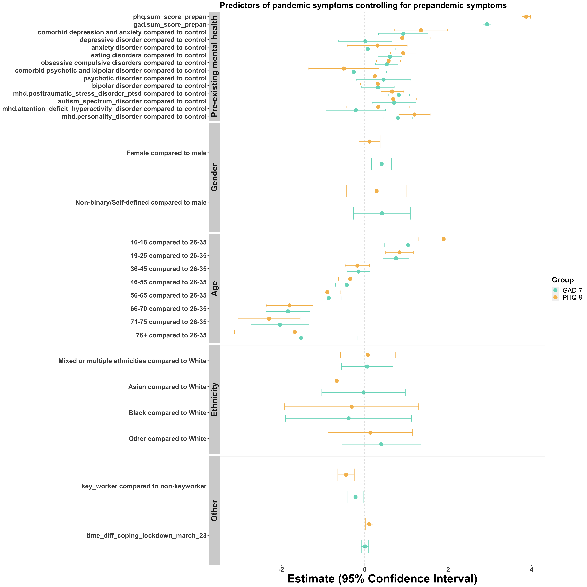


```
Warning: geom_hline(): Ignoring `mapping` because `yintercept` was provided.
```


### time point 

```
Warning: geom_hline(): Ignoring `mapping` because `yintercept` was provided.
```


```
Warning: geom_hline(): Ignoring `mapping` because `yintercept` was provided.
```


```
Warning: geom_hline(): Ignoring `mapping` because `yintercept` was provided.
```


### Sample (retrospective only)


```
Warning: geom_hline(): Ignoring `mapping` because `yintercept` was provided.
```


```
Warning: geom_hline(): Ignoring `mapping` because `yintercept` was provided.
```


```
Warning: geom_hline(): Ignoring `mapping` because `yintercept` was provided.
```


